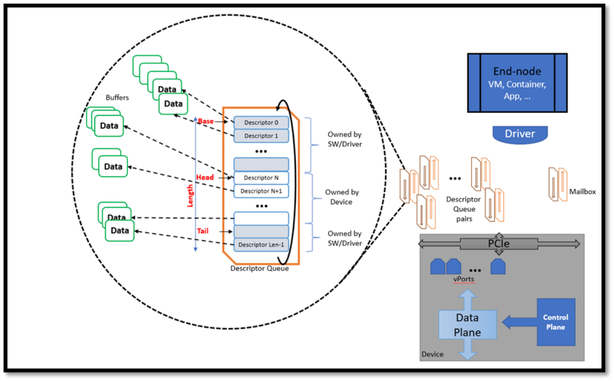
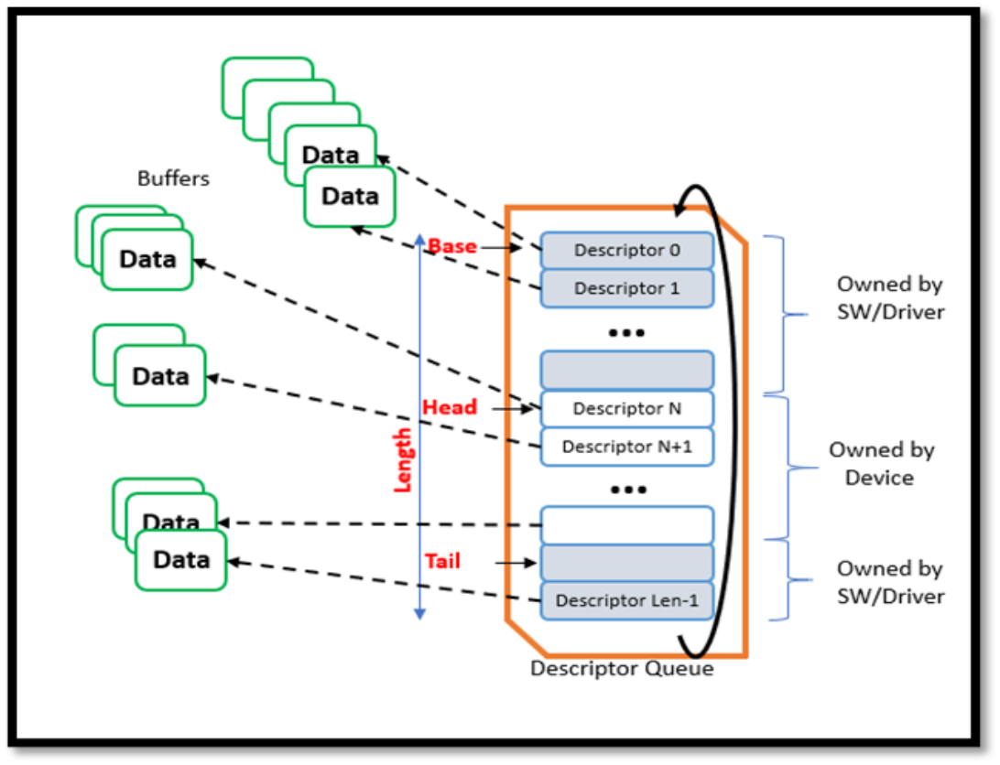

# IDPF (Infrastructure Data-Plane Function)

|Version|Date|Comments|
| ----- | -- | ------ |
|0.9|2/2/2023|1st Draft for Oasis IDPF TC|
|0.91|2/7/2023|Added OEM descriptor format range to mailbox descriptors.|
|0.91|2/14/2023|Added place holders for multiple Default vport capability and Container Dedicated Queues.|
|0.91|2/14/2023|vport Attributes flow to be described|
|0.91|2/28/2023|Updated virtchnl2 descriptor structure.   Updated TX descriptor IDs in virtchnl2_lan_desc.h|
|0.91|4/19/2023|Name updated to match the Oasis TC|

# Introduction

This document describes the host Interface, device behavior, setup, and configuration flows of a PCIE network function device. This device can be presented to an OS as a PCIe Physical function (PF) device or a virtual function (VF) device from a NIC or as a completely emulated device in Host SW. An IDPF device is OS and Vendor Agnostic. 

# Context and Motivation

There is a need for standardized Network function devices that can support high throughput over Ethernet and RDMA. The Goal is to define a multi-vendor interface that takes away most of the CPU cost of an emulated Interface and is inherently extensible and scalable. A useful device must:

* Support easy maintenance to bring down Datacenter operating cost using standardized interfaces.
* Support zero downtime for Tenants while Datacenter operator brings down servers for maintenance
* Support getting more value out of a server by reducing CPU overhead costs on the server 
* Support providing very high  throughput and multiple offload features to the Tenant to keep up with higher demands 
* Provide Flexibility and extensibility to support multi-vendor and per-need negotiable feature sets 
* Be O/S agnostic 
* Be usable in both Virtualized and Bare-metal scenarios

None of the standard interfaces available in the market provide for all these needs. This Spec is an effort towards achieving all the above goals.

# Key Concepts

## IDPF Network Function Device (“Device”)

This is an abstraction of a physical or emulated Network PCIE Device as seen by the driver. It is modeled as having internally a **data path** component that carries out Packet handling and a **control plane** component that is used to configure and monitor the operations of the data-path.  An IDPF Device has the same interface whether used as a Physical Function (PF) PCIe device, a Virtual Function (VF) device (when virtualization is used) , or a composed PCIe entity. It is also Operating-system agnostic, and does not impose assumptions on the implementation of conformant Devices.

## Abstraction

Although this Interface is designed to be high  performance, there is a big effort to abstract the resources from their actual device representations. This is to facilitate Live Migration.

Abstracted SW Elements:
* **Adapter or a Device**: This is an abstraction of a physical or emulated Network PCIE Device as seen by the driver. 
* **vSwitch**: Typically the Device will support a vSwitch implementation in order to classify traffic to multiple Network end-points exposed by the Device. This Spec does not concern itself with the programmability or the features and capabilities of the vSwitch but depending on the underlying vSwitch the Device capabilities will vary and will be negotiated as such.
* **vPort**: A vPort is used by the Device to represent a L2 network end-point. This endpoint is a source/destination for network traffic, and can be associated with a Host, VM, a Container, an application on a host, etc.  A single application or VM can have 1 or many logical network endpoints (e.g. a VM can have several virtual NICs), and hence can have multiple vPorts associated with it. Internally it is common for a network Device to implement vPorts as sets of DMA targets with a queue hierarchy to determine priority of service of these DMA targets. It is also common for network devices to support a load-balancing mechanism to distribute traffic among these queues.
  For example, in a NIC Device, vPort can be a group of DMA (Direct Memory Access) queues or just one (that deposits the packet into Host or VM memory). When a vPort is a group of DMA queues, there is a host side load balancer or classifier implemented in the Device/SW Data path past the vSwitch to pick one of the queues of the vPort for final delivery of the packet.
  Note: There is no replication of packets within a vPort.
* **Buffers, Descriptors, and descriptor queues**: The main communication mechanism between the Device and host-side software (including the driver) is by placing relevant data (received or to be transmitted) and requests/responses in Memory buffers and creating data-structures called Descriptors that point to these buffers (and hold some metadata describing various attributes of the data in the buffers). These Descriptors are placed into Circular Ring-queues (See Figure 1 ) called Descriptor Queues. These Descriptor queues are often used in pairs, with one queue used in the Host-to-Device direction, and the other in Device-To-Host direction.
* **Descriptor Queue**: A descriptor Queue is a Memory region whose length is some multiple of the size of the relevant Descriptors it is meant to hold. (As noted above, Descriptors are data-structures containing pointers to Data-buffers + additional flags and meta-data used in processing that data). A Descriptor queue is an in-memory ring-queue shared between the SW and the Device’s HW. It starts at a memory location pointed at by the relevant BASE pointer, and uses two additional pointers, called HEAD and TAIL to coordinate usage (see Figure 2). HW “owns” the Queue entries from HEAD to TAIL-1. It will next process the descriptor pointed to by “head” and will process items from the queue going forward until it processes the item at location TAIL-1; When HW is done with the 1st descriptor in the range it “owns”, it advances HEAD thus moving that Descriptor into the “for SW processing” part of the Queue. SW “owns” the descriptors outside the range the HW owns. When SW adds a Descriptor to the Queue it will place it where TAIL points, and then advance TAIL to the next location, thus making the just-added descriptor part of the range available for HW processing. When TAIL reaches the maximum length of the queue it wraps around. 

* **Mailbox**:This is an Out-of-band communication mechanism that may be implemented in HW or SW. A typical implementation uses a specific agreed-upon pair of Descriptor queues to pass back and forth Commands from the driver to the Control-plane of the Device and responses and event notifications from the Device control-plane to the driver (see drawing 1). This control/monitoring side-band is called a Mailbox.
The Mailbox is used for:

  * To learn about the Device capabilities.
  * To configure, enable or disable device capabilities
  * To receive Events from the Device

  Typically, this out-of-band communication is assumed to be not very chatty and can be implemented as a low throughput mechanism. 

* **virtchannel**: The device driver communicates with the Control Plane Agent over a mailbox in order to  request configuration and learn about capabilities etc. Virtchannel is a negotiation protocol with the Control plane and also for both sides to send asynchronous events as mentioned in the Mailbox description. Virtchannel as it is a sideband communication protocol with CP, the driver negotiates a protocol version first with CP and then follows the rules of the protocol for learning about capabilities and setting up Configs and offloads etc.
Each virtchannel message and the capabilities for which they are used and the flow with CP is described in detail as part of the Negotiation, Mailbox flows and offload Capabilities Sections. A driver using a feature without negotiation will be marked as a malicious activity by the driver on the CP side and it can result in the driver going through reset and failing to load.
* **Control Plane Agent (CP)**:This is a SW/FW/HW entity that is part of the device which communicates with the SW driver over the Mailbox using virtchannel in order for the SW Driver to learn about the capabilities, configure the device etc.
* **Tx & RX Process, and Completion Descriptors**: The general pattern of communication between host-side Software and the device is that Software posts request Descriptors in the Host-to-Device Descriptor queue, and the Device posts responses and events in the associated Device-to-Host Descriptor queue. In particular for the reception (RX) and transmission (TX) of packets the process is as follows (note this is the general case, some nuances and optimizations are described in the relevant section)
  1. **RX Process Overview**: Software prepares empty buffers in Host Memory (perhaps in VM’s Memory space if a VM is involved) to hold the data and headers of the frames when they are received. Software Builds “RX Request” descriptors that point to these buffers and places them on a Host-to-device Descriptor queue called “RX Queue”. When a packet is received by the Device’s data path, it reads the next Descriptor from the RX queue, and using DMA places the data received into the buffers pointed to by the Descriptor. The device then indicates to the SW that data has been received and placed in host memory that the SW should process. It does that by writing a “RX Completion Descriptor” that points to the data received, and holds additional meta-data describing relevant attributes for the data received (e.g. that its CRC was verified by the device, and the SW does not need to repeat this check). This completion Descriptor is typically placed in the Device-to-Host descriptor queue paired with the RX descriptor used by the relevant vPort, this queue is called the “RX Completion Queue". 
  2. **TX Process Overview**:Software prepares buffers in host memory containing the data to be transmitted. Software builds “TX request Descriptors” that point to these buffers, and places them on a Host-to-Device descriptor queue called “TX Descriptor queue”. The device’s Data-path reads the next TX request Descriptor from this queue and uses its content to read the data to be transmitted from the buffers, and processes them into one or more outgoing packets sent to the destination. The device then indicates to the SW that the data has been transmitted by building “TX Completion Descriptors” and placing them in a “TX Completion queue” which is the Device-to-Host  part of the queue-pair used for this vPort. 

