# IDPF (Infrastructure Data-Plane Function)

|Version|Date|Comments|
| ----- | -- | ------ |
|0.9|2/2/2023|1st Draft for Oasis IDPF TC|
|0.91|2/7/2023|Added OEM descriptor format range to mailbox descriptors.|
|0.91|2/14/2023|Added place holders for multiple Default vport capability and Container Dedicated Queues.|
|0.91|2/14/2023|vport Attributes flow to be described|
|0.91|2/28/2023|Updated virtchnl2 descriptor structure. <br /> Updated TX descriptor IDs in virtchnl2_lan_desc.h|
|0.91|4/19/2023|Name updated to match the Oasis TC|

# Introduction

This document describes the host Interface, device behavior, setup, and configuration flows of a PCIE network function device. This device can be presented to an OS as a PCIe Physical function (PF) device or a virtual function (VF) device from a NIC or as a completely emulated device in Host SW. An IDPF device is OS and Vendor Agnostic. 

# Context and Motivation

There is a need for standardized Network function devices that can support high throughput over Ethernet and RDMA. The Goal is to define a multi-vendor interface that takes away most of the CPU cost of an emulated Interface and is inherently extensible and scalable. A useful device must:

* Support easy maintenance to bring down Datacenter operating cost using standardized interfaces.
* Support zero downtime for Tenants while Datacenter operator brings down servers for maintenance
* Support getting more value out of a server by reducing CPU overhead costs on the server 
* Support providing very high  throughput and multiple offload features to the Tenant to keep up with higher demands 
* Provide Flexibility and extensibility to support multi-vendor and per-need negotiable feature sets 
* Be O/S agnostic 
* Be usable in both Virtualized and Bare-metal scenarios

None of the standard interfaces available in the market provide for all these needs. This Spec is an effort towards achieving all the above goals.

# Key Concepts

## IDPF Network Function Device (“Device”)

This is an abstraction of a physical or emulated Network PCIE Device as seen by the driver. It is modeled as having internally a **data path** component that carries out Packet handling and a **control plane** component that is used to configure and monitor the operations of the data-path.  An IDPF Device has the same interface whether used as a Physical Function (PF) PCIe device, a Virtual Function (VF) device (when virtualization is used), or a composed PCIe entity. It is also Operating-system agnostic, and does not impose assumptions on the implementation of conformant Devices.


## Abstraction

Although this Interface is designed to be high  performance, there is a big effort to abstract the resources from their actual device representations. This is to facilitate Live Migration.

Abstracted SW Elements:
* **Adapter or a Device**: This is an abstraction of a physical or emulated Network PCIE Device as seen by the driver. 
* **vSwitch**: Typically the Device will support a vSwitch implementation in order to classify traffic to multiple Network end-points exposed by the Device. This Spec does not concern itself with the programmability or the features and capabilities of the vSwitch but depending on the underlying vSwitch the Device capabilities will vary and will be negotiated as such.
* **vPort**: A vPort is used by the Device to represent a L2 network end-point. This endpoint is a source/destination for network traffic, and can be associated with a Host, VM, a Container, an application on a host, etc.  A single application or VM can have 1 or many logical network endpoints (e.g. a VM can have several virtual NICs), and hence can have multiple vPorts associated with it. Internally it is common for a network Device to implement vPorts as sets of DMA targets with a queue hierarchy to determine priority of service of these DMA targets. It is also common for network devices to support a load-balancing mechanism to distribute traffic among these queues.

  For example, in a NIC Device, vPort can be a group of DMA (Direct Memory Access) queues or just one (that deposits the packet into Host or VM memory). When a vPort is a group of DMA queues, there is a host side load balancer or classifier implemented in the Device/SW Data path past the vSwitch to pick one of the queues of the vPort for final delivery of the packet.
  
  _**Note:**_ There is no replication of packets within a vPort.
* **Buffers, Descriptors, and descriptor queues**: The main communication mechanism between the Device and host-side software (including the driver) is by placing relevant data (received or to be transmitted) and requests/responses in Memory buffers and creating data-structures called Descriptors that point to these buffers (and hold some metadata describing various attributes of the data in the buffers). These Descriptors are placed into Circular Ring-queues (See Figure 1 ) called Descriptor Queues.

  These Descriptor queues are often used in pairs, with one queue used in the Host-to-Device direction, and the other in Device-To-Host direction.
* **Descriptor Queue**: A descriptor Queue is a Memory region whose length is some multiple of the size of the relevant Descriptors it is meant to hold. (As noted above, Descriptors are data-structures containing pointers to Data-buffers + additional flags and meta-data used in processing that data).

  A Descriptor queue is an in-memory ring-queue shared between the SW and the Device. It starts at a memory location pointed at by the relevant BASE pointer, and uses two additional pointers, called HEAD and TAIL to coordinate usage (see Figure 2).<br/>Device “owns” the Queue entries from HEAD to TAIL-1. It will next process the descriptor pointed to by “head” and will process items from the queue going forward until it processes the item at location TAIL-1; When Device is done with the 1st descriptor in the range it “owns”, it advances HEAD thus moving that Descriptor into the “for SW processing” part of the Queue.
  
  SW “owns” the descriptors outside the range the Device owns. When SW adds a Descriptor to the Queue it will place it where TAIL points, and then advance TAIL to the next location, thus making the just-added descriptor part of the range available for Device processing. When TAIL reaches the maximum length of the queue it wraps around. 


* **Mailbox**:This is an Out-of-band communication mechanism that may be implemented in HW or SW. A typical implementation uses a specific agreed-upon pair of Descriptor queues to pass back and forth Commands from the driver to the Control-plane of the Device and responses and event notifications from the Device control-plane to the driver (see drawing 1). This control/monitoring side-band is called a Mailbox.
The Mailbox is used for:

  * To learn about the Device capabilities.
  * To configure, enable or disable device capabilities
  * To receive Events from the Device

  Typically, this out-of-band communication is assumed to be not very chatty and can be implemented as a low throughput mechanism. 

* **virtchannel**: The device driver communicates with the Control Plane Agent over a mailbox in order to  request configuration and learn about capabilities etc. Virtchannel is a negotiation protocol with the Control plane and also for both sides to send asynchronous events as mentioned in the Mailbox description.

  Virtchannel as it is a sideband communication protocol with CP, the driver negotiates a protocol version first with CP and then follows the rules of the protocol for learning about capabilities and setting up Configs and offloads etc.
Each virtchannel message and the capabilities for which they are used and the flow with CP is described in detail as part of the Negotiation, Mailbox flows and offload Capabilities Sections.

  A driver using a feature without negotiation will be marked as a malicious activity by the driver on the CP side and it can result in the driver going through reset and failing to load.
* **Control Plane Agent (CP)**:This is a SW/FW/HW entity that is part of the device which communicates with the SW driver over the Mailbox using virtchannel in order for the SW Driver to learn about the capabilities, configure the device etc.
* **Tx & RX Process, and Completion Descriptors**: The general pattern of communication between host-side Software and the device is that Software posts request Descriptors in the Host-to-Device Descriptor queue, and the Device posts responses and events in the associated Device-to-Host Descriptor queue. In particular for the reception (RX) and transmission (TX) of packets the process is as follows (note this is the general case, some nuances and optimizations are described in the relevant section)

  * **RX Process Overview**: Software prepares empty buffers in Host Memory (perhaps in VM’s Memory space if a VM is involved) to hold the data and headers of the frames when they are received.

      Software Builds “RX Request” descriptors that point to these buffers and places them on a Host-to-device Descriptor queue called “RX Queue”.
    
      When a packet is received by the Device’s data path, it reads the next Descriptor from the RX queue, and using DMA places the data received into the buffers pointed to by the Descriptor.
    
      The device then indicates to the SW that data has been received and placed in host memory that the SW should process. It does that by writing a “RX Completion Descriptor” that points to the data received, and holds additional meta-data describing relevant attributes for the data received (e.g. that its CRC was verified by the device, and the SW does not need to repeat this check).
    
      This completion Descriptor is typically placed in the Device-to-Host descriptor queue paired with the RX descriptor used by the relevant vPort, this queue is called the “RX Completion Queue". 

  * **TX Process Overview**: Software prepares buffers in host memory containing the data to be transmitted.

      Software builds “TX request Descriptors” that point to these buffers, and places them on a Host-to-Device descriptor queue called “TX Descriptor queue”.
    
      The device’s Data-path reads the next TX request Descriptor from this queue and uses its content to read the data to be transmitted from the buffers, and processes them into one or more outgoing packets sent to the destination.
    
      The device then indicates to the SW that the data has been transmitted by building “TX Completion Descriptors” and placing them in a “TX Completion queue” which is the Device-to-Host  part of the queue-pair used for this vPort.

## Modularization

When configuring device resources, care was taken that data structures group the resources into categories such as

* DMA Resources: Example: queues
* PCIE Resources: Example: Interrupts, Virtual functions
* Network resource: Example vPort 

## Composition

The IDPF interface does not make any assumption about how the device is composed, whether it is a complete passthrough Device like an SR-IOV interface or a PF interface or a composed device interface. Some parts of the device memory space can be passthrough and parts of the device memory space can be emulated in the backend SW or a completely emulated device.

## Live Migration

The Host interface Specification is designed to support Live migration assisted by the device, although there is no assumption that the driver needs to do anything special for Live Migration of the VM; the design concepts such as abstraction of device resources etc.  keep live migratability in mind.

## Adaptability and Elasticity

IDPF allows for adding or removing any of the offloads and capabilities based on what the device can support or not. Also, the Capability Negotiation Protocol allows for extending capabilities in the future.

IDPF allows for supporting more than one vPort through the same PCIE device interface to provide dedicated resources and control for a Software network interface that can be tied to individual applications, namespaces, containers etc.

## Negotiation

All device capabilities and offloads are negotiable; this allows for running the driver on a huge set of physical, virtual, or emulated devices.

## Profiling

Since the capabilities are negotiated with the device, this allows the Device Control Plane to enforce SLAs by creating templates of capabilities and offloads to expose to the Interface.

# PCIE Host Interface

## Device Identification 

The IDPF will use the following Programming Interface under PCIE class : Network Controller (02h),subclass : Ethernet Controller (00h) as Programming Interface :  Ethernet Controller with IDPF compliant Interface (01h). 

This will allow the driver to be loaded just based on Programming Interface identification, and we wouldn't need a generic Vendor ID for this device that Every vendor needs to put in their HW. An Emulated IDPF device will still have a Vendor ID such as "Redhat"

If  a Vendor chooses to add a Vendor ID + Device ID identification tuple in the IDPF driver, they can still do that for reasons such as Quirks/workarounds or any other reason.

## BARs

IDPF functions shall expose two BARs:

* BAR0 (32 bits) or BAR0-1 (64 bits) that includes the registers described in the Registers section. This BAR size depends on the number of resources exposed by the function

* BAR2 (32 bits) or BAR2-3 (64 bits) that includes the MSI-X vectors. The location of the vectors and the PBA bits shall be pointed by the standard MSI-X capability registers. The IMS vectors may be mapped in the BAR also.

## PCIe Capabilities

The following capabilities shall be part of an IDPF function configuration space:

* Power Management
* MSI-X. MSI support is optional.
* PCI Express

The following capabilities shall be part of an IDPF function that exposes SR-IOV functions:

* ARI
* SR-IOV

Other capabilities like ATS, VPD, serial number and others are optional and may be exposed based on the specific hardware capabilities. 

## PCIE MMIO (Memory Mapped IO) Map  

### Registers

Fixed: Mailbox registers, Control and status Registers. . See register Register Section

Flexible: Queue and Interrupt registers. See Register section.

Note : When the driver writes a device register and then reads that same register the device might return the old register value (value before the register write) unless the driver keeps 2 ms latency between the write access and the read accesses.
 
# Versioning (Device, Driver, virtchannel Version)

## Device Versioning

As mentioned in the Device identification, a Device ID, and Subdev ID defines the Device version. A base Device ID for PF and VF Device is defined and a subdev ID of zero as a default for the device. The Device ID and subdev ID can be used to have separate register offsets for the fixed portions of register space such as the mailbox. 

## Virtchannel: Mailbox Protocol Versioning

The Driver shall start the Mailbox communication with the Control plane by first negotiating the mailbox protocol version that both can support. The information is passed in the mailbox buffer pointed to by the mailbox command descriptor.

VF/PF posts its highest supported version number to the CP (Control Plane Agent). CP responds with its virtchannel version number in the same format, along with a return code. Reply from CP has CP’s virtchannel major/minor versions.

If there is a major version mismatch, then the VF/PF goes to the lowest version of virtchannel as the CP is assumed to support at least version 2.0 of virtchannel. If there is a minor version mismatch, then the PF/VF can operate but should add a warning to the system log.
```C
    struct virtchnl_version_info {
	    u32 major;
	    u32 minor;
    };
```
## Driver Versioning

The spec does not define a driver version, and this is maintained strictly to identify the revisions of driver codes and features.

# Compatibility Requirements

For multiple generations of devices to support this interface, there is a small base set of interface definitions that needs to be fixed.

# Virtchannel and Mailbox Queue

Virtchannel is a SW protocol defined on top of a Device supported mailbox in case of a passthrough sideband going directly to Device. Device as mentioned previously can be a HW or a SW Device.

## Virtchannel Descriptor Structure
```C
    struct virtchnl2_descriptor {
    __le16 flags;
    __le16 opcode;
    __le16 datalen;
    union {
	    __le16 retval;
	    __le16 pfid_vfid;
    };
    __le32 v_opcode:28;
    __le32 v_dtype:4
    __le32 v_retval;
    __le32 reserved;
    __le16 sw_cookie;
    __le16 v_flags;
    __le32 addr_high;
    __le32 addr_low;
    };
```
## Mailbox Queues (Device Backed or SW Emulated)

The driver holds a transmit and receive mailbox queue pair for communication with the CP.

For both RX and TX queues the interface is like the “In order, single queue model” (see RX In order single queue model and TX In order single queue model) LAN (Local Area Network) queue with the following exceptions:

* TX mailbox:
  * The Maximum packet size is 4KB.
  * Packet is pointed by a single 32B descriptor. Packet data resides in a single buffer.
  * Packet can be a zero-byte packet (in that case, the descriptor does not point to a data buffer).
  * Device reports completion (descriptor write back) for every mailbox packet/descriptor, which will be received into the RX Mailbox queue.
* RX mailbox:
  * SW fills the RX queue with 32B descriptors that point to 4KB buffers.
  * The Maximum packet size is 4KB. RX packet data resides in a single buffer.
  * Packet can be a zero-byte packet (in that case, data buffer remains empty).
  * RX mailbox is set by device as fast drop in absence of sufficient RX descriptors/buffers posted by the driver, in order to avoid DDoS and blocking of the pipe.

The mailbox queues CSRs (Control Status Registers) are in fixed addresses and are described in Appendix Section [- PF/VF- Mailbox Queues]().

## Mailbox Descriptor Formats

Both queues use the same descriptor structure for command posting (TX descriptor format) and command completion (RX descriptor format). 
All descriptors and commands are defined using little endian notation with 32-bit words. Drivers using other conventions should take care to do the proper conversions.

Mailbox commands are
* Indirect – commands, which in addition to Descriptor info, can carry an additional payload buffer of up to 4KB (pointed by “Data address high/low”).

### Generic Descriptor Fields Description

| Name | Bytes.Bits | Description | 
| ---- | ---------- | ----------- |
| Flags.DD | 0.0 | This flag indicates that  the current descriptor is done and processed by hardware or IDPF.|
| Flags.CMP| 0.1 | This flag indicates the current descriptor is Completed and processed by hardware or IDPF. This is part of the legacy format and needs to be set together with Flag.DD in cases defined below.|
| Flags.Reserved | 0.2-1.1 | Reserved for hardware uses.|
| Flags.RD | 1.2 |This flag can be coupled with Flag.BUF from below to indicate Mailbox TX Hardware that IDPF provides data in an additional buffer (pointed by Data Address low/high below) to be sent to CP in Mailbox command.<br />Not relevant for the RX queue. |
| Flags.VFC | 1.3 |This flag indicates that command is sent by IDPF running on VF.|
| Flags.BUF | 1.4 |This flag indicates that a buffer exists for this descriptor, used for RX descriptor advertisement. For TX, it needs to be set together with Flag.RD.|
| Flags.Reserved | 1.5 – 1.7| Reserved for hardware uses.|
| Message Infrastructure Type | 2-3| TX Side:<br />0x0801 – “Send to CP” opcode.<br />The driver may use this command to send a mailbox message to its CP.<br />Other opcodes will be rejected and not sent to the destination.<br /><br />RX side: 0x0804– “Send to Peer IDPF Driver” opcode.<br />The driver will receive this opcode inside descriptors coming from CP.|
| Message Data Length | 4-5 | Attached buffer length in bytes (this field is set to 0 when buffer is not attached). Up to 4KB. Used only when Flag.BUFF and optionally Flag.RD(TX case) are set.|
| Hardware Return Value | 6-7 | Hardware Return value, which indicates that Descriptor was processed by Hardware successfully. Relevant when Flag.DD and CMP are set for descriptor.|
| VirtChnl Message Opcode | 8-11.3 | Includes VirtChnl opcode value,. i.e. VIRTCHNL2_OP_GET_CAPS = 500.<br />Opcodes 0x0000 - 0x7FFF are in use.<br />Codes 0x8000-0xFFFF - are reserved.<br />Note: The upper 4 bits in byte 11 are reserved for the VirtChnl descriptor Format.
| VirtChnl Descriptor Type | 11.4-11.7 | v_dtype, default value is 0 but can be used in future to enhance the VirtChnl descriptor format.<br />Values 1-7 are reserved for future expansion. Values 8-15 are reserved for OEM descriptor formats.|
| VirtChnl Message Return Value | 12-15 | VirtChnl Command return value sent by CP will be received here. Not relevant for TX.|
| Message Parameter 0 | 16-19 | Can be used to include message parameter|
| SW Cookie | 20-21 | Used for cookies to be delivered to the receiver.|
| VirtChnl Flags | 22-23 | When a Flags capability is negotiated, it can be used to give more direction to CP whether a response is required etc.|
| Data Address high / Message Parameter 2 | 24-27 | When RD and BUF are set, describe the attached buffer address.<br />Else, used as a third general use as additional parameter.|
| Data Address low / Message Parameter 3 | 28-31 | When RD and BUF are set, describe the attached buffer address.<br />Else, used as a fourth general use additional parameter.|

### TX descriptor Command Submit Format

The table below describes the descriptor structure fields, which are expected to be filled by the driver before incrementing Mailbox TX Queue Tail.
All fields inside the TX descriptor, which are not provided by the sender, but are expected to be filled by the responder (output fields) should be set to 0 by the sender.

| Name | Bytes.Bits | Description | 
| ---- | ---------- | ----------- |
| Flags.DD | 0.0 | Should be set to 0.|
| Flags.CMP| 0.1 | Should be set to 0.|
| Flags.Reserved | 0.2-1.1 |Should be set to 0.|
| Flags.RD | 1.2 | Set by the IDPF when a buffer is attached to this Command. |
| Flags.VFC | 1.3 |Should be set to 0.|
| Flags.BUF | 1.4 |Set by the IDPF when a buffer is attached to this Command.|
| Flags.Reserved | 1.5 – 1.7| Should be set to 0.|
| Message Infrastructure Type | 2-3| 0x0801 – “Send to CP” opcode.<br />The driver uses this command opcode only to send a mailbox message to its CP.<br />Other opcodes will be rejected and not sent to the destination.|
| Message Data Length | 4-5 | Attached buffer length in bytes (this field is set to 0 when buffer is not attached). Up to 4KB.|
| Hardware Return Value | 6-7 |Should be set to 0. |
| VirtChnl Message Opcode | 8-11.3 | Includes VirtChnl opcode value,. i.e. VIRTCHNL2_OP_GET_CAPS = 500.<br />Opcodes 0x0000 - 0x7FFF are in use.<br />Codes 0x8000-0xFFFF - are reserved.<br />Note: The upper 4 bits in byte 11 are reserved for the VirtChnl descriptor Format.|
| VirtChnl Descriptor Type | 11.4-11.7 | v_dtype, default value is 0 but can be used in future to enhance the VirtChnl descriptor format.<br />Values 1-7 are reserved for future expansion. Values 8-15 are reserved for OEM descriptor formats.|
| VirtChnl Message Return Value | 12-15 | Should be set to 0.|
| Message Parameter 0 | 16-19 | Can be used to include message parameter|
| SW Cookie | 20-21 | Used for cookies to be delivered to the receiver.|
| VirtChnl Flags | 22-23 | When a Flags capability is negotiated, it can be used to give more direction to CP whether a response is required etc.|
| Data Address high / Message Parameter 2 | 24-27 | When RD and BUF are set, describe the attached buffer address.<br />Else, used as a third general use parameter. Copied to the RX packet descriptor of the receiver.|
| Data Address low / Message Parameter 3 | 28-31 | When RD and BUF are set, describe the attached buffer address.<br />Else, used as a fourth general use parameter Copied to the RX packet descriptor of the receiver.|

### TX Descriptor Command Completed Format

This is the TX descriptor view, after it was processed and sent by the Device, while Flag.DD = 1 indicated this. This is an indication for the sender driver that the current TX descriptor and its buffer are completed by hardware and can be reused for a new command. Command’s response will be then received asynchronously into the RX Mailbox queue.

| Name | Bytes.Bits | Description | 
| ---- | ---------- | ----------- |
| Flags.DD | 0.0 | Descriptor done.<br />Should be set to 1 by Device.|
| Flags.CMP| 0.1 | Complete.<br />Should be set to 1 by Device.|
| Flags.Reserved | 0.2-1.1 | Should be ignored by Driver.|
| Flags.RD | 1.2 | Should be ignored by Driver.|
| Flags.VFC | 1.3 |Should be ignored by Driver.|
| Flags.BUF | 1.4 |Should be ignored by Driver.|
| Flags.Reserved | 1.5 – 1.7| Should be ignored by Driver.|
| Message Infrastructure Type | 2-3 | Preserve the field value in the descriptor.|
| Message Data Length | 4-5 | Preserve the field value in the descriptor.|
| Hardware Return Value | 6-7 | Expected to be set to 0 (Success) by Device.|
| VirtChnl Message Opcode | 8-11.3 | Includes VirtChnl opcode value,. i.e. VIRTCHNL2_OP_GET_CAPS = 500.<br />Opcodes 0x0000 - 0x7FFF are in use.<br />Codes 0x8000-0xFFFF - are reserved.<br />Note: The upper 4 bits in byte 11 are reserved for the VirtChnl descriptor Format.|
| VirtChnl Descriptor Type | 11.4-11.7 | v_dtype, default value is 0 but can be used in future to enhance the VirtChnl descriptor format.<br />Values 1-7 are reserved for future expansion. Values 8-15 are reserved for OEM descriptor formats.|
| VirtChnl Message Return Value | 12-15 | Should be set to 0.|
| Message Parameter 0 | 16-19 | Can be used to include message parameter|
| SW Cookie | 20-21 | Used for cookies to be delivered to the receiver.|
| VirtChnl Flags | 22-23 | When a Flags capability is negotiated, it can be used to give more direction to CP whether a response is required etc.|
| Data Address high / Message Parameter 2 | 24-27 | Preserve the field value in the descriptor.|
| Data Address low / Message Parameter 3 | 28-31 | Preserve the field value in the descriptor.|

### RX Descriptor Command Submit Format

The driver must advertise empty RX descriptors into Mailbox RX queues,potentially including free 4KB buffers. During free descriptor preparation, the driver will clear any unused fields (including unused Flags) and set data pointers and data length to a mapped DMA pointer, see table below.

| Name | Bytes.Bits | Description | 
| ---- | ---------- | ----------- |
| Flags.DD | 0.0 | Should be set to 0.|
| Flags.CMP| 0.1 | Should be set to 0.|
| Flags.Reserved | 0.2-1.1 | Should be set to 0.|
| Flags.RD | 1.2 | Should be set to 0.|
| Flags.VFC | 1.3 |Should be set to 0.|
| Flags.BUF | 1.4 |Receive queue elements should always have an additional buffer. Should be set to 1.|
| Flags.Reserved | 1.5 – 1.7| Should be set to 0.|
| Message Infrastructure Type | 2-3 | Should be set to 0.|
| Message Data Length | 4-5 | Attached buffer length in bytes (this field is set to 4KB to advertise maximum buffer length)|
| Hardware Return Value | 6-7 | Should be set to 0.|
| VirtChnl Message Opcode | 8-11.3 | Should be set to 0.<br />Note: The upper 4 bits in byte 11 are reserved for the VirtChnl descriptor Format.|
| VirtChnl Descriptor Type | 11.4-11.7 |v_dtype, default value is 0 but can be used in future to enhance the VirtChnl descriptor format.<br />Values 1-7 are reserved for future expansion. Values 8-15 are reserved for OEM descriptor formats.|
| VirtChnl Message Return Value | 12-15 | Should be set to 0.|
| Message Parameter 0 | 16-19 | Should be set to 0.|
| SW Cookie | 20-21 | Used for cookies to be delivered to the receiver.|
| VirtChnl Flags | 22-23 | 
When a Flags capability is negotiated, it can be used to give more direction to CP whether a response is required etc.|
| Data Address high / Message Parameter 2 | 24-27 | As BUF is always set - 4KB buffer address to be pointed.|
| Data Address low / Message Parameter 3 | 28-31 | As BUF is always set - 4KB buffer address to be pointed.|

### RX Descriptor Command Completed Format

When a mailbox command arrives from the device to Driver RX Mailbox Queue, it will use previously advertised RX descriptors and additional 4KB buffers  and fill it with mailbox command data. This structure defines what fields will be seen by the driver.

| Name | Bytes.Bits | Description | 
| ---- | ---------- | ----------- |
| Flags.DD | 0.0 | Descriptor done.<br />Should be set to 1 by the device.|
| Flags.CMP| 0.1 | Complete.<br />Should be set to 1 by the device.|
| Flags.Reserved | 0.2-1.1 | Should be ignored by Driver.|
| Flags.RD | 1.2 | Should be ignored by Driver.|
| Flags.VFC | 1.3 |Should be ignored by Driver.|
| Flags.BUF | 1.4 |0 - no buffer data is attached to the incoming command.<br />1 - buffer data is attached to the incoming command.|
| Flags.Reserved | 1.5 – 1.7| Should be ignored by Driver.|
| Opcode | 2-3 | Should be ignored by Driver.|
| Message Data Length | 4-5 | Attached buffer length in bytes (this field is set to 0 when buffer is not attached). Up to 4KB|
| Hardware Return Value | 6-7 | Should be ignored by Driver.|
| VirtChnl Message Opcode | 8-11.3 | Includes Internal virtChnl opcode value, all 32 bits. i.e. VIRTCHNL_OP_GET_CAPS = 100.<br />Opcodes 0x0000 - 0x7FFF are in use.<br />Codes 0x8000-0xFFFF - are reserved.<br />Note: The upper 4 bits in byte 11 are reserved for the VirtChnl descriptor Format.|
| VirtChnl Descriptor Type | 11.4-11.7 | v_dtype, default value is 0 but can be used in future to enhance the VirtChnl descriptor format.<br />Values 1-7 are reserved for future expansion.<br />Values 8-15 are reserved for OEM descriptor formats.|
| VirtChnl Message Return Value | 12-15 | Should be set to 0.|
| Message Parameter 0 | 16-19 | Can be used to include message parameter|
| SW Cookie | 20-21 | Used for cookies to be delivered to the receiver.|
| VirtChnl Flags | 22-23 | When a Flags capability is negotiated, it can be used to give more direction to CP whether a response is required etc.|
| Data Address high / Message Parameter 2 | 24-27 | When BUF is set, it specifies the attached buffer address (the one was advertised by the driver previously).<br />Else, used as a third general use parameter copied from the TX packet descriptor.|
| Data Address low / Message Parameter 3 | 28-31 | When BUF is set, it describes the attached buffer address (the one was advertised by the driver previously).<br />Else, used as a fourth general use parameter copied from the TX packet descriptor.|

## Mailbox Flows

### Mailbox Initialization Flow

Most of the Mailbox queues initialization is done by default by CP, while the IDPF driver needs to provide rings’ description and enable the queues using MMIO registers access. Here are the configuration to be performed by driver:

1. The driver clears the head and tail register for its TX/RX queues - PF/VF_MBX_ATQT, PF/VF_MBX_ARQT, PF/VF_MBX_ATQH, PF/VF_MBX_ARQH.
2. The driver programs the base address PF/VF_MBX_ATQBAL/H and PF/VF_MBX_ARQBAL/H (must be 128B aligned)
3. The driver set the PF/VF_MBX_ARQLEN/PF/VF_MBX_ATQLEN.Length and “Enable” field to 1 to signal that its mailbox is now enabled.

Driver must follow this exact sequence of operations in order to initialize the mailbox queue context.
After this Driver writes the first message to TX mailbox and waits for 20 msec for response, if no response it tries at least 10 times with a gap of 20 msec before it fails to load the driver.

### Mailbox Queues Disable

The mailbox queues are disabled by the CP ONLY while the driver cannot directly disable its own mailbox queues. 

Any queue disable request (clearing of the PF/VF_MBX_ARQLEN/PF/VF_MBX_ATQLEN.Enable flag ) from the driver can be ignored by Device. 

### Mailbox Queues Operation

As stated above Mailbox queues in both directions operate as “In order Single Queue Model”.

On the TX mailbox queue the IDPF driver moves the Tail pointer of the ring to notify device to transmit new mailbox packet while device informs the driver that packet was transmitted by overriding the descriptor with DD bit set.

On the RX queue IDPF driver moves the Tail pointer of the ring to notify the device that new buffers are available to use in the RX queue while the device notifies the driver that the packet was received into the queue by overriding the descriptor with DD bit set.

Note that the driver must not use the device head pointer to understand the device progress.

There several Mailbox specific operations to be done by IDPF for Mailbox queues, here they are:

TX direction:

* IDPF reads the PF/VF_MBX_ATQLEN.Enable field to check if value is 1 before posting packets/buffers to the TX/RX queue. This in order to verify that the queue is enabled and commands can be posted. If the queue is found disabled, this means that the queue was disabled by CP and IDPF is expected to be under FLR and need to perform Function Level Reset flow as described in chapter below Function Level reset.
* IDPF fills buffer with Command data, IDPF fills descriptor structure with proper information.
* IDPF increases Tail (PF/VF_MBX_ATQT) by 1 to send commands to the device.
* The device transmits the TX packet and overrides the TX descriptor  of the transmitted packet in the descriptor queue.
* IDPF polls the TX descriptor queue for completed descriptors (or waits for interrupt to be launched).
* The descriptor that belongs to completed packets are ones with the DD flag set.

RX direction:

* IDPF adds descriptors to the RX queue pointing to empty buffers and then sends the Tail point to notify the device that buffers are available.
* The device receives the RX packet, writes it to the host memory and then overrides the RX descriptor of the received packet in the descriptor queue.
* IDPF polls the RX descriptor queue for completed descriptors (or waits for interrupt to be launched).
* The descriptor that belongs to completed packets are ones with the DD flag set.
IDPF reads the additional buffer (“Data Address low/high”), which arrives together with the mailbox command.
* After all command information is fetched from the ring, IDPF advertise new free descriptor to the RX ring, as described in “RX descriptor command submit format” above and move Tail (PF/VF_MBX_ATQT) by 1 to make it available for device.  

# Data Queues

TX and RX queue types are valid in single as well as split queue models. With Split Queue model, 2 additional types are introduced - TX_COMPLETION and RX_BUFFER. In split queue model, RX corresponds to the queue where Device posts completions.

## LAN RX Queues

A receive descriptor queue is made of a list of descriptors that point to memory buffers in host memory for storing received packet data of a particular queue.

Each queue is a cyclic ring made of a sequence of receive descriptors in contiguous memory. 
A packet may be stored in a single receive descriptor or spread across multiple receive descriptors, depending on the size of the buffers associated with the receive descriptor and the size of the received packet.

This section describes the different RX queue modes supported by this specification, describes how SW posts new RX descriptors for Device, and describes how Device indicates to SW that it can reuse the buffers and descriptors for new packets.
The mode of operation is a per queue configuration. Each queue can be configured to work in a different model:

* In order single queue model. 
  This option is supported only when VIRTCHNL2_CAP_RXQ_MODEL_SINGLE feature is negotiated. 
* Out of order split queue model.
  This option is supported only when VIRTCHNL2_CAP_RXQ_MODEL_SPLIT feature is negotiated. 

The device must negotiate at least one of the features above.

The minimal and maximal buffers sizes that are supported by Device are negotiable Device capabilities.
The possible values and default values (in the absence of negotiation) of those capabilities are described in the RX packet/buffer sub-section under the Device capabilities section.

Note that the device is not obligated to check the maximal packet length of a packet delivered to driver.

### In Order Single Queue Model

In the single queue model, the same descriptor queue is used by SW to post descriptors to Device and used by Device to report completed descriptors to SW.

SW writes the packet descriptors to the queue and updates the QRX_TAIL register to point to the descriptor after the last descriptor written by SW (points to the first descriptor owned by SW).
Tail pointer should be updated in 8 descriptors granularity. 

After Device writes the packet to the data buffers (pointed by the fetched descriptors) it reports a completion of a received packet by overriding the packet descriptors in ring with the write format descriptor (as described in LAN Receive Descriptor Write Back Formats).

In this model, completions are reported “in order” - according to the packet placement order in the queue.

The diagram below illustrates the descriptors’ Device/SW ownership based on the Tail pointer:

* TAIL pointer represents the following descriptor after last descriptor written to the ring by SW.
* HEAD pointer represents the following descriptor after last descriptor written by Device.
* White descriptors (owned by Device) are waiting to be processed by Device or currently processed by Device.
* Blue descriptors (owned by SW) were already processed by Device and can be reused again by SW.
* Zero descriptor are owned by Device when TAIL == HEAD
* The SW should never set the TAIL to a value above the HEAD minus 1.

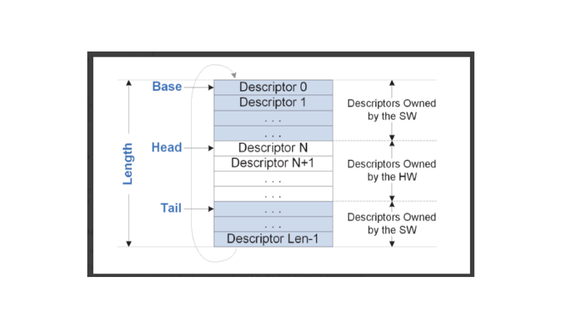

### Out of Order Split Queue Model

In the split queue model, "Rx Buffer Queues" are used to pass descriptor
buffers from SW to Device while Rx Queues are used only to pass the
descriptor completions (descriptors that point to completed buffers)
from Device to SW (as opposed to the single queue model in which
Rx Queues are used  for both purposes).

In this model, descriptor completions can be reported “out of order” -
not according to the descriptor placement order in the buffer queue.

To enable SW to associate a buffer with a completion, SW writes a unique
buffer identifier to each descriptor written to the RX buffer queue
while Device writes back this buffer identifier to the completed
descriptor later written to the RX queue.  
Device supports an asymmetric ratio of Rx Buffer queues to RX queues.

For the Split-queue model RX buffer Queues can be used in groups where
each group contains two RX buffer Queues, one with small buffers and one
with big buffers. In case the received packet length is smaller than the
small buffer, the whole packet is copied to a small buffer and in case
the packet is bigger then small buffer the whole packet is copied to 1
or more big buffers.

In case header split offload is activated and the packet header is
copied to a separate, dedicated buffer, the decision if to copy the
packet payload to a small buffer or to 1 or more big buffers is based on
the packet payload length and not on the whole packet length (header and
payload).

RX queue to RX buffer queue/s association details:

- Each Rx Queue is associated to a single Rx Buffer Queue Group and in the usual case, Rx Buffer Queue Group will feed a set of Rx queues.
- Rx Buffer Queue Group consists of one or two Rx Buffer Queues. On a given Rx Buffer queue, every buffer (or buffer pair, when header split is supported for the queue) points to a buffer (or buffer pair) of the same size.
- When the Rx Buffer Queue Group consists of 2 Rx Buffer Queues, each one of the queues points to buffers of a distinct size.
- The association between an RX queue and Buffer queue group is defined in RX queue context.

The number of buffer queues in the group can be 1 or 2 as defined by the
*num_buf_queues_per_rx* Device capability. The possible values and default
value (in the absence of negotiation) are described in the [<u>Device
capabilities
section.</u>](#device-capabilities-default-values-assumed-by-the-idpf-driver)

### RX Buffer Queues

As with the single queue model, when posting buffer to the buffer queue,
SW writes the receive descriptors and updates the TAIL pointer in the
relevant QRX_BUFFQ_TAIL register.  
SW should bump the tail at whole 8 x descriptors granularity.

In addition to the regular completion, Device is capable of reporting to
SW when descriptors are fetched (before data was written) from the
buffer queue.  
The Buffer queue fetch reporting is executed each time a descriptor
fetch operation crosses a multiple of the “buffer notification stride”
which is negotiated….  
The reporting is done by writing the descriptor offset of the crossing
descriptor to a fixed address in host memory (also called “head” WB
reporting).  
For example, in case Buffer queue depth is 128 and “buffer notification
stride” is set to 32, Device:

- Reports 32 after first 32 descriptors are fetched.
- Reports 64 after the following 32 descriptors are fetched.
- Reports 96 after the following 32 descriptors are fetched.
- Reports 0 after the following 32 descriptors are fetched.

The descriptor fetch reporting on buffer stride is support writeback
reporting for buffer queue descriptor fetch (on stride cross).

The Head writeback reporting for buffer queue descriptor fetch (stride
cross) is supported only when VIRTCHNL2_CAP_RX_SPLITQ_HEAD_WB feature is
negotiated.

### RX Completion Queues

SW tracks the number of buffers in hardware (posted to buffer queue and
were not pulled from RX completion queue) and guarantees that there is
enough space in the RX completion queue for any future descriptor(s)
posted by SW (via Rx Buffer Queue) without assuming anything about the
SW processing rate of entries.

_**Note:_** SW should guarantee that there is a minimum free space of 128B in
each completion queue to avoid the theoretical case in which Device
wraps around the ring and overrides an entry that has not been read yet
by SW.

Device does not inform SW directly of the availability of descriptors in
the RX queue but piggybacks the notification to the completed descriptor
itself using a “generation” bit.  
As part of queue initialization, SW should clear all the generation bits
in all completion queue descriptors.

In the descriptor completion written by Device, Device changes the
generation bit value (from 0 to 1 or from 1 to 0) to indicate to SW
which descriptors in the ring were written back.  
SW uses this bit to identify newly written completions by Device versus
ones which have already been processed by SW. The bit polarity is
flipped every ring wraparound.

### RX Buffer Queue Association Decision

When a packet arrives the device should take two “DMA related” decisions
in the following order:

- Header split decision: Define the portion of the packet written to the header buffer and the portion of the packet written to the payload buffer.  

  The main inputs to this decision are the configured header buffer size
  and the header split mode as defined in the RX queue context. It is
  assumed that the header buffer size for all Buffer queues in the group
  is identical.  
    
  The output of this stage is one of the following :

  - Post the whole packet to the packet buffer(s).
  - Post header to header buffer and payload to the packet buffer(s).
  - Post the whole packet to the header buffer.

- Buffer queue decision: Which Buffer queue from the buffer queue group
  should be used for the packet DMA?  
  The decision is only relevant when both buffer queues are enabled.
  When only one buffer queue is enabled, the buffers are taken from the
  enabled queue. Note that when the Rx Buffer Queue Group includes two
  queues, it is assumed the buffer size for the first queue is larger
  than the buffer size of the 2nd one.  
  The main input for this decision is the “Header split decision”
  output.

### RSC SW/Device Handshake Principles 

Receive Side Coalescing (RSC) is a mode in which multiple packets from a
single TCP (Transmission Control Protocol) flow are merged to create a
larger TCP packet. Thus reducing the per packet overhead of the driver
and the TCP stack. RSC can be enabled per queue as part of the queue
creation flow

RSC enabled queues (as negotiated) must operate in split-queue,
out-of-order mode.

RSC Segments are written to the buffers pointed by buffer queue in the
order they are received; from buffer queue perspective, RSC segments
from different RSC flows are interleaved.  
When an RSC flow is terminated, the device writes the descriptor
completions of the whole RSC to the RX queue.  Descriptors are written
contiguously to the queue.

The diagram below describes the DMA processing of multiple RSC flows
that are assigned to the same RX queue.

- Phase 1 describes the buffer queue initialization done by SW, as seen in diagram; each descriptor holds a unique "buffer identifier".
- Phase 2 describes the buffers assignment the different RSC flows (RSC A and RSC B) after packet reception. In this specific example, packets from the different RSC flows were received in an interleaved manner and therefore their buffer allocation within the queue is interleaved.
- Phase 3 describes RSC completion reporting. As seen in the diagram, the descriptor completions of an RSC flow are reported contiguously in the completion queue; each completion descriptor holds the unique "buffer identifier" of its associated buffer.

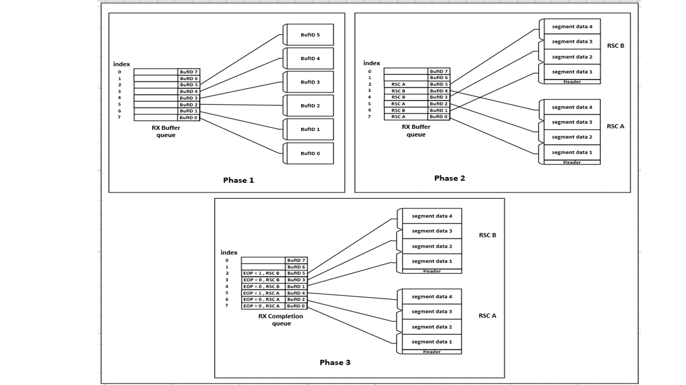

Device receive descriptors form the control path that connects the
software driver with the Ethernet Controller on the receive side.
Software uses Receive Descriptors for providing host memory buffers to
the hardware for use in returning packet header and payload data. A
packet may map to one or more buffers and thus to one or more receive
descriptors.

The flow chart below describes the RX buffer queue association decision
for a RSC segment.  
For an RSC segment, the first buffer queue is always used.

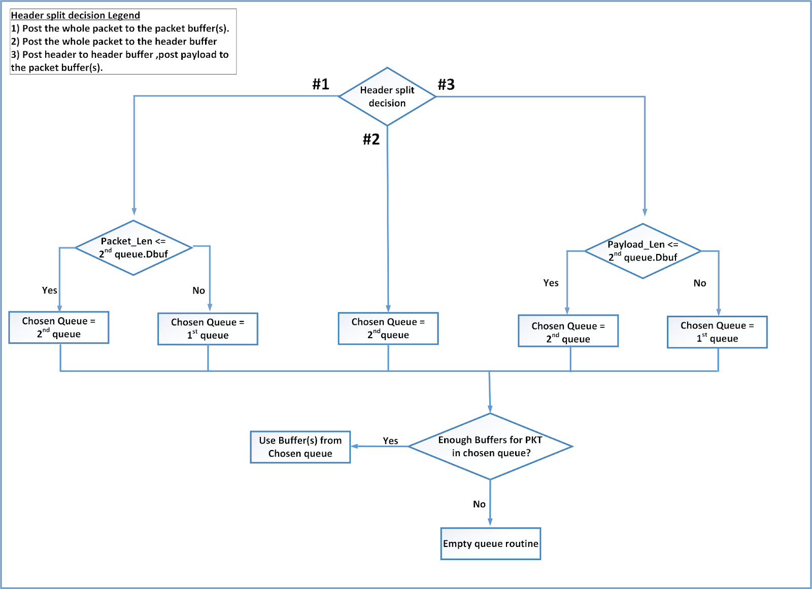

### RX Descriptor Formats

The text below describes the RX read descriptor formats and RX write
descriptor formats.  
A "read format" descriptor is a descriptor posted by SW and read by
Device while a "write format" descriptor is a descriptor written by the
Device and read by SW.

For both queue models, the read descriptor holds the buffers pointers.  
For the “out of order split queue” model, the read descriptors also
hold the unique buffer identifier (sent as is to packet completion) used
for SW to associate the submitted packet buffers with the completed
packet buffers.

For both queue models, the write descriptor holds some packet metadata
fields delivered from the Device processing pipeline and some DMA
related fields.  
For the “out of order split queue” model, the write back descriptor
also holds the completion queue "generation" bit and the buffer queue
identifier (buffer queue identifier within the buffer queue group).

The table below describes the supported descriptor formats according to
queue context configuration and describes allowed relations of the
different queue context configurations.

<table>
<colgroup>
<col style="width: 17%" />
<col style="width: 14%" />
<col style="width: 13%" />
<col style="width: 13%" />
<col style="width: 22%" />
<col style="width: 17%" />
</colgroup>
<thead>
<tr class="header">
<th colspan="4"><strong>Configuration</strong></th>
<th colspan="2"><strong>Descriptors Supported</strong></th>
</tr>
<tr class="odd">
<th><strong>Queue Model</strong></th>
<th><strong>Hsplit Enable</strong></th>
<th><strong>RD Desc Len</strong></th>
<th><strong>WR Desc Len</strong></th>
<th><strong>Read Format</strong></th>
<th><strong>Write Format</strong></th>
</tr>
<tr class="header">
<th rowspan="2">Single queue model</th>
<th rowspan="2">Do not care</th>
<th>16B</th>
<th>16B</th>
<th>Read 16B for single q model</th>
<th>Write Base 16B<br />
Write Flex 16B</th>
</tr>
<tr class="odd">
<th>32B</th>
<th>32B</th>
<th>Read 32B for single q model</th>
<th>Write Base 32B<br />
Write Flex 32B</th>
</tr>
<tr class="header">
<th rowspan="2">Split queue model</th>
<th rowspan="2">Disabled</th>
<th rowspan="2">16B</th>
<th>16B</th>
<th rowspan="2">Read 16B for split q model</th>
<th>Write Flex 16B</th>
</tr>
<tr class="odd">
<th>32B</th>
<th>Write Flex 32B</th>
</tr>
<tr class="header">
<th rowspan="2">Split queue model</th>
<th rowspan="2">Enabled</th>
<th rowspan="2">32B</th>
<th>16B</th>
<th rowspan="2">Read 32B for split q model</th>
<th>Write Flex 16B</th>
</tr>
<tr class="odd">
<th>32B</th>
<th>Write Flex 32B</th>
</tr>
</thead>
<tbody>
</tbody>
</table>

When queue is configured to single queue model, the descriptor type
(RXDID) determines if descriptor write format is flex or base.

The Base RXDID values are 0 and 1:

- When RXDID value is 0, write descriptor format is "Write Base 16B".
- When RXDID value is 1, write descriptor format is "Write Base 32B".

Any other RXDID value indicates that the write descriptor format is
flex.

### RX Descriptor Read Formats

#### 16B RX Descriptors Read Format for Single Q Model

This is the read descriptor used when a queue operates in “In order
single queue model.”  
Descriptor length is 16B.

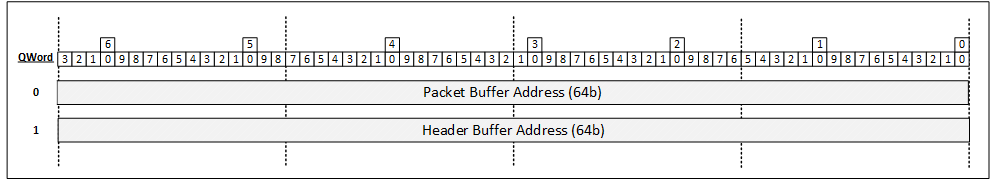

Descriptor fields layout:

- **Packet Buffer Address (64b)**  
  The physical address of the packet buffer defined in byte units. The packet buffer size is defined in the receive queue context. 

- **Header Buffer Address (64b)**  
  The physical address of the header buffer defined in byte units. The header address should be set by the software to an even number (word aligned address). The Header Buffer Address is meaningful only for Header Split queues and Split Always queues as defined by the DTYPE (descriptor type) field in the receive queue context. If a received packet spans across multiple buffers, only the first descriptor's header buffer is used. The header buffer size is defined in the receive queue context. The header buffer address is an even number to keep bit0 of the address set to zero (regardless of header split enablement). This bit is used as a place holder to the Descriptor Done ('DD') indication to the software reported on the as part of the descriptor write back format.

#### 32B RX Descriptors Read Format for Single Q Model

This is the read descriptor used when the queue operates in “In order
single queue model.”  
Descriptor length is 32B.

Descriptor fields layout:

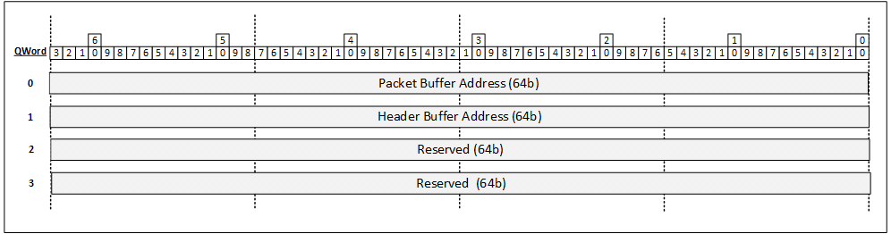

The fields in the first 16 Bytes are Identical to the 16 Byte
descriptors described above.

#### 16B RX Descriptors Read Format for Split Q Model

This is the read descriptor used when queue operates in “Out of order
split queue model.”  
Descriptor length is 16B.

Descriptor fields layout:

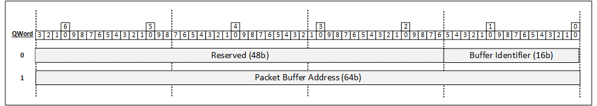

- **Buffer identifier (16): **The unique buffer identifier used by SW to associate the packet buffer addressed by this descriptor with the completion queue descriptor.
- **Packet Buffer Address (64b)**: The physical address of the packet buffer defined in byte units. The packet buffer size is defined in the negotiated receive queue context. 

#### 32B RX Descriptors Read Format for Split Q Model

This is the read descriptor used when queue operates in “Out of order
split queue model.”  
Descriptor length is 32B.

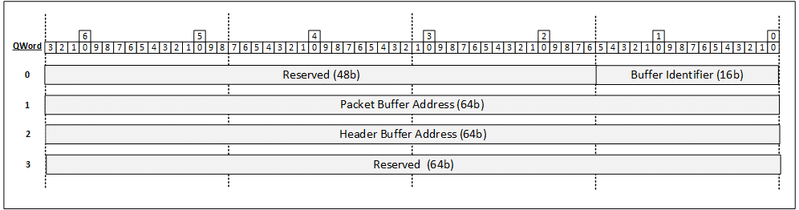

Descriptor fields layout:

- **Buffer Identifier (16)**  
  The unique buffer identifier used by SW to associate the header buffer and packet buffer addressed by this descriptor with the completion queue descriptor.
- **Packet Buffer Address (64)**  
  Identical to the definition described above.
- **Header Buffer Address (64)**  
  Identical to the definition described above.

### RX Descriptor Write Formats

A single packet might span a single buffer or multiple buffers reported
by their matched descriptors. If a packet is described by a single
descriptor then all the fields are valid. 

The rules below apply to a packet that is described by multiple
descriptors:

1.  The following fields are valid in all descriptors of a packet:

  - DD flag (Done)
  - EOP flag (End of Packet)
  - PKTL field (Packet content length)
  - Generation flag (Valid only when the queue is configured to work in "split queue model").
  - Buffer ID (Valid only when the queue is configured to work in "split queue model").
  - RXDID.

2.  The following fields are valid only in the first descriptor of a
    packet:

  - HDRL (Packet content length in the header buffer)
  - SPH (Header is identified for header split functionality)
  - HBO (Header Buffer overflow)

3.  All other fields are valid only in the last descriptor of a packet.


#### 16B RX Descriptors Write Format Base

This is the write descriptor used when the queue operates in “In order
single queue model.”  
Descriptor length is 16B.

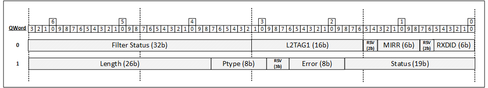

Descriptor fields layout:

<table>
<colgroup>
<col style="width: 9%" />
<col style="width: 23%" />
<col style="width: 10%" />
<col style="width: 57%" />
</colgroup>
<thead>
<tr class="header">
<th><strong>Word</strong></th>
<th><strong>Field Mnemonic</strong></th>
<th><strong>Width</strong></th>
<th><strong>Description</strong></th>
</tr>
<tr class="odd">
<th>0</th>
<th>RXDID</th>
<th>6b</th>
<th><table>
<colgroup>
<col style="width: 100%" />
</colgroup>
<thead>
<tr class="header">
<th><p>RX write back descriptor ID</p>
<p>0 - Base 16B</p>
<p>1- Base 32B</p></th>
</tr>
</thead>
<tbody>
</tbody>
</table></th>
</tr>
<tr class="header">
<th>0</th>
<th>Reserved</th>
<th>2</th>
<th>Reserved</th>
</tr>
<tr class="odd">
<th></th>
<th>MIRR</th>
<th>6b</th>
<th>Mirror Match Rule ID (UMBCAST field is zero)<br />
<br />
matched Mirror Rule ID that directed the packet to this queue</th>
</tr>
<tr class="header">
<th>1</th>
<th>L2TAG1</th>
<th>16b</th>
<th>Extracted L2 VLAN Tag from the receive packet.<br />
This field is valid if the L2TAG1P flag in this descriptor is set, else
field is invalid and set to zero.</th>
</tr>
<tr class="odd">
<th>2,3</th>
<th>Filter Status</th>
<th>32b</th>
<th><p>Filter Status</p>
<ul>
<li><p>If the packet matches the Hash filter, FLTSTAT is set to 11b and
this field contains the hash signature (RSS (Receive Side
Scaling)). </p></li>
<li><p>Else, FLTSTAT is set to 00b and this field is set to
zero.</p></li>
</ul></th>
</tr>
<tr class="header">
<th>4,5</th>
<th>Status</th>
<th>19b</th>
<th><p>Status indications</p>
<p>Layout listed separately below.</p></th>
</tr>
<tr class="odd">
<th>4,5</th>
<th>Error</th>
<th>8b</th>
<th>Error indications.<br />
<br />
Layout listed separately below.</th>
</tr>
<tr class="header">
<th>6,7</th>
<th>PTYPE</th>
<th>8b</th>
<th><p>Packet Type </p>
<p>Enumerates the packet type according to the packet types programmed
into the device.</p>
<p>Packet types values are discoverable by the mechanism described in
the “Packet Types negotiation” section of this document.</p></th>
</tr>
<tr class="odd">
<th>6,7</th>
<th><strong>Length</strong></th>
<th>26</th>
<th><table>
<colgroup>
<col style="width: 15%" />
<col style="width: 19%" />
<col style="width: 64%" />
</colgroup>
<thead>
<tr class="header">
<th><strong>Bits</strong></th>
<th><strong>Name</strong></th>
<th><strong>Functionality</strong></th>
</tr>
<tr class="odd">
<th>25</th>
<th>SPH</th>
<th>The Split Header flag is an indication that the device identified
the packet header.</th>
</tr>
<tr class="header">
<th>0:13</th>
<th>PKTL</th>
<th>Packet content length in the packet buffer defined in byte
units.</th>
</tr>
<tr class="odd">
<th>14:24</th>
<th>HDRL</th>
<th><p>Bits 0:9 - Packet content length in the header buffer defined in
byte units.</p>
<p>Bit 10 reserved.</p></th>
</tr>
</thead>
<tbody>
</tbody>
</table></th>
</tr>
</thead>
<tbody>
</tbody>
</table>

##### Status Field

The table below details the contents of the Status field.

<table>
<colgroup>
<col style="width: 8%" />
<col style="width: 15%" />
<col style="width: 9%" />
<col style="width: 67%" />
</colgroup>
<thead>
<tr class="header">
<th><strong>Bit</strong></th>
<th><strong>Field Mnemonic</strong></th>
<th><strong>Width</strong></th>
<th><strong>Description</strong></th>
</tr>
<tr class="odd">
<th>0</th>
<th>DD</th>
<th>1b</th>
<th><p><strong>Descriptor Done</strong></p>
<p>Descriptor done indication flag</p></th>
</tr>
<tr class="header">
<th>1</th>
<th>EOP</th>
<th>1b</th>
<th><p><strong>End of Packet</strong></p>
<p>End of packet flag is set to 1b indicating that this descriptor
is the last one of a packets</p></th>
</tr>
<tr class="odd">
<th>2</th>
<th>L2TAG1P</th>
<th>1b</th>
<th><p><strong>L2 TAG 1 Present</strong></p>
<p>L2 TAG 1 presence indication while the L2 Tag is stripped from the
packet and reported in the L2TAG1 field in the descriptor.</p>
<p>If the specified L2 tag is not present in the packet the L2TAG1P flag
is cleared.</p></th>
</tr>
<tr class="header">
<th>3</th>
<th>L3L4P</th>
<th>1b</th>
<th><p><strong>L3 and L4 Integrity Check</strong></p>
<p>For IP (Internet Protocol) packets, this flag indicates that
detectable L3 or L4 integrity check was processed by the hardware
according to the negotiated capabilities.</p>
<p>If L3L4P is set to zero, SW should not assume Device calculated
checksums for any of the headers in the packet should treat the L3L4E
field as invalid</p></th>
</tr>
<tr class="odd">
<th>4</th>
<th>CRCP</th>
<th>1b</th>
<th><p><strong>CRC Posted</strong></p>
<p>CRCP indicates that the Ethernet CRC is posted with data to the host
buffer.</p>
<p>Note that strip CRC is set through the negotiated queue context.</p>
<p>If the RXE error flag is set, the CRC bytes are not stripped
regardless of the queue context setting.<br />
For loop back packets (<strong>LPBK</strong> flag is set 1) Device does
not compute the CRC and therefore the CRC bytes for such a packet are
not present in the packet regardless of the CRCStrip setting in the
queue context.</p>
<p>Modified packets may contain original CRC and not the CRC
re-calculated after the packet modification. Original/re-calculated CRC
should be part of device capability negotiation.</p></th>
</tr>
<tr class="header">
<th>5:7</th>
<th>Reserved</th>
<th>RSV</th>
<th><p><strong>Reserved</strong></p>
<p>Reserved, Set to “0” by hardware.</p></th>
</tr>
<tr class="odd">
<th>8</th>
<th>EXT_UDP_0</th>
<th>1b</th>
<th><p><strong>External UDP (User Datagram Protocol) Checksum
Zero</strong></p>
<p>This flag is set for received tunneled packets with an outer UDP
header on which the outer UDP checksum word equals zero.</p>
<p>In case of double tunneled packet (with 2 outer headers), this flag
is set if one of the outer headers fulfills the condition above.</p>
<p>Note that UDP checksum zero is an indication that there is no
checksum.</p></th>
</tr>
<tr class="header">
<th>9:10</th>
<th>UMBCAST</th>
<th>2b</th>
<th><p><strong>Unicast Multicast Broadcast</strong></p>
<p>UMBCAST indicates the Destination Address type of the outer Ethernet
header of the packet delivered to the host.</p>
<p>Destination Address can be one of the following:<br />
00b - Unicast<br />
01b - Multicast<br />
10b - Broadcast<br />
11b - Mirrored Packet (indicated by packet processor)</p></th>
</tr>
<tr class="odd">
<th>11</th>
<th>Reserved</th>
<th>1b</th>
<th>Reserved</th>
</tr>
<tr class="header">
<th>13:12</th>
<th>FLTSTAT</th>
<th>2b</th>
<th><p><strong>Filter Status</strong></p>
<p>The FLTSTAT indicates the reported content in the “Filter Status”
field.</p>
<p>FLTSTAT has the following encoding:<br />
00b - Reserved.<br />
01b - Reserved.<br />
10b - Reserved..<br />
11b - Hash filter signature (RSS (Receive Side Scaling))</p></th>
</tr>
<tr class="odd">
<th>14</th>
<th>LPBK</th>
<th>1b</th>
<th><p><strong>Loopback</strong></p>
<p>Loop back indication which means that the packet originated from this
system rather than the network</p></th>
</tr>
<tr class="header">
<th>15</th>
<th>IPV6EXADD</th>
<th>1b</th>
<th><p><strong>IPV6EXADD</strong></p>
<p>Set when an IPv6 packet contains a Destination Options Header or a
Routing Header.</p>
<p>If the packet contains more than a single IP header , the IPV6EXADD
is a logic ‘OR’ function of the multiple IP headers.</p></th>
</tr>
<tr class="odd">
<th>16:17</th>
<th>Reserved</th>
<th>1b</th>
<th><p><strong>Reserved</strong></p>
<p>Reserved field</p></th>
</tr>
<tr class="header">
<th>18</th>
<th>INT_UDP_0</th>
<th>1b</th>
<th><p><strong>Internal UDP Checksum Zero</strong></p>
<p>This flag is set for received UDP packets on which the UDP checksum
word equals zero.</p>
<p>Note that for tunneled packets with UDP header, this flag relates to
the checksum field in the inner UDP header.</p>
<p>Note that UDP checksum zero is an indication that there is no
checksum.</p></th>
</tr>
</thead>
<tbody>
</tbody>
</table>

##### Error Field

The table below details the contents of the Error field.

<table>
<colgroup>
<col style="width: 6%" />
<col style="width: 15%" />
<col style="width: 9%" />
<col style="width: 69%" />
</colgroup>
<thead>
<tr class="header">
<th><strong>Bit</strong></th>
<th><strong>Field Mnemonic</strong></th>
<th><strong>Width</strong></th>
<th><strong>Description</strong></th>
</tr>
<tr class="odd">
<th>0</th>
<th>RXE</th>
<th>1b</th>
<th><p>Receive Error</p>
<p>The RXE error bit is an indication for MAC layer errors.</p></th>
</tr>
<tr class="header">
<th>1</th>
<th>RSV</th>
<th>1b</th>
<th></th>
</tr>
<tr class="odd">
<th>2</th>
<th>HBO</th>
<th>1b</th>
<th><p><strong>Header Buffer Overflow</strong></p>
<p>This flag is set when using Header split buffers or Split Always
buffers and the identified packet header is larger than the header
buffer.</p></th>
</tr>
<tr class="header">
<th>3:5</th>
<th>L3L4E</th>
<th>1b</th>
<th><p><strong>L3/L4 Error</strong></p>
<p>For IP packets processed by the hardware the L3L4E flag has the
following encoding:<br />
bit 3 - IPE: IP checksum error indication for non-tunneled packets. For
tunneled packets it is the most inner IP header indication.<br />
bit 4 - L4E: L4 integrity error indication for non-tunneled
packets. Most inner L4 header in case of UDP tunneling.<br />
bit 5 - EIPE: External IP header or L4 checksum error.<br />
Relevant for tunneled packet when there is at least 1 external header,
L3 or L4, in a packet. The bit describes the logical OR between all the
external headers error indications.</p>
<p>For these bits, a tunneled packet does not imply that the packet has
an inner IP header.</p>
<p>For example, a VXLAN packet without an inner IP is considered as a
tunnel packet.</p>
<p>The error reporting is done according to the negotiated
capabilities.</p></th>
</tr>
<tr class="odd">
<th>7:6</th>
<th>RSV</th>
<th>1b</th>
<th><strong>Reserved</strong></th>
</tr>
</thead>
<tbody>
</tbody>
</table>

#### 32B RX Descriptors Write Format Base

This is the write descriptor used when the queue operates in “In order,
single queue model.”  
Descriptor length is 32B.

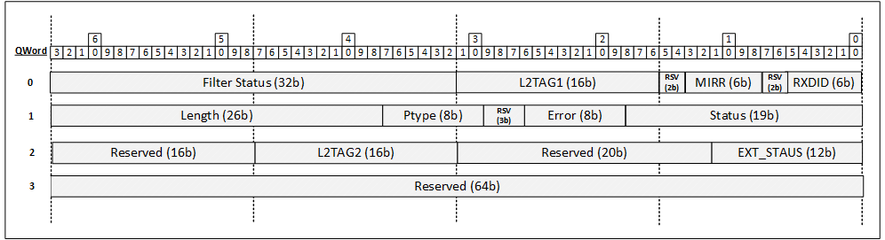

Descriptor fields layout:

<table>
<colgroup>
<col style="width: 9%" />
<col style="width: 17%" />
<col style="width: 10%" />
<col style="width: 62%" />
</colgroup>
<thead>
<tr class="header">
<th><strong>Word</strong></th>
<th><strong>Field Mnemonic</strong></th>
<th><strong>Width</strong></th>
<th><strong>Description</strong></th>
</tr>
<tr class="odd">
<th>0-7</th>
<th></th>
<th>16*8b</th>
<th>Same as 16B descriptor</th>
</tr>
<tr class="header">
<th>8,9</th>
<th>Ext Status</th>
<th>12b</th>
<th><p>Ext Status indications</p>
<p>Layout listed separately below.</p></th>
</tr>
<tr class="odd">
<th>8,9</th>
<th>Reserved</th>
<th>20b</th>
<th></th>
</tr>
<tr class="header">
<th>10</th>
<th>L2TAG2</th>
<th>16b</th>
<th>Extracted L2 Tag from the receive packet.<br />
This field is valid if the L2TAG2P flag in this descriptor is set, else
the field is invalid and set to zero.</th>
</tr>
<tr class="odd">
<th>11-13</th>
<th>Reserved</th>
<th>16b</th>
<th></th>
</tr>
<tr class="header">
<th>14,15</th>
<th>Reserved</th>
<th>16b</th>
<th></th>
</tr>
</thead>
<tbody>
</tbody>
</table>

##### Ext Status Field

The table below details the contents of the extended status field.

<table>
<colgroup>
<col style="width: 9%" />
<col style="width: 15%" />
<col style="width: 9%" />
<col style="width: 65%" />
</colgroup>
<thead>
<tr class="header">
<th><strong>Bit</strong></th>
<th><strong>Field Mnemonic</strong></th>
<th><strong>Width</strong></th>
<th><strong>Description</strong></th>
</tr>
<tr class="odd">
<th>0</th>
<th>L2TAG2P</th>
<th>1b</th>
<th><p><strong>L2 TAG 2 Present</strong></p>
<p>L2 TAG 2 presence indications while the L2 Tag is stripped from the
packet and reported in the L2TAG2 field in the descriptor.</p>
<p>If the specified L2 tag is not present in the packet the L2TAG2P flag
is cleared.</p></th>
</tr>
<tr class="header">
<th>3:1</th>
<th>RSV</th>
<th>3b</th>
<th>Reserved</th>
</tr>
<tr class="odd">
<th>5:4</th>
<th>RSV</th>
<th>2b</th>
<th>Reserved</th>
</tr>
<tr class="header">
<th>11:6</th>
<th>RSV</th>
<th>3b</th>
<th><strong>Reserved</strong></th>
</tr>
</thead>
<tbody>
</tbody>
</table>

#### Flex RX Descriptors Write Format

The "Flex" write back formats are used in the “In order single queue
model" and for "Out of order split queue model".

#### 16B RX Descriptors Write Format Flex

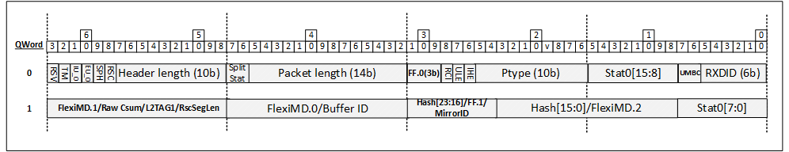

Descriptor fields layout:

<table>
<colgroup>
<col style="width: 9%" />
<col style="width: 20%" />
<col style="width: 10%" />
<col style="width: 59%" />
</colgroup>
<thead>
<tr class="header">
<th><strong>Word</strong></th>
<th><strong>Field Mnemonic</strong></th>
<th><strong>Width</strong></th>
<th><strong>Description</strong></th>
</tr>
<tr class="odd">
<th>0</th>
<th>RXDID</th>
<th>6b</th>
<th><p>RXDID</p>
<p>Setting of this field is described at LAN Receive Descriptors.</p></th>
</tr>
<tr class="header">
<th>0</th>
<th>UMBC</th>
<th>2b</th>
<th><p>UMBCAST </p>
<p>Identical to the field definition in the Base Mode descriptor
format.</p></th>
</tr>
<tr class="odd">
<th>0</th>
<th>Stat.0[15:8]</th>
<th>8b</th>
<th><p>Status/Error indications, Upper byte</p>
<p>Layout listed separately below.</p></th>
</tr>
<tr class="header">
<th>1</th>
<th>PTYPE</th>
<th>10b</th>
<th><p>Packet Type </p>
<p>Enumerates the packet type according to the packet types programmed
into the device.</p>
<p>Packet types values are discoverable by the mechanism described in
the “Packet Types negotiation” section of this document.</p></th>
</tr>
<tr class="odd">
<th>`1</th>
<th>IHE</th>
<th>1b</th>
<th><p>IP_HDR_ERR</p>
<p>Set when any level of IP header validation error occurs except for
the Checksum validation errors which are reported through L3L4P and Xsum
reports fields.</p></th>
</tr>
<tr class="header">
<th>1</th>
<th>ULE</th>
<th>1b</th>
<th><p>UDP_LEN_ERR</p>
<p>Set when any level of UDP length validation error occurs.</p></th>
</tr>
<tr class="odd">
<th>1</th>
<th>RCI</th>
<th>1b</th>
<th><p>RAW_CSUM_INV</p>
<p>Field operates as "Raw checksum invalid" flag.</p></th>
</tr>
<tr class="header">
<th>1</th>
<th>FF.0</th>
<th>3</th>
<th><p>Flexible Flags section 0 </p>
<p>Up to 3 x user-selectable flags per RXDID ProfileID.</p></th>
</tr>
<tr class="odd">
<th>2</th>
<th>Packet Length</th>
<th>14b</th>
<th><p>Packet Length </p>
<p>Identical to PKTL the field definition in the Base Mode descriptor
format.</p></th>
</tr>
<tr class="header">
<th>2</th>
<th>Split status</th>
<th>2b</th>
<th><p>Split Status</p>
<p>Status and error indications.</p>
<p>Valid only when the queue is configured to work in "split queue
model".</p>
<p>Layout listed separately below.</p></th>
</tr>
<tr class="odd">
<th>3</th>
<th>Header Length</th>
<th>10b</th>
<th><p>Header Length </p>
<p>Identical to the HDRL field definition in the Base Mode descriptor
format.</p></th>
</tr>
<tr class="header">
<th>3</th>
<th>RSC</th>
<th>1b</th>
<th><p>RSC</p>
<p>Set when the packet is an RSC packet.</p></th>
</tr>
<tr class="odd">
<th>3</th>
<th>SPH</th>
<th>1b</th>
<th><p>SPH </p>
<p>Identical to the field definition in the Base Mode descriptor
format.</p></th>
</tr>
<tr class="header">
<th>3</th>
<th>EX_0</th>
<th>1b</th>
<th><p>Ext_UDP_0</p>
<p>Outer UDP Checksum equals 0 - Identical to the field definition in
the Base Mode descriptor format.</p></th>
</tr>
<tr class="odd">
<th>3</th>
<th>IU_0</th>
<th>1b</th>
<th><p>Int_UDP_0</p>
<p>Inner UDP Checksum equals 0 - Identical to the field definition in
the Base Mode descriptor format.</p></th>
</tr>
<tr class="header">
<th>3</th>
<th>TM</th>
<th>1b</th>
<th><p>TRUNCATE_MIRROR<br />
Indication is set when the packet is a truncated mirror copy.</p>
<p>Packet mirror truncation is a negotiated capability.</p>
<p>When this bit is set, raw xsum and L3/L4 xsums are invalid
(regardless of the RAW_CSUM_INV and "XSUM Reports" values).</p></th>
</tr>
<tr class="odd">
<th>3</th>
<th>Reserved</th>
<th>1b</th>
<th></th>
</tr>
<tr class="header">
<th>4</th>
<th>Stat.0[7:0]</th>
<th>8b</th>
<th><p>Status/Error indications, Lower byte</p>
<p>Layout listed separately below.</p></th>
</tr>
<tr class="odd">
<th>4/5</th>
<th>Hash[15:0]/<br />
FlexiMD.2[15:0]</th>
<th>16</th>
<th><p>Hash field, bits 15:0/Flexible Metadata Container #0 bits</p>
<p>Field holds Bits 15:0 of RSS Hash field or FlexiMD.2 field.</p>
<p>The content of this field is determined based on the negotiated queue
context.</p></th>
</tr>
<tr class="header">
<th>4/5</th>
<th>Hash[23:16]/<br />
MirrorID/<br />
FF.1</th>
<th>8b</th>
<th><p>Hash field, bits 23:16/MirrorID/Flexible Flags section 1 </p>
<p>Field holds Bits 23:16 of the RSS Hash field, holds the mirrorID
field (the MirrorID field definition is Identical to the field
definition in the Base Mode descriptor format) or Flexible flags1.</p>
<p>The content of this field is determined based on the negotiated queue
context.</p></th>
</tr>
<tr class="odd">
<th>6</th>
<th>FlexiMD.0/<br />
BufferID</th>
<th>16b</th>
<th><p>Flexible Metadata Container #0 /BufferID</p>
<p>Field holds FlexiMD.0 or the BufferId field. (Used as the buffer
identifier in the split queue model)</p>
<p>The content of this field is determined based on the negotiated queue
context.</p></th>
</tr>
<tr class="header">
<th>7</th>
<th>FlexiMD.1/<br />
Raw_CS/<br />
L2TAG1/<br />
RSCPayLen</th>
<th>16b</th>
<th><p>Flexible Metadata Container #1/Raw Checksum/L2TAG1/RSC payload
length</p>
<p>Field holds the FlexiMD.1, Raw checksum, L2TAG1 or the RSC segment
length.</p>
<p>The content of this field is determined based on the negotiated queue
context.</p>
<p>When field meaning is "Raw checksum" it holds the checksum value
calculated from byte 14 of the packet until the last byte of the packet
excluding CRC (including the padding bytes). “Raw checksum” is invalid
when RAW_CSUM_INV is set.</p>
<p>When field meaning is "RSC payload length" it holds the payload
length of the first RSC segment.</p></th>
</tr>
</thead>
<tbody>
</tbody>
</table>

#### 32B RX Descriptors Write Format Flex

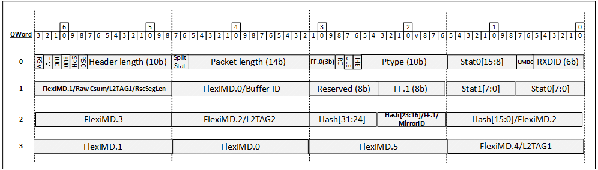

Descriptor fields layout:

<table>
<colgroup>
<col style="width: 25%" />
<col style="width: 25%" />
<col style="width: 25%" />
<col style="width: 25%" />
</colgroup>
<thead>
<tr class="header">
<th><strong>Word</strong></th>
<th><strong>Field Mnemonic</strong></th>
<th><strong>Width</strong></th>
<th><strong>Description</strong></th>
</tr>
<tr class="odd">
<th>0</th>
<th>RXDID</th>
<th>6b</th>
<th>Identical to the field definition in the first 16B descriptor
table.</th>
</tr>
<tr class="header">
<th>0</th>
<th>UMBCAST</th>
<th>2b</th>
<th>Identical to the field definition in the first 16B descriptor
table.</th>
</tr>
<tr class="odd">
<th>0</th>
<th>Stat.0[15:8]</th>
<th>8b</th>
<th>Identical to the field definition in the first 16B descriptor
table.</th>
</tr>
<tr class="header">
<th>1</th>
<th>PTYPE</th>
<th>10b</th>
<th>Identical to the field definition in the first 16B descriptor
table.</th>
</tr>
<tr class="odd">
<th>1</th>
<th>IHE</th>
<th>1b</th>
<th>Identical to the field definition in the first 16B descriptor
table.</th>
</tr>
<tr class="header">
<th>1</th>
<th>ULE</th>
<th>1b</th>
<th>Identical to the field definition in the first 16B descriptor
table.</th>
</tr>
<tr class="odd">
<th>1</th>
<th>RCI</th>
<th>1b</th>
<th>Identical to the field definition in the first 16B descriptor
table.</th>
</tr>
<tr class="header">
<th>1</th>
<th>FF.0</th>
<th>3</th>
<th>Identical to the field definition in the first 16B descriptor
table.</th>
</tr>
<tr class="odd">
<th>2</th>
<th>Packet Length</th>
<th>14b</th>
<th>Identical to the field definition in the first 16B descriptor
table.</th>
</tr>
<tr class="header">
<th>2</th>
<th>Split status</th>
<th>2b</th>
<th>Identical to the field definition in the first 16B descriptor
table.</th>
</tr>
<tr class="odd">
<th>3</th>
<th>Header Length</th>
<th>10b</th>
<th>Identical to the field definition in the first 16B descriptor
table.</th>
</tr>
<tr class="header">
<th>3</th>
<th>RSC</th>
<th>1b</th>
<th>Identical to the field definition in the first 16B descriptor
table.</th>
</tr>
<tr class="odd">
<th>3</th>
<th>SPH</th>
<th>1b</th>
<th>Identical to the field definition in the first 16B descriptor
table.</th>
</tr>
<tr class="header">
<th>3</th>
<th>EU_0</th>
<th>1b</th>
<th>Identical to the field definition in the first 16B descriptor
table.</th>
</tr>
<tr class="odd">
<th>3</th>
<th>IU_0</th>
<th>1b</th>
<th>Identical to the field definition in the first 16B descriptor
table.</th>
</tr>
<tr class="header">
<th>3</th>
<th>TM</th>
<th>1b</th>
<th>Identical to the field definition in the first 16B descriptor
table.</th>
</tr>
<tr class="odd">
<th>3</th>
<th>Reserved</th>
<th>1b</th>
<th></th>
</tr>
<tr class="header">
<th>4</th>
<th>Stat.0[7:0]</th>
<th>8b</th>
<th>Identical to the field definition in the first 16B descriptor
table.</th>
</tr>
<tr class="odd">
<th>4</th>
<th>Stat.1[7:0]</th>
<th>8b</th>
<th><p>Status/Error indications, Upper byte</p>
<p>Layout listed separately below.</p></th>
</tr>
<tr class="header">
<th>5</th>
<th>FF.1</th>
<th>8b</th>
<th><p>Flexible Flags section 1 </p>
<p>Up to 8 x user-selectable flags.</p></th>
</tr>
<tr class="odd">
<th>5</th>
<th>RSV</th>
<th>8b</th>
<th></th>
</tr>
<tr class="header">
<th>6</th>
<th>FlexiMD.0/BufferID</th>
<th>16b</th>
<th>Identical to the field definition in the first 16B descriptor
table.</th>
</tr>
<tr class="odd">
<th>7</th>
<th><p>FlexiMD.1/Raw_CS/</p>
<p>L2TAG1/RSCPayLen</p></th>
<th>16b</th>
<th>Identical to the field definition in the first 16B descriptor
table.</th>
</tr>
<tr class="header">
<th>8</th>
<th>Hash [15:0]/<br />
FlexiMD.2</th>
<th>16b</th>
<th>Identical to the field definition in the first 16B descriptor
table.</th>
</tr>
<tr class="odd">
<th>9</th>
<th>Hash [23:16]/<br />
MirrorID/FlexiFlags.1</th>
<th>8b</th>
<th>Identical to the field definition in the first 16B descriptor
table.</th>
</tr>
<tr class="header">
<th>9</th>
<th>Hash [31:24]</th>
<th>8b</th>
<th><p>Hash field, bits 31:24</p>
<p>Bits 31:24 of the RSS Hash field</p></th>
</tr>
<tr class="odd">
<th>10</th>
<th>FlexiMD.2/L2TAG2</th>
<th>16b</th>
<th><p>Flexible Metadata Container #2/L2TAG2</p>
<p>Field holds the L2TAG2 or the FlexiMD.2 field (Generic 16b container
for conveying metadata/actions from packet processor to the host).</p>
<p>The content of this field is determined based on the negotiated queue
context.</p></th>
</tr>
<tr class="header">
<th>11</th>
<th>FlexiMD.3</th>
<th>16b</th>
<th><p>Flexible Metadata Container #3 </p>
<p>Generic 16b container for conveying metadata/actions from packet
processor to the host</p></th>
</tr>
<tr class="odd">
<th>12</th>
<th>FlexiMD.4/L2TAG1</th>
<th>16b</th>
<th><p>Flexible Metadata Container #4/L2TAG1</p>
<p>Field holds the L2TAG1 or the FlexiMD.4 field (Generic 16b container
for conveying metadata/actions from packet processor to the host).</p>
<p>The content of this field is determined based on the negotiated queue
context.</p></th>
</tr>
<tr class="header">
<th>13</th>
<th>FlexiMD.5</th>
<th>16b</th>
<th><p>Flexible Metadata Container #5</p>
<p>Generic 16b container for conveying metadata/actions from packet
processor to the host</p></th>
</tr>
<tr class="odd">
<th>14</th>
<th>FlexiMD.0</th>
<th>16b</th>
<th><p>Flexible Metadata Container #0</p>
<p>Generic 16b container for conveying metadata/actions from packet
processor to the host.</p></th>
</tr>
<tr class="header">
<th>15</th>
<th>FlexiMD.1</th>
<th>16b</th>
<th><p>Flexible Metadata Container #1</p>
<p>Generic 16b container for conveying metadata/actions from packet
processor to the host.</p></th>
</tr>
</thead>
<tbody>
</tbody>
</table>

##### Stat.0 Field

The table below details the contents of the Status/Error.0 field.

<table>
<colgroup>
<col style="width: 6%" />
<col style="width: 18%" />
<col style="width: 9%" />
<col style="width: 66%" />
</colgroup>
<thead>
<tr class="header">
<th><strong>Bit</strong></th>
<th><strong>Field Mnemonic</strong></th>
<th><strong>Width</strong></th>
<th><strong>Description</strong></th>
</tr>
<tr class="odd">
<th>0</th>
<th>DD</th>
<th>1b</th>
<th><p><strong>Descriptor Done</strong></p>
<p>Identical to the field definition in the Base Mode descriptor
format.</p></th>
</tr>
<tr class="header">
<th>1</th>
<th>EOP</th>
<th>1b</th>
<th><p><strong>End Of Packet</strong></p>
<p>Identical to the field definition in the Base Mode descriptor
format.</p></th>
</tr>
<tr class="odd">
<th>2</th>
<th>HBO</th>
<th>1b</th>
<th><p><strong>Header Buffer Overflow</strong></p>
<p>Identical to the field definition in the Base Mode descriptor
format.</p></th>
</tr>
<tr class="header">
<th>3</th>
<th>L3L4P</th>
<th>1b</th>
<th><p><strong>L3 and L4 Integrity Check</strong></p>
<p>For IP (Internet Protocol) packets, this flag indicates that
detectable L3 or L4 integrity check was processed by the hardware
according to the negotiated capabilities.</p>
<p>If L3L4P is set to zero or one of the flags below are set to 1 ,
SW should not assume Device calculated checksums for any of the headers
in the packet and should recalculate the checksums and SW should treat
the "Xusm reports" field as invalid :</p>
<ul>
<li><blockquote>
<p>IPV6EXADD</p>
</blockquote></li>
<li><blockquote>
<p>IP_HDR_ERR</p>
</blockquote></li>
<li><blockquote>
<p>UDP_LEN_ERR</p>
</blockquote></li>
<li><blockquote>
<p>One of the bits in the XSUM Reports field</p>
</blockquote></li>
</ul>
</th>
</tr>
<tr class="odd">
<th>7:4</th>
<th>XSUM Reports</th>
<th>4b</th>
<th><p><strong>Checksum Reports</strong></p>
<p>Checksum error indications:</p>
<p>bit 4 - IPE: IP checksum error indication for non-tunneled packets.
For tunneled packets it is the most inner IP header indication.</p>
<p>bit 5 - L4E: L4 integrity error indication for non-tunneled packets.
Most inner L4 header in case of UDP tunneling.</p>
<p>bit 6 - EIPE: External (most outer) IP header.<br />
Relevant for tunneled packet when there is at least 1 external IP header
in packet.</p>
<p>(When there is more than a single L3 outer header the packet flag
describes the logical OR between the error indication of the multiple
outer headers.)</p>
<p>bit 7 - EUDPE: External ( outermost) UDP checksum error.<br />
Relevant for tunneled packet when there is at least 1 external L4 header
in packet<br />
(When there is more than a single L4 outer header the packet flag
describes the logical OR between the error indication of the multiple
outer headers.)</p></th>
</tr>
<tr class="header">
<th>8</th>
<th>LPBK</th>
<th>1b</th>
<th><p><strong>Loopback</strong></p>
<p>Identical to the field definition in the Base Mode descriptor
format.</p></th>
</tr>
<tr class="odd">
<th>9</th>
<th>IPV6EXADD</th>
<th>1b</th>
<th><p>IPV6EXADD</p>
<p>Set when an IPv6 packet contains a Destination Options Header or a
Routing Header.</p>
<p>If the packet has more than a single IPv6 headers (tunneling), the
IPV6EXADD is a logic ‘OR’ function of the multiple IP headers.</p></th>
</tr>
<tr class="header">
<th>10</th>
<th>RXE</th>
<th>1b</th>
<th><p><strong>Receive MAC Errors</strong></p>
<p>Identical to the field definition in the Base Mode descriptor
format.</p></th>
</tr>
<tr class="odd">
<th>11</th>
<th>CRCP</th>
<th>1b</th>
<th><p><strong>Ethernet CRC Present</strong></p>
<p>Identical to the field definition in the Base Mode descriptor
format.</p></th>
</tr>
<tr class="header">
<th>12</th>
<th>RSS Valid</th>
<th>1b</th>
<th><p><strong>RSS Valid</strong> </p>
<p>Indicates that the RSS result if valid. Qualifies RSS metadata in
FlexiMD fields.</p></th>
</tr>
<tr class="odd">
<th>13</th>
<th>L2TAG1P</th>
<th>1b</th>
<th><p><strong>L2 Tag 1 Presence</strong></p>
<p>Identical to the field definition in the Base Mode descriptor
format.</p></th>
</tr>
<tr class="header">
<th>14</th>
<th>XTR_MD.0_VLD</th>
<th>1b</th>
<th><p><strong>Extract MD.0 Valid</strong> </p>
<p>When set, the FlexiMD.0 field is valid.</p></th>
</tr>
<tr class="odd">
<th>15</th>
<th>XTR_MD.1_VLD</th>
<th>1b</th>
<th><p><strong>Extract MD.1 Valid</strong> </p>
<p>When set, the FlexiMD.1 field is valid.</p></th>
</tr>
</thead>
<tbody>
</tbody>
</table>

#####  Split Status Field

The table below details the contents of the split status field (Valid
only when queue is configured to work in "split queue model").

<table>
<colgroup>
<col style="width: 5%" />
<col style="width: 15%" />
<col style="width: 9%" />
<col style="width: 68%" />
</colgroup>
<thead>
<tr class="header">
<th><strong>Bit</strong></th>
<th><strong>Field Mnemonic</strong></th>
<th><strong>Width</strong></th>
<th><strong>Description</strong></th>
</tr>
<tr class="odd">
<th>0</th>
<th>Generation</th>
<th>1b</th>
<th><p><strong>Generation bit</strong></p>
<p>Hardware toggles the generation bit on every wraparound on the
completion queue</p>
<p>Software identifies new completion queue entries by comparing the
generation bit.<br />
Using this method, software can determine the old entries from the new
ones by looking for mismatches on the generation bit from one descriptor
to the next. </p></th>
</tr>
<tr class="header">
<th>1</th>
<th>Buf Queue ID</th>
<th>1b</th>
<th><p><strong>Buffer queue identifier (within buffer queue
group)</strong></p>
<p>0 - Descriptor represents a buffer (or buffer pair in case of header
split) fetched from the first Buffer queue (within the buffer queue
group).</p>
<p>1 - Descriptor represents a buffer (or buffer pair in case of header
split) fetched from the second Buffer queue (within the buffer queue
group).</p></th>
</tr>
</thead>
<tbody>
</tbody>
</table>

##### Stat.1 Field

The table below details the contents of the Status/Error.1 field.

<table>
<colgroup>
<col style="width: 6%" />
<col style="width: 18%" />
<col style="width: 9%" />
<col style="width: 65%" />
</colgroup>
<thead>
<tr class="header">
<th><strong>Bit</strong></th>
<th><strong>Field Mnemonic</strong></th>
<th><strong>Width</strong></th>
<th><strong>Description</strong></th>
</tr>
<tr class="odd">
<th>1:0</th>
<th>RSV</th>
<th>2b</th>
<th></th>
</tr>
<tr class="header">
<th>2</th>
<th>RSV</th>
<th>1b</th>
<th></th>
</tr>
<tr class="odd">
<th>3</th>
<th>L2TAG2P</th>
<th>1b</th>
<th><p><strong>L2 Tag 2 Presence</strong></p>
<p>Identical to the field definition in the Base Mode descriptor
format.</p></th>
</tr>
<tr class="header">
<th>4</th>
<th>XTR_MD.2_VLD</th>
<th>1b</th>
<th><p><strong>Extract MD.2 Valid</strong> </p>
<p>When set, the FlexiMD.2 field is valid</p></th>
</tr>
<tr class="odd">
<th>5</th>
<th>XTR_MD.3_VLD</th>
<th>1b</th>
<th><p><strong>Extract MD.3 Valid</strong> </p>
<p>When set, the FlexiMD.3 field is valid</p></th>
</tr>
<tr class="header">
<th>6</th>
<th>XTR_MD.4_VLD</th>
<th>1b</th>
<th><p><strong>Extract MD.4 Valid</strong> </p>
<p>When set, the FlexiMD.4 field is valid</p></th>
</tr>
<tr class="odd">
<th>7</th>
<th>XTR_MD.5_VLD</th>
<th>1b</th>
<th><p><strong>Extract MD.5 Valid</strong> </p>
<p>When set, the FlexiMD.5 field is valid</p></th>
</tr>
</thead>
<tbody>
</tbody>
</table>

##### 

##### 

#### Flex RX Descriptors Notes

The differences in the usage of flex descriptor formats between the
single queue and split queue models are as follows:

- The split status field is valid only for the "split queue model" (In the single queue model this field is irrelevant and ignored by software.
- RSC is enabled only for "split queue model" queue and therefore RSC related fields (RSC flag and RscSegLen) are valid only for this queue model.
- Field FlexiMD.0/BufferID in the first 16B of the descriptor holds the FlexiMD.0 field when "single queue model" and holds BufferID when “split queue model”.

Regardless of queue model, the following fields in the descriptor can
hold different values depending on the negotiated queue context: 

1.  Depending on negotiated queue context, the "Hash [23:16]/MirrorID/FlexiFlags1" field in the first 16B of the descriptor holds the MirrorID field or the Hash [23:16] or the FlexiFlags1 field.
2.  Depending on negotiated queue context ,the “FlexiMD.1/Raw_CS/L2TAG1/RSCPayLen” field in the first 16B of the descriptor holds one of the following values:
    *  Holds the RSCPayLen for an RSC packet or the Raw csum for a non RSC packet.
    *  Holds the L2TAG1 field in case the tag is present in the RX descriptor (L2TAG1P flag is set) or holds the FlexiMD.1 field.
    *  Always holds the FlexiMD.1 field.

  Field "L2TAG1/FlexMD4" in the second 16B of the descriptor holds L2TAG1 if L2TAG1P is set and the “FlexiMD.1/Raw_CS/L2TAG1/RSCPayLen” field in the first 16B of the descriptor does not hold L2TAG1, Else, field holds FlexMD4.
3.  Depending on negotiated queue context the "Hash [15:0]/FlexMD2" field in the first 16B of the descriptor holds the Hash [15:0] field or the FlexMD2.

Field "L2TAG2/FlexMD2" in the second 16B of the descriptor holds L2TAG2
if L2TAG2P is set,  
Else, field holds FlexMD2.

## TX Queues

A transmit descriptor queue is a cyclic ring made of a list of
descriptors that points to memory buffers in host memory for the TX
packets of a particular queue.

A packet may be stored in a single transmit descriptor or spread across
multiple transmit descriptors, depending on the size of the buffers
associated with the transmit descriptor and the size of the transmitted
packet.

This section describes the different TX queue modes supported by the
device, describes how SW posts new TX packets for Device transmission,
and describes how Device indicates to SW that it can reuse the buffers
and descriptors for new packets.

The mode of operation is a per queue configuration. Each queue can be
configured to work in a different model:

- In order single queue model. This option is supported only when VIRTCHNL2_TXQ_MODEL_IN_ORDER_SINGLE feature is negotiated.
- In order split queue model. This option is supported only when VIRTCHNL2_TXQ_MODEL_IN_ORDER_SPLIT feature is negotiated.
- Out of order split queue model. This option is supported only when VIRTCHNL2_TXQ_MODEL_OUT_OF_ORDER_SPLIT feature is negotiated.

The device must negotiate at least
VIRTCHNL2_TXQ_MODEL_OUT_OF_ORDER_SPLIT or
VIRTCHNL2_TXQ_MODEL_IN_ORDER_SINGLE features.

### In Order Single Queue Model

In this model completions are reported “in order” - according to the
packet placement order in the queue.

In this model the same descriptor queue is used by SW to post
descriptors to Device and used by Device to report completed descriptors
to SW.

SW writes the packet descriptors to the queue and updates the QTX_TAIL
register to point to the Descriptor following the last descriptor
written (points to first descriptor owned by SW).  
Tail pointer should be updated in the packet granularity (SW cannot post
partial packets to Device).

After Device reads the packet from the data buffers (pointed by the
fetched descriptors) it reports a completion of a transmitted packet
by overriding the existing descriptors in ring with the write format
descriptor (As described in [<u>TX Write Back Descriptor
Format</u>](#tx-descriptor-write-formats)) .

SW uses the RS bit in the TX descriptor to indicate to the Device on
which descriptor Device should report completion to SW.

The following rules apply to RS bit setting :

- SW must keep a minimal gap of IDPF_TX_RS_MIN_GAP descriptors between 2 descriptors that have their RS flag set.
- The RS flag can be set only on the last Transmit Data Descriptor of a packet (single sent packet or TSO).

In addition to reporting completions for descriptors marked as such by
SW (RS bit setting), occasionally (based on a periodic timer), Device
will report a completion for the last descriptor processed (in case
completion was not already reported to this descriptor due to RS bit
setting).  
This guarantees that SW will be periodically notified for completed
descriptors regardless of RS bit setting.

The diagram below illustrates the descriptors Device/SW ownership based
the Tail pointer:

- TAIL pointer represents the Descriptor following the last descriptor
  written to the ring by SW.
- HEAD pointer represents the Descriptor following the last descriptor
  written by Device.
- White descriptors (owned by Device) are waiting to be processed by
  Device or currently processed by Device.
- Blue descriptors (owned by SW) were already processed by Device and
  can be reused again by SW.
- Zero descriptor are owned by Device when TAIL == HEAD
- The SW should never set the TAIL to a value above the HEAD minus 1.

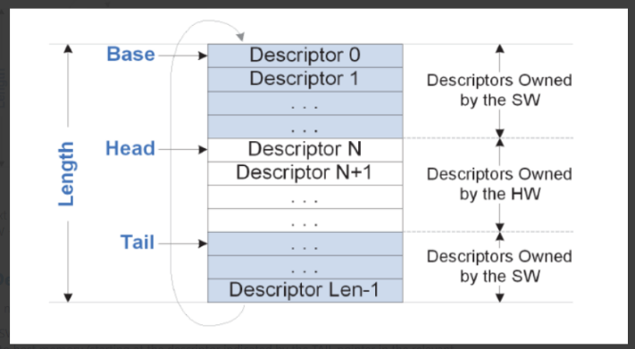

### In Order Split Queue Model

In this model completions are reported “in order” - according to the
packet placement order in the queue.

In this model "TX Queues" are used to pass buffers from SW to Device
while "Tx Completion Queues" are used to pass descriptor completions
from Device to SW (also called PCE- packet completion element).

Device supports an asymmetric ratio of Tx queues to TX Completion
queues.  
Each TX queue is associated to a single TX completion Queue while a TX
completion Queue can be fed by multiple Tx queues.  
The association of a TX queue to a completion queue is defined in the TX
queue context.  
The TX queue context also holds the “TX queue ID” field that is sent as
part of the PCE and used by SW to identify the TX queue of the completed
packet. This queue index must be unique among all TX queues that are
associated with the same completion queue.

In this model, SW posts descriptors to Device through the TX queue in
the same manner it does for the “single queue model” and as in the
“single queue model", SW sets the RS bit to indicate to Device on which
descriptors it should report a completion to SW.  
Similarly to the “single queue model” , In addition to reporting
completions for descriptors marked as such by SW (RS bit setting),
occasionally (based on a periodic timer), Device will report a
completion for the last descriptor processed (in case completion was not
already reported to this descriptor due to RS bit setting).

For this model , the “TX head” field in PCE holds the TX queue offset of
the descriptor that follows the RS marked descriptor.

### Out of Order Split Queue Model

In this model completion can be reported “out of order” - not according
to the packet descriptors placement order in the TX queue.

As in the “In order single queue model”, also in this model:

- "TX Queues" are used to pass buffers from SW to Device while "Tx Completion Queues" are used to pass descriptor completions from Device to SW (also called PCE- packet completion element).
- Single Device supports an asymmetric ratio of Tx queues to TX Completion queues. Each TX queue is associated to a single TX completion Queue and in the usual case, TX completion Queue will be fed by a set of Tx queues. The association between a TX queue and the completion queue is defined in the TX queue context.

In contrast to the “In order single queue model” where PCE can be
written to the completion queue once in a few packets (controlled RS bit
setting ) for this model PCE is written to the completion queue for
every packet.

To enable SW to associate of the completed packet with its buffers
software writes a COMPLETION_TAG to all data descriptors of the packet
while Device passes the COMPLETION_TAG back to SW through the PCE.

In addition to the regular completion, Device is capable of reporting SW
when descriptors are fetched from the TX queue by writing a “descriptor
fetch” PCE to the completion queue.  
By setting the RE bit in the TX read descriptor, SW indicates to the
Device on which descriptors Device should report a “descriptor fetch”
PCE to SW.

For this model,the “TX head” field in “descriptor fetch” PCE holds the
TX queue offset of the descriptor that follows the RE marked
descriptor.  
  
The following rules apply to RE bit setting :

* SW must keep a minimal gap of IDPF_TX_SPLITQ_RE_MIN_GAP descriptors between 2 descriptors that have their RE flag set.
* The RE flag can be set only on the last Transmit Data Descriptor of a packet (single sent packet or TSO).

Note that the descriptor fetch completion functionality
enables software to reuse the descriptor queue slots before data was
fetched from host memory.

### TX Completion Queues

TX completion queues are used in the split queue models.  
For the Tx Completion Queue, SW tracks the number of potential
completions in hardware (posted to TX queue and were not pulled from the
completion queue yet) and guarantees that there is enough space in the
Completion queue for any future completions (either “descriptor fetch”
completions or “data fetch” completions) without assuming anything on
its processing rate of the completions.

Note: SW should guarantee that there is a minimum free space of 128B in
the completion queue to avoid the theoretical case in which Device wraps
around the ring and overrides a line that has not been read yet by SW.

Device does not inform SW directly of the availability of descriptors in
the TX queue but piggybacks the notification to the completed descriptor
itself using a “generation” bit.  
As part of queue initialization, SW should clear all the generation bits
in all completion queue descriptors.

In the descriptor completion written by Device, Device changes the
generation bit value (from 0 to 1 or from 1 to 0) To indicate SW which
descriptors in the ring were written back.  
SW uses this bit to identify newly written completions by Device versus
ones which have already been processed by SW. The bit polarity is
flipped every ring wraparound.

### TX Descriptor Formats

The text below describes the TX read descriptor formats and TX write
descriptor formats.  
A "read format" descriptor is a descriptor posted by SW and read by
Device while a "write format" descriptor is a descriptor written by the
Device and read by SW (TX packet completion).

For both queue models the read descriptor holds the buffer pointers,
offload parameters and metadata to downstream blocks.  
Specifically, for the “out of order split queue model”, the read
descriptor also holds the unique packet identifier (sent as is to packet
completion) used for SW to associate the submitted packet with the
completed packet.

### TX Descriptor Read Formats

There are two basic types of descriptors: Data and Context.

* Data descriptors point to packet buffers at host memory.
* Context descriptors and data descriptors hold offload parameters (such as TSO, checksum offload, etc.) and metadata passed to downstream blocks.

All TX descriptors have a DTYPE field that represents the descriptor
type.  
DTYPEs field is placed at the least-significant bits of the second
quad-word of the descriptor.  
DTYPEs 0x0, 0x1 and 0xF are exceptional by having a 4b DTYPE, all the
rest of the DTYPEs (descriptor type) are 5 bits long.

All context descriptors except for context descriptor of DTYPE 0x1 share
the same 16b structure of CMD_DTYPE that includes the five-bit DTYPE
field (encoding the descriptor type) and the rest of the CMD fields.

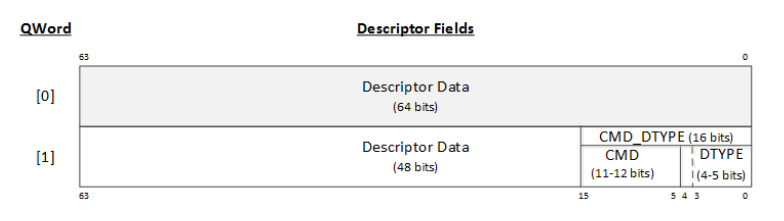

The table below describes the different descriptor types encoding and
the queue models on which they are supported.

“Reserved for OEM” means that a DTYPE cannot be used for Future
extension, only OEMs can use it for their OEM specific features.

“Free” means that a DTYPE is available for future use.

“WIP” Means they are in the process of getting defined for
Standardization.

Note:

6 are already defined in Current Spec, 13 Free for future , 3 WIP, 10 “Reserved for OEM”.  
2 DTYPEs out of the 13 free DTYPs are “reserved for OEM” for In-order
Single Queue and free for the other queue models.

| **DTYPE** | **Queue Models**                                                              |
|-----------|-------------------------------------------------------------------------------|
| 0         | Base TX Data & Context Descriptor Formats for "In order single queue model".  |
| 1         | Native TX Context                                                             |
| 2         | Reserved for OEM                                                              |
| 3         | Free                                                                          |
| 4         | Context with L2Tag1                                                           |
| 5         | TX TSO Context Descriptor                                                     |
| 6-7       | Reserved for OEM                                                              |
| 8         | Context Desc with LSO and L2Tag2                                              |
| 9         | WIP                                                                           |
| 10        | Reserved for OEM                                                              |
| 11        | Free                                                                          |
| 12        | TX Data Descriptor for Out of order, split queue model.                       |
| 13-14     | Free                                                                          |
| 15        | Free (Except for In-order Single Queue where DTYPE is reserved for OEM)       |
| 16-18     | Reserved for OEM                                                              |
| 19        | WIP                                                                           |
| 20        | Reserved for OEM                                                              |
| 21        | Free                                                                          |
| 22        | WIP                                                                           |
| 23-28     | Free                                                                          |
| 29-30     | Reserved for OEM                                                              |
| 31        | Free (Except for In-order Single Queue where DTYPE is reserved for OEM)       |

#### Base TX Data Descriptor - DTYPE = 0x0

This is the basic data descriptor used for “in order” queues. (When the
queue operates in “In order single queue model” or in “In order split
queue model”).

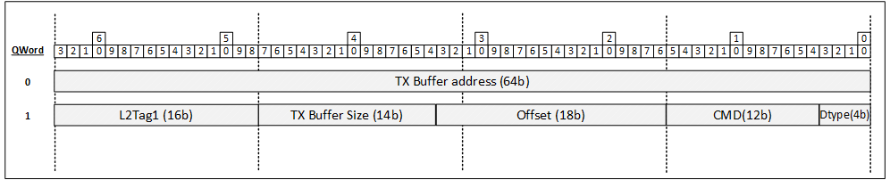

Descriptor fields layout:

 

<table>
<colgroup>
<col style="width: 17%" />
<col style="width: 8%" />
<col style="width: 73%" />
</colgroup>
<thead>
<tr class="header">
<th><strong>Field</strong></th>
<th><strong> Size</strong></th>
<th><strong>Functionality</strong></th>
</tr>
<tr class="odd">
<th>TX_BUF_ADDR</th>
<th>64b</th>
<th>Address of packet buffer in host memory. The address is in the
format appropriate for the queue. For example, a VF queue would use
guest physical buffer addresses.</th>
</tr>
<tr class="header">
<th>L2TAG1</th>
<th>16b</th>
<th>L2 tag insertion offload data value for the first tag added by the
device. Offload is enabled when the IL2TAG1 flag is set.</th>
</tr>
<tr class="odd">
<th>TX_BUF_SIZE</th>
<th>14b</th>
<th>Size of packet buffer in bytes.</th>
</tr>
<tr class="header">
<th>OFFSET</th>
<th>18b</th>
<th><p>Header offsets provided by software. This 18-bit field supplies
three separate header lengths:</p>
<table>
<colgroup>
<col style="width: 12%" />
<col style="width: 16%" />
<col style="width: 70%" />
</colgroup>
<thead>
<tr class="header">
<th>Bits</th>
<th>Field</th>
<th>Functionality Notes</th>
</tr>
<tr class="odd">
<th>0:6</th>
<th>MACLEN</th>
<th>MAC Header Length in Words. In case of a tunnel packet, MACLEN
defines the outer L2 header. MACLEN defines the L2 header length up to
including the Ethertype. If L2 tag(s) are provided in the data buffers,
then they are included in MACLEN.</th>
</tr>
<tr class="header">
<th>7:13 </th>
<th>IPLEN </th>
<th>IP Header Length (including IP optional/extended headers) in the TX
buffer in DWords . In the case of a tunnel packet, IPLEN defines the
most inner IP header length. If the IIPT flags are cleared, this should
be set to zero.</th>
</tr>
<tr class="odd">
<th>14:17 </th>
<th>L4LEN </th>
<th><p>L4 Header Length in the TX buffer in DWords . In case of a tunnel
packet, L4LEN defines the most inner L4 header length. When the L4T
field of COMMAND is set to 00b, L4LEN must be set to zero.</p>
<p>Otherwise, it should be set to 2 to reflect 8B for UDP, 12B for SCTP
(Stream Control Transmission Protocol) and should be greater-than or
equal-to 5 to reflect at least 20B for TCP.</p></th>
</tr>
</thead>
<tbody>
</tbody>
</table>
<p>Device uses this field to compute the header length for TSO
messages.<br />
For the other offloads (Checksum and others) this field is ignored
since packet is parsed before by the Device before those offloads are
executed.</p>
<p>Header length as implied by this field should not be bigger than the
negotiated packet parsing depth.</p></th>
</tr>
<tr class="odd">
<th>COMMAND</th>
<th>12b</th>
<th>Command information for the descriptor as detailed below.</th>
</tr>
<tr class="header">
<th>DTYPE</th>
<th>4b</th>
<th>Descriptor type. Should be set to 0x0</th>
</tr>
</thead>
<tbody>
</tbody>
</table>

COMMAND field layout:

<table>
<colgroup>
<col style="width: 8%" />
<col style="width: 11%" />
<col style="width: 80%" />
</colgroup>
<thead>
<tr class="header">
<th><strong>Bits</strong></th>
<th><strong>Field</strong></th>
<th><strong>Functionality</strong></th>
</tr>
<tr class="odd">
<th>0</th>
<th>EOP</th>
<th>End-of-Packet (EOP) marks the last data descriptor in a packet or
TSO message.</th>
</tr>
<tr class="header">
<th>1</th>
<th>RS</th>
<th><p>Report Status. When set, the hardware reports the DMA completion
of the transmit descriptor and its data buffer.</p>
<p>Completion is reported using the TX WriteBack
Descriptor.</p>
<p>Notes:</p>
<ul>
<li><blockquote>
<p>SW must keep a minimal gap of IDPF_TX_RS_MIN_GAP descriptors between
2 descriptors with RE bit set.</p>
</blockquote></li>
</ul>
<ul>
<li><blockquote>
<p>The RE flag can be set only on the last Transmit Data Descriptor of a
message (i.e., a packet or TSO).</p>
</blockquote></li>
</ul></th>
</tr>
<tr class="odd">
<th>2</th>
<th> RSV</th>
<th>Reserved for OEM. Must be set to 0</th>
</tr>
<tr class="header">
<th>3</th>
<th>IL2TAG1</th>
<th>Insert an L2 tag from the L2TAG1 field in this descriptor.</th>
</tr>
<tr class="odd">
<th>4</th>
<th>DUMMY</th>
<th><p>When the DUMMY flag is set, the packet is not transmitted
(internally or externally). The DUMMY flag purpose is to create
artificial spacing between packets.</p>
<p>When setting the DUMMY flag, software should set all the fields in
the data and context descriptors that describe the packet structure as
it does for normal packets; however, the packet needs not have a correct
checksum when the DUMMY flag is set.</p></th>
</tr>
<tr class="header">
<th> 5:6</th>
<th> IIPT</th>
<th><p>The IP header type and its offload. In case of tunneling, the
IIPT relates to the inner IP header.</p>
<ul>
<li><p>00b – Non-IP packet or packet type is not defined by
software</p></li>
<li><p>01b – IPv6 packet</p></li>
<li><p>10b – IPv4 packet with no IP checksum offload</p></li>
<li><p>11b – IPv4 packet with IP checksum offload</p></li>
</ul>
<p>For an IPV4 TSO message, this field must be set to “11”</p>
<p>This field is used in Base mode.</p>
<p>See general comment regarding checksum calculation at<u> TX</u></a>
<u>Packets</u>
<u>Rules
Summary</u>.</p></th>
</tr>
<tr class="odd">
<th> 7</th>
<th>RSV</th>
<th>Reserved for OEM. Must be set to 0</th>
</tr>
<tr class="header">
<th>8:9</th>
<th>L4T</th>
<th><p>L4T is the L4 packet type:<br />
00b - Unknown / Fragmented Packet<br />
01b - TCP<br />
10b - SCTP<br />
11b - UDP</p>
<p>When theL4T is set to other values than 00b, the L4LEN must be
defined as well. When set to UDP or TCP, the hardware inserts the L4
checksum and when set to SCTP, the hardware inserts the SCTP CRC.</p>
<p>Notes:</p>
<p>Requesting TCP or UDP offload for a packet which was padded by
Software, will result in wrong Csum calculation.</p>
<p>See general comment regarding checksum calculation at<u> </u><u>TX</u>
<u>Packets</u>
<u>Rules Summary</u>.</p></th>
</tr>
<tr class="odd">
<th>10:11</th>
<th>RSV</th>
<th>Reserved for OEM. Must be set to 0</th>
</tr>
</thead>
<tbody>
</tbody>
</table>

#### Base TX Context Descriptor - DTYPE = 0x01

This is the basic context descriptor used for all queue models.

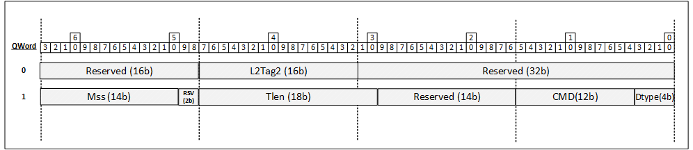

Descriptor fields layout:

<table>
<colgroup>
<col style="width: 17%" />
<col style="width: 8%" />
<col style="width: 73%" />
</colgroup>
<thead>
<tr class="header">
<th><strong>Field</strong></th>
<th><strong> Size</strong></th>
<th><strong>Functionality</strong></th>
</tr>
<tr class="odd">
<th>L2TAG2</th>
<th>16b</th>
<th>L2 tag insertion offload data value for the second tag added by the
device. Offload is enabled when the IL2TAG2 flag is set.</th>
</tr>
<tr class="header">
<th>MSS (Maximum Segment Size)</th>
<th>14b</th>
<th>When the TSO flag in the CMD field is set, the MSS field defines the
Maximum Segment Size of the packet’s payload in the TSO (excluding the
L2, L3 and L4 headers). In case of tunneling, the MSS relates to the
inner payload. The MSS should not be set to a lower value than
MIN_LSO_MSS.</th>
</tr>
<tr class="odd">
<th>TLEN</th>
<th>18</th>
<th>TSO Total Length. This field defines the L4 payload bytes that
should be segmented. Note that the sum of all transmit buffer sizes of
the TSO should match exactly the TLEN plus the TSO header size in host
memory.<br />
If the TSO flag is cleared, the TLEN is ignored and should be set by
software to zero.<br />
If the TSO flag is set, the TLEN must be set by software to a larger
value than zero.</th>
</tr>
<tr class="header">
<th>COMMAND</th>
<th>12b</th>
<th>Command information for the descriptor as detailed below.</th>
</tr>
<tr class="odd">
<th>DTYPE</th>
<th>4b</th>
<th>Descriptor type. This field should be set to 1.</th>
</tr>
</thead>
<tbody>
</tbody>
</table>

COMMAND field layout

<table>
<colgroup>
<col style="width: 9%" />
<col style="width: 12%" />
<col style="width: 77%" />
</colgroup>
<thead>
<tr class="header">
<th><strong>Bits</strong></th>
<th><strong>Field</strong></th>
<th><strong>Functionality</strong></th>
</tr>
<tr class="odd">
<th>0</th>
<th>TSO</th>
<th><p>Transmit Segmentation Offload is activated when the TSO flag is
set.</p>
<p>Should be set only for TSO supporting descriptors.</p></th>
</tr>
<tr class="header">
<th>1</th>
<th>TSYN_EN</th>
<th>TimeSync/PTP</th>
</tr>
<tr class="odd">
<th>2</th>
<th>IL2TAG2</th>
<th>Insert an L2 tag from the L2TAG2 field in this descriptor.</th>
</tr>
<tr class="header">
<th>3:9</th>
<th>RSV</th>
<th>Reserved for OEM. Must be set to 0</th>
</tr>
<tr class="odd">
<th>10:11</th>
<th>RSV</th>
<th>Reserved for OEM. Must be set to 0</th>
</tr>
</thead>
<tbody>
</tbody>
</table>

#### TX Data Descriptor - DTYPE = 0x0C

This is the data descriptor used when a queue operates in “Out of order,
split queue model.”  
  
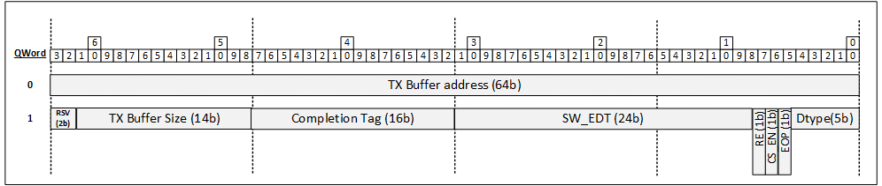

Descriptor fields layout:

 

<table>
<colgroup>
<col style="width: 20%" />
<col style="width: 9%" />
<col style="width: 70%" />
</colgroup>
<thead>
<tr class="header">
<th><strong>Field</strong></th>
<th><strong> Size</strong></th>
<th><strong>Functionality</strong></th>
</tr>
<tr class="odd">
<th>TX_BUF_ADDR</th>
<th> 64b</th>
<th>Address of message/packet buffer in host memory. The address is in
the format appropriate for the queue. For example, a VF queue would use
guest physical buffer addresses.</th>
</tr>
<tr class="header">
<th>TX_BUF_SIZE</th>
<th>14b</th>
<th>Size of message/packet buffer in bytes.</th>
</tr>
<tr class="odd">
<th>COMPLETION_TAG</th>
<th>16b</th>
<th>Completion tag of the packet to be returned in the packet completion
to SW.</th>
</tr>
<tr class="header">
<th>SW_EDT</th>
<th>24b</th>
<th>The SW “Earliest Departure Time” used for packet pacing.</th>
</tr>
<tr class="odd">
<th>EOP</th>
<th>1b</th>
<th>End-of-Packet (EOP) marks the last data descriptor in a packet or
TSO message.</th>
</tr>
<tr class="header">
<th>CS_EN</th>
<th>1b</th>
<th><p>Checksum offloads enable for all L3/L4 headers, see<u> Checksum</u>
<u>Offload</u>.</p>
<p>See general comment regarding checksum calculation at<u> </u><u>TX</u>
<u>Packets</u>
<u>Rules Summary</u>.</p></th>
</tr>
<tr class="odd">
<th>RE</th>
<th>1b</th>
<th><p>Report Event. When set, the hardware reports when descriptor
completions arrive at the device (Before it sends the DMA data
request).</p>
<p>Completion is reported through the Completion queue.</p>
<p><strong>Notes:</strong></p>
<p>The RE flag can be set only on the last Transmit Data Descriptor of a
message (i.e., a packet or TSO).</p>
<p>SW must keep a minimal gap of IDPF_TX_SPLITQ_RE_MIN_GAP descriptors
between 2 descriptors with RE bit set.</p></th>
</tr>
<tr class="header">
<th>DTYPE </th>
<th>5b</th>
<th>Descriptor type. This field should be set to 12.</th>
</tr>
</thead>
<tbody>
</tbody>
</table>

#### TX General Context Descriptor - DTYPE = 0x04

This is the context descriptor with flex bytes and L2TAG1.  
This descriptor is used for all queue models.

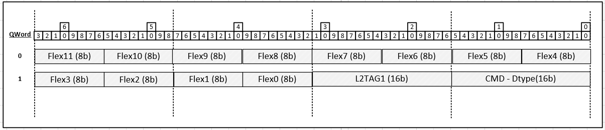

Descriptor fields layout:

<table>
<colgroup>
<col style="width: 46%" />
<col style="width: 11%" />
<col style="width: 42%" />
</colgroup>
<thead>
<tr class="header">
<th><strong>Field</strong></th>
<th><strong> Size</strong></th>
<th><strong>Functionality</strong></th>
</tr>
<tr class="odd">
<th>L2Tag1</th>
<th>16b</th>
<th>L2 tag insertion offload data value for the first tag added by the
device. Offload is enabled when the IL2TAG1 flag is set.</th>
</tr>
<tr class="header">
<th>Flex</th>
<th>12 x 8b</th>
<th>Generic 12*8b containers for conveying metadata/actions from host to
packet processor. Can be used for OEM data or future extension.</th>
</tr>
<tr class="odd">
<th>CMD_DTYPE</th>
<th>16b</th>
<th><p>Bits 4:0 - Descriptor type. This field should be set to 4.</p>
<p>Bits 15:5 – TX context descriptor command (See “TX Context Descriptor
COMMAND field layout”).</p></th>
</tr>
</thead>
<tbody>
</tbody>
</table>

#### 

#### TX TSO Context Descriptor - DTYPE = 0x05

This is the context descriptor with flex bytes and TSO.  
This descriptor is used for all queue models.

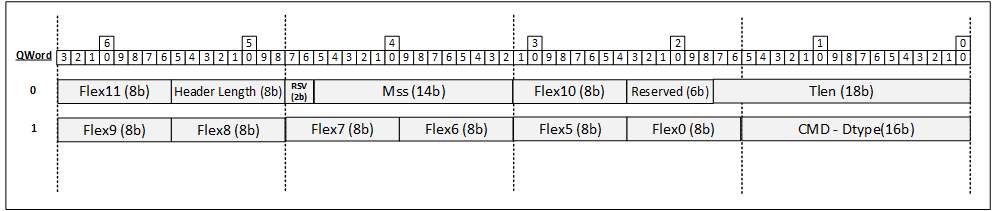

Descriptor fields layout:

<table>
<colgroup>
<col style="width: 46%" />
<col style="width: 11%" />
<col style="width: 42%" />
</colgroup>
<thead>
<tr class="header">
<th><strong>Field</strong></th>
<th><strong> Size</strong></th>
<th><strong>Functionality</strong></th>
</tr>
<tr class="odd">
<th>Flex</th>
<th>8 x 8b</th>
<th>Generic 8*8b containers for conveying metadata/actions from host to
packet processor. Can be used for OEM data or future extension.</th>
</tr>
<tr class="header">
<th>Header Len</th>
<th>8b</th>
<th>Header length to use for TSO offload. The device consumes this value
and uses it during TSO offload to determine how to build the per-segment
headers.</th>
</tr>
<tr class="odd">
<th>CMD_DTYPE</th>
<th>16b</th>
<th><p>Bits 4:0 - Descriptor type. This field should be set to 5.</p>
<p>Bits 15:5 – TX context descriptor command (See “TX Context Descriptor
COMMAND field layout”).</p></th>
</tr>
<tr class="header">
<th>TLEN</th>
<th>18</th>
<th>TSO Total Length. This field defines the L4 payload bytes that
should be segmented. Note that the sum of all transmit buffer sizes of
the TSO should match exactly the TLEN plus the TSO header size in host
memory.<br />
If the TSO flag is cleared, the TLEN is ignored and should be set by
software to zero.<br />
If the TSO flag is set, the TLEN must be set by software to a value
larger than zero.</th>
</tr>
<tr class="odd">
<th>MSS</th>
<th>14b</th>
<th>When the TSO flag in the CMD field is set, the MSS field defines the
Maximum Segment Size of the packet’s payload in the TSO (excluding the
L2, L3 and L4 headers). In case of tunneling, the MSS relates to the
inner payload. The MSS should not be set to a lower value than
MIN_LSO_MSS. It also must follow the rule declared in Table Handling
Malicious Drivers on Data Queues.</th>
</tr>
</thead>
<tbody>
</tbody>
</table>

#### 

#### TX TSO Context Descriptor - DTYPE = 0x08

This is the context descriptor with L2TAG2 and TSO.  
This descriptor is used for all queue models.

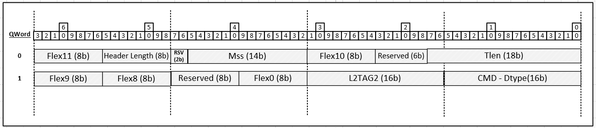

Descriptor fields layout:

<table>
<colgroup>
<col style="width: 15%" />
<col style="width: 8%" />
<col style="width: 76%" />
</colgroup>
<thead>
<tr class="header">
<th><strong>Field</strong></th>
<th><strong> Size</strong></th>
<th><strong>Functionality</strong></th>
</tr>
<tr class="odd">
<th>Flex</th>
<th>5 x 8b</th>
<th>Generic 5*8b containers for conveying metadata/actions from host to
packet processor. Can be used for OEM data or future extension.</th>
</tr>
<tr class="header">
<th>Header Len</th>
<th>8b</th>
<th>Header length to use for TSO offload. The device consumes this value
and uses it during TSO offload to determine how to build the per-segment
headers.</th>
</tr>
<tr class="odd">
<th>CMD_DTYPE</th>
<th>16b</th>
<th><p>Bits 4:0 - Descriptor type. This field should be set to 8.</p>
<p>Bits 15:5 – TX context descriptor command (See “TX Context Descriptor
COMMAND field layout”).</p></th>
</tr>
<tr class="header">
<th>TLEN</th>
<th>18</th>
<th><p>TSO Total Length. This field defines the L4 payload bytes that
should be segmented. Note that the sum of all transmit buffer sizes of
the TSO should match exactly the TLEN plus the TSO header size in host
memory.<br />
If the TSO flag is cleared, the TLEN is ignored and should be set by
software to zero.<br />
If the TSO flag is set, the TLEN must be set by software to a value
larger than</p>
<p>zero.</p></th>
</tr>
<tr class="odd">
<th>MSS</th>
<th>14b</th>
<th>When the TSO flag in the CMD field is set, the MSS field defines the
Maximum Segment Size of the packet’s payload in the TSO (excluding the
L2, L3 and L4 headers). In case of tunneling, the MSS relates to the
inner payload. The MSS should not be set to a lower value than
MIN_LSO_MSS. It also must follow the rule declared in Table Handling
Malicious Drivers on Data Queues.</th>
</tr>
<tr class="header">
<th>L2TAG2</th>
<th>16b</th>
<th>L2 tag insertion offload data value for the second tag added by the
device. Offload is enabled when the IL2TAG2 flag is set.</th>
</tr>
<tr class="odd">
<th>Reserved</th>
<th>8b</th>
<th>should be set to 0</th>
</tr>
</thead>
<tbody>
</tbody>
</table>

#### 

### TX Context Descriptor COMMAND Field Layout

This table describes the TX descriptor command field layout that is used
by all TX context descriptors except for the context descriptor of DTYPE
0x01.

<table>
<colgroup>
<col style="width: 7%" />
<col style="width: 11%" />
<col style="width: 80%" />
</colgroup>
<thead>
<tr class="header">
<th><strong>Bits</strong></th>
<th><strong>Field</strong></th>
<th><strong>Functionality</strong></th>
</tr>
<tr class="odd">
<th>0</th>
<th>TSO</th>
<th><p>Transmit Segmentation Offload is activated when the TSO flag is
set.</p>
<p>Should be set only for TSO supporting descriptors.</p></th>
</tr>
<tr class="header">
<th>1</th>
<th>RSV</th>
<th>Reserved. Must be set to 0</th>
</tr>
<tr class="odd">
<th>2</th>
<th>IL2TAG2</th>
<th>Insert an L2 tag from the L2TAG2 field in this descriptor.</th>
</tr>
<tr class="header">
<th>3</th>
<th>RSV</th>
<th>Reserved for OEM. Must be set to 0</th>
</tr>
<tr class="odd">
<th>4:5</th>
<th>RSV</th>
<th>Reserved for OEM. Must be set to 0</th>
</tr>
<tr class="header">
<th>6</th>
<th>RSV</th>
<th>Reserved for OEM. Must be set to 0</th>
</tr>
<tr class="odd">
<th>7</th>
<th>RSV</th>
<th>Reserved. Must be set to 0</th>
</tr>
<tr class="header">
<th>8</th>
<th>DUMMY</th>
<th><p>When the DUMMY flag is set, the packet is not transmitted
(internally or externally). The DUMMY flag purpose is to create
artificial spacing between packets.</p>
<p>When setting the DUMMY flag, software should set all the fields in
the data and context descriptors that describe the packet structure as
it does for normal packets; however, the packet needs not have a correct
checksum when the DUMMY flag is set.</p>
<p>Native mode only field.</p></th>
</tr>
<tr class="odd">
<th>9</th>
<th>IL2TAG1</th>
<th>Insert an L2 tag from the L2TAG1 field in this descriptor.</th>
</tr>
<tr class="header">
<th>10</th>
<th>RSV</th>
<th>Reserved for OEM. Must be set to 0</th>
</tr>
</thead>
<tbody>
</tbody>
</table>

### TX Packet and Descriptors Building Rules Summary

The packet and descriptors building rules are specified below. Any
violation of those rules might be detected as malicious driver behavior.

* Device executes L3/L4 checksum for packet checksums according to feature negotiation. When negotiated, Device calculates checksum for the relevant layer without SW activation (through descriptor.) The only exception is of the inner L4 checksum calculation that is executed when one of the conditions below is true

  1.  Base mode data descriptor - when L4T is set to UDP ,TCP or SCTP or when IIPT is set to to "IPv4 packet with IP checksum offload "
  2.  CS_EN is set to 1.

  Note that for for case #a and #b the most inner header checksum is calculated using the offsets as parsed by the Device parser. The *max_tx_hdr_generic_offloads* negotiated capability defines the maximal header length supported by the device for non-generic checksum/CRC offloads.
* The total size of a single packet in host memory must be at least **IDPF_TX_MIN_PKT_LEN** bytes and up to the *max_mtu*. This rule applies for single packet send as well as for an LSO segment.
* The header length of an LSO packet should be at least *min_lso_header_len*.
* Optionally, Packet can carry a context descriptor(s). In that case, all context descriptors of a packet must be placed before the data descriptors of the packet. 
  1.  Up to *max_ctxt_desc_per_sso_packet* context descriptors are allowed to be added to one SSO (Single Send Offload) message and up to *max_ctxt_desc_per_lso_segment* context descriptors are allowed to be added to one LSO (Large Send Offload) message.
* A single transmit packet must contain at least one data descriptor and may span up to *max_sg_bufs_per_tx_pkt* buffers. The maximal length of a data buffer is defined by *tx_max_desc_data* negotiated parameter.
- TSO Max payload size is *max_lso_payload_len* (as implied in TLEN field in the context descriptor), TSO MSS minimal value is refined by *min_mss_for_lso.* The maximal MSS value is set so that the total segment length (header and payload) do not exceed *max_mtu.*
* Each segment within the TSO obeys the previous rule of spanning on up to *max_sg_bufs_per_tx_pkt* data buffers.
  1.  The limitation refers to any buffer or buffer part of the segment so in case one data buffer holds data for multiple segments the data buffer is counted in each one of those segments.
  2.  The limitation refers to both header buffers and payload buffers. The header buffers are counted in each one of the segments.
  3.  In case a single buffer holds a mixture of packet header and packet payload, for that limitation, that buffer is treated as 2 buffers.
* If a packet or TSO spans on single or multiple transmit data descriptors:
  1.  All data descriptors in a packet must use the same DTYPE.
  2.  When the queue operates in “in order , single queue model” or “out of order , split queue model” the data descriptors of the packet must be anything but DTYPEs 12. When the queue operates in "out of order ,split queue model" the data descriptors of the packet must be DTYPE 12.
  3.  The fields in all the data descriptors must be valid.
  4.  All data descriptor fields but the Packet buffer address, TX buffer Size, and flags EOP, RS, and RE must carry the same values.
  5.  EOP must be set at the last data descriptor of a message and only there.
  6.  RS and RE flags may be set only at the last data descriptor of a message.
  7.  In case if the same field is present in more than 1 descriptor, the value of the field should be the same in all descriptors.
  8.  Any context-type information in all descriptors associated with a particular TX message are set consistently.
  9.  The TSO message header should not span on more than *max_hdr_buf_per_lso* buffers. (Max *max_hdr_buf_per_lso* Descriptors).
* SW must keep a minimal gap of IDPF_TX_RS_MIN_GAP descriptors between 2 descriptors that have their RS flag set(when set to zero, SW does not keep a gap).
* SW must keep a minimal gap of IDPF_TX_SPLITQ_RE_MIN_GAP descriptors between 2 descriptors that have their RE flag set(when set to zero , SW does not keep a gap).
* RE flag can be set only for queues that operate in “out of order ,split queue” model.
* When using TSO message SW must follow the Descriptors order:
  1.  Single TSO context descriptor with the TSO bit set. 
  2.  The rest of the Non-TSO context descriptors or TSO context descriptors that have their TSO bit set to 0.
  3.  One or more TX data descriptors.
  Note: A TSO context descriptor is one that has MSS, Tlen and Headerlen fields or a Base mode TX context descriptor of Dtype 0x1.
- For a TSO packet, either its data descriptors or its first context descriptor must describe the packet header length. The *max_tx_hdr_len_seg* negotiated capability defines the Maximal header length supported by the device for segmentation.

### Tx Descriptor Write Formats 

#### TX Writeback Descriptor Format - DTYPE = 0x0F

This is the write back descriptor written to the descriptor queue when a
queue operates in “In order, single queue model.”

In these descriptors, the only significant fields are the 4-bit DTYPE
(that is set to 0x0F) and RS bit that keeps its original value from the
read descriptor.  
Device may write any value to the Other Descriptors fields.

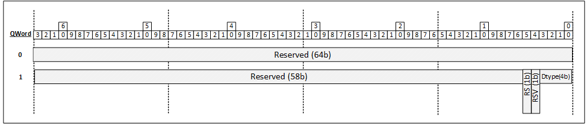

### TX Completion Descriptor Format  

The text below describes the TX completion element written to the
completion queue when a queue operates in “Out of order split queue” or
in “in order split queue” models.

As a completion queue setting, The TX completion element length can be
either 4B or 8B.

The 4B completion element layout is described below:

<table>
<colgroup>
<col style="width: 15%" />
<col style="width: 8%" />
<col style="width: 75%" />
</colgroup>
<thead>
<tr class="header">
<th><strong>Field</strong></th>
<th><strong>Bit(s)</strong></th>
<th><strong>Description</strong></th>
</tr>
<tr class="odd">
<th>TX Q ID</th>
<th>10:0</th>
<th>For completion types 0- 4 this field described the "relative
TX queue ID within the completion queue owner space.</th>
</tr>
<tr class="header">
<th>Completion Type</th>
<th>13:11</th>
<th><p>Completion entry type (this is a coding of completion types).</p>
<p>0:  Regular packet completion triggered by a periodic timer.<br />
This is relevant only when the queue operates in the "in order , split
queue" model).<br />
From the SW point of view , this completion is similar to a “Regular
Packet completion” (Completion entry type 2) and should be treated the
same.</p>
<p>1:  Regular packet completion for a packet sent on the exception path
(Relevant only when the queue operates in "out of order ,split queue"
model).<br />
<br />
2: Regular Packet completion.</p>
<p>TX packet completion for a packet that its RS bit set in the last TX
descriptor ( when the queue operates in "on of order split queue" or
in “in order single queue” models) or for every packet ( when the queue
operates in "out of order split queue" model ).<br />
<br />
3: reserved.</p>
<p>4: Descriptor fetch completion for a packet that has its RE bit set
in the last TX descriptor( relevant only when the queue operates in "out
of order split queue" model ).<br />
<br />
5: reserved.</p>
<p>6: "Buffer de allocate" markers.</p>
<p>Used to indicate to the SW to deallocate all buffers that are located
before the tail pointer as delivered in "TX Head/Completion tag"
field.</p>
<p>This completion is used in live migration flows to de-allocate TX
packet buffers of the lost packets (the ones that were not transmitted
on the source and are not transmitted on the destination).</p>
<p>Note: packet is referred to as an SSO (Single Send offload) packet or
as the last segment of an LSO packet.</p></th>
</tr>
<tr class="odd">
<th>Reserved</th>
<th>14</th>
<th></th>
</tr>
<tr class="header">
<th>Generation</th>
<th>15</th>
<th>Completion writes a generation bit. This bit is flipped every
wraparound of the completion queue write. Software uses this bit to
identify newly written completions versus those which have already been
processed.</th>
</tr>
<tr class="odd">
<th>Completion tag/TX head</th>
<th>31:16</th>
<th><p>For completion types 0 and 2, this field points to TX queue
offset of the descriptor that follows the last descriptor of the
completed packet.</p>
<p>Note the SW reaction should be the same for completion types 0 and
2</p>
<p>For completion type 1, this field describes the Completion tag of
the packet or LSO.</p>
<p>For completion type 4, this field points to the TX queue offset of
the descriptor that follows the RE marked descriptor.</p>
<p>For completion type 6 , this field points to the TX queue offset of
the last descriptor that its buffer should be deallocated .</p></th>
</tr>
</thead>
<tbody>
</tbody>
</table>

Completion entry type (Refering to row 2)

<table>
<colgroup>
<col style="width: 15%" />
<col style="width: 8%" />
<col style="width: 75%" />
</colgroup>
<thead>
<tr class="header">
<th><strong>Value</strong></th>
<th><strong>Description</strong></th>
<th><strong>Comment</strong></th>
</tr>
<tr class="odd">
<th>0</th>
<th>Regular packet completion triggered by a periodic timer.</th>
<th>This is relevant only when the queue operates in the "in order split queue" model).
From the SW point of view, this completion is similar to a “Regular Packet completion” (Completion entry type 2) and should be treated the same.</th>
</tr>
<tr class="header">
<th>1</th>
<th>Regular packet completion for a packet sent on the exception path.</th>
<th><p>(Relevant only when the queue operates in "out of order split queue" model).</p>
</tr>
<tr class="odd">
<th>2</th>
<th>Regular Packet completion.</th>
<th>TX packet completion for a packet that its RS bit set in the last TX descriptor ( when the queue operates in "on of order split queue" or in “in order single queue” models) or for every packet (when the queue operates in "out of order split queue" model ).</th>
</tr>
<tr class="header">
<th>3</th>
<th>Reserved.</th>
<th> </th>
</tr>
<tr class="odd">
<th>4</th>
<th>Descriptor fetch completion for a packet that has its RE bit set in the last TX descriptor.</th>
<th>Relevant only when the queue operates in "out of order split queue" model.</th>
</tr>
<tr class="header">
<th>5</th>
<th>Reserved.</th>
<th> </th>
</tr>
<tr class="odd">
<th>6</th>
<th>"Buffer de allocate" markers.</th>
<th></p>Used to indicate to the SW to deallocate all buffers that are located before the tail pointer as delivered in "TX Head/Completion tag" field.<br />
<br />
<p>This completion is used in live migration flows to de-allocate TX packet buffers of the lost packets (the ones that were not transmitted on the source and are not transmitted on the destination).<br />
<br />
<p>Note: packet is referred to as an SSO (Single Send offload) packet or as the last segment of an LSO packet.</p></th>
</tr>
</thead>
<tbody>
</tbody>
</table>

The 8B completion element layout is described below:

<table>
<colgroup>
<col style="width: 15%" />
<col style="width: 10%" />
<col style="width: 73%" />
</colgroup>
<thead>
<tr class="header">
<th><strong>Field</strong></th>
<th><strong>Bit(s)</strong></th>
<th><strong>Description</strong></th>
</tr>
<tr class="odd">
<th>First 4 Bytes</th>
<th>31:0</th>
<th>Similar layout as the 4B descriptor</th>
</tr>
<tr class="header">
<th>scheduled timestamp</th>
<th>55:32</th>
<th><p>24 bit of scheduled timestamp.</p>
<p>Representing the timer value when packet completion is sent to
SW.</p>
<p>Relevant only for completion types 1 and 2.</p>
<p>For the rest of the completion types this field is not relevant and
is set to zero .</p></th>
</tr>
<tr class="odd">
<th>Reserved</th>
<th>63:56</th>
<th></th>
</tr>
</thead>
<tbody>
</tbody>
</table>

<span class="mark">Unlike the “in order single queue model” which
implements a descriptor done (DD) bit, for “in order split queue” and
“out of order split queue” models (in which completion queue is used)
,software identifies new completion queue entries by comparing the
generation bit. Hardware toggles the generation bit on every wraparound
on the completion queue. Using this method, software can determine the
old entries from the new ones by looking for mismatches on the
generation bit from one descriptor to the next.  
When working with a completion queue, Software must not post new
packets to the TX queue unless it is guaranteed that the completions of
the packets (either descriptor fetch completion or data fetch
completion) will not be overlapped before software processes
them.</span>

# Interrupts

## Supported Interrupt Modes 

The device supports the following interrupt modes:

* MSI - supports one Message-Signaled Interrupt (MSI) per PF.
* MSI-X - supports up to 2k vectors.

In each PF, only one of the two modes is enabled.

### MSI Mode 

MSI is exposed in the MSI capability structure of the PCI configuration space of each PF. MSI is enabled by the OS using the "MSI Enable" flag of the "MSI Capability" structure in the PCI configuration space per PF.

There is no support for MSI in VFs.

### MSI-X Mode 

MSI-X enables multiple interrupts for the PFs/VFs.

MSI-X is exposed in the MSI-X capability structure in the PCI configuration space of all PFs and VFs. The number of supported MSI-X vectors is defined by the "table size" parameters in the MSI-X capability structure in the PCI configuration space of the PFs and the VFs. The "table size" parameters are loaded from the NVM for each PF and for each of its VFs following FLR.

MSI-X is enabled by the OS using the "MSI-X Enable" flag in the "MSI-X Capability" structure in the PCI configuration space per PF or VF. Also, masking a vector can be done by the OS using the relevant "Mask" bit per MSI-X vector in the "MSI-X Table Structure".

## Pending Bit Array (PBA)

On top of the interrupt signaling, the PCIe function also supports the standard PBA structure in the MSI-X BAR. The PBA is relevant only when MSI-X is enabled. It is described as part of the "MSI-X Capability" structure for the PFs and the VFs. 

A bit in the PBA is set to 1 when an interrupt is triggered internally and is cleared when the interrupt message is sent.

For a given function, a write to the PF_PBA_CLEAR or VF_PBA_CLEAR register with the function related vector number in the VECTOR field will clear the matching PBA bit. In order to avoid races, the PBA register should be read again before the interrupt is re-enabled.

## Interrupt Enable Procedure 

Interrupt enablement by the driver is done via the INTENA flag in the
VF/PFINT_DYN_CTL_N registers. (VF/PFINT_DYN_CTL_N is per vector control
register while N represents the function vector index.).

- Upon interrupt assertion, the INTENA flag is automatically cleared by Device. This prevents new interrupts from being issued until the interrupt is enabled once again by SW.
- Software enables the interrupt by setting the INTENA flag and clearing NO_INT_MODE flag in the relevant VF/PFINT_DYN_CTL_N register.

Setting or clearing *INTENA*, not as part of an interrupt handling
routine, might lead to race conditions and therefore it is expected that
software never clears *INTENA* and clearing of *INTENA* always be done
by hardware.

## Interrupt Causes 

This section lists all interrupt cause clients (sources).

An interrupt cause is an event sent from the cause client that can
trigger an interrupt.

### Transmit Queues 

Each transmit queue is a potential interrupt cause client. The following events of the queue are considered as transmit events that can trigger an interrupt:

* In case a packet generates a completion, when packet completion is written the completion queue (split queue model) or when packet descriptor is written to the descriptor queue (single queue model).
* In case a packet did not generate a completion (in order queue model, sparse RS bit setting), when packet processing is completed by the device.

When an interrupt is issued, SW should assume that the descriptor/completion of the latest packet processed by the device for that queue was written to the descriptor/completion queue regardless of if the packet generated a completion or not. (Before an interrupt is issued, the device writes the descriptor/completion of the latest packet processed for the queue).

Transmit queue ‘n’ can be enabled for interrupts by the IDPF using configuration flows described below. The TX queues can be mapped to any interrupt vector within the function space and mapped to any of its ITRs.

### Receive Queues 

Each receive queue is a potential interrupt cause client. The following events of the queue are considered as a receive event that can trigger an interrupt:

* When packet descriptors are written the completion queue (split queue model) or to the RX descriptor queue (single queue model).

When an interrupt is issued , SW should assume that the descriptor/completion of all packets processed by the device for that queue were written to the completion queue.

Receive queue ‘n’ can be enabled for interrupts by the IDPF using configuration flows described below. The queues can be mapped to any interrupt vector within the function space and mapped to any of its ITRs.

### Receive Buffer Queues 

Each receive buffer queue in “split queue model” is a potential interrupt cause client. The following events of the queue are considered as a receive event that can trigger an interrupt:

* Head WB reporting (as described in “Out of order split queue model” section) is triggered if packet descriptors are fetched from host memory and the notification stride is crossed.

When interrupt is issued, SW should assume that the latest head WB value for that queue is updated.

Receive buffer queue ‘n’ can be enabled for interrupts by the IDPF using configuration flows described below. The queues are mapped to any interrupt vector within the function space and mapped to any of its ITRs.  

Issuing interrupt for receive buffer queues Head WB reporting is supported only when VIRTCHNL2_RX_SPLITQ_INTR_ON_HEAD_WB feature is negotiated.

### Mailbox Queues

The software driver supports Mailbox queues.

A completion of a VirtChnl command on the transmit mailbox queue or receiving a VirtChnl command on the mailbox receive queue is considered an interrupt cause for the queue pair that might trigger an interrupt (depending on if it was configured to do so in the relevant mailbox queue).

Note that the device support for interrupt and interrupt flows are the same for RX/TX mailbox queues and for regular RX/TX queues.

## Interrupt Throttling 

Interrupt Throttling (ITR) is a mechanism that guarantees a minimum gap
between two consecutive interrupts.

IDPF supports up to 3 ITR timers per vector, while the ITR intervals per
vector can be programmed in the following ways :

* When vector is initialized, programming is done through the per vector GLINT_ITR [0,1] per vector registers.

The number of ITR timers per vector can be 2 or 3 as defined by the
itr_idx_map Device capability.  
The possible values and default value (in the absence of negotiation)
are described in the device capabilities section.

Each one of the interrupt causes is mapped to a specific vector and to a
specific ITR of the vector.

The ITR interval can be 0.5us,1us, 2us or 4us as defined by the
itr_intvl_gran Device capability.  
The possible values and default value (in the absence of negotiation)
are described in the Device capabilities section.

Device is allowed to issue an interrupt when all the following conditions
are fulfilled:

* Interrupt is enabled.
* Interrupt has at least one ITR that has expired and has a pending cause (either ITR has expired after cause was issued or cause was issued after the ITR has expired).

As an example, assume a vector has only 1 active ITR :

* If an interrupt cause that is associated with the ITR happened before the ITR had expired or happened when interrupt was disabled (i.e. INTENA is zero), the interrupt assertion is delayed until both ITR expires and the interrupt is enabled.

* If an interrupt cause associated with this ITR happens after the ITR has expired when interrupt was enabled, the ITR is armed, and interrupt will be asserted the moment the cause happens.

Note :

Using multiple ITRs per vector is useful to support different throttling
rates for different cause clients assigned to the same vector.

In case both cause clients are active , the interrupt throttling rate is
done according to the ITR with the higher rate but in case only one
cause client~~s~~ is active at a certain time, the throttling
rate is done according to its associated ITR rate.

## Enable/disable Interrupts for a Vector 

Device supports the per vector NO_INT_MODE mode. When vector is in this
mode :

* Interrupts are not issued from the device for causes associated with this vector.
* Interrupt throttling mechanisms operate as if interrupt is enabled (i.e. interrupts are not disabled automatically when interrupt is issued).  

This mode is required when software works in polling mode where it does
not expect any interrupt to be issued by the device but expects the
device to update the descriptor/completion queue with the latest values
once in a period of time.

The interrupt mechanism supports dynamic switching of a vector between
interrupt enabled and NO_INT_MODE on a per vector basis as described
below :

1.  A switch from interrupt-enabled mode to NO_INT_MODE can be done by software only when the INTENA flag is cleared, that is, the interrupt is disabled for processing as described in “interrupt enable procedure(ADD LINK)” section. The switch is done by writing the GLINT_DYN_CTL register with INTENA flag cleared and NO_INT_MODE flag set.
2.  A switch from NO_INT_MODE to interrupt enabled mode can occur at any time. The switch is done by software enabling the vector (setting the INTENA flag and clearing the NO_INT_MODE flag in the relevant GLINT_DYN_CTL register).

Based on the written above, those are the following transitions between
the different interrupt modes (enabled, disabled and NO_INT_MODE):

<u>Interrupt mode :</u>

<table>
<colgroup>
<col style="width: 7%" />
<col style="width: 21%" />
<col style="width: 50%" />
<col style="width: 20%" />
</colgroup>
<thead>
<tr class="header">
<th><strong>Step</strong></th>
<th><p><strong>Interrupt state</strong></p>
<p><strong>before the action</strong></p></th>
<th><strong>Action</strong></th>
<th><p><strong>Interrupt state</strong></p>
<p><strong>after the action</strong></p></th>
</tr>
<tr class="odd">
<th>1</th>
<th>Disabled</th>
<th>SW enables the interrupt</th>
<th>Enabled</th>
</tr>
<tr class="header">
<th>2</th>
<th>Enabled</th>
<th>Device issues an interrupt and then disables the interrupt
automatically.</th>
<th>Disabled</th>
</tr>
<tr class="odd">
<th>3</th>
<th>Disabled</th>
<th>SW enables the interrupt.</th>
<th>Enabled</th>
</tr>
</thead>
<tbody>
</tbody>
</table>

<u>NAPI mode:</u>

<table>
<colgroup>
<col style="width: 7%" />
<col style="width: 21%" />
<col style="width: 50%" />
<col style="width: 20%" />
</colgroup>
<thead>
<tr class="header">
<th><strong>Step</strong></th>
<th><p><strong>Interrupt state</strong></p>
<p><strong>before the action</strong></p></th>
<th><strong>Action</strong></th>
<th><p><strong>Interrupt state</strong></p>
<p><strong>after the action</strong></p></th>
</tr>
<tr class="odd">
<th>1</th>
<th>Disabled</th>
<th>SW enables the interrupt.</th>
<th>Enabled</th>
</tr>
<tr class="header">
<th>2</th>
<th>Enabled</th>
<th>Device issues an interrupt and then disables the interrupt
automatically.</th>
<th>Disabled</th>
</tr>
<tr class="odd">
<th>3</th>
<th>Disabled</th>
<th>SW inserts the interrupt to NO_INT_MODE</th>
<th>NO_INT_MODE</th>
</tr>
<tr class="header">
<th>4</th>
<th>NO_INT_MODE</th>
<th>SW enables the interrupt.</th>
<th>Enabled</th>
</tr>
</thead>
<tbody>
</tbody>
</table>

When SW initiates a transition from NO_INT_MODE to “Enabled” it is
encouraged to trigger a “SW initiated interrupt(ADD LINK)” to ensure
that the latest update to the completion/descriptor queue will trigger
an interrupt and will be visible to SW.

Note that interrupt enablement is also done by SW after interrupt
initialization (before first interrupt was issued).

## Changing ITR Intervals on-the-fly 

The device supports SW changing the ITR rates dynamically.

The rate change operation is submitted through the GLINT_DYN_CTL
register.

To enforce a rate change, software should:

1.  Set the GLINT_DYN_CTL.ITR_INDX field to the relevant ITR. When GLINT_DYN_CTL.ITR_INDX is set to 0x3 the rate programming update is disabled.
2.  Set the GLINT_DYN_CTL.INTERVAL to the desired interval.

Based on negotiation, the rate change can be done b<u>y</u> using the
following options:

* Piggybacked to an interrupt enablement operation done using GLINT_DYN_CTL (i.e. when setting the INTENA flag).
* This option is supported only when VIRTCHNL2_CAP_INTR_ADAPT_WITH_INTENA feature is negotiated.
* SW can use this option only when operation occurs when interrupt is disabled (and not when interrupt is in NO_INT_MODE).
* When using this option SW must clear the GLINT.INTENA_MSK flag.
* As an individual operation using GLINT_DYN_CTL without interrupt enablement. (i.e. without setting the INTENA flag).
* This option is supported without negotiation.
* SW must not use this option when the interrupt is in NO_INT_MODE.
* When using this option SW must set the GLINT.INTENA_MSK flag.

Additionally:

* The intervals cannot be read through in the GLINT_DYN_CTL registers.
* By default,changing the ITR interval through this interface value causes the timer to expire which triggers an immediate interrupt in case there are pending causes.

## Miscellaneous SW Operations

### SW Initiated Interrupt 

The device enables SW to issue an interrupt cause to any of the vectors
assigned to it and associate it with any of the ITR timers.

A SW cause is submitted using the GLINT_DYN_CTL register.

In the GLINT_DYN_CTL register software should:

1.  Set SWINT_TRIG to 1 . This flag is used to trigger the SW cause.
2.  Set SW_ITR_INDX_ENA to 1.
3.  Set SW_ITR_INDX to the associated ITR.

Based on negotiation, the SW interrupt can be done be using the
following options:

* Piggybacked to an interrupt enablement operation using GLINT_DYN_CTL (i.e. when setting the INTENA flag).
  - This option is supported only when VIRTCHNL2_CAP_INTR_SW_INTR_WITH_INTENA feature is negotiated.
  - SW can use this option only when operation occurs when interrupt is disabled or when interrupt is in NO_INT_MODE.
  - When using this option SW must clear the GLINT.INTENA_MSK flag.
* As an individual operation using GLINT_DYN_CTL.
  - This option is supported only when VIRTCHNL2_CAP_INTR_SW_INTR_INDV feature is negotiated.
  - SW must not use this option when the interrupt is in NO_INT_MODE.
  - When using this option SW must set the GLINT.INTENA_MSK flag.

When neither VIRTCHNL2_CAP_INTR_SW_INTR_INDV nor
VIRTCHNL2_CAP_INTR_SW_INTR_WITH_INTENA are negotiated, dynamic rate
change is not supported.

## Interrupt Initialization 

MSI-X is enabled by the *MSI-X Enable* flag in the MSI-X Capability
structure in the PCIE config space per PF and VF and further enablement
is done by the *Mask* bit per MSI-X vector in the MSI-X Table Structure.

After MSI-X interrupts are enabled for the function through PCIE, there
is an allocation and enablement process to be performed by IDPF using
VirtChnl Interface commands. Each IDPF is always assigned at least one
interrupt vector and a queue pair (mailbox TX/RS queues) to start with
for mailbox operation communicating with CP. In order for the Interrupt
mechanism to work along with the mailbox for any communication with CP,
the Control plane should by default map the mailbox queue to the
pre-allocated Interrupt as part of the initial setup for IDPF (See
pre-allocation and runtime allocation mechanism details below).

In addition, when operating in a non-split queue model, the IDPF will
request one vector per TX/RX queue pair. In the Split Queue model the
IDPF will request one vector per Tx Completion queue and one per RX
Buffer queue pair as well as one per RX Completion queue.

Software pre-allocation, initialization and runtime configurations flow
is as follow:

1. IDPF to discover its MSI-X related capabilities and resources by sending “VIRTCHNL_OP_GET_CAPS”, Opcode 100 command. Following this command, CP will reply back with following MSI-X related information:
  1.  ***mailbox_dyn_ctl*** – address of GLINT_DYN_CTL register to be used for runtime interrupt functionality configuration for vector mapped for Mailbox Queue Pair.
  2.  ***mailbox_vector_id*** – index of the vector mapped by CP to be used for Mailbox Queue Pair.
  3.  ***num_allocated_vectors*** – number of MSI-X vectors allocated and guaranteed for the function by CP, not including already provided Mailbox one.
  4.  ***itr_idx_map*** – map of possible ITRs to be used.
2.   IDPF to allocate and map vectors to itself by usin “VIRTCHNL_OP_ALLOC_VECTORS” opcode 120. Important to mention, that IPDF is promised to have at least number of vectors, as provided by capabilities command, but it can also try to opportunistically allocate additional ones on “first come-first served '' basis using this virtchnl command. Following this allocation command, CP will reply to IPDF with all relevant information regarding allocated vectors, registers information etc. Returned vectors are returned and single or multiple sequential chunks of vectors, each one of them contains information as below (for most updated info refer to virtchnl header file):
  1. ***start_vector_id, start_evv_id, num_vectors*** – provide indexes of allocated vectors.*
  2. ***dynctl_reg_start, dynctl_reg_spacing*** – provide addresses of GLINT_DYN_CTL registers to be used for runtime configuration of the allocated vectors.*
  3. ***itrn_reg_start, itrn_reg_spacing*** – provide addresses of GLINT_ITR_x registers to be used for runtime throttling configuration of the allocated vectors.
3. IDPF to map TX and RX queues to already allocated vectors by using “VIRTCHNL_OP_MAP_QUEUE_VECTOR” opcode 111 by providing TX and RX queues and vector information. Command structure is organized in queue map chunks, each one of them defined as follows:
  1. ***queue_id, queue_type –*** provide Queue information.
  2. *** vector_id, itr_idx –*** vector information to map specified queue to.

After IPDF completed its vectors’ allocation and mapping activities and
got all its register information for runtime vector manipulation, it can
use CP provided registers to control MSI-X vector functionality on
runtime.

# Overall Flows

The Virtchannel messages are initiated by the Infrastructure Data-Plane
Function driver and the CP sends a response.

The Virtchannel interface supports asynchronous execution and several
concurrent outstanding messages for same or different vport_id if it
follows the ordering rules defined in this section.

The interface supports parallel execution of CREATE_VPORT messages from
the same driver function.

## Driver Initialization

Initialization includes Capability negotiation and virtchnl version
negotiation.

## Interrupt Initialization and Mailbox Initialization

At Initialization time, the SW sets up a mailbox queue pair by programming the mailbox queues registers such as Base Address, Length, Head and Tail pointers. Once these are programmed, the driver must enable the Mailbox queue as part of the length (xF_AxQLEN) registers.

As part of this spec the device and the driver use Descriptor writeback (similar to the in-order, single-queue model described above) for mailbox queue completion.

The first message that is posted on the mailbox queue using virtchannel commands is VIRTCHNL_OP_GET_VERSION ().

A response to this message indicates the readiness of the CP to start communication on the sideband channel. The driver shall try to establish communication with the CP for at least 10 seconds before failing to load.

The second message the driver posts is the Capability Negotiation (VIRTCHNL_OP_GET_CAPS), the driver posts the requested capabilities and resources to reserve, and the CP in return sends which of the requested capabilities and resources can be supported. The CP reserves the resources before sending the response.

##  VIRTCHNL_OP_VERSION

The purpose of this command is to negotiate version info for the virtual channel API (Application Programming Interface).

Driver posts its version number and CP responds with its version number in the same format, along with a return code.

If there is a major version mismatch, then the driver falls to to the lowest common ,major version which is version 2.0 as the CP is assumed to always support.

If there is a minor version mismatch, then the driver can operate but should add a warning to the system log. CP will not respond with an error even in case of versions mismatch.

<table>
<colgroup>
<col style="width: 8%" />
<col style="width: 12%" />
<col style="width: 35%" />
<col style="width: 44%" />
</colgroup>
<thead>
<tr class="header">
<th>type</th>
<th>parameter</th>
<th>description</th>
<th>implementation</th>
</tr>
<tr class="odd">
<th>u32</th>
<th>major</th>
<th><p>Input:</p>
<p>Driver posts its version number</p>
<p>Output:</p>
<p>CP responds with its version number in the same format, along with a
return code.</p></th>
<th><p>min (func ver, cp version)</p>
<p>The reply has its major/minor versions also in param0 and param1 of
the control queue descriptor (see References).</p></th>
</tr>
<tr class="header">
<th>u32</th>
<th>minor</th>
<th>Same as above</th>
<th><p>min (func ver, cp version)</p>
<p>The reply has its major/minor versions also in param0 and param1 of
control queue descriptor (see References).</p></th>
</tr>
</thead>
<tbody>
</tbody>
</table>

## High Level Flow with Participants

#### Driver Negotiation General Flow

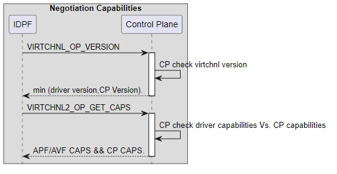

#### VPORT Enable General Flow

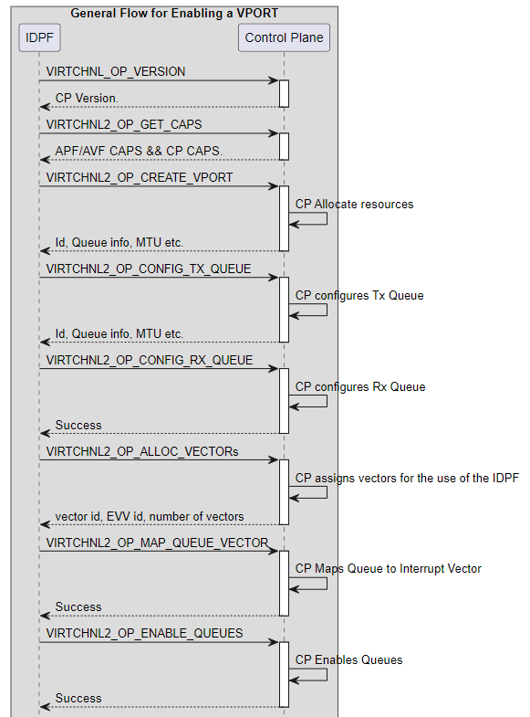

Flow continues in the next page

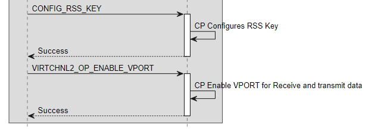

#### 

#### Teardown a VPORT General Flow

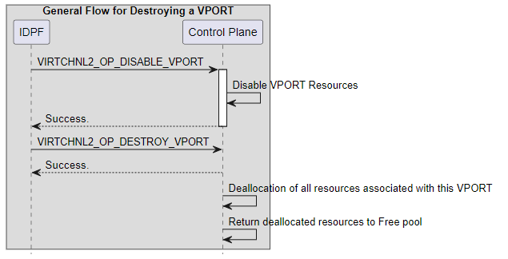

## Virtchannel APIs (Application Programming Interfaces)

The following table summarizes the Virtchnl messages, and the ordering
constraints.

<table>
<colgroup>
<col style="width: 9%" />
<col style="width: 16%" />
<col style="width: 7%" />
<col style="width: 19%" />
<col style="width: 11%" />
<col style="width: 35%" />
</colgroup>
<thead>
<tr class="header">
<th>Opcode</th>
<th>Message</th>
<th>CP<br />
Respond</th>
<th>Description</th>
<th>Source</th>
<th>Ordering</th>
</tr>
<tr class="odd">
<th>1</th>
<th>VIRTCHNL2_OP_VERSION</th>
<th>Yes</th>
<th>Version number announcement</th>
<th>All Functions Drivers</th>
<th>Shall be the first message after xLR.<br />
Shall be sent only once per xLR.</th>
</tr>
<tr class="header">
<th>524</th>
<th>VIRTCHNL2_OP_RESET_VF</th>
<th>No</th>
<th>Reset the VF resources (xLR) and keep original minimum
resources.</th>
<th>Virtual Function Driver</th>
<th><p>Shall be sent only if VIRTCHNL_CAP_SRIOV is set and
VIRTCHNL_OP_VERSION is success.<br />
Cannot send consecutive VIRTCHNL_OP_RESET_VF</p>
<p>After VIRTCHNL_OP_RESET_VF must come VIRTCHNL_OP_VERSION</p></th>
</tr>
<tr class="odd">
<th>500</th>
<th>VIRTCHNL2_OP_GET_CAPS</th>
<th>Yes</th>
<th>Capability negotiation</th>
<th>All Functions Drivers</th>
<th>Shall be the second message after xLR.<br />
Shall be sent only once per xLR</th>
</tr>
<tr class="header">
<th>501</th>
<th>VIRTCHNL2_OP_CREATE_VPORT</th>
<th>Yes</th>
<th>Create a new VPOST with associated resources</th>
<th>All Functions Drivers</th>
<th>Shall be sent only if VIRTCHNL_OP_GET_CAPS is successful.<br />
For additional VPORTs can be sent any time after the first
VIRTCHNL_OP_CREATE_VPORT</th>
</tr>
<tr class="odd">
<th>502</th>
<th>VIRTCHNL2_OP_DESTROY_VPORT</th>
<th>Yes</th>
<th><p>Deallocation of all resources associated with the VPORT.</p>
<p>Note: There is no vport reset cmd, disable and destroy stands for
reset.</p></th>
<th>All Functions Drivers</th>
<th>Shall be sent only if VIRTCHNL_OP_CREATE_VPORT is successful.<br />
Note: This cmd can be sent even if VIRTCHNL_OP_DISABLE_VPORT was not
sent. In this case, the VIRTCHNL_OP_DESTROY_VPORT disables the VPORT and
deallocates the resources.</th>
</tr>
<tr class="header">
<th>503</th>
<th>VIRTCHNL2_OP_ENABLE_VPORT</th>
<th>Yes</th>
<th><p>Activate the VPORT</p>
<p>VPORT can be a queue or queue groups.</p></th>
<th>All Functions Drivers</th>
<th><p>Shall be sent only after:</p>
<p>VPORT=queue =&gt; call only one message.<br />
Enable either queues depends on the vprot type. in q type, it is the
same as enable queue.<br />
VPORT = QUEUE ==&gt; after configuration queue.<br />
VPORT = Queue group =&gt; after enable at least one queue.</p></th>
</tr>
<tr class="odd">
<th>504</th>
<th>VIRTCHNL2_OP_DISABLE_VPORT</th>
<th>Yes</th>
<th><p>Disable VPORT.<br />
This cmd can be sent even if VIRTCHNL_OP_DISABLE_QUEUES_V2 was not
sent..</p>
<p>Note: There is not vport reset cmd, disable and destroy stands for
reset.</p></th>
<th>All Functions Drivers</th>
<th>Shall be sent only if VIRTCHNL_OP_ENABLE_VPORT is successful.<br />
Note: This cmd can be sent even if VIRTCHNL_OP_DISABLE_QUEUES_V2 was not
sent. In this case, the VIRTCHNL_OP_DISABLE_QUEUES_V2 is automatically
executed.</th>
</tr>
<tr class="header">
<th>505</th>
<th>VIRTCHNL2_OP_CONFIG_TX_QUEUES</th>
<th>Yes</th>
<th>Configure Transmit queues</th>
<th>All Functions Drivers</th>
<th><p>Shall be sent only if</p>
<p>VIRTCHNL_OP_CREATE_VPORT is successful, for a created vport_id and
allocated q_id only.</p>
<p>OR</p>
<p>VIRTCHNL_OP_ADD_QUEUES is successful, for a created vport_id and
allocated q_id only.</p></th>
</tr>
<tr class="odd">
<th>506</th>
<th>VIRTCHNL2_OP_CONFIG_RX_QUEUES</th>
<th>Yes</th>
<th>Configure Receive queues</th>
<th>All Functions Drivers</th>
<th><p>Shall be sent only if</p>
<p>VIRTCHNL_OP_CREATE_VPORT is successful, for a created vport_id and
allocated q_id only.</p>
<p>OR</p>
<p>VIRTCHNL_OP_ADD_QUEUES is successful, for a created vport_id and
allocated q_id only.</p></th>
</tr>
<tr class="header">
<th>507</th>
<th>VIRTCHNL2_OP_ENABLE_QUEUES</th>
<th>Yes</th>
<th>Enable queues to be able to receive and transmit.</th>
<th>All Functions Drivers</th>
<th>Shall be sent only if VIRTCHNL_OP_CONFIG_RX_QUEUES is successful if
there are only Rx queues for the VPORT.<br />
Shall be sent only if VIRTCHNL_OP_CONFIG_TX_QUEUES is successful if
there are only Tx queues for the VPORT.<br />
Shall be sent only if VIRTCHNL_OP_CONFIG_RX_QUEUES and
VIRTCHNL_OP_CONFIG_TX_QUEUES are successful if both are needed for the
VPORT.<br />
Shall be sent only if VIRTCHNL_OP_MAP_QUEUE_VECTOR is successful if
vectors are needed for the VPORT.</th>
</tr>
<tr class="odd">
<th>508</th>
<th>VIRTCHNL2_OP_DISABLE_QUEUES</th>
<th>Yes</th>
<th>Disable receive and transmit queues</th>
<th>All Functions Drivers</th>
<th>Shall be sent only if VIRTCHNL_OP_ENABLE_QUEUES is successful for
the VPORT for specified queues</th>
</tr>
<tr class="header">
<th>509</th>
<th>VIRTCHNL2_OP_ADD_QUEUES</th>
<th>Yes</th>
<th>Allocate additional queues</th>
<th>All Functions Drivers</th>
<th>Shall be sent only if VIRTCHNL_OP_CREATE_VPORT is successful for the
VPORT</th>
</tr>
<tr class="odd">
<th>510</th>
<th>VIRTCHNL2_OP_DEL_QUEUES</th>
<th>Yes</th>
<th>Release allocated queues</th>
<th>All Functions Drivers</th>
<th><p>Shall be sent only if</p>
<p>VIRTCHNL_OP_CREATE_VPORT is successful, for a created vport_id and
allocated q_id only.</p>
<p>OR</p>
<p>VIRTCHNL_OP_ADD_QUEUES is successful, for a created vport_id and
allocated q_id only.</p></th>
</tr>
<tr class="header">
<th>511</th>
<th>VIRTCHNL2_OP_MAP_QUEUE_VECTOR</th>
<th>Yes</th>
<th>Map a queue to an interrupt vector</th>
<th>All Functions Drivers</th>
<th>Shall be sent only if VIRTCHNL_OP_CREATE_VPORT,
VIRTCHNL_OP_ADD_QUEUES or<br />
VIRTCHNL_OP_CONFIG_RX_QUEUES or VIRTCHNL_OP_CONFIG_TX_QUEUES are
successful or both, for created queues.<br />
Cannot be done for queues that are already Enabled.</th>
</tr>
<tr class="odd">
<th>512</th>
<th>VIRTCHNL2_OP_UNMAP_QUEUE_VECTOR</th>
<th>yes</th>
<th>Unmap a queue from an interrupt vector</th>
<th>All Functions Drivers</th>
<th></th>
</tr>
<tr class="header">
<th>513</th>
<th>VIRTCHNL2_OP_GET_RSS_KEY</th>
<th>Yes</th>
<th>Get the RSS Hash Key</th>
<th>All Functions Drivers</th>
<th>Shall be sent only if VIRTCHNL_CAP_RSS_* is set<br />
and VIRTCHNL_OP_CREATE_VPORT</th>
</tr>
<tr class="odd">
<th>514</th>
<th>VIRTCHNL2_OP_SET_RSS_KEY</th>
<th>yes</th>
<th>Set the RSS Hash Key</th>
<th>All Functions Drivers</th>
<th></th>
</tr>
<tr class="header">
<th>515</th>
<th>VIRTCHNL2_OP_GET_RSS_LUT</th>
<th>Yes</th>
<th>Get the RSS Hash Look Up Table</th>
<th>All Functions Drivers</th>
<th>Shall be sent only if VIRTCHNL_CAP_RSS_* is set<br />
and VIRTCHNL_OP_CREATE_VPORT</th>
</tr>
<tr class="odd">
<th>516</th>
<th>VIRTCHNL2_OP_SET_RSS_LUT</th>
<th>Yes</th>
<th>Set the RSS Hash Look Up Table</th>
<th>All Functions Drivers</th>
<th>Shall be sent only if VIRTCHNL_CAP_RSS_* is set<br />
and VIRTCHNL_OP_CREATE_VPORT</th>
</tr>
<tr class="header">
<th>517</th>
<th>VIRTCHNL2_OP_GET_RSS_HASH</th>
<th>Yes</th>
<th>Capability of the VPORT RSS as negotiated</th>
<th>All Functions Drivers</th>
<th>Shall be sent only if VIRTCHNL_CAP_RSS_* is set<br />
Shall be sent only if VIRTCHNL_OP_GET_CAPS is successful.</th>
</tr>
<tr class="odd">
<th>518</th>
<th>VIRTCHNL2_OP_SET_RSS_HASH</th>
<th>Yes</th>
<th>Set RSS Hash capability.<br />
Should comply with the advertised capability.</th>
<th>Physical Function Driver</th>
<th>Shall be sent only if VIRTCHNL_CAP_RSS_* is set<br />
Shall be sent only if VIRTCHNL_OP_GET_CAPS is successful.</th>
</tr>
<tr class="header">
<th>519</th>
<th>VIRTCHNL2_OP_SET_SRIOV_VFS</th>
<th>Yes</th>
<th><p>Destroy all existing VFs (VIRTUAL FUNCTIONS) and create new
ones.</p>
<p>This will reserve minimum resources such as Mailbox and At least a
single queue pair per VF and a minimum of 2 interrupts per VF.</p>
<p>If the number sent is not allowed because of the Control plane policy
or the resources (above) are not available, then SET_NUM_VFS will fail,
leaving behind what was the original number of VFs and not destroy
existing ones.</p>
<p>IF there is a dynamic change from Nonzero VF value x to non-zero VF
value y, Then CP needs to send reset events towards the VF Drivers, so
that the drivers can cleanup. Then the CP can proceed to complete the
reset for each of the VFs.</p></th>
<th>Physical Function Driver</th>
<th>Shall be sent only if VIRTCHNL_CAP_SRIOV is set</th>
</tr>
<tr class="odd">
<th>520</th>
<th>VIRTCHNL2_OP_ALLOC_VECTORS</th>
<th>Yes</th>
<th>Allocate additional interrupt vectors</th>
<th>Physical Function Driver</th>
<th>Shall be sent only if VIRTCHNL_OP_GET_CAPS is successful</th>
</tr>
<tr class="header">
<th>521</th>
<th>VIRTCHNL2_OP_DEALLOC_VECTORS</th>
<th>Yes</th>
<th>Release interrupt vectors</th>
<th>Physical Function Driver</th>
<th>Shall be sent only if VIRTCHNL_OP_GET_CAPS is successful</th>
</tr>
<tr class="odd">
<th>522</th>
<th>VIRTCHNL2_OP_EVENT</th>
<th>N/A</th>
<th>CP sends this message to inform PF/VF driver of events that may
affect it.</th>
<th>CP</th>
<th></th>
</tr>
<tr class="header">
<th>523</th>
<th>VIRTCHNL2_OP_GET_STATS</th>
<th>Yes</th>
<th>Get vport statistics</th>
<th>All Functions Drivers</th>
<th></th>
</tr>
<tr class="odd">
<th>525</th>
<th>VIRTCHNL2_OP_GET_EDT_CAPS</th>
<th>Yes</th>
<th>Get EDT granularity and time horizon</th>
<th></th>
<th></th>
</tr>
<tr class="header">
<th>526</th>
<th>VIRTCHNL2_OP_GET_PTYPE_INFO</th>
<th>Yes</th>
<th>Get all supported packet types.</th>
<th></th>
<th></th>
</tr>
<tr class="odd">
<th>527</th>
<th>VIRTCHNL2_OP_GET_PTYPE_ID</th>
<th>yes</th>
<th></th>
<th></th>
<th>Reserved</th>
</tr>
<tr class="header">
<th>528</th>
<th>VIRTCHNL2_OP_GET_PTYPE_INFO_RAW</th>
<th>yes</th>
<th></th>
<th></th>
<th>Reserved</th>
</tr>
<tr class="odd">
<th>529</th>
<th>VIRTCHNL2_OP_RDMA</th>
<th>yes</th>
<th></th>
<th></th>
<th></th>
</tr>
<tr class="header">
<th>530</th>
<th>Reserved</th>
<th>yes</th>
<th></th>
<th></th>
<th></th>
</tr>
<tr class="odd">
<th>531</th>
<th>Reserved</th>
<th>yes</th>
<th></th>
<th></th>
<th></th>
</tr>
<tr class="header">
<th>532</th>
<th>VIRTCHNL2_OP_CREATE_ADI</th>
<th>yes</th>
<th></th>
<th></th>
<th></th>
</tr>
<tr class="odd">
<th>533</th>
<th>VIRTCHNL2_OP_DESTROY_ADI</th>
<th>yes</th>
<th></th>
<th></th>
<th></th>
</tr>
<tr class="header">
<th>534</th>
<th>VIRTCHNL2_OP_LOOPBACK</th>
<th>yes</th>
<th></th>
<th></th>
<th></th>
</tr>
<tr class="odd">
<th>535</th>
<th>VIRTCHNL2_OP_ADD_MAC_ADDR</th>
<th>Yes</th>
<th>Add MAC address to Device classification filters. CP decides how it
handles this in various scenarios.</th>
<th>All Functions Drivers</th>
<th>Shall be sent only if VIRTCHNL_OP_CREATE_VPORT is successful</th>
</tr>
<tr class="header">
<th>536</th>
<th>VIRTCHNL2_OP_DEL_MAC_ADDR</th>
<th>Yes</th>
<th>Remove MAC address from filters.</th>
<th>All Functions Drivers</th>
<th>Shall be sent only if VIRTCHNL_OP_CREATE_VPORT is successful.</th>
</tr>
<tr class="odd">
<th>537</th>
<th>VIRTCHNL2_OP_CONFIG_PROMISCUOUS_MODE</th>
<th>yes</th>
<th>Configure unicast or multicast promiscuous mode</th>
<th></th>
<th></th>
</tr>
<tr class="header">
<th>538</th>
<th>VIRTCHNL2_OP_ADD_QUEUE_GROUPS</th>
<th>yes</th>
<th>Add Queue Groups to a vport</th>
<th></th>
<th></th>
</tr>
<tr class="odd">
<th>539</th>
<th>VIRTCHNL2_OP_DEL_QUEUE_GROUPS</th>
<th>yes</th>
<th>Delete Queue Groups from a vport</th>
<th></th>
<th></th>
</tr>
<tr class="header">
<th>&gt;5000</th>
<th>VIRTCHNL_OP_OEM_1</th>
<th></th>
<th></th>
<th></th>
<th>All OEM (original equipment manufacturers) specific opcodes start at
higher offset. This will allow OEMs (original equipment manufacturers)
to use the virtchannel header with standard opcodes and OEM specific
opcodes. Every OEM is reserved 1000 opcodes. All opcodes and structure
names of a specific OEM must include OEM specific identifier.<br />
For example, the identifier in this case is OEM_1</th>
</tr>
</thead>
<tbody>
</tbody>
</table>

## Message Return Value Codes

The return value is returned by CP for each message as part of “VirtChnl
Message Return Value” field in the mailbox descriptor.

Return values are as following:

| **Return status**           | **Description**                                                              | **Enum Value** |
|-----------------------------|------------------------------------------------------------------------------|----------------|
| VIRTCHNL2_STATUS_OK         | Command success                                                              | 0              |
| VIRTCHNL2_STATUS_ERR_EPERM  | Operation not permitted, used in case of command is not permitted for sender | 1              |
| VIRTCHNL2_STATUS_ERR_ESRCH  | Bad opcode - VirtChnl interface problem                                      | 3              |
| VIRTCHNL2_STATUS_ERR_EIO    | I/O error - Device access error.                                                 | 5              |
| VIRTCHNL2_STATUS_ERR_ENXIO  | No such resource - referenced resource is not allocated                      | 6              |
| VIRTCHNL2_STATUS_ERR_EACCES | Permission denied - Resource is not permitted to caller                      | 13             |
| VIRTCHNL2_STATUS_ERR_EBUSY  | Device or resource busy - In case shared resource is in use by others        | 16             |
| VIRTCHNL2_STATUS_ERR_EEXIST | object already exists and not free                                           | 17             |
| VIRTCHNL2_STATUS_ERR_EINVAL | Invalid input argument in command                                            | 22             |
| VIRTCHNL2_STATUS_ERR_ENOSPC | No space left or allocation failure                                          | 28             |
| VIRTCHNL2_STATUS_ERR_ERANGE | Parameter out of range                                                       | 34             |
| VIRTCHNL2_STATUS_ERR_EMODE  | Op not allowed in current dev mode                                           | 200            |
| VIRTCHNL2_STATUS_ERR_ESM    | State Machine error, Command sequence problem                                | 201            |

## Capability and Offload Negotiation 

Get Capabilities command that is used for capabilities negotiation
between the CP and the driver.

The function requests the list of capabilities and the CP reports back
which of the requested capabilities are allowed.

The overall size of the payload returned is 48 bytes.

<table>
<colgroup>
<col style="width: 5%" />
<col style="width: 16%" />
<col style="width: 60%" />
<col style="width: 16%" />
</colgroup>
<thead>
<tr class="header">
<th>type</th>
<th>Parameter</th>
<th>Description</th>
<th>Remarks</th>
</tr>
<tr class="odd">
<th>u32</th>
<th>csum_caps</th>
<th><p>Checksum offload capability flags. Bit per exposed
capability.</p>
<p>VIRTCHNL2_CAP_TX_CSUM_L3_IPV4 = BIT(0),<br />
VIRTCHNL2_CAP_TX_CSUM_L4_IPV4_TCP = BIT(1),<br />
VIRTCHNL2_CAP_TX_CSUM_L4_IPV4_UDP = BIT(2),<br />
VIRTCHNL2_CAP_TX_CSUM_L4_IPV4_SCTP = BIT(3),<br />
VIRTCHNL2_CAP_TX_CSUM_L4_IPV6_TCP = BIT(4),<br />
VIRTCHNL2_CAP_TX_CSUM_L4_IPV6_UDP = BIT(5),<br />
VIRTCHNL2_CAP_TX_CSUM_L4_IPV6_SCTP = BIT(6),<br />
VIRTCHNL2_CAP_TX_CSUM_GENERIC = BIT(7),<br />
VIRTCHNL2_CAP_RX_CSUM_L3_IPV4 = BIT(8),<br />
VIRTCHNL2_CAP_RX_CSUM_L4_IPV4_TCP = BIT(9),<br />
VIRTCHNL2_CAP_RX_CSUM_L4_IPV4_UDP = BIT(10),<br />
VIRTCHNL2_CAP_RX_CSUM_L4_IPV4_SCTP = BIT(11),<br />
VIRTCHNL2_CAP_RX_CSUM_L4_IPV6_TCP = BIT(12),<br />
VIRTCHNL2_CAP_RX_CSUM_L4_IPV6_UDP = BIT(13),<br />
VIRTCHNL2_CAP_RX_CSUM_L4_IPV6_SCTP = BIT(14),<br />
VIRTCHNL2_CAP_RX_CSUM_GENERIC = BIT(15),</p></th>
<th>Used as both input and output parameter.</th>
</tr>
<tr class="header">
<th>u32</th>
<th>seg_caps</th>
<th><p>Segmentation offload capability flags. Bit per exposed
capability.</p>
<p>VIRTCHNL2_CAP_SEG_IPV4_TCP = BIT(0),<br />
VIRTCHNL2_CAP_SEG_IPV4_UDP = BIT(1),<br />
VIRTCHNL2_CAP_SEG_IPV4_SCTP = BIT(2),<br />
VIRTCHNL2_CAP_SEG_IPV6_TCP = BIT(3),<br />
VIRTCHNL2_CAP_SEG_IPV6_UDP = BIT(4),<br />
VIRTCHNL2_CAP_SEG_IPV6_SCTP = BIT(5),<br />
VIRTCHNL2_CAP_SEG_GENERIC = BIT(6),</p></th>
<th>Used as both input and output parameter.</th>
</tr>
<tr class="odd">
<th>u32</th>
<th>rss_caps</th>
<th><p>RSS Flow type capability flags. Bit per exposed capability.</p>
<p>VIRTCHNL_CAP_RSS_IPV4_TCP = BIT(0),<br />
VIRTCHNL_CAP_RSS_IPV4_UDP = BIT(1),<br />
VIRTCHNL_CAP_RSS_IPV4_SCTP = BIT(2),<br />
VIRTCHNL_CAP_RSS_IPV4_OTHER = BIT(3),<br />
VIRTCHNL_CAP_RSS_IPV6_TCP = BIT(4),<br />
VIRTCHNL_CAP_RSS_IPV6_UDP = BIT(5),<br />
VIRTCHNL_CAP_RSS_IPV6_SCTP = BIT(6),<br />
VIRTCHNL_CAP_RSS_IPV6_OTHER = BIT(7),<br />
VIRTCHNL_CAP_RSS_IPV4_AH = BIT(8),<br />
VIRTCHNL_CAP_RSS_IPV4_ESP = BIT(9),<br />
VIRTCHNL_CAP_RSS_IPV4_AH_ESP = BIT(10),<br />
VIRTCHNL_CAP_RSS_IPV6_AH = BIT(11),<br />
VIRTCHNL_CAP_RSS_IPV6_ESP = BIT(12),<br />
VIRTCHNL_CAP_RSS_IPV6_AH_ESP = BIT(13),</p></th>
<th>Used as both input and output parameter.</th>
</tr>
<tr class="header">
<th>u32</th>
<th>hsplit_caps</th>
<th><p>Header split capability flags. Bit per exposed capability.</p>
<p>VIRTCHNL2_CAP_RX_HSPLIT_AT_L2 = BIT(0),<br />
VIRTCHNL2_CAP_RX_HSPLIT_AT_L3 = BIT(1),<br />
VIRTCHNL2_CAP_RX_HSPLIT_AT_L4V4 = BIT(2),<br />
VIRTCHNL2_CAP_RX_HSPLIT_AT_L4V6 = BIT(3),</p></th>
<th>Used as both input and output parameter.</th>
</tr>
<tr class="odd">
<th>u32</th>
<th>rsc_caps</th>
<th><p>Receive Side Coalescing offload capability flags. Bit per exposed
capability.</p>
<p>VIRTCHNL2_CAP_RSC_IPV4_TCP = BIT(0),<br />
VIRTCHNL2_CAP_RSC_IPV4_SCTP = BIT(1),<br />
VIRTCHNL2_CAP_RSC_IPV6_TCP = BIT(2),<br />
VIRTCHNL2_CAP_RSC_IPV6_SCTP = BIT(3),</p></th>
<th>Used as both input and output parameter.</th>
</tr>
<tr class="header">
<th>u16</th>
<th>max_sriov_vfs</th>
<th><p>The PF sends the maximum VFs it is requesting. The CP responds
with the maximum VFs granted</p>
<p>CP responds with max_num_vfs set to min (n, x) where x is the max
number of VFs allowed by CP's policy.</p>
<p>max_sriov_vfs is not applicable for VFs.</p></th>
<th><p>Used as both input and output parameter.</p>
<p>If PF sets max_sriov_vfs as 0, CP will respond with max number of VFs
that can be created by this PF. For any other value 'n', CP responds
with max_sriov_vfs set to min (n, x) where x is the max number of VFs
allowed by CP's policy. max_sriov_vfs is not applicable for
VFs.</p></th>
</tr>
<tr class="odd">
<th>u16</th>
<th>num_allocated_vectors</th>
<th>If PF/VF sets num_allocated_vectors as 0, CP will respond with 1
which is default vector associated with the default mailbox. For any
other value 'n', CP responds with a value &lt;= n based on the CP's
policy of max number of vectors for a PF.</th>
<th><p>Used as both input and output parameter.</p>
<p>If data path driver sets num_allocated_vectors as 0, CP will respond
with 1 which is default vector associated with the default mailbox. For
any other value 'n', CP responds with a value &lt;= n based on the CP's
policy of max number of vectors for a PF.</p></th>
</tr>
<tr class="header">
<th>u16</th>
<th>mailbox_vector_id</th>
<th><p>Vector id allocated to the driver mailbox.</p>
<p>CP will respond with the vector ID of mailbox allocated to the PF in
mailbox_vector_id and the number of itr index registers in
itr_idx_map.</p></th>
<th>During CP initialization, when CP creates MBX queues for VFs, it
also allocates and maps this queue to vector.</th>
</tr>
<tr class="odd">
<th>u16</th>
<th>max_vports</th>
<th>Maximum number of vports that can be supported.</th>
<th>Only output.</th>
</tr>
<tr class="header">
<th>u16</th>
<th>default_num_vports</th>
<th><p>Default number of vports that the data path driver should comeup
with.</p>
<p>default_num_vports &lt;= max_vports.</p></th>
<th>Only output.</th>
</tr>
<tr class="odd">
<th>u16</th>
<th>max_tx_hdr_size</th>
<th>Max header length the NIC can parse/checksum, in bytes</th>
<th></th>
</tr>
<tr class="header">
<th>u8</th>
<th>max_sg_bufs_per_tx_pkt</th>
<th>Max number of scatter gather buffers that that can be sent per TX
packet without needing to be linearized</th>
<th>Fixed number supported by Device.</th>
</tr>
<tr class="odd">
<th>u32</th>
<th>other_caps</th>
<th><p>VIRTCHNL2_CAP_RDMA = BIT(0),<br />
VIRTCHNL2_CAP_SRIOV = BIT(1),<br />
VIRTCHNL2_CAP_MACFILTER = BIT(2),<br />
VIRTCHNL2_CAP_FLOW_RULES = BIT(3),<br />
VIRTCHNL2_CAP_SPLITQ_QSCHED = BIT(4),<br />
VIRTCHNL2_CAP_CRC = BIT(5),<br />
VIRTCHNL2_CAP_ADQ = BIT(6),<br />
VIRTCHNL2_CAP_WB_ON_ITR = BIT(7),<br />
VIRTCHNL2_CAP_PROMISC = BIT(8),<br />
VIRTCHNL2_CAP_LINK_SPEED = BIT(9),<br />
VIRTCHNL2_CAP_INLINE_IPSEC = BIT(10),<br />
VIRTCHNL2_CAP_LARGE_NUM_QUEUES = BIT(11),<br />
/* require additional info */<br />
VIRTCHNL2_CAP_VLAN = BIT(12),<br />
VIRTCHNL2_CAP_PTP = BIT(13),</p>
<p>VIRTCHNL2_CAP_EDT = BIT(14),</p>
<p>VIRTCHNL2_CAP_OEM = BIT(63)</p></th>
<th></th>
</tr>
</thead>
<tbody>
</tbody>
</table>

## Negotiation Protocol 

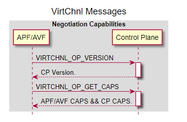

## Receive Descriptor Formats (RXDID) Enumeration

As described in the ‘RX Descriptors Format’ section, the format of a descriptor is defined by 6-bit RXDID field of the receive descriptor. To enumerate all RXDIDs supported by the Device, the driver posts a message with VIRTCHNL_OP_GET_SUPPORTED_RXDIDS opcode.

In reply to this message CP PF will return a 64 bits mask of the supported RXDIDs where set bits represent valid RXDID values.

The capability and negotiation protocol does not provide an enumeration of the receive descriptors format structures and relies on the format provided by the device’s package.

## Packet Types Negotiation 

Depending on RX descriptor format, the packet type (PTYPE) field can be 10 or 8 bits in size. The parse graph programmed to hardware defines the relationship between packets and PTYPEs (packet type).

After receive descriptor type is negotiated and size of the PTYPE field of the receive descriptor is known, the driver can discover values of PTYPEs reported by the Device.

To discover PTYPE values software may use one of the following methods:

- Basic PTYPE mapping mode used to create a simple mapping table for all PTYPEs supported by Device using well-known Protocol IDs
- Advanced PTYPE discovery mode used to discover advanced information for specific packets of interest to an application.

### Basic PTYPE Mapping

Software uses basic PTYPE negotiation mode for simple Device to SW PTYPE value mapping.

In this mode, SW request the list of PTYPEs supported by Device and then creates a mapping table from the 10/8b Device PTYPE value reported in the RX descriptor to an internal representation required by software. For example, like the DPDK (Data Plane Developer Kit) 32b rte_mbuf::packet_type.

The driver posts a get_ptype_info(start_ptype_id, num_ptypes) message using VIRTCHNL_OP_GET_PTYPE_INFO opcode requesting the CP PF to provide information for the given number of PTYPEs starting from the specified PTYPE ID.

For get_ptype_info(start_ptype_id, num_ptypes) message ‘start_ptype_id’ and ‘num_ptypes’ must use 10 bits range even if selected RXDID supports only 8-bit PTYPEs. In case if the driver uses different RXDID for different queues, and PTYPE field size are mixed, the driver can maintain two PTYPE mapping tables: one for 10 bits PTYPEs and one for 8 bits PTYPEs.

The CP PF replies with information for existing PTYPEs only. Depending on the number of PTYPEs requested, it may take CP PF multiple replies to provide all information needed.

This information contains a variable number of bytes per PTYPE in the following format:

*Table 1 CP PF PTYPE reply format*

<table>
<colgroup>
<col style="width: 20%" />
<col style="width: 10%" />
<col style="width: 69%" />
</colgroup>
<thead>
<tr class="header">
<th><strong>Field</strong></th>
<th><p><strong>Size,</strong></p>
<p><strong>bytes</strong></p></th>
<th><strong>Description</strong></th>
</tr>
<tr class="odd">
<th>PTYPE ID 10bit</th>
<th>2</th>
<th><p>Bits 0-9: PTYPE value reported on flex RX descriptor</p>
<p>Bits 10-15: Reserved</p></th>
</tr>
<tr class="header">
<th>PTYPE ID 8bit</th>
<th>1</th>
<th>PTYPE value reported on RX descriptor for 8 bits PTYPEs</th>
</tr>
<tr class="odd">
<th>PID Count</th>
<th>1</th>
<th>The number of protocol IDs in this record</th>
</tr>
<tr class="header">
<th>PID 0</th>
<th>2</th>
<th>The first protocol ID, one of well-known values defined by this
spec</th>
</tr>
<tr class="odd">
<th>...</th>
<th>...</th>
<th>...</th>
</tr>
<tr class="header">
<th>PID N-1</th>
<th>2</th>
<th>The last protocol ID, one of well-known values defined by this
spec</th>
</tr>
</thead>
<tbody>
</tbody>
</table>

For example, for PTYPE  [26] CP PF could reply with the following buffer:

*Table 2 CP PF PTYPE information reply example*

<table>
<colgroup>
<col style="width: 21%" />
<col style="width: 9%" />
<col style="width: 10%" />
<col style="width: 57%" />
</colgroup>
<thead>
<tr class="header">
<th><strong>Field</strong></th>
<th><p><strong>Size,</strong></p>
<p><strong>bytes</strong></p></th>
<th><strong>Value</strong></th>
<th><strong>Description</strong></th>
</tr>
<tr class="odd">
<th>PTYPE ID 10bit</th>
<th>2</th>
<th>27</th>
<th>10 bits PTYPE reported as part of flex RX descriptor</th>
</tr>
<tr class="header">
<th>PTYPE ID 8bit</th>
<th>1</th>
<th>27</th>
<th>8 bits PTYPE reported as part of RX descriptor</th>
</tr>
<tr class="odd">
<th>Protocol ID count</th>
<th>1</th>
<th>4</th>
<th>The number of protocols IDs in this record</th>
</tr>
<tr class="header">
<th>Protocol ID 0</th>
<th>2</th>
<th>2</th>
<th>Protocol ID for MAC</th>
</tr>
<tr class="odd">
<th>Protocol ID 1</th>
<th>2</th>
<th>19</th>
<th>Protocol ID for IPv4 (IP version 4)</th>
</tr>
<tr class="header">
<th>Protocol ID 2</th>
<th>2</th>
<th>25</th>
<th>Protocol ID for TCP</th>
</tr>
<tr class="odd">
<th>Protocol ID 3</th>
<th>2</th>
<th>34</th>
<th>Protocol ID for PAY</th>
</tr>
</thead>
<tbody>
</tbody>
</table>

For the full list of the predefined well-known Protocol IDs for
reporting supported PTYPEs see [<u>Protocols IDs for PTYPE
negotiation</u>](#protocols-ids-for-ptype-negotiation) below.

If needed, instead of requesting the full range of PTYPEs, the driver
can request a PTYPE ID for the specific sequence of protocol IDs. In
this case the driver may post a get_ptype_id (sequence_of_protocols)
using VIRTCHNL_OP_GET_PTYPE_ID opcode message requesting the CP PF to
provide PTYPE ID for the given sequence of protocols. The CP PF
replies with corresponding 10 and 8 bits PTYPE IDs.

For example, for the sequence of protocols {MAC, IPv4, TCP, PAY}, CP
PF could reply with the following buffer:

*Table 3 CP PF reply with PTYPE ID format*

<table>
<colgroup>
<col style="width: 21%" />
<col style="width: 9%" />
<col style="width: 10%" />
<col style="width: 57%" />
</colgroup>
<thead>
<tr class="header">
<th><strong>Field</strong></th>
<th><p><strong>Size,</strong></p>
<p><strong>bytes</strong></p></th>
<th><strong>Value</strong></th>
<th><strong>Description</strong></th>
</tr>
<tr class="odd">
<th>PTYPE ID 10bit</th>
<th>2</th>
<th>27</th>
<th>10 bits PTYPE reported as part of flex RX descriptor</th>
</tr>
<tr class="header">
<th>PTYPE ID 8bit</th>
<th>1</th>
<th>27</th>
<th>8 bits PTYPE reported as part of RX descriptor</th>
</tr>
</thead>
<tbody>
</tbody>
</table>

Multiple 10 bits PTYPE IDs may be mapped to the same 8 bits PTYPE ID.
It is not guaranteed that all 10 bits PTYPE ID would have
corresponding 8 bits PTYPE IDs. In such cases 255 (0xFF) will be used
to indicate invalid 8 bits PTYPE ID.

### Advanced PTYPE Discovery

In advanced PTYPE discovery, the driver sends a raw packet buffer to
CP PF to discover protocol classification capabilities of the CP PF.

First, the driver must construct a raw packet buffer in network format
with all essential fields. These essential fields include Ethertypes
(L2), Next Protocols (L3), Headers Options, L4 Ports, and so on.

Then the driver posts a get_ptype_info_raw(raw_packet_buffer) using
VIRTCHNL2_OP_GET_PTYPE_INFO_RAW opcode message requesting the CP PF to
process this packet buffer.

After receiving and processing the raw packet buffer, the CP PF
replies with information about the packet. This information includes:

- Device PTYPE ID

- A sequence of Protocols IDs with corresponding byte offsets to the
  start of the associated protocol header. Using this information, the
  driver can detect parser depth and protocols supported by the
  Device.

Using this method, the driver can discover any Device Protocols IDs
even if they are not part of the pre-defined well-known protocols
list.

For example, consider a GTP-U packet with inner TCPv4. The driver can
prepare the following raw packet buffer:

00 00 00 00 00 00 00 00 00 00 00 00 00 08 00\|45 00
10 00 60 00 00 00 00 40 11 00 00 00 00 00 00 00 00

20 00 00\|00 00 08 68 00 4c 00 00\|30 ff 00 48 00 00

30 00 00\|45 00 00 3c 00 00 00 00 00 06 00 00 00 00

40 00 00 00 00 00 00\|00 00 00 00 00 00 00 00 00 00

50 00 00 50 00 00 00 00 00 00 00\|00 00 00 00 00 00

60 00 00 00 00 00 00 00 00 00 00 00 00 00 00

Here:

bytes 0-13 are MAC header with Ethertype 0x0800 (IPv4 (IP version 4))

bytes 14-33 IPv4 header with Next Protocol 0x11 (UDP)

bytes 34-41 UDP header with Destination Port 2152 (GTP-U)

bytes 42-49 GTP-U header, no extensions

bytes 50-69 IPv4 header with Next Protocol 0x06 (TCP)

bytes 70-89 TCP header with no options

bytes 90-109 payload

Assuming the package supports GTP-U tunnels and can parse beyond the
GTP-U header, the CP PF will reply with the following information:

*Table 4 CP PF reply for GTP-U with inner TCPv4 packet if GTP-U
supported by Device*

<table>
<colgroup>
<col style="width: 23%" />
<col style="width: 8%" />
<col style="width: 10%" />
<col style="width: 57%" />
</colgroup>
<thead>
<tr class="header">
<th><strong>Field</strong></th>
<th><p><strong>Size,</strong></p>
<p><strong>bytes</strong></p></th>
<th><blockquote>
<p><strong>Value</strong></p>
</blockquote></th>
<th><strong>Description</strong></th>
</tr>
<tr class="odd">
<th>PTYPE ID 10bit</th>
<th>2</th>
<th>Depends on Device</th>
<th>10 bits PTYPE reported as part of flex RX descriptor</th>
</tr>
<tr class="header">
<th>PTYPE ID 8bit</th>
<th>1</th>
<th>Depends on Device</th>
<th>8 bits PTYPE reported as part of RX descriptor</th>
</tr>
<tr class="odd">
<th>Number of protocols detected</th>
<th>1</th>
<th>7</th>
<th>Number of protocols detected by CP PF parser</th>
</tr>
<tr class="header">
<th>Protocol 0 Offset</th>
<th>2</th>
<th>0</th>
<th>Offset of the first protocol detected</th>
</tr>
<tr class="odd">
<th>Protocol 0 ID</th>
<th>2</th>
<th>Depends on Device</th>
<th>Device Protocol ID for MAC header</th>
</tr>
<tr class="header">
<th>Protocol 1 Offset</th>
<th>2</th>
<th>14</th>
<th>Offset of the second protocol detected</th>
</tr>
<tr class="odd">
<th>Protocol 1 ID</th>
<th>2</th>
<th>Depends on Device</th>
<th>Device Protocol ID for the outer IPv4 header</th>
</tr>
<tr class="header">
<th>Protocol 2 Offset</th>
<th>2</th>
<th>34</th>
<th>Offset of the third protocol detected</th>
</tr>
<tr class="odd">
<th>Protocol 2 ID</th>
<th>2</th>
<th>Depends on Device</th>
<th>Device Protocol ID for the outer UDP header</th>
</tr>
<tr class="header">
<th>Protocol 3 Offset</th>
<th>2</th>
<th>42</th>
<th>Offset of the fourth protocol detected</th>
</tr>
<tr class="odd">
<th>Protocol 3 ID</th>
<th>2</th>
<th>Depends on Device</th>
<th>Device Protocol ID for the GTPU header</th>
</tr>
<tr class="header">
<th>Protocol 4 Offset</th>
<th>2</th>
<th>50</th>
<th>Offset of the fifth protocol detected</th>
</tr>
<tr class="odd">
<th>Protocol 4 ID</th>
<th>2</th>
<th>Depends on Device</th>
<th>Device Protocol ID for the inner IPv4 header</th>
</tr>
<tr class="header">
<th>Protocol 5 Offset</th>
<th>2</th>
<th>70</th>
<th>Offset of the sixth protocol detected</th>
</tr>
<tr class="odd">
<th>Protocol 5 ID</th>
<th>2</th>
<th>Depends on Device</th>
<th>Device Protocol ID for the TCP header</th>
</tr>
<tr class="header">
<th>Protocol 6 Offset</th>
<th>2</th>
<th>90</th>
<th>Offset of the last protocol detected (payload)</th>
</tr>
<tr class="odd">
<th>Protocol 6 ID</th>
<th>2</th>
<th>Depends on Device</th>
<th>Device Protocol ID for the last protocol detected</th>
</tr>
</thead>
<tbody>
</tbody>
</table>

If the package does not support GTP-U tunnels and parsing stops at the
first UDP header, then the CP PF will reply with the following
information:

*Table 5 CP PF reply for GTP-U with inner TCPv4 packet if GTP-U not
supported by Device*

<table>
<colgroup>
<col style="width: 23%" />
<col style="width: 8%" />
<col style="width: 10%" />
<col style="width: 57%" />
</colgroup>
<thead>
<tr class="header">
<th><strong>Field</strong></th>
<th><p><strong>Size,</strong></p>
<p><strong>bytes</strong></p></th>
<th><blockquote>
<p><strong>Value</strong></p>
</blockquote></th>
<th><strong>Description</strong></th>
</tr>
<tr class="odd">
<th>PTYPE ID 8bit</th>
<th>1</th>
<th>Depends on Device</th>
<th>8 bits PTYPE reported as part of RX descriptor</th>
</tr>
<tr class="header">
<th>PTYPE ID 10bit</th>
<th>2</th>
<th>Depends on Device</th>
<th>10 bits PTYPE reported as part of flex RX descriptor</th>
</tr>
<tr class="odd">
<th>Number of protocols detected</th>
<th>1</th>
<th>4</th>
<th>Number of protocols detected by CP PF parser</th>
</tr>
<tr class="header">
<th>Protocol 0 Offset</th>
<th>2</th>
<th>0</th>
<th>Offset of the first protocol detected</th>
</tr>
<tr class="odd">
<th>Protocol 0 ID</th>
<th>2</th>
<th>Depends on Device</th>
<th>Device Protocol ID for MAC header</th>
</tr>
<tr class="header">
<th>Protocol 1 Offset</th>
<th>2</th>
<th>14</th>
<th>Offset of the second protocol detected</th>
</tr>
<tr class="odd">
<th>Protocol 1 ID</th>
<th>2</th>
<th>Depends on Device</th>
<th>Device Protocol ID for the outer IPv4 header</th>
</tr>
<tr class="header">
<th>Protocol 2 Offset</th>
<th>2</th>
<th>34</th>
<th>Offset of the third protocol detected</th>
</tr>
<tr class="odd">
<th>Protocol 2 ID</th>
<th>2</th>
<th>Depends on Device</th>
<th>Device Protocol ID for the outer UDP header</th>
</tr>
<tr class="header">
<th>Protocol 3 Offset</th>
<th>2</th>
<th>42</th>
<th>Offset of the last protocol detected (payload)</th>
</tr>
<tr class="odd">
<th>Protocol 3 ID</th>
<th>2</th>
<th>Depends on Device</th>
<th>Device Protocol ID for the last protocol detected</th>
</tr>
</thead>
<tbody>
</tbody>
</table>

## vPort Initialization and Teardown

VPORT Final state Machine
(FSM):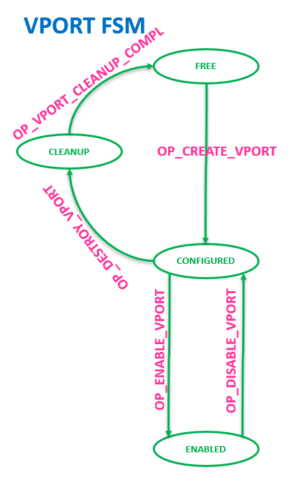

- OP_CREATE_VPORT command must allocate at least one RX and one TX
  queue, which will be associated with Queue Group #0.

- VPORT can be transitioned to FREE state only from CONFIGURED state. In
  other words, if VPORT is enabled, it must be disabled first before
  releasing its resources and destroying it.

- OP_DISABLE_VPORT and OP_ENABLE_VPORT can be called even if there are
  Queue resources associated and they are active on the Vport.

- VPORT RX Default Queues must be set upon execution of the
  OP_CREATE_VPORT command. The lowest RX Queue index must be used for
  all three engines (LAN, RDMA and CPE).

- OP_DISABLE_VPORT and OP_DESTROY_VPORT commands can be issued even when
  all or some of VPORT associated queues are enabled, including TX,
  RX, TX Completion and RX Buffer Queues. As a result, Queues
  associated with the VPORT must be disabled by the command is called.

WIP: vport_flags, vport_type usage and in-general vport Datastructure
IN/OUT params table.

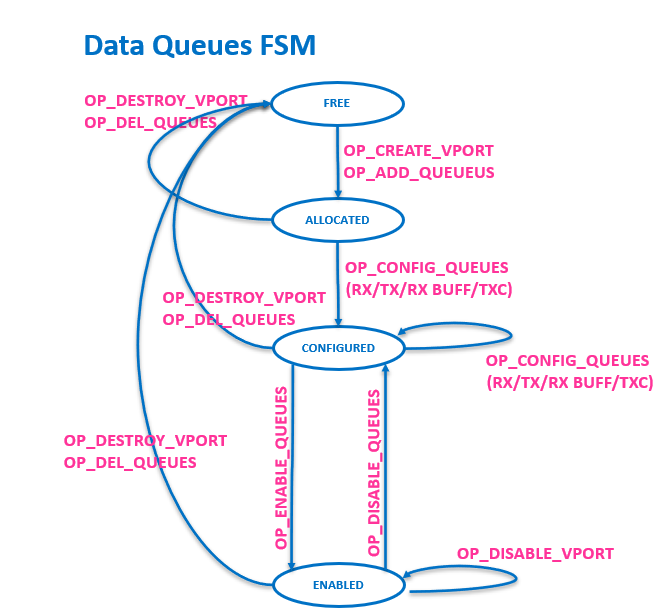

## Queue Initialization and Teardown

Data Queues Final State Machine (FSM):

- RX and TX queues can be allocated by using OP_CREATE_VPORT (Allocates
  default Queue Group #0), OP_ADD_QUEUES (Add Queues to already
  existing default Queue Group #0) or OP_ADD_QUEUE_GROUPS (Add
  additional Queue Groups).

- Allocated queues are not yet configured, so OP_CONFIG_QUEUES command
  is expected to configure desired parameters to pre-allocated queues.

- After Queues are configured properly they can be enabled/disabled
  using OP_ENABLE_QUEUES or OP_DISABLE_QUEUES.

- Queue State Transition from ENABLED to FREE by issuing
  OP_DESTROY_VPORT or OP_DEL_QUEUES commands is prohibited.

- Queue can be transitioned to FREE state only from CONFIGURED or
  ALLOCATED states by issuing either OP_DESTROY_VPORT or OP_DEL_QUEUES
  events.

- OP_ADD_QUEUES command can be issued even if the underlying VPORT is up
  and running, including traffic.

- From FSM perspective, OP_ADD_QUEUES/OP_DEL_QUEUE vs.
  OP_ADD_QUEUE_GROUPS/ OP_DEL_QUEUE_GROUPS are the same.

- OP_ADD_QUEUES/OP_DEL_QUEUE manipulate only default Queue Group #0
  allocated by OP_CREATE_VPORT, while non-default groups can be
  manipulated using OP_ADD_QUEUE_GROUPS/ OP_DEL_QUEUE_GROUPS commands.

## Queue Group Initialization and Tear Down

A vport’s queues can be split into multiple queue groups to provide
dedicated/isolated resources to multiple applications sharing a vport.
Each queue group can be associated with an application using Device receive
filters and SW based transmit filters. RSS can be enabled and configured
per RX queue group to load balance incoming packets across queues in a
queue group. From TX queue perspective, Queues can be grouped to be
connected to different Device Traffic Classes (TCS) or even grouped
inside the vport to provide ability to control ETS (arbitration SP/WFQ)
between different Queue groups.

Queue Group capability is not on by default and the capability is
negotiated by the driver as part of the GET_CAPS request.

```C
#define VIRTCHNL2_CAP_ADQ BIT(6)
```

The following 2 virtchnl messages are used to add and delete queue
groups.

```C
#define VIRTCHNL2_OP_ADD_QUEUE_GROUPS 538

#define VIRTCHNL2_OP_DEL_QUEUE_GROUPS 539
```

By default all the queues of a vport belong to a single queue group 0.
Additional queue groups can be added to the vport using ADD_QUEUE_GROUPS
message.

```C
/* VIRTCHNL2_OP_ADD_QUEUE_GROUPS

* Driver sends this message to request additional transmit/receive queue groups

* beyond the ones that were assigned via CREATE_VPORT request.

* virtchnl2_add_queue_groups structure is used to specify the number of each

* type of queues. CP responds with the same structure with the actual number

* of groups and queues assigned followed by num_queue_groups and num_chunks

* of virtchnl2_queue_groups and virtchnl2_queue_chunk structures.

*/

struct virtchnl2_add_queue_groups {

/* IN, vport_id to add queue group to, same as allocated by

* CreateVport.

* NA for mailbox and other types not assigned to vport

*/

__le32 vport_id;

u8 pad[4];

/* IN/OUT */

struct virtchnl2_queue_groups qg_info;

};

/* VIRTCHNL2_OP_DEL_QUEUE_GROUPS

* Driver sends this message to delete queue groups.

* PF sends virtchnl2_delete_queue_groups struct to specify the queue groups

* to be deleted. CP performs requested action and returns status and update

* num_queue_groups with a number of successfully deleted queue groups.

*/

struct virtchnl2_delete_queue_groups {

/* IN, vport_id to delete queue group from, same as

* allocated by CreateVport.

*/

__le32 vport_id;

/* IN/OUT, Defines number of groups provided below */

__le16 num_queue_groups;

u8 pad[2];

/* IN, IDs & types of Queue Groups to delete */

struct virtchnl2_queue_group_id qg_ids[1];

};
```

- Events

Events are asynchronous messages that are sent from the NIC to the driver. The NIC may choose to send these events anytime once the mailbox is operational.

Following are the events that the driver is interested in:

**VIRTCHNL2_EVENT_LINK_CHANGE - Sent when the link is up or down**

**VIRTCHNL2_EVENT_START_RESET_ADI (TBD after 1.0) - Sent when the ADI is reset has been initiated**

**VIRTCHNL2_EVENT_FINISH_RESET_ADI (TBD after 1.0) - Sent when the ADI reset was completed**

- The ADIs dont have physical function but their config space is emulated by the PF driver. These events are used by the PF driver to bring up the ADIs out of their reset

**VIRTCHNL2_EVENT_UPDATE_STATS - Sent when there is an update to be raised immediately**

```C
    struct virtchnl2_event {
        /* see VIRTCHNL2_EVENT_CODES definitions */
        
        __le32 event;

        /* link_speed provided in Mbps */

        __le32 link_speed;

        __le32 vport_id;

        u8 link_status;

        u8 pad[1];

        /* CP sends reset notification to PF with corresponding ADI ID */

        __le16 adi_id;

    };
```
## Function Level Reset

When the driver is unloading, it triggers Function Level Reset (FLR/XLR)
according to the type of the function it is working on (Physical
Function Reset (PFR) or Virtual function reset (VFR)) to clean all its
pending transactions and release its owned resources. In addition to
graceful XLR, triggered by the IDPF during unload process, there can be
additional XLR triggers happening asynchronously by device itself or by
O/S. Potential XLR sources can be:

1.  FLR/VFLR (PF/VF Level Reset) bit setting in the Physical/Virtual function configuration space.
2.  Function BME (Bus Master Enable) bit in the Physical/Virtual function configuration space is cleared.
3.  VF Only: VFE bit is cleared in the PF configuration space.
4.  Graceful trigger by IDPF driver during unload or reload process - PF by setting PFGEN_CTRL.PFSWR or VF by sending “VIRTCHNL_OP_RESET_VF” mailbox command.
5.  Function D state changes to D3.
6.  High Level Device or PCIE Level Resets, i.e. PeRST.

### Graceful VFR

This flow is triggered by the driver itself as part of driver load/unload or other failure use cases, which require return to driver default configuration. The flow to be executed is:

- Before Triggering XLR, the state of device visible to IDPF driver in PF/VFGEN_RSTAT register to is expected to be “PF/VFR_ACTIVE” state (10b).
- The IDPF triggers XFR: PF setting PFGEN_CTRL.PFSWR (XLR is triggered immediately) or VF sending the “VIRTCHNL_OP_RESET_VF” command, which is executed by Host Management after delay.
- Following this, Device will automatically clear PF/VFGEN_RSTAT register to “PF/VFR_INPROGRESS” state (00b), while the driver will start polling the PF/VFGEN_RSTAT register to get back into “PF/VFR_COMPLETED” state (01b), meaning that hardware PF/VF device is initialized to its default state.
- After it happens the PF/VF Driver is ready for re-initialization. As part of the initialization and execution of the first command in the initialization sequence “GetVersion” virtChnl command, Host Management will set PF/VFGEN_RSTAT register back to “PF/VFR_ACTIVE” state (10b).

### Asynchronous VFR/FLR

In this case, XLR happens asynchronously to the driver, usually triggered by Device, OS or any other source described above. The driver is expected to detect XLR condition and start polling till function is back to normal working state and then to start re-initialization process.

Driver flow:

- When the driver detects “TX timeout” on its data TX queues or it detects that its Mailbox TX Queue ENA bit and/or LEN bit in PF/<span class="mark">VF_ARQLEN. ARQENABLE</span> is cleared, the driver is expected to assume XLR and check if its PF/VFGEN_RSTAT register is not in “PFR/VFR_ACTIVE” state (10b).
- Following XLR detection, the driver is expected to avoid sending new data or control transactions to the device, poll for PF/VFGEN_RSTAT register to get back into “PFR/VFR_COMPLETED” state and then to re-initialize itself.

***Note***: Despite the fact that VF IDPF devices operate
completely independently and do not require any initialization or
involvement from PF IDPF; Function Level Reset triggered on PF
device will automatically trigger VF Level resets for all VFs mapped to
this PF.

#### MMIO Space non-accessible condition: 
The other Async reset flow that needs to be detected by the IDPF driver is the case when the Device MMIO space is not accessible for some period of time.

When MMIO space is not accessible, the device will generate an SError to the system upon MMIO access by the driver or any SW.

IMPORTANT Note: When the Device needs to inform the PFs and VFs, it needs to clear the ATQLEN and ENA field for the PFs and also the SRIOV VFs.
In compliance with SRIOV Specification, the VF interfaces are removed when PF interfaces are in reset because of VF_ENABLE bit being cleared in PCI Config space of the PF, at which point the Host OS removes the VF interface triggering a VF driver unload.

When tne device needs to go to MMIO space not accessible situation, the Mailbox interrupt is triggered by Device Control (just for the PFs) for letting driver know that a reset is going to occur soon. Driver must check ATQLEN and ENA field in ATQ** register as the first thing in the Mailbox interrupt service routine and if any of the fields are cleared it should then just arm the Interrupt and should stop accessing any MMIO space and wait for another Mailbox interrupt to occur or a timeout to happen. 
	
	IMPORTANT NOTE: Since in the Async reset flow, the driver immediately starts to poll on PFGEN_RSTAT or VFGEN_RSTAT register to see if it is coming out of reset, driver must set a different state to know this it cannot poll on PFGEN_RSTAT or VFGEN_RSTAT register till it receives the second interrupt or timeout happens.

	
	IMPORTN NOTE: The assumption for MSIX vector is its Auto clear and does not require driver to read any register. Also the watchdog timer which gets fired on the Device Control side before such a reset is actually triggered is started after the PF drivers are notified and is large enough that the time spent by the drivers doing couple of register access in the Mailbox Interrupt routine are well below the watchdog value. For example watchdog timer value is in 100s of millisecond and the registers access is at best in microseconds.

Device Control will trigger another mailbox interrupt for PFs/VFs once the reset is done, to indicate that they can now read PFGEN_RSTAT/VFGEN_RSTAT registers. Please note this interrupt will not have any virtchnl payload either as the rings won’t be configured by the driver.  Upon reception of this interrupt, the IDPF will follow the normal reset state machine for recovery as described earlier. (PFGEN_RSTAT/VFGEN_RSTAT 1) state= Reset_in_progress -> Reset_Completed -> Active).

The driver waits for the second interrupt to occur to come out of reset for a given period. The safe timeout value which still leaves a possibility of recovery by the device is TBD seconds. If the second interrupt does arrive within the timeout period, the driver should move to a state indicating it cannot communicate with the device to be on the safe side. 

Again both the reset interrupt mechanism and the timeout mechanism is an extension present as a common flow, a device may never trigger this interrupt for both PF or VF  and just rely on the non-graceful detection through ARQLEN and ARQLEN.ENA bit being clear check in the timer task.

#### FLR MMIO HW access synchronization condition:
When the Linux OS triggers FLR on a PF and VF, and the driver tries to access MMIO space, different PCIE Errors are triggered on Xeon (HW Error) vs ARM (Sync Abort) cores if the access is within reset duration of the FLR being triggered from the PCIE Config space. This is due to a standard flow for PCIE Devices where the MMIO access is removed during FLR for a short duration.

	To deal with this correctly the driver needs to enable callbacks only for function level reset triggered by the OS/hypervisor.  In case of linux, the driver must subscribe for reset detection event through OS callbacks in the driver, this will give an early detection for the driver when a reset is going to happen so the driver does not touch the MMIO space after its notified. After the reset is done, the driver gets a different callback to know that it is out of reset and now driver can start rebuilding and accessing MMIO space by following the PFGEN_RSTAT/VFGEN_RSTAT state machine to get Active state.

	In case of windows and ESX, there is no OS/hypervisor triggering FLR through config space, instead the driver is asked to trigger a PFR or VFR so the driver is always in the loop and since this is not an FLR driver can use the PFGEN_RSTAT/VFGEN_RSTAT access flow to know when it is out of reset without having to avoid MMIO access for some duration.

# Standard Offloads

- Multiple Default vPorts
IDPF driver can support multiple vPorts if the Device allows to do so. There are two ways the device can communicate to the driver that vPorts need to be created.
 1. Init Time
	At Init time the driver is informed as a response to VIRTCHNL2_OP_GET_CAPS opcode from the driver that it needs to create n number of vports. The value n can be 0 or more. The vport creation and configuration flow is the same for all vports. This is described in the vport creation and configuration flow section.
 2. Run Time (TBD after 1.0)
	This flow needs to be done as part of ADI and Subfunction creation and will be added after 1.0 of the Spec.

All offloads (standard or advanced) are negotiated. This gives a device
the opportunity to opt out of supporting a particular offload.

## MAC Filter Offload

- Device Interface

The driver uses this interface to add/delete L2 MAC addresses as filters
to redirect packets to a specific vport.

- Capability and Data structures
```C
    #define VIRTCHNL2_CAP_MACFILTER BIT(2)
```
The opcodes used to add/delete mac filters are
```C
    #define VIRTCHNL2_OP_ADD_MAC_ADDR 535

    #define VIRTCHNL2_OP_DEL_MAC_ADDR 536

    /* VIRTCHNL2_MAC_TYPE

    * VIRTCHNL2_MAC_ADDR_PRIMARY

    * Driver should set @type to VIRTCHNL2_MAC_ADDR_PRIMARY for the

    * primary/device unicast MAC address filter for VIRTCHNL2_OP_ADD_MAC_ADDR

    * and VIRTCHNL2_OP_DEL_MAC_ADDR. This allows for the underlying control

    * plane function to accurately track the MAC address and for VM/function

    * reset.

    *

    * VIRTCHNL2_MAC_ADDR_EXTRA

    * Driver should set @type to VIRTCHNL2_MAC_ADDR_EXTRA for any extra

    * unicast and/or multicast filters that are being added/deleted via

    * VIRTCHNL2_OP_ADD_MAC_ADDR/VIRTCHNL2_OP_DEL_MAC_ADDR respectively.

    */

    #define VIRTCHNL2_MAC_ADDR_PRIMARY 1

    #define VIRTCHNL2_MAC_ADDR_EXTRA 2

    /* structure to specify each MAC address */

    struct virtchnl2_mac_addr {

        u8 addr[ETH_ALEN];

        /* see VIRTCHNL2_MAC_TYPE definitions */

        u8 type;

        u8 pad;

    };

    /* VIRTCHNL2_OP_ADD_MAC_ADDR

    * VIRTCHNL2_OP_DEL_MAC_ADDR

    * PF/VF driver uses this structure to send list of MAC addresses to be

    * added/deleted to the CP whereas CP performs the action and returns the

    * status.

    */

    struct virtchnl2_mac_addr_list {

        __le32 vport_id;

        __le16 num_mac_addr;

        u8 pad[2];

        struct virtchnl2_mac_addr mac_addr_list[1];

    };
```

- Configuration Options

The MAC address assigned to the driver as part of the CREATE_VPORT
response is considered as the PRIMARY address and any additional MAC
addresses are marked as EXTRA addresses.

- Driver Configuration and Runtime flow

The driver negotiates MAC filter capability with the device by setting
VIRTCHNL2_CAP_MACFILTER bit as part of negotiating the capabilities with
the control plane. The control plane will set this bit in its response
if the vport is allowed to add/delete MAC filters.

At Runtime, the driver offloads add/delete mac filter requests to the
device when the OS notifies the driver.

- Device and Control Plane Behavioral Model

The device adds/delete MAC address filters in hardware to direct packets
to the requested vport.

## Promiscuous Offload

- Device Interface

The driver uses this interface to configure unicast or multicast
promiscuous mode on a vport.

- Capability and Data structures
```C
#define VIRTCHNL2_CAP_PROMISC BIT(8)

#define VIRTCHNL2_OP_CONFIG_PROMISCUOUS_MODE 537

/* VIRTCHNL2_PROMISC_FLAGS

* Flags used for promiscuous mode

*/

#define VIRTCHNL2_UNICAST_PROMISC BIT(0)

#define VIRTCHNL2_MULTICAST_PROMISC BIT(1)

/* VIRTCHNL2_OP_CONFIG_PROMISCUOUS_MODE

* Driver sends vport id and flags to the CP whereas CP performs the
action

* and returns the status.

*/

struct virtchnl2_promisc_info {

__le32 vport_id;

/* see VIRTCHNL2_PROMISC_FLAGS definitions */

__le16 flags;

u8 pad[2];

};
```

- Driver Configuration and Runtime flow

The driver negotiates Promiscuous offload capability with the device by
setting VIRTCHNL2_CAP_PROMISC bit as part of negotiating the
capabilities with the control plane. The control plane will set this bit
in its response if the vport is allowed to configure promiscuous mode.

At Runtime, the driver offloads promiscuous mode setting requests to the
device when the OS notifies the driver.

- Device and Control Plane Behavioral Model

The device will program the hardware to configure unicast/multicast
promiscuous mode and as a result the driver should be able to send and
receive packets with any unicast or multicast addresses based on
configuration.

## L2 Tag Insertion Offload (TBD after 1.0)

- Device Interface

L2 tag insertion offload is requested by the driver on a per-request
basis (single send or TSO). If tag insertion is needed for a given
transmit packet placed on a transmit queue, the driver will specify that
one or more tags should be inserted into the packet and will provide the
tag(s) in the transmit descriptor(s).

- Capability and Data structures

During the capability’s negotiation phase, the device will advertise
whether it can support L2 tag insertion offload. If the feature is
supported, the device will advertise how many L2 tags it can insert.

- Configuration options

On a per-message basis, the device may insert zero, one, or more L2
tags. For each tag to be inserted, the first 16 bits (TPID) is
configured in advance by software (in the queue context). The second 16
bits (TCI) are passed from software to the device in the transmit
descriptor(s). If one tag needs to be added, it is provided in the data
descriptor. If two or more tags need to be added, subsequent tag(s) are
provided in the context descriptor.

- Driver Configuration and Runtime flow

At configuration time, the driver will learn whether the device supports
tag insertion offload and advertise support with the operating system
accordingly. For each tag to be inserted, the device will need to
configure the device with the 16-bit TPID to be inserted into each
packet along with the 16-bit tag provided by the driver in the
descriptor.

At run time, the driver will set up each transmit request to insert
zero, one, or more tag(s), depending on the instructions from the
operating system.

- Device and Control Plane Behavioral Model

If tag insertion offload is enabled for a given transmit request, the
device will insert the tag(s) from the descriptor into the packet
immediately preceding the outermost L3 header. For a TSO request, the
same tag will be inserted for every individual packet.

The device needs three pieces of information to perform this operation:

- Number of tags to insert

- TCI value(s) for the inserted tag(s)

- TPID value(s) for the inserted tag(s)

The first two pieces of information are included in the descriptor on a
per-request basis, while the TPID value(s) are configured up-front in
the queue context. If more than one tag is inserted, they will show up
in order in the packet (i.e., tag 1 closest to SMAC, tag 2 following tag
1, etc.).

The tag(s) are inserted between the outermost Source MAC Address and
EtherType of the header as shown in the diagram below. Each tag is 32
bits and consists of a TPID value followed by a TCI value.

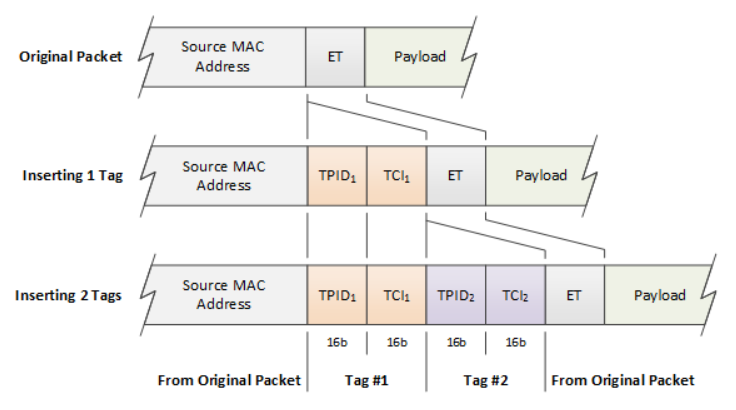

## Tx Checksum

- Device Interface

Transmit checksum offload is requested by the driver on a per-packet
basis. For a given transmit packet placed on a transmit queue, the
driver will specify whether transmit checksum(s) should be calculated
and inserted by the device.

- Capability and Data structures

During the capabilities negotiation phase, the device will advertise
support for the type(s) of transmit checksum calculation/insertion it is
capable of offloading. This may include L3 checksum (i.e., IPv4) and/or
L4 checksum (i.e., TCP, UDP, SCTP). Software must not attempt to offload
checksum calculation for a protocol that the device cannot support.

```C
/* VIRTCHNL2_CHECKSUM_OFFLOAD_CAPS

* Checksum offload capability flags

*/

#define VIRTCHNL2_CAP_TX_CSUM_L3_IPV4 BIT(0)

#define VIRTCHNL2_CAP_TX_CSUM_L4_IPV4_TCP BIT(1)

#define VIRTCHNL2_CAP_TX_CSUM_L4_IPV4_UDP BIT(2)

#define VIRTCHNL2_CAP_TX_CSUM_L4_IPV4_SCTP BIT(3)

#define VIRTCHNL2_CAP_TX_CSUM_L4_IPV6_TCP BIT(4)

#define VIRTCHNL2_CAP_TX_CSUM_L4_IPV6_UDP BIT(5)

#define VIRTCHNL2_CAP_TX_CSUM_L4_IPV6_SCTP BIT(6)

#define VIRTCHNL2_CAP_TX_CSUM_GENERIC BIT(7)

struct virtchnl2_get_capabilities {

/* see VIRTCHNL2_CHECKSUM_OFFLOAD_CAPS definitions */

__le32 csum_caps;

…

}
```
- Configuration

There are several different offload models for transmit checksum. The
model depends on which type of transmit descriptor is being used.

Base TX Data Descriptor – in this mode, the driver provides the header
lengths for the L2, L3, and L4 headers. The driver can specify for the
L3 and L4 header whether the checksum should be offloaded or not. If the
checksum is offloaded, the driver must specify the L3 and L4 header
types.

TX Data Descriptor – in the base mode for this descriptor, there is a
single bit to enable checksum offload for all headers in the packet. The
device will parse the packet and calculate/insert checksums for all
protocols it can support. As an alternative, this type of transmit
descriptor may also support generic transmit checksum, which is
described in more detail below.

- Driver Configuration and Runtime flow

At configuration time, the driver will learn which types of transmit
checksum offload operations the device can offload and advertise support
with the operating system accordingly.

Any queue configuration required to set this up?

At run time, depending on the offload model, the driver will set up each
transmit descriptor to offload or not, depending on the instructions
from the operating system.

- Device and Control Plane Behavioral Model

In the Base transmit descriptor model, the device is not expected to
parse the transmit packet. The header layout is specified by the driver
in the transmit descriptor, and the driver can enable/disable each
checksum offload individually. The device will calculate and insert the
checksum(s) for each packet as specified by the driver.

In the TX Data Descriptor mode, the device is expected to parse the
transmit packet. The device will calculate and insert all the header
checksums in the packet if requested to do so by the driver.

Generic checksum is simple from the device perspective. The driver does
not assume that the hardware has any knowledge of the packet or ability
to parse the headers. The driver takes care of calculating and inserting
all the static header checksums in the frame. The device is responsible
for calculating and inserting one L4 checksum which covers the payload.
The driver provides a starting point for the checksum calculation, which
continues to the end of the payload. The driver also provides the offset
where the result of the checksum calculation shall be inserted. The
driver is responsible for pre-populating the checksum field with the
pseudo header checksum which covers sections of the preceding headers.
If the device supports more than one generic checksum algorithm, the
driver will need to specify which algorithm shall be used for a given
transmit request/queue.

## Transmit Segmentation Offload (TCP and UDP)

- Device Interface

Transmit Segmentation Offload (TSO) is requested by the driver on a
per-request basis. For a given transmit request placed on a transmit
queue, the driver will specify whether the request should be segmented
by the device into multiple frames prior to transmission.

- Capability and Data structures

During the capabilities negotiation phase, the device will advertise
support for the type(s) of segmentation it is capable of offloading.
This may include TCP or UDP. Software must not attempt to offload
segmentation for a protocol that the device cannot support. There are
several other capabilities associated with TSO which must be learned
from the device:

- Minimum/Maximum header size (if any)

- Minimum/Maximum segment size (if any)

- Min/Max header buffers per request

- Min/Max data buffers per request

- Min/Max data buffers per segment

- Min/Max context descriptors per request

<!-- -->

- Cross-feature support

TSO works in conjunction with L2 tag insertion. Both offloads can run on
the same request.

Transmit checksum offload is required in conjunction with TSO. The
device will calculate and insert all checksums for each segment
associated with a TSO request.

- Driver Configuration and Runtime flow

At configuration time, the driver will learn which types of TSO
operations the device can offload and advertise support with the
operating system accordingly. In particular, the driver will advertise
support for the header sizes and segment sizes that the device can
support. The driver will also advertise support for the protocol(s) that
the device can support.

TSO queue configuration

TX queue Configuration data structures are filled out with TSO related
fields and negotiated with the CP. For details refer to the
virtchannel2.h Header file in Appendix.

Runtime flow for TSO

- The application provides a datagram to be transmitted to the protocol stack.
- The protocol stack divides the datagram into multiple TSO requests based on the capabilities of the underlying device.
- The protocol stack passes the datagram to the driver with the appropriate header information.
- The driver builds the descriptor stream necessary to send the datagram based on the hardware-specific restrictions as listed above and places that descriptor stream on the appropriate transmit queue.
- The driver updates the doorbell to notify the device that work is available on the transmit queue.
- After the device has processed the entire TSO request, it will issue a completion to the driver.
- The driver releases the buffers associated with the headers and the datagram back to the protocol stack, signaling that the memory can be reused.

- Device and Control Plane Behavioral Model

The device implements Transmit Segmentation Offload (TSO), which allows
the networking stack to pass to the device a larger datagram than the
Maximum Transmit Unit (MTU) size. The device divides the datagram into
multiple segments according to the MTU size, replicating and modifying
headers for each.

There are three components to this process, as illustrated in the
diagram below:

- Segmenting the datagram into one or more segments of at most MSS bytes in size
- Assembling the datagram segments into packets of at most MTU bytes in size by adding a header
- Editing the headers to reflect that the packet is part of a larger message

Example

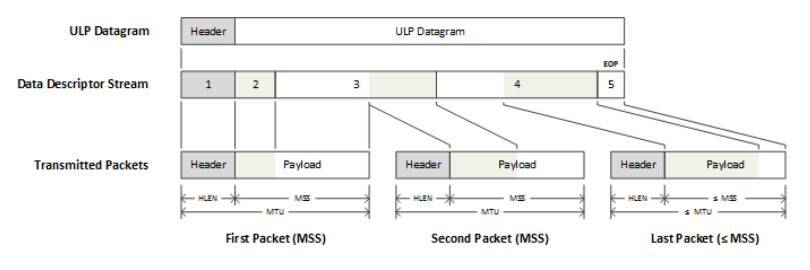

## L2 Tag Strip Offload (TBD after 1.0)

- Device Interface

L2 tag strip offload is requested by the driver on a per-queue basis. If
a tag strip is enabled on a given queue, the tag(s) will be removed from
any receive packet that contains tag(s), and the tag(s) will be
delivered to the driver in the receive descriptor. There is a flag in
the receive descriptor to indicate whether tag(s) are present or not.

- Capability and Data structures

During the capabilities negotiation phase, the device will advertise
whether it can support tag strip offload. It will also advertise the
number of L2 tags that it can strip and deliver to software in the
receive descriptor.

- Configuration options

A receive queue can be configured to strip one or more L2 tags from
packets and deliver the tag value(s) to software in the receive
descriptor.

- Driver Configuration and Runtime flow

At configuration time, the driver will learn whether the device supports
tag strip offload and advertise support with the operating system
accordingly.

If the operating system enables a given receive queue for tag strip, the
RX queue context must be configured accordingly.

At run time, the driver will check each receive descriptor for the
presence of one or more L2 tags. If present, the driver will copy the
tag(s) from the receive descriptor to the software metadata structure(s)
(OS-specific) prior to indicating the packet to the OS.

- Device and Control Plane Behavioral Model

If tag strip offload is enabled for a given receive queue, the device
will remove the outermost L2 tag from the packet (from the final
transformed packet destined to host) and deliver it to software in the
receive descriptor. To be clear the Device may have removed certain
headers from the packet already based on Infrastructure Data Path
operations offloaded on the NIC (e.g. Decapsulation of tunnel headers) .
The L2 Tag that is delivered here is the one that was allowed to be
delivered to the Host.

## Rx Checksum

- Device Interface

Rx Checksum offload is requested by the driver on a per-queue basis after the Device capabilities are negotiated. If RX checksum is enabled on a given queue, the RX checksum validation or Raw checksum will be delivered with any receive packet to the driver in the receive descriptor. There is a flag in the receive descriptor to indicate whether tag(s) are present.

- Capability and Data structures

```C

#define VIRTCHNL2_CAP_RX_CSUM_L3_IPV4 BIT(8)

#define VIRTCHNL2_CAP_RX_CSUM_L4_IPV4_TCP BIT(9)

#define VIRTCHNL2_CAP_RX_CSUM_L4_IPV4_UDP BIT(10)


#define VIRTCHNL2_CAP_RX_CSUM_L4_IPV4_SCTP BIT(11)

#define VIRTCHNL2_CAP_RX_CSUM_L4_IPV6_TCP BIT(12)

#define VIRTCHNL2_CAP_RX_CSUM_L4_IPV6_UDP BIT(13)

#define VIRTCHNL2_CAP_RX_CSUM_L4_IPV6_SCTP BIT(14)

#define VIRTCHNL2_CAP_RX_CSUM_GENERIC BIT(15) /* raw Checksum */

#define VIRTCHNL2_CAP_TX_CSUM_L3_SINGLE_TUNNEL BIT(16)

#define VIRTCHNL2_CAP_TX_CSUM_L3_DOUBLE_TUNNEL BIT(17)

#define VIRTCHNL2_CAP_RX_CSUM_L3_SINGLE_TUNNEL BIT(18)

#define VIRTCHNL2_CAP_RX_CSUM_L3_DOUBLE_TUNNEL BIT(19)

#define VIRTCHNL2_CAP_TX_CSUM_L4_SINGLE_TUNNEL BIT(20)

#define VIRTCHNL2_CAP_TX_CSUM_L4_DOUBLE_TUNNEL BIT(21)

#define VIRTCHNL2_CAP_RX_CSUM_L4_SINGLE_TUNNEL BIT(22)

#define VIRTCHNL2_CAP_RX_CSUM_L4_DOUBLE_TUNNEL BIT(23)

struct virtchnl2_get_capabilities {

/* see VIRTCHNL2_CHECKSUM_OFFLOAD_CAPS definitions */

__le32 csum_caps;

…

}
```

## RSS (Receive Side Scaling)

RSS is enabled on a per vPort basis. The initial set of RX queues requested for a vPort while it is created and granted by the CP can be part of RSS if the feature was negotiated.

As a result of this feature, the device will calculate a hash on certain fields in the packet depending on the Flow type as programmed by the Device Dataplane definition. This hash is used two ways

1.  Deliver the hash value in the RX descriptor along with the packet. This can be used by the Host OS for further classification needs.
2.  Distribute the RX packets belonging to different flows to different RX queues based on the distribution programmed by the Device driver as part of Lookup Table (LUT) programming.
  1.  All packets of a flow get hashed to a single RX queue as per the Data Plane programming of the device, although a device with programmable Dataplane can decide to hash them differently.
  
  The Device driver can learn about the fields on which the hash was performed for a packet and as an advanced feature can negotiate to select the fields in the packet to perform the hash.

- Device Interface
  - RSS hash value is delivered in the RX descriptor as described in the RX Descriptor sections.

- Capability and Data structures
```C
#define VIRTCHNL2_OP_GET_RSS_KEY 513
#define VIRTCHNL2_OP_SET_RSS_KEY 514
#define VIRTCHNL2_OP_GET_RSS_LUT 515

#define VIRTCHNL2_OP_SET_RSS_LUT 516

/* VIRTCHNL2_RSS_ALGORITHM
* Type of RSS algorithm
*/

#define VIRTCHNL2_RSS_ALG_TOEPLITZ_ASYMMETRIC 0
#define VIRTCHNL2_RSS_ALG_R_ASYMMETRIC 1
#define VIRTCHNL2_RSS_ALG_TOEPLITZ_SYMMETRIC 2
#define VIRTCHNL2_RSS_ALG_XOR_SYMMETRIC 3

/* VIRTCHNL2_OP_CREATE_VPORT
* PF/VF driver sends this message to CP to create a vport by filling in required
* fields of virtchnl2_create_vport structure.
* CP responds with the updated virtchnl2_create_vport structure containing the
* necessary fields followed by chunks which in turn will have an array of
* num_chunks entries of virtchnl2_queue_chunk structures.
*/
struct virtchnl2_create_vport {
…
/* see VIRTCHNL2_RSS_ALGORITHM definitions */
__le32 rss_algorithm;
__le16 rss_key_size;
__le16 rss_lut_size;
…
}
/* VIRTCHNL2_OP_GET_RSS_LUT
 * VIRTCHNL2_OP_SET_RSS_LUT
 * PF/VF Driver sends this message to get or set RSS lookup table. Only supported if
 * both PF and CP drivers set the VIRTCHNL2_CAP_RSS bit during configuration
 * negotiation. Uses the virtchnl2_rss_lut structure
 */

struct virtchnl2_rss_lut {
__le32 vport_id;
__le16 lut_entries_start;
__le16 lut_entries;
u8 reserved[4];
__le32 lut[1]; /* RSS lookup table */
};

/* VIRTCHNL2_OP_GET_RSS_KEY
 * VIRTCHNL2_OP_SET_RSS_KEY
 * PF/VF Driver sends this message to get or set RSS key. Only supported if both
 * PF/VF and CP drivers set the VIRTCHNL2_CAP_RSS bit during configuration
 * negotiation. Uses the virtchnl2_rss_key structure
 */

struct virtchnl2_rss_key {
__le32 vport_id;
__le16 key_len;
u8 pad;
u8 key[1]; /* RSS hash key, packed bytes */
};
```
- Configuration

RSS can be configured as a standard feature by negotiation with CP as part of device Capability negotiation.

After the negotiation, during vPort Create the algorithm can be selected or provided by the Device as well as the key size and lut size used.

- Driver Configuration and Runtime flow

1.  Driver -\> CP (get_capabilities)
2.  Driver -\> CP (create_vport)
3.  Driver -\> CP (set_key)
4.  Driver -\> CP (get_key)
5.  Driver -\> CP (set_lut)
6.  Driver -\> CP (get_lut)

- Device and Control Plane Behavioral Model

The Device can expose standard and advanced configuration options for RSS, as part of standard features, the device must expose the ability to choose the Algorithm, set the Key and Lookup table for directing traffic to the Rx queues.

In terms of advanced features, the Device can expose ways to learn about the flow types and enable/disable RSS on individual flow types. Also the Device can support ways to change the fields on which the hash is performed for a given flow type.

If the Driver sends a configuration that is malicious such as set the LUT with queues that are not part of the vPort, CP can decide to either fail the request or mark the interface as malicious and initiate an interface level reset.

## Header Split

- Device Interface

Header split is enabled on a per-receive-queue basis. For each received
packet, the device determines whether to split the packet across the
header buffer and packet buffer(s), post the whole packet to the header
buffer, or post the whole packet to the packet buffer(s). The receive
descriptor contains fields to communicate the packet layout across the
header and packet buffer(s) between the device and the driver.

- Capability and Data structures

There are several capabilities associated with header split which must
be learned from the device.

- Header buffer min/max size
- Header buffer granularity
- Header buffer alignment requirement (if any)
- Packet buffer min/max size
- Packet buffer granularity
- Packet buffer alignment requirement (if any)
- Header split modes supported (see details below)

- Configuration

Single queue model: if header split is enabled, either the 16B or 32B
read descriptor format may be used. Each descriptor posted to the device
contains a header buffer address and data buffer address. On a per-queue
basis (in the RX queue context), the driver sets the length of the
header buffer and length of the data buffer. The driver also configures
the Header Split Mode for the queue.

Split queue model: if header split is enabled, the 32B read descriptor
format must be used. Each descriptor posted to the device contains a
header buffer address and data buffer address. On a per-queue basis (in
the RX queue context), the driver sets the length of the header buffer
and length of the data buffer. The driver also configures the Header
Split Mode for the queue.

The header split mode determines how the packet is split across the
header buffer and data buffer(s). Depending on the mode and several
other factors, the packet may be delivered to data buffer(s) only,
header buffer only, or split across the header buffer and data
buffer(s). Bits in the receive descriptor(s) specify how the packet is
laid out across the associated buffers.

Supported modes are the following:

- Header Split disabled (Single buffer) – the whole packet is always posted to packet buffer(s)
- Header split enabled W/O supporting "Split large, coalesce small"<span class="mark">.</span> – if the header is identified and fits into the header buffer, post header to header buffer and payload to packet buffer(s), else post the whole packet to the packet buffer(s)
- Header Split with the support for “Split large, coalesce small” – if packet length is \<= header buffer size, post the whole packet to the header buffer, else use header split algorithm above.
  (Note: This option is supported only for non RSC. For RSC segments it is always header split regardless of this condition<span class="mark">.)</span>

- Driver Configuration and Runtime flow

If the driver wishes to enable header split, it must configure the
receive queue context with the header buffer size and packet buffer
size. It also must specify the header split mode for the queue.

When posting buffers to the device, the driver must post an
appropriately sized header buffer and packet buffer with each receive
descriptor. The buffers must be aligned according to the device
requirements, if any.

When processing a receive queue, the driver must check each receive
descriptor for the following information:

- SPH – this bit indicates that the packet was split across the header buffer and packet buffer(s) unless HBO is also set, indicating an overflow condition
- HBO – this bit indicates that the header length is larger than the header buffer size. In this situation, the whole packet is posted to the packet buffer(s)
- HDRL – number of bytes placed in the header buffer; will be the header length if the packet is split or the packet length if the entire packet was posted to the header buffer
- PKLT – number of bytes placed in packet buffer; for a packet that spans multiple buffers, all buffers but the last one is full (Note: In case of HBO the PKTL will hold the whole packet.)

Based on these fields in the receive descriptor, the driver indicates
the packet up to the OS along with the appropriate software data
structures to describe the location of the packet in one or more
buffers.

- Device and Control Plane Behavioral Model

Upon packet reception, the device chooses a target receive queue using
either exact match rules or hash-based queue selection. If header split
is enabled for the target receive queue, the device will decide whether
to post the full packet to the packet buffer(s), post the full packet to
the header buffer, or split the packet across the header buffer and
packet buffer(s). Based on the layout of the packet across the header
and packet buffer(s), the device will

## RSC

- Device Interface

Receive Segment Coalescing (RSC) can be enabled in conjunction with
header split and the split (receive) queue model. The RSC context may be
opened and closed based on specific criteria. The device will coalesce
received packets associated with the same flow into one or more packet
buffers, which may or may not have been posted consecutively onto the Rx
Buffer Queue. The device will also update the packet header as needed.
When the RSC context is closed, the receive descriptors associated with
the RSC datagram are posted consecutively to the Receive Queue. The
driver processes the Receive Queue descriptors and indicates the
datagram to the operating system.

- Capability and Data structures

The device supports a total number of RSC contexts. A subset of this
number can be made available to an AVH host interface instance. This
number is configured by the control software.

The device may have a requirement about packet buffer size if RSC is
enabled (i.e., 4K buffers). This buffer size should be advertised by the
device and followed by the driver.

The device may have a limit on the number of buffers it can coalesce
into a single RSC indication.

The device may have a maximum coalesce size which can be configured by
the host interface.

The device may have an RSC timeout setting which may be configured by
software. This is one of several criteria by which the RSC context may
be closed. This would typically be configured by control software; the
host driver would not have control over this setting.

- Configuration

When RSC is enabled, the receive split queue model must be used. RSC is
not supported with the single queue model or when header split is
disabled. RSC is enabled in the receive queue context and would
typically be enabled for all receive queues associated with a given
vPort.

- Driver Configuration and Runtime flow

The driver must enable RSC on a per-receive-queue basis. Typically, the
driver would enable RSC for all the queues associated with a given host
interface. If the driver wishes to adjust the maximum coalesce size,
this must be configured during configuration time.

The driver must post header buffers and packet buffers via the split
queue model. There may be device-specific size requirements on the sizes
of the header buffer and/or packet buffer when RSC is enabled.

When processing a receive queue enabled for RSC, the driver must be
prepared to indicate receive datagrams up to the maximum RSC coalesce
size. This may be larger than the interface MTU.

- Device and Control Plane Behavioral Model

When RSC is enabled, the receive flow in the device is as follows:

- Packet arrives at the device, which searches for an in-use RSC context associated with the flow.
- If not found, the device pulls the next available buffer from the Rx Buffer Queue and finds a free RSC context
- The device writes the packet data to the buffer in host memory and updates its internal RSC context. The packet header is not written to host memory until the RSC context is closed.
- If there is an in-use RSC context associated with the flow (i.e., for all subsequent packets after the first to open an RSC context), the device compares the remaining space in the already-allocated buffer with the number of bytes of data in the current packet.
  - If needed, the device pulls the next available buffer from the Rx Buffer Queue and updates the RSC context accordingly.
- The Device appends the packet data to the buffer(s) in host memory and updates the header for each subsequent packet.
- At some point, it will be time to close the context.
- The device writes the packet header to host memory (to the header buffer associated with the first packet buffer) and completes all buffers associated with the RSC context consecutively on the receive queue. Note that the buffers may or may not have been consecutive on the Rx Buffer Queue.

## Double Completion (TBD after 1.0)

- Device Interface
- Capability and Data structures
- Configuration
- Driver Configuration and Runtime flow
- Device and Control Plane Behavioral Model

**Host SW Support for LSO miss Completions**

- When there is a miss for a TX packet rule lookup in the Device and the Device sends the packet to be handled by Special SW on Embedded Cores , Device will send two completions for SW (per completion queue context configuration) :
  - First completion is reported as a “miss” completion. This completion is sent for the original packet that is missed.
  - Second completion is reported as a “reinject” completion. This completion is sent for the reinjected packet.

In both cases the timestamp reported in the TX completion represents the
time upon which completion is sent to host SW.

- Host SW should deallocate the original packet buffers when it gets the first completion and should send a completion to the congestion control SW (with the completion timestamp) when it gets the second completion. Host SW activates a timer between the first and second completion . Host SW reports the completion to congestion control SW if timer expires before second completion was sent from Device.
  - SW cannot release the packet buffer Context ( In case of Linux, it's the SKB) until both are done.
  
  Here are the few cases that a driver might see in terms of the order of completion, and the flow it needs to implement to support the double completion feature.

<table>
<colgroup>
<col style="width: 15%" />
<col style="width: 16%" />
<col style="width: 17%" />
<col style="width: 51%" />
</colgroup>
<thead>
<tr class="header">
<th><strong>Regular Completion</strong></th>
<th><strong>Miss Completion</strong></th>
<th><strong>Reinject Completion</strong></th>
<th><strong>SW flow</strong></th>
</tr>
<tr class="odd">
<th>N/A</th>
<th>Comes 1st to the driver</th>
<th>Comes 2nd to the driver</th>
<th><p>· On Miss, the driver should start count_down_timer per miss and
also free the packet buffer.</p>
<p>· Timer/Counter decrements in time_based worker thread of the
driver.</p>
<p>On Reinject, the driver will reset the timer/counter and release the
packet buffer context (skb) and report completion to the SW protocol
stack.</p></th>
</tr>
<tr class="header">
<th>N/A</th>
<th>Comes 1st to the driver</th>
<th>Does not come to the driver</th>
<th>If the timer goes to 0 and has not been reset by the Tx_cleanup
thread on arrival of reinject completion, then release the packet buffer
context (skb) from the timer_thread and report completion to the SW
protocol stack.</th>
</tr>
<tr class="odd">
<th>N/A</th>
<th>Comes 2nd</th>
<th>Comes 1st</th>
<th>In this case SW will do nothing on Reinject Completion but will wait
for miss completion to come without starting the timer to actually do
both the buffer release and skb_release and report to stack.</th>
</tr>
<tr class="header">
<th>Comes 1st</th>
<th>N/A</th>
<th>Comes 2nd</th>
<th>SW never knew to wait for Reinject, so it is going to discard the
reinject completion as it has already finished all processing when the
regular completion came.</th>
</tr>
<tr class="odd">
<th>Comes 1<sup>st</sup></th>
<th>Comes 2<sup>nd</sup></th>
<th>Comes 3rd</th>
<th>Not possible</th>
</tr>
<tr class="header">
<th>Comes 1<sup>st</sup></th>
<th>Comes 2nd</th>
<th>N/A</th>
<th>Not possible</th>
</tr>
<tr class="odd">
<th>Comes 2nd</th>
<th>Comes 1st</th>
<th>N/A</th>
<th>Not possible</th>
</tr>
<tr class="header">
<th>Comes 2<sup>nd</sup></th>
<th>N/A</th>
<th>Comes 1<sup>st</sup></th>
<th>Not possible</th>
</tr>
</thead>
<tbody>
</tbody>
</table>

## EDT (Earliest Departure Time)

This feature enables offloading Packet pacing hints to the device.

- Device Interface

The Driver fills out the transmit data descriptor with a hint to transmit a packet at a time in future. Field named SW_EDT in the Data descriptor(0xc) is used to specify the earliest time the packet should be launched.

A value of 0 in SW_EDT means the SW is not asking to delay the packet, the device may still launch the packet at a future time when the scheduling conditions are met.

In order to support SW requested packet pacing, the driver should configure Split Transmit queues and use flow Scheduling Descriptor format. The completions will be delayed and arrive out of order when the packet is actually scheduled by the device.

- Capability and Data structures

```C
enum virtchnl2_cap_other {
...
    VIRTCHNL2_CAP_EDT                       = BIT_ULL(14),
...
}

enum virtchnl2_op {
...
 VIRTCHNL2_OP_GET_EDT_CAPS                       = 525,
...
}

/**
 * struct virtchnl2_edt_caps - Get EDT granularity and time horizon
 * @tstamp_granularity_ns: Timestamp granularity in nanoseconds
 * @time_horizon_ns: Total time window in nanoseconds
 *
 * Associated with VIRTCHNL2_OP_GET_EDT_CAPS.
 */
struct virtchnl2_edt_caps {
        __le64 tstamp_granularity_ns;
        __le64 time_horizon_ns;
};
VIRTCHNL2_CHECK_STRUCT_LEN(16, virtchnl2_edt_caps);
```

- Driver Configuration and Runtime flow

The driver negotiates EDT offload capability with the device by setting VIRTCHNL2_CAP_EDT bit as part of negotiating the device level capabilities with the control plane. The control plane will set this bit in its response if the driver is allowed to offload EDT. If EDT offload capability is granted, the driver learns EDT specific parameters by sending a EDT specific capability request VIRTCHNL2_OP_GET_EDT_CAPS. The control plane provides timestamp granularity and time horizon value in its response. Time horizon value indicates the maximum time the device can hold the packet before it can be transmitted. This value can be passed to the OS stack so that it can decide to offload packet pacing to HW if the earliest departure time of a paced packet is within the time horizon supported by the device.

At runtime, OS stack can decide to offload packet pacing to the device and passes the packet along with earliest departure time to the driver.  The driver fills in the TX timestamp provided by the OS stack in the flow scheduling transmit descriptor to offload pacing of that packet to the device. The driver validates that the timestamp is within the time horizon supported by the device. The format of the timestamp is a 24-bit value. The 23 LSBs represent absolute time in units of timestamp granularity. The MSB of the timestamp is used to indicate SW Timestamp overflow, meaning that the SW Timestamp is beyond the device's Time Horizon.

- Device and Control Plane Behavioral Model

The device uses Timing Wheel Scheduler that selects packets for transmission based on a Timestamp. The Timestamp in the flow scheduling transmit descriptor represents the earliest departure time of the packet, and the Timing Wheel Scheduler ensures that packets are not transmitted until the Absolute Time is greater than or equal to the packet’s Timestamp. The device and the hosts are synchronized so that all share a common time.

##  

## Flow Steering

Flow steering capability is an advanced capability provided by a device using stateful tables in the device to achieve better load balancing or flow pinning of flows to the CPU cores by classifying the flows into specific DMA queues. It’s a feature that is used in place of RSS or in addition to RSS as an advancement. The default behavior assumed by the device when both are enabled is to fall back to RSS for queue selection when flow steering ule does not exist for a given flow. The flow rule may not exist because there is no more space in the device to add a flow rule for the flow or the driver does not chose to add a flow steering rule for such a flow.
The Device level flow steering capability request is made by IDPF driver through get_capabilities virtchannel command by setting VIRTCHNL2_CAP_FlOW_STEER bit in the capability bitmap. If the device supports flow steering capability for this interface the response from Device Control still has the VIRTCHNL2_CAP_FLOW_STEER bit set in the capability bitmap.

### Flow Steering Sub Capabilities
The feature can be enabled as three different sub capabilities.
1.	Inline flow steering support with implicit Rx queue
2.	Inline flow steering support with explicit Rx queue 
3.	Sideband Flow steering support using virtchannel messages

Each vPort will learn using vPort flags what capabilities it has with respect to flow steering as this can be controlled at a vport level.  
Following VPORT flags get set by the Device Control as a response to create vport based on the 
configured policy for the vPorts on the Device Control side.

```C
enum virtchnl2_vport_flags {
	…
	VIRTCHNL2_VPORT_INLINE_FLOW_STEER	= BIT(1),
	VIRTCHNL2_VPORT_INLINE_FLOW_STEER_RXQ	= BIT(2),
	VIRTCHNL2_VPORT_SIDEBAND_FLOW_STEER	= BIT(3),
             …
}
```

Device Control could allow all 3 capabilities or any combination for a Vport. Apart from this a few new fields are defined in the create_vPort message padding area to provide some information for the IDPF driver regarding Flow director  support.

```C
struct virtchnl2_create_vport {
	…
__le64 inline_flow_types;
__le64 sideband_flow_types;
__le32 sideband_flow_actions;
__le32 flow_steer_max_rules;
…
}
```

Flow Steer Max Rules: 
Flow_steer_max_rules allowed by the device per vport are across all flow types and all flow steering capabilities for that vport.

Flow Types:

```C
enum virtchnl2_flow_types {
 	VIRTCHNL2_FLOW_IPV4_UDP		= BIT(1),
 	VIRTCHNL2_FLOW_IPV4_SCTP	       = BIT(2),
 	VIRTCHNL2_FLOW_IPV4_OTHER	= BIT(3),
	VIRTCHNL2_FLOW_IPV4_AH		= BIT(4),
	VIRTCHNL2_FLOW_IPV4_ESP		= BIT(5),
	VIRTCHNL2_FLOW_IPV4_AH_ESP	= BIT(6),
	VIRTCHNL2_FLOW_IPV6_TCP		= BIT(7),
	VIRTCHNL2_FLOW_IPV6_UDP		= BIT(8),
	VIRTCHNL2_FLOW_IPV6_SCTP	= BIT(9),
	VIRTCHNL2_FLOW_IPV6_OTHER	= BIT(10),
 	VIRTCHNL2_FLOW_IPV6_AH		= BIT(11),
 	VIRTCHNL2_FLOW_IPV6_ESP		= BIT(12),
 	VIRTCHNL2_FLOW_IPV6_AH_ESP	= BIT(13),
…
}
```

sideband_flow_steer_flow_types (bitmask), is like rss_flow_type and lets the driver know which flow types are allowed for configuring sideband filter rules. This does not give any indication on the input set (match fields) used for a given flow type which is configured by the Device Control Plane. So, if a driver tries to program a rule with match fields for a given flow type that is not configured by Device Control; device Control will respond with failure to add the rule.
Note: A flow type is way to identify certain sequence of headers in each packet such as IPv4_TCP flow type, typically a device may allow a flow type to be interpreted in a tunnel agnostic fashion, so a packet with IPv4_TCP over Vxlan may still be considered as the same flow type as non-tunneled TCP_IPv4 packet.

inline_Flow_Steer_flow_types (bit mask), this is also like rss_flow_type and lets the driver know which flow types are allowed for configuring inline filter rules, again this does not give any indication on the input set allowed and that is configured by the Device Control Plane.
sideband_flow_steer_action_types (bit mask only applicable to sideband)

```C
enum virtchnl2_action_types {
	VIRTCHNL2_ACTION_DROP		= BIT(0),
	VIRTCHNL2_ACTION_PASSTHRU	= BIT(1),
	VIRTCHNL2_ACTION_QUEUE		= BIT(2),
	VIRTCHNL2_ACTION_Q_GROUP	= BIT(3),
	VIRTCHNL2_ACTION_MARK		= BIT(4),
	VIRTCHNL2_ACTION_COUNT		= BIT(5),
};
```

Note: Inline flow steering assumes an input set and filter rule that is derived from the packet header content as a flow match based on the Device Control plane configuration. This is not configurable by the driver. The only action allowed with Inline flow steer is queue action.

In case of Inline flow steering rules, when sending a packet that should program a  flow rule in the device, the Context descriptor must set the FILT_AU_EN bit to Enabled, the Rx Queue used for forwarding is programmed as part of the Tx queue configuration as peer_rx_queue_id.

Inline Flow steering with Explicit queue is supported using fields (TBD) from the TX Context Descriptor (Rx queue that needs to be used as forwarding action.) as part of Flex fields. 
In case of Inline flow steering rules, when sending a packet that should remove a  flow rule from the device, the Context descriptor must set the FILT_AU_EVICT bit to remove the filter.

```C
//Flow Steering Vitrchannel Commands
	VIRTCHNL2_OP_FLOW_RULE_CHECK			= 550,
	VIRTCHNL2_OP_FLOW_RULE_ADD			= 551,
	VIRTCHNL2_OP_FLOW_RULE_GET			= 552,
	VIRTCHNL2_OP_FLOW_RULE_DEL			= 553,
	VIRTCHNL2_OP_FLOW_RULE_IDS_GET			= 554,
	VIRTCHNL2_OP_FLOW_RULE_BY_IDS_DEL		= 555,
```

### Flow Steering flows
#### Init Flow
1. After the Device level capability negotiation as described in the Flow Steering Capability section, the driver does vport creation.
2. As part of response for create_vport, the driver learns the vport level flow steering sub capabilities granted by the Device Control.
3. The driver also learns about number of filters (overall for this vport) and flow types supported from this device per sub capability. The driver also learns about the actions supported by the device for Sideband flow steering. All this info helps the driver in doing a sw check before adding any rules into the device.
4. The driver ultimately enables the Inline or sideband flow steering based on SW Control knobs after the Device capabilities granted per vport are learnt. So even if the device gives the capability the SW administrator can chose not to enable the feature. 
#### Runtime flow
#####	Filter Add flow for Sideband filters.
1. Driver prepares a virtchannel command struct based on VIRTCHNL2_OP_FLOW_RULE_ADD data structure definitions. This can be done two different ways using raw packet content or using sequence of protocol headers with fields to be matched.
	- Raw packet format specifies a raw packet with field values that need to be matched and a mask of the same size specifying which are the bits to be matched from the packet.
    - With the Sequence of protocol header with fields, one has to construct an array of protocol Header names and a 64 byte max header content with an accompanying mask to specify the relevant bits and bytes to be matched in the filter.

	One must specify headers in the packet starting from a given tunnel level from where to start matching the fields . 0 being the outer most tunnel level. If all the fields to be matched are say in tunnel level 2 from outer most, the filter specification can just set the tunnel level to 2 and specify protocol hrds in level 2. If fields from level 1 and 2 are to be matched then one has to specify all protocols in both he levels that are allowed in the packet and if there is no match in a particular protocol hdr that can be specified by leaving the mask for that header to be empty and the Device control will ignore definition of fields or the size of the hdr etc for that protocol.

	Again each protocol hdr can be longer that 64 bytes, but this will provide for matching fields in a protocol hrd as deep as 64 bytes.
	Also a count field is filled by the driver to say the number of protocols in the array. 
	
	Driver must also prepare the action specification array to specify the actions that must happen upon the filter match in the device. Number of actions should be filled out as action count and a structure that specifies the different action details.   Each action definition will pick one of the following actions: queue, queue_group, mark, count, passthrough or drop. Drop and passthrough will be specified as single actions by themselves with no accompanying data. Other actions will have data to go along such as queue_id etc.

	Driver must also specify the vPort_id for which the filter is being added.
2. Driver sends the command over mailbox and gets a response from the Device Control if the rules was added or not. If not added it gets the right error depending on the filter input set supported or not or if the filter space on the device is completely occupied etc.

	The definition assumes a response is always received and carries an ID (flow_rule_Id) for the filter added by the device Control in the Device.	
##### Filter Add flow for Inline filters and implicit RX Queue
1. Driver sets the Peer_rx_qeueue_id filed in the TX Configuration vrtchannel command to specify the Rx queue which would be used for forwarding action with the inline filter that gets added as part of Tx packet send.
2. Driver sets meta data (FILT_AU_EN) in the TX Context descriptor to indicate to HW to add a Flow steering rule and derive the Input set from the packet based on the Configuration on the device side.
3. If a filter rule add fails, in some cases the Device can send a receive descriptor with error. 
4. Dummy packets or standard TX packets can be used to add a filter in the Device. A dummy packet is specified by marking DUMMY bit in the Tx Context Descriptor and the Device discards the packet after programming the rule. The validity of packet headers is not considered as long as there is information for parsing of headers by the device present in the packet. Also, the fields that identify a flow for a given packet type should be populated.
##### Filter add flow for Inline filters and explicit RX queue 
	(TBD after 1.0): To define the exact fields layout for the RX queue information in the Tx context descriptor
##### Filter remove flow for sideband filters
1.	Driver prepares a virtchannel command struct based on VIRTCHNL2_OP_DEL_FLOW_RULE data structure definition.
2.	The driver must fill out the flow_rule_id as returned by Control plane during filter add in the delete command along with vport_id from which this filter needs to be removed.
##### Filter remove flow for Inline filters and implicit or explicit RX queue
1. The driver must Send a packet with hdr containing relevant fields to help remove a  flow rule from the device. The Context descriptor with the packet must set the FILT_AU_EVICT bit to remove the filter. The packet could be for example a FIN or RST packet that is going out in case of TCP based flows. In case of UDP any last packet of the UDP flow can set the EVICT bit to remove the filter.
2. Dummy packets can be used as well to Evict a filter from the Device. A dummy packet is specified by marking DUMMY bit in the Tx Context Descriptor and the Device discards the packet after programming the rule. The validity of packet headers is not considered as long as there is information for parsing of headers by the device present in the packet. Also, the fields that identify a flow for a given packet type should be populated.
#### Filter check for sideband filters (TBD after 1.0)
#### Reset flow
The driver can chose to hold state of programmed flows in the Device and clear the flow info stored in SW as part of Device reset, or use the SW copy of flow Steer rules to repopulate the Device with flow rules after Device reset.


### Device Interface

The Driver negotiates with the device the capability to add/delete/query flow steering filter rules over the mailbox. The response from the device can be negotiated as well as using virtchannel flags

- All responses: success or failure. This is the default setting for all virtchannel requests from the driver to CP.
- Just failure response. This needs to be enabled by setting an appropriate virtchannel flag in the virtchannel Descriptor.
- Fence. This needs to be enabled by setting an appropriate virtchannel flag in the virtchannel Descriptor. Upon setting this flag on a request from the driver to the CP, CP responds to this particular request after the CP checks all other previous requests from the Interface on this mailbox where completed successfully or otherwise.

### Flow Add/Remove Capability and Data structures

```C
#define VIRTCHNL2_CAP_FLOW_RULES BIT(16)
```

If the device supports flow steering it responds with the capability supported in get_capability flow.

The two opcodes supported as of now are for adding and removing
flow rules.
A driver can keep a log of the flow rules added, to respond to the
user queries regarding what flow rules are programmed or in future a
QUERY_RULE opcode may be added into the virtchannel to get actual flow
rules dumnped out of the device.

```C
#define VIRTCHNL2_OP_ADD_FLOW_RULE 538
#define VIRTCHNL2_OP_DEL_FLOW_RULE 539
```

Actions and related Data structures :

```C
#define VIRTCHNL2_ACTION_DROP 1
#define VIRTCHNL2_ACTION_PASSTHRU 2
#define VIRTCHNL2_ACTION_QUEUE 3
#define VIRTCHNL2_ACTION_Q_GROUP 4
#define VIRTCHNL2_ACTION_MARK 5
#define VIRTCHNL2_ACTION_COUNT 6

struct virtchnl2_proto_hdr {
/* see VIRTCHNL2_PROTO_HDR_TYPE */
__le32 type;
__le32 pad;
/**
* binary buffer in network order for specific header type.
* For example, if type = VIRTCHNL2_PROTO_HDR_IPV4, a IPv4
* header is expected to be copied into the buffer.
*/
u8 buffer_spec[64];
/* binary buffer for bit-mask applied to specific header type
*/
u8 buffer_mask[64];
}
struct virtchnl2_proto_hdrs {
/* As a packet may contain multiple headers of same type, this
defines the encap level */
u8 tunnel_level;
/* count = 0 is for a raw packet format, 1 &lt;= is when specifying
the match key using proto_hdr format. */
__le32 count;
union {
struct virtchnl2_proto_hdr proto_hdr[VIRTCHNL2_MAX_NUM_PROTO_HDRS];
struct {
__le16 pkt_len;
u8 spec[VIRTCHNL2_MAX_SIZE_RAW_PACKET];
u8 mask[VIRTCHNL2_MAX_SIZE_RAW_PACKET];
} raw;
}
}
```

### Configuration

Device, if it can support flow Steering, will allocate certain flow Steering table resources to be used by the SW as requested by the driver. A get_flow_steering_capability data structure will be defined to learn about the device's detailed capability. The number of rules supported, match kind etc.

## Inline Crypto Offload (TBD after 1.0)

- Device Interface

The Driver negotiates with the device the capability to add/delete Security Context (SA) rules over the mailbox. The response from the device can be negotiated as well using virtchannel flags

- All responses: success or failure. This is the default setting for all virtchannel requests from the driver to CP.
- Just failure response. This needs to be enabled by setting an appropriate virtchannel flag in the virtchannel Descriptor.
- Fence. This needs to be enabled by setting an appropriate virtchannel flag in the virtchannel Descriptor. Upon setting this flag on a request from the driver to the CP, CP responds to this particular request after the CP checks all other previous requests from the Interface on this mailbox where completed successfully or otherwise.

- Capability and Data structures

- Configuration

- Driver Configuration and Runtime flow

- Device and Control Plane Behavioral Model

## RDMA Capability

RDMA is part of the advanced Capabilities negotiated with the control
plane as <span class="mark">VIRTCHNL2_CAP_RDMA.</span> RDMA negotiation
happens with RDMA Control Plane Peer identified as
<span class="mark">VIRTCHNL2_RDMA_CPF</span>

IDPF driver will negotiate RDMA Specific capability with the Device Control plane. 
RDMA is a vendor specific capability as opposed to the rest of the IDPF spec compliant vendor agnostic capabilities. IDPF Spec will cover Interface and driver/device flow details to support a vendor specific RDMA driver along with a generic/common vendor agnostic IDPF driver.
The Spec will carry the flows and Interfaces between the IDPF driver and IDPF Device Control Plane for RDMA which we refer to as South side interfaces. The North side interfaces between the IDPF driver and the RDMA vendor driver are OS specific and will be covered for Linux as OS in an Appendix section to the Spec.

### South Side Interactions with Device Control Plane
#### RDMA Capability Negotiation
As the IDPF driver comes up, if it does have the RDMA support code in it, it will announce to the Device Control that it is capable of supporting RDMA capability and vendor specific RDMA driver. If the Device supports the RDMA capability along with IDPF Spec and the Control plane policy allows enabling it for an instance of the PF or VF driver it will respond with the RDMA capability enabled bit in the Capabilities bitmap.
Note: RDMA transport protocol is agnostic to IDPF driver and the transport in use is a negotiation/learning between the RDMA driver and the Device Control plane. The same RDMA vendor driver is assumed to support all Transports that apply to a given device. 
As an IDPF driver can come up with multiple logical LAN interfaces corresponding to the multiple vPorts created at Init or later at runtime, the Device Control must mark a vport_flag (a new ENABLE_RDMA flag) for a given vPort so that the driver can then instantiate the corresponding RDMA device Interface instance. If the Vport_flags bitmask does not indicate ENABLE_RDMA for any of the vports even if the device level capability grants RDMA to the driver, no RDMA devices/interfaces will be created by the IDPF driver.

Besides the device level RDMA capability, the driver also learns vport level RDMA capability from the device control plane. This is indicated as a vport flag set in the response to create_vport by the Device Control plane.
```C
VIRTCHNL2_VPORT_ENABLE_RDMA             = BIT(4),
```

####	MMIO Space Learning
After the RDMA capability negotiation, IDPF driver must learn about the various MMIO memory regions in the memory BAR that it should map. This will allow RDMA driver to map its own regions in the best possible way depending on the usage.
This memory region discovery opcode can be called in other cases by IDPF driver as well in future if it needs to support other independent auxiliary drivers that need their own BAR space mapping.
There are two flows that a driver    can follow depending on the support in the OS.
1.	It can start with just mapping the Memory pages corresponding to the virtchannel Mailbox registers  and the reset registers. Then map the rest once the driver learns about the rest of the memory regions from Device Control Plane leaving behind regions that will be mapped by another auxiliary/dependent driver (in this case RDMA driver) appropriately.
2.	Or it can start with mapping all the BAR and then request unmap from the OS of the regions that it should not be mapping so that the auxiliary/dependent driver can map it appropriately. (Note: currently Linux does not support this flow and is proposed as an enhancement, the benefit with this approach is that there is only one contiguous mapping/region (with holes) for the IDPF drivers MMIO space.
In either case the virtchannel exchange with the device Control remains the same and needs to happen as soon as the driver learns that it is enabled to support RDMA auxiliary/dependent driver or any other auxiliary/dependent driver that needs its own memory mapping.

Virtchannel Details

```C
enum virtchnl2_op {
  ...
  VIRTCHNL2_OP_GET_LAN_MEMORY_REGIONS	= 543,
  ...
}
/* Opcode: VIRTCHNL2_OP_GET_LAN_MEMORY_REGIONS */
struct vitchnl2_mem_region
{ 
__le64 size;
__le64 start_offset;
};

struct virtchnl2_get_lan_memory_regions {
	__le16 num_memory_regions;
	u8 pad[6];
	struct virtchnl2_mem_region mem_reg[STRUCT_VAR_LEN];
};
```
####		RDMA MSIX vector allocation
IDPF driver given the OS capabilities needs to request MSIX vectors on behalf of the  RDMA vendor specific dependent driver as a onetime request for all vectors or additional request for RDMA specific Aux driver usage once it is aware of its enabled capabilities and the number of vectors that Control Plane carves out for RDMA usage.
Driver implements the following policy
1.	A default allocation of 4  vectors is made for RDMA by LAN IDPF driver if the Control plane does not inform the driver about RDMA dedicate allocation of vectors. This amount will be taken from the num_allocated_vectors in get_capability that Device Control plane informs LAN driver about. So LAN will have less than max msix for its use based on the default policy.
2.	Default allocation policy will be used only if the Device Control plane does not initialize  num_rdma_allocated_vectors in the get_capability structure using some of the padding area to specify exactly how many vectors to be allocated for RDMA and given to the RDMA CORE driver.  If this field is understood by the driver and populated by the Device Control Plane with a non-zero value, then the IDPF driver may not take any vectors from num_allocated_vectors given to the LAN but will allocate the sum of LAN + RDMA with Device Control Plane and with the OS. And give the RDMA portion to the RDMA core driver for its use.

####	Init and Runtime Virtchannel  Messages and flows between RDMA driver and The Device Control Plane
All interactions between the RDMA vendor specific dependent driver and the Device Control plane after the initial exchange are pretty much opaque to the IDPF driver.
Opaque Virtchannel message:

```C
VIRTCHNL2_OP_RDMA			= 529,
```
This OP/call is used as an opaque RDMA virtchannel message between the vendor driver and the Device Control plane. A message buffer from RDMA driver is sent to the Device Control with this Opcode and the Device Control can do the reverse using the same opcode to send a message buffer to the RDMA driver. The interpretation of this message buffer is agreed upon between the Vendor RDMA driver and the Device Control plane.


## PTP

|Term|Other Archaic terms in use|Definition|
| ----- | -- | ------ |
|Grandmaster| |The main Atomic clock in a PTP cluster which is the source for time syncrnization by all nodes directly or indirectly in the cluster|
|TimeTransmitter|Master, Leader|This can be used for Grandmaster or for a an intermediate edge clock that acts as source for a local sub-cluster|
|TimeReceiver|Slave, follower|These are all the dependent clock systems that synchronize with TimeTransmitter|
|Device PHC|Device Master clock, Device Main clock, Device Clock|The main Device Clock, PHC stands for PTP HW clock, this si what is adjusted in a TimeReceiver|
|Phy clock|| Apart from Device PHC, the device migth have a separate Phy clock that needs to be synchronized as well|


### Device Interface
  
  With this capability, Device provides an Interface for synchronizing the system(OS) clock with Device PHC and also to adjust Device PHC etc as defined through sub capabilities below. The inetrface requires the Device to expose either direct or indirect ways to read/write/adjust Device PHC time, transmit packet timestamp, receive packet timestamp etc.  

### Capability and Data structures
  
 This capability consists of multiple sub capabilities that can be exposed by a device and are divided primarily in a few categories as described below. The primary PTP capability request is made by IDPF driver through VIRTCHNL2_OP_GET_CAPS virtchannel command by setting VIRTCHNL2_CAP_PTP bit in other_caps bitmap. If the device supports PTP capability the response from Device Control still has the VIRTCHNL2_CAP_PTP bit set in the other_caps bitmap.

#### PTP Sub Capabilities
1. Ability to synchronize system (OS) time with Device time by doing cross time stamping. 
  * In legacy Devices with no PCIe PTM capability, this was done by independently sampling Device time and system time. But doing it in a fashion that they can be done as close in time as possible. Or by taking two system time sample one before taking the Device time sample and one immediately after the Device time sample. The mean system time value between the two would be approximately the same time when the Device time was sampled.  
  This capability is exposed as   
  VIRTCHNL2_CAP_PTP_GET_DEVICE_CLK_TIME  
  VIRTCHNL2_CAP_PTP_GET_DEVICE_CLK_TIME_MB    
  Note: The Mailbox (_MB) version to get Device time over mailbox is generally not in use but is for completeness as the Device time over mailbox cannot be relied as being done exactly in the middle of the two system time samples or due to proxy nature can be far off from the system time sample. The capability returns only one time value from the Device, that of the Device PHC time.
  * With PCIe PTM capability, the system OS time and the Device time can be latched simultaneously by the Device. This is done by the Device’s ability to sample the system timer at the same time the Device PHC timer is sampled.   
  This capability is exposed as    
  VIRTCHNL2_CAP_PTP_GET_CROSS_TIME  
  VIRTCHNL2_CAP_PTP_GET_CROSS_TIME_MB         
  Either capability is as accurate as the other in sampling the system and Device time as the Mailbox (_MB) mechanism also relies on the Device control plane to be able to latch both system time and the Device at the same instance. The mailbox method just allows for indirect access to reading the latched values by the Device. This capability returns two time values one for the Device and one for the system (CPU complex).
2. Ability to do Tx time stamping of packets as they leave the Device (typically in the PHY).  
This capability can be used by either the TimeReceiver clock server or by the Grandmaster clock server in the common PTP network domain to calculate packet delay in transmission and reception between TimeReceiver and the TimeTransmitter.   
VIRTCHNL2_CAP_PTP_TX_TSTAMPS  
VIRTCHNL2_CAP_PTP_TX_TSTAMPS_MB      
The packet delay calculation on the wire is used to accurately remove the time component that is common in calculation of the skew in clock between the TimeMaster and the TimeReceiver. Tx timestamping should be allowed on all vports that are tied to an external port which means their traffic goes only to a particular external physical port.        
Note: There are other Tx timestamp capabilities that the Device can support. Like the Tx completion timestamp, where the Device supports split queue model for Tx queues and the Tx Completion queue has an 8 byte completion descriptor that carries a Tx completion timestamp that can come from the Device when it schedules the Tx packet. This timestamp is per packet and is enabled by default as long the right completion queue format is used and does not necessarily come form the Device PHY and may be of a differnet time granularity than the Tx timestamp requested through a Tx descriptor on some of the packets.     
3. Ability to adjust Device PHC, this capability in a multi-complex system is given to one of the CPU complex that is trusted to make this Device clock adjustment. The Complex that calculates the skew between the Grandmaster and the current Device PHC (TimeReceiver system in the PTP network domain) runs the PTP protocol and algorithm in SW which requires other capabilities such as TX_TSTAMPS and cross timestamping as well from the Device as described in 1 and 2 above. When adjusting Dveice clock, some devices may also require a secondary Phy clock to be adjusted as well, not just the Device PHC.  
VIRTCHNL2_CAP_PTP_ADJ_DEVICE_CLK  
VIRTCHNL2_CAP_PTP_ADJ_DEVICE_CLK_MB  
In a system this can be done through direct register writes or over mailbox. If done over mailbox (_MB), the mailbox latency should be constant and adjusted for when setting the Device PHC time to be as close in time to the TimeTransmitter as possible.  
4. Ability to initialize the Device PHC, this is done at the start of the server and is done by a trusted entity for the system. In some cases set time can also be used for adjusting time by the kernel stack if the time adjustment is higher than maximum adjtime value allowed by the stack. Again this can be done directly or over mailbox (_MB), when doing it over mailbox similar consideration for adjustment in mailbox latency should be made.  
VIRTCHNL2_CAP_PTP_SET_DEVICE_CLK_TIME  
VIRTCHNL2_CAP_PTP_SET_DEVICE_CLK_TIME_MB    
5. Ability to do Rx Timestamping of packets as they arrive on the Device, The Device automatically latches timestamp information on the receive path, and the timestamp is carried through the data pipeline in the Device as metadata. Using the default 32 byte descriptors as defined in the spec, the driver always gets the rx_timestamp in the descriptor as a 40 bit value spread in 2 fields ts_high (32 bits, carrying the nanosecond timestamp) and ts_low (8 bits, carrying the sub-nanosecond timestamp). The driver can check if the rx_timestamp field is valid or not by checking least significant bit in ts_low field in the descriptor being set or not. If the least significant bit is set, then the timestamp value is valid for the default 32 byte descriptor.  
There is no explicit enabling or disabling of this capability in the Device inetrface, although SW driver can chose to support this by copying or not copying the timestamp into the SW metadata sent with the packet to the stack.  
Advanced Rx descriptors when defined for the Device for newer capabilities may override the upper 32 bit rx_timestamp fields with other fields and indicate the same with a new RXDID which will define the new field layout for the flex fields. This would require the driver to use the right descriptor layout and adjust the flow accordingly.


### Configuration

**PTP Virtchannel Commands**  
  * VIRTCHNL2_OP_PTP_GET_CAPS		
  * VIRTCHNL2_OP_PTP_GET_VPORT_TX_TSTAMP	
  * VIRTCHNL2_OP_PTP_GET_DEV_CLK_TIME
  * VIRTCHNL2_OP_PTP_GET_CROSS_TIME	
  * VIRTCHNL2_OP_PTP_SET_DEV_CLK_TIME
  * VIRTCHNL2_OP_PTP_ADJ_DEV_CLK_FINE
  * VIRTCHNL2_OP_PTP_ADJ_DEV_CLK_TIME
  * VIRTCHNL2_OP_PTP_GET_VPORT_TX_TSTAMP_CAPS

### Driver Configuration and Runtime Flow
  
Depending on the OS callbacks into the driver and the Device capabilities granted to the driver, different PTP flows can be triggered.  
For a Tenant untrusted system such as in case of Bare metal renting or a Tenant VM or even when the Infrastructure Control plane runs on a different embedded complex, then the only capability requested by the OS and granted to the driver by the Device might be to do cross time stamping. Depending on whether PTM capability is supported on the Device through PCIe or not, one of the above 4 capabilities might be used for doing cross time stamping. The legacy (non PTM) way of accessing the Device time over mailbox may not be ideal and is more for completeness. PTM whether done over mailbox or directly is the most ideal/accurate way of doing cross time stamping because the System and Device times are latched at the same time.  
Flow here is for first the driver to learn what Device capabilities are being granted once the driver has hooks from the OS to provide cross time stamping either the non PTM or the PTM way.

#### Init Time Flow
1. Driver has PTP supported code to access the Device support for PTP.
2. Driver at Init sets the VIRTCHNL2_CAP_PTP bit in GET_CAPS opcode in the other_caps field over the mailbox.
3. The Device Control plane responds if the Device supports PTP capability or not for this instance of the driver.
4. The driver then sends a PTP_GET_CAPS opcode over the mailbox to Device Control.
5. Device Control responds with a bitmap of PTP sub capabilities granted to the driver instance.
6. As part of the response for PTP_GET_CAPS if there are direct accesses available from the PCIe Interface, the driver learns the offsets of these register locations as well from the Device Control plane.
7. A driver will do the Initialization of the Device PHC. Depending on the CPU complex trust level this capability may or may not be given to the driver instance by the Device Control. The opcode used for setting of the Device clock indirectly is VIRTCHNL2_OP_PTP_SET_DEVICE_CLK_TIME.   
8. If the access is a direct access for setting the clock, then the Driver may have to adjust both the Device PHC clock as well as the Phy clock if the the Device PHC and Phy clock are not automatically synchornized. If done over mailbox the Device Control needs to do the same.  
9. At this point the driver registers a PTP clock device with the SW stack for PTP runtime callbacks.
10. A driver may also configure a separate dedicated mailbox (secondary mailbox) for doing the indirect access such as for Tx Timestamping, adjusting the Device PHC etc. The way the Device control indicates to the driver to use a dedicated secondary mailbox or not is again through the PTP capability negotiation data structures setting the flag (secondary_mbx) for driver to do the right setup. After the initial capability exchange over the default mailbox, if the Device Control suggests using a secondary mailbox, the driver sets up a secondary mailbox using the default mailbox and then switches to use secondary mailbox for any PTP related operations.

#### Runtime Flows
Runtime flows are triggered by the stack and are dependent on what the system and the CPU Complex is being used for. If a system and the CPU Complex is used for Tenant hosting it may only have the Cross timestamping runtime flow. Whereas if a system and the CPU complex attached to the Device is used for Infrastructure SW hosting then it may be used for adjusting the Device PHC directly or indirectly.  
If a system is used for a Grandmaster Independent clock for the PTP network Domain, then it may have some subset of these runtime flows as desired from a given CPU Complex attached to the Device. 

##### Cross Time Stamping Flow Done on all CPU Complexes Attached to the Device.
1. If the OS supports hooks for PCIe based PTM capability and a callback is received to do PTM cross time stamping, if the capability was granted to the driver instance, the driver makes a call to either do a direct or mailbox based PTM cross time stamping request to the Device. Direct method is preferred over the mailbox method for cross timestamping to avoid unnecessary mailbox chatter. The opcodes used for indirect PTM access is VIRTCHNL2_OP_PTP_GET_CROSS_TIME.  
2. If the capability was not granted the driver will fail the call.  
3. Legacy (non PTM) method of cross timestamping is pretty much supported in all modern OSes. Although it may not be invoked in case of a VM. VM system time may be synchronized with the Hypervisor or Host OS time through a SW flow. Direct access is the only right method for this, mailbox mechanism is only for completeness.  

##### Tx Timestamping Flow (given to drivers that are trusted (not tenant) drivers.)
Note: This Tx timestamping capability is for a 2-step timestamping device where the Tx timestamp is returned to the SW driver and not copied in the packet. In a 1-step timestamping device, a new capability should be defined and added to PTP subcapabilities, in which case the device can also copy the Tx timestamp into the outgoing packet and not just return the value to the SW driver.  
1. In this case if the Device control plane grants the direct or indirect access for Tx timestamp as part of PTP sub capabilities negotiation, then driver must do some addition calls to Device Control for uplink vports using VIRTCHNL2_OP_PTP_GET_VPORT_TX_TSTAMP_CAPS opcode .  
2. The driver learns about the number of latches, the latch indices and the nansecond bits in timestamp field per Uplink vport as part of the above opcode response. If the access granted is direct access, the driver also learns about the register offsets of the latches in the PCIe MMIO space.  
3. When a packet comes down with a PTP HW Tx timestamping request as part of packet meta data from the stack then the driver must enable the Tx timestamping bits in the Tx descriptor and specify one of the free/unused latch ID per uplink vport to be used for timestamping of this Tx packet by the HW.    
4. At some point when the packet completion for both buffer and the Tx descriptor is received, then the driver can read the Tx timestamp directly or indirectly over the mailbox. Note: Here the packet buffer completion is assumed to happen very close to packet scheduling on the wire by the Device with no buffering of the packet after that point in the Device. The opcode used for indirect Tx timestamping reading is VIRTCHNL2_OP_PTP_GET_VPORT_TX_TSTAMP.    
5. When reading the timestamp over mailbox, occasionally the driver can combine the request to get the Device PHC time as well along with the Tx timestamp instead of requesting just the timestamp by setting  get_devtime_with_txtstmp flag. This is just an optimization to avoid having two mailbox request and cause jitter.  
6. The driver can now return the latch ID to the per Uplink vport free pool, to be used for another PTP timestamping packet.  
7. The driver reports the Tx timestamp along with Device PHC time extension to make it a full 64 bit value to the SW stack as part of packet completion flow.    

##### Rx Timestamping Flow
For now every 32 byte default Rx descriptor carrying a valid packet whether in single queue or split queue mode is assumed to carry Rx timestamp for when the packet is received in the Device (mostly at PHY level). A valid Rx timestamp value is indicated by Device by setting the lowest bit to 1. SW driver can decide to deliver this to SW stack or not based on capability enabling. The driver reports the Rx timestamp along with Device PHC time extension to make it a full 64 bit value to the SW stack as part of Rx packet flow. Time conversion logic for a given kernel stack is same for both Tx and Rx timestamps.  

##### Device PHC and Frequency Skewing Flow (given to drivers that are trusted (not tenant) drivers.)
This flow typically is in conjunction with Tx timestamping flows but from the driver perspective, it’s a callback from the stack that can happen anytime. 
1. If the callback to adjust the time or the frequency of the Device clock is made from the stack into the driver, the driver checks if it has the capability to do direct or indirect Time or frequency adjustment of the Device PHC.
2. If it has the capability, it uses either the direct registers to make the adjustments or send the request over mailbox using the following opcodes VIRTCHNL2_OP_PTP_ADJ_DEV_CLK_TIME or VIRTCHNL2_OP_PTP_ADJ_DEV_CLK_FINE. The SW driver gets the base increment value (base_incval) for the frequency adjustment as part of the initial VIRTCHNL2_OP_PTP_GET_CAPS response from the Device Control. Also it gets the maximum frequency adjustment possible from Device Control.
3. If the access is a direct access, then the Driver may have to adjust both the Device PHC clock and Frequency as well as the Phy clock and frequecny if the the Device PHC and Phy clock are not automatically synchornized. If done over mailbox the Device Control needs to do the same.
4. If done over the mailbox it's best to use a dedicated secondary mailbox for it so as to avoid any jitter introduced through mailbox mechanism due to other config requests queue-up on the main mailbox.
5. Device Control may also have separate thread and a mailbox to handle just the PTP requests to avoid similar jitters on the other side.
6. Note: This is a write request and does not require a response from the control plane.

# Additional Offloads and Capabilities

These offloads are just like standard offloads but not enabled by the
drivers by default and the NIC vendors do not provide these offloads as
a standard capability to a PF or a VF device.

## OEM Capabilities

This spec allows the OEMs to add new OEM specific capabilities and export them to an IDPF compatible vendor driver.

- Device Interface
  
  The driver learns and negotiates the OEM specific capabilities from the device. Based on the current device type as sepcified in get_capabilities and device policy, certain capabilities will be made available to the driver.

- Capability and Data structures

  The response from <span class="mark">VIRTCHNL2_OP_GET_CAPS will have the</span> VIRTCHNL2_DEVICE_TYPE, oem_cp_major_version, and oem_cp_minor_version to indicate what device and the CP SW the driver is talking to.
  
  Driver will use the VIRTCHNL2_OP_GET_OEM_CAPS message to learn about the special capabilities that are available. A suggested OEM capability negotiation struct and details plus examples can be found in the Spec appendix.

## Application Targeted Routing (ATR)

- Device Interface

ATR High-Level Flow

- An application transmits data from a particular core (i.e., Core A)
- An exact-match filter is programmed in the device by either hardware or software
- Subsequent incoming frames from the same flow are directed to a receive queue associated with Core A
- If the application moves to a different core (i.e., Core B), the exact-match filter is updated (by either hardware or software) when another packet is transmitted by the application
- Subsequent incoming frames are directed to a receive queue associated with Core B
- If the connection is closed, the filter is removed

- Capability and Data structures

Devices may have one or more options to add exact-match filters to the
table. The mechanism should be communicated at configuration time. Some
options include:

- Driver adds the filter via TX Queue command (i.e., prepending an additional descriptor)
- Driver adds the filter to an “ATR queue” via a single bit in the data descriptor (in this case, the associated RX queue would need to be configured in the TX queue context)
- Driver enables Device sampling on each “ATR Queue” (in this case, the driver sets a sampling rate, or the device adds filters on a best effort basis)

- Configuration

ATR is most effective if there is a TX/RX queue pair per core associated
with the host interface.

- Driver Configuration and Runtime flow

See above.

- Device and Control Plane Behavioral Model

See above.

## SR-IOV

In virtualization, Single root input/output virtualization (SR-IOV) is a
specification that allows the isolation of PCI Express resources for
manageability and performance reasons. This Direct Assignment model is
built according to the software model defined by SR-IOV chapter in PCI
Express specification.

In SR-IOV mode, resources are exposed through a VF compliant CSR space
as described in VF Registers chapter below. Time critical CSR space,
like control of the Mailbox RX and TX queues, Data Tx and Rx queue or
interrupt handling, are assigned for VF and is directly accessible by
the IDPF VF driver using the Bus, Device, Function of the VF.

In addition to PCIE enumeration of SR-IOV VFs which are done by BIOS or
OS, there is an optional software-based initialization flow to be
performed by IDPF PF driver in order to fully enable and assign its IDPF
VF devices with proper resources. This SW enablement is not always
needed and depending on the device, where the driver is loaded. In case
the enablement is not needed, this enablement call, described below,
will be discarded by the device.

When Software initialization is needed, IDPF PF driver initially enables
and creates all its SR-IOV VF resources, which then will be run by their
own IDPF VF drivers. Here is the description of SR-IOV VF software
enablement flow to be performed by IDPF PF driver:

1. IDPF PF driver discovers device capabilities using “VIRTCHNL_OP_GET_CAPS” opcode 100 virtChnl command. In order to be able to enable and configure SR-IOV, device capability is expected to contain VIRTCHNL_CAP_SRIOV = BIT(1) in “other_caps” field. If this bit is set, the maximum number of VFs, which can be available and enabled by PF is defined by “max_sriov_vfs”.
2. **Optional step** - After device capabilities are discovered by the IDPF driver, it can proceed and enable its VFs and back them up with the resources. For this purpose, the PF driver will send "VIRTCHNL_OP_SET_SRIOV_VFS” opcode 118 VirtChnl command to create a specified number of VFs. Following this command, CP will create default mailbox Queue Pairs, MSIx vectors etc. for each one of the VFs in order to provide them the ability to load their drivers and start their own device configuration.
3. After these PF driver initialization steps, IDPF driver can be loaded on enabled VFs and start its own initialization flow, using its assigned Mailbox queue pairs. See more details in [<u>Driver Initialization</u>](#8cwea2t0qd3s).

## ADI (TBD after 1.0)

ADI/S-IOV (Scalabale - IO Virtualization) is an advanced virtualization capability provided by the device to some of its functions ( for now only PF), it is a much lighter weight virtualization as compared to SR-IOV and does provide a huge fan out.

- Device Interface

- Capability and Data structures

  ```C
  #define VIRTCHNL2_OP_CREATE_ADI 532
  
  #define VIRTCHNL2_OP_DESTROY_ADI 533
  ```

- Configuration

- Driver Configuration and Runtime flow

- Device and Control Plane Behavioral Model

## 

## CRC Strip/No-strip offload: (TBD after 1.0)

Note: Also negotiate if the CRC provided is updated when the Device
makes modification to the packet or the wire side CRC.

 

# Appendix

##  Protocols IDs for PTYPE Negotiation

Well-known protocols identifications for PTYPE negotiation. Sequential order is used to provide cache efficient lookups.

Mandatory Protocol IDs must be supported by all IDPF compliant devices to provide minimal required information about supported PTYPEs.

User specific or private protocols can be mapped to range 32768-65534 guaranteed to be used for well-known protocols.

*Table 5 SW facing Protocols IDs for PTYPE negotiation*

<table>
<colgroup>
<col style="width: 10%" />
<col style="width: 16%" />
<col style="width: 10%" />
<col style="width: 61%" />
</colgroup>
<thead>
<tr class="header">
<th><strong>Protocol ID, Size 2 Bytes</strong></th>
<th><strong>Protocol Name</strong></th>
<th><p><strong>Mandatory</strong></p>
<p><strong>Protocol</strong></p></th>
<th><strong>Description</strong></th>
</tr>
<tr class="odd">
<th>0</th>
<th>ANY</th>
<th>YES</th>
<th>Reserved for protocol wildcard</th>
</tr>
<tr class="header">
<th>1</th>
<th>PRE_MAC</th>
<th></th>
<th>Generic Pre-MAC metadata tags, for example, HiGig</th>
</tr>
<tr class="odd">
<th>2</th>
<th>MAC</th>
<th>YES</th>
<th>MAC header, by default includes Ethertype, but for some protocols
Ethertype may be missing or included into the protocol. For example, if
POST_MAC follows MAC protocol, then Ethertype is not part of MAC
header.</th>
</tr>
<tr class="header">
<th>3</th>
<th>POST_MAC</th>
<th></th>
<th>Generic Ethertype-less protocols like DSA, inserted between MAC SA
and Ethertype</th>
</tr>
<tr class="odd">
<th>4</th>
<th>ETHERTYPE</th>
<th></th>
<th>Generic Ethertype</th>
</tr>
<tr class="header">
<th>5</th>
<th>VLAN</th>
<th></th>
<th>Generic VLAN, with unspecified TPID (Ethertype)</th>
</tr>
<tr class="odd">
<th>6</th>
<th>SVLAN</th>
<th></th>
<th>S-VLAN, usually TPID 0x88A8</th>
</tr>
<tr class="header">
<th>7</th>
<th>CVLAN</th>
<th></th>
<th>C-VLAN, usually TPID 0x8100</th>
</tr>
<tr class="odd">
<th>8</th>
<th>MPLS</th>
<th></th>
<th>Generic MPLS label, Unicast or Multicast</th>
</tr>
<tr class="header">
<th>9</th>
<th>UMPLS</th>
<th></th>
<th>Unicast MPLS Label</th>
</tr>
<tr class="odd">
<th>10</th>
<th>MMPLS</th>
<th></th>
<th>Multicast MPLS label</th>
</tr>
<tr class="header">
<th>11</th>
<th>PTP</th>
<th></th>
<th>Precision Time Protocol header</th>
</tr>
<tr class="odd">
<th>12</th>
<th>CTRL</th>
<th></th>
<th>Control header</th>
</tr>
<tr class="header">
<th>13</th>
<th>LLDP</th>
<th></th>
<th>LLDP header</th>
</tr>
<tr class="odd">
<th>14</th>
<th>ARP</th>
<th>YES</th>
<th>ARP Header</th>
</tr>
<tr class="header">
<th>15</th>
<th>ECP</th>
<th></th>
<th>Edge Control Protocol Header</th>
</tr>
<tr class="odd">
<th>16</th>
<th>EAPOL</th>
<th></th>
<th>Extensible Authentication Protocol over LAN.</th>
</tr>
<tr class="header">
<th>17</th>
<th>PPPOD</th>
<th></th>
<th>PPPoE Discovery</th>
</tr>
<tr class="odd">
<th>18</th>
<th>PPPOE</th>
<th></th>
<th>PPPoE Session</th>
</tr>
<tr class="header">
<th>19</th>
<th>IPV4</th>
<th>YES</th>
<th>IPv4 header</th>
</tr>
<tr class="odd">
<th>20</th>
<th>IPV4_FRAG</th>
<th>YES</th>
<th>IPv4 header with fragmented flag set</th>
</tr>
<tr class="header">
<th>21</th>
<th>IPV6</th>
<th>YES</th>
<th>IPv6 header</th>
</tr>
<tr class="odd">
<th>22</th>
<th>IPV6_FRAG</th>
<th>YES</th>
<th>First IPv6 fragmented header, could be in any header group or
layer</th>
</tr>
<tr class="header">
<th>23</th>
<th>IPV6_EH</th>
<th></th>
<th>Generic IPv6 Extension Header</th>
</tr>
<tr class="odd">
<th>24</th>
<th>IPV6_EH_HOP</th>
<th></th>
<th>IPv6 Hop-by-Hop Extension Header</th>
</tr>
<tr class="header">
<th>25</th>
<th>IPV6_EH_ROUTE</th>
<th></th>
<th>IPv6 Routing Extension Header</th>
</tr>
<tr class="odd">
<th>26</th>
<th>IPV6_EH_DST</th>
<th></th>
<th>IPv6 Destination Option Extension Header</th>
</tr>
<tr class="header">
<th>27</th>
<th>UDP</th>
<th>YES</th>
<th>UDP header</th>
</tr>
<tr class="odd">
<th>28</th>
<th>TCP</th>
<th>YES</th>
<th>TCP Header</th>
</tr>
<tr class="header">
<th>29</th>
<th>SCTP</th>
<th>YES</th>
<th>SCTP header</th>
</tr>
<tr class="odd">
<th>30</th>
<th>ICMP</th>
<th>YES</th>
<th>ICMP header</th>
</tr>
<tr class="header">
<th>31</th>
<th>ICMPV6</th>
<th>YES</th>
<th>ICMPv6 Header</th>
</tr>
<tr class="odd">
<th>32</th>
<th>IGMP</th>
<th></th>
<th>IGMP Header</th>
</tr>
<tr class="header">
<th>33</th>
<th>AH</th>
<th></th>
<th>AH Header</th>
</tr>
<tr class="odd">
<th>34</th>
<th>ESP</th>
<th></th>
<th>ESP Header</th>
</tr>
<tr class="header">
<th>35</th>
<th>IKE</th>
<th></th>
<th>ESP IKE Header</th>
</tr>
<tr class="odd">
<th>36</th>
<th>NATT_KEEP</th>
<th></th>
<th>NAT-T Keep Alive</th>
</tr>
<tr class="header">
<th>37</th>
<th>PSP</th>
<th></th>
<th>PSP Security Protocol</th>
</tr>
<tr class="odd">
<th>38</th>
<th>PAY</th>
<th>YES</th>
<th>Payloads of all types. This protocol ID shall be the last entry for
all packet types</th>
</tr>
<tr class="header">
<th>39</th>
<th>L2TPV2</th>
<th></th>
<th>L2TPv2 Header</th>
</tr>
<tr class="odd">
<th>40</th>
<th>L2TPV2_CONTROL</th>
<th></th>
<th>L2TPv2 Control Header</th>
</tr>
<tr class="header">
<th>41</th>
<th>L2TPV3</th>
<th></th>
<th>L2TPv3 Header</th>
</tr>
<tr class="odd">
<th>42</th>
<th>GTP</th>
<th></th>
<th>Generic GTP Header, no GTPC/GTPU distinction is given</th>
</tr>
<tr class="header">
<th>43</th>
<th>GTP_EH</th>
<th></th>
<th>Generic GTP Extension Header</th>
</tr>
<tr class="odd">
<th>44</th>
<th>GTPCV2</th>
<th></th>
<th>GTPCv2, TEID not present</th>
</tr>
<tr class="header">
<th>45</th>
<th>GTPC_TEID</th>
<th></th>
<th>GTPC v1 or V2 with TEID present</th>
</tr>
<tr class="odd">
<th>46</th>
<th>GTPU</th>
<th></th>
<th>Generic GTP-U Header</th>
</tr>
<tr class="header">
<th>47</th>
<th>GTPU_UL</th>
<th></th>
<th>GTP-U Header, Uplink direction</th>
</tr>
<tr class="odd">
<th>48</th>
<th>GTPU_DL</th>
<th></th>
<th>GTP-U Header, Downlink direction</th>
</tr>
<tr class="header">
<th>49</th>
<th>ECPRI</th>
<th></th>
<th>eCPRI Header</th>
</tr>
<tr class="odd">
<th>50</th>
<th>VRRP</th>
<th></th>
<th>VRRP Header</th>
</tr>
<tr class="header">
<th>51</th>
<th>OSPF</th>
<th></th>
<th>OSPF Header</th>
</tr>
<tr class="odd">
<th>52</th>
<th>TUN</th>
<th>YES</th>
<th>Generic Tunnel Header, no tunnel type provided</th>
</tr>
<tr class="header">
<th>53</th>
<th>GRE</th>
<th></th>
<th>Generic GRE Header</th>
</tr>
<tr class="odd">
<th>54</th>
<th>NVGRE</th>
<th></th>
<th>GRE Header for NVGRE</th>
</tr>
<tr class="header">
<th>55</th>
<th>VXLAN</th>
<th></th>
<th>VXLAN Header</th>
</tr>
<tr class="odd">
<th>56</th>
<th>VXLAN_GPE</th>
<th></th>
<th>VXLAN-GPE Header</th>
</tr>
<tr class="header">
<th>57</th>
<th>GENEVE</th>
<th></th>
<th>GENEVE Header</th>
</tr>
<tr class="odd">
<th>58</th>
<th>NSH</th>
<th></th>
<th>NSH Header, no MD-type provided</th>
</tr>
<tr class="header">
<th>59</th>
<th>INT</th>
<th></th>
<th>Generic In-band Network Telemetry Header</th>
</tr>
<tr class="odd">
<th>60</th>
<th>IFA</th>
<th></th>
<th>In-band Flow Analyzer Header</th>
</tr>
<tr class="header">
<th>61</th>
<th>IFA_MD</th>
<th></th>
<th>In-band FLow Analyzer Metadata Header</th>
</tr>
<tr class="odd">
<th>62</th>
<th>QUIC</th>
<th></th>
<th>QUIC Header</th>
</tr>
<tr class="header">
<th>63</th>
<th>PFCP</th>
<th></th>
<th>Generic PFCP Header, no message type provided</th>
</tr>
<tr class="odd">
<th>64</th>
<th>PFCP_NODE</th>
<th></th>
<th>PFCP Header, Node message type</th>
</tr>
<tr class="header">
<th>65</th>
<th>PFCP_SESSION</th>
<th></th>
<th>PFCP Header, Session message type</th>
</tr>
<tr class="odd">
<th>66</th>
<th>RTP</th>
<th></th>
<th>Real-time Transport Protocol Header</th>
</tr>
<tr class="header">
<th>67</th>
<th>ROCE</th>
<th></th>
<th>RDMA over Converged Ethernet Protocol Header, version is not
specified</th>
</tr>
<tr class="odd">
<th>68</th>
<th>ROCEV1</th>
<th></th>
<th>RDMA over Converged Ethernet Protocol Header, v1 or v1.5</th>
</tr>
<tr class="header">
<th>69</th>
<th>ROCEV2</th>
<th></th>
<th>RDMA over Converged Ethernet Protocol Header, v2</th>
</tr>
<tr class="odd">
<th>70-32767</th>
<th>Reserved</th>
<th></th>
<th>Reserved for future</th>
</tr>
<tr class="header">
<th>32768-65534</th>
<th>User specific</th>
<th></th>
<th>Reserved for experimental user specific protocols, guaranteed not to
be used</th>
</tr>
<tr class="odd">
<th>65535</th>
<th>NO_PROTO</th>
<th>YES</th>
<th>Reserved value to indicate unknown protocol</th>
</tr>
</thead>
<tbody>
</tbody>
</table>

 

# Register Definitions

## Static/Fixed Registers
All the VF register offsets are the default standard assumed by the devcie driver for both PF and VF interfaces. The PF ones defined below are optional and are for devices that cannot support the VF offsets for a PF interface and are opted in per Device ID/Vendor ID check by the device driver.

### VF Reset Status - VFGEN_RSTAT (0x00008800; RW)

### PF Reset Status - PFGEN_RSTAT (0x08407008; RW)

<table>
<colgroup>
<col style="width: 16%" />
<col style="width: 10%" />
<col style="width: 8%" />
<col style="width: 64%" />
</colgroup>
<thead>
<tr class="header">
<th><strong>Field</strong></th>
<th><strong>Bit(s)</strong></th>
<th><strong>Init.</strong></th>
<th><strong>Description</strong></th>
</tr>
<tr class="odd">
<th>PF/VFR_STATE</th>
<th>1:0</th>
<th>0x0</th>
<th><p>The state defines the PFR/VFR reset progress as follows:</p>
<p>00b = reset in progress.</p>
<p>01b = reset completed.</p>
<p>10b = Function is Active,</p>
<p>11b = Reserved.</p>
<p>This field is used to communicate the reset progress to the PF/VF
with no impact on hardware functionality. Related flows and usage is
described in <a href="#ch6t4ercw1em"><u>Function Level
reset</u></a>.</p></th>
</tr>
<tr class="header">
<th>RSVD</th>
<th>31:2</th>
<th>0x0</th>
<th>Reserved.</th>
</tr>
</thead>
<tbody>
</tbody>
</table>

###

### PF Reset Trigger - PFGEN_CTRL (0x0840700C; RW)

### 

| **Field** | **Bit(s)** | **Init.** | **Description**                                                                                                                                                    |
|-----------|------------|-----------|--------------------------------------------------------------------------------------------------------------------------------------------------------------------|
| PFSWR     | 0          | 0x0       | Trigger PFR when SW sets the bit. Cleared only by device FW writing 0 to it. Related flows and usage is described in [<u>Function Level reset</u>](#ch6t4ercw1em). |
| RSVD      | 31:1       | 0x0       | Reserved.                                                                                                                                                          |

### 

### 

### PF/VF - Mailbox Queues

This section describes Mailbox registers.

#### PF MailBox Transmit Queue Base Address Low - PF_FW_ATQBAL (0x08400014; RW)

#### VF MailBox Transmit Queue Base Address Low - VF_ATQBAL (0x00007C00; RW)

This register contains the lower bits of the 64-bit descriptor base
address.

| **Field**  | **Bit(s)** | **Init.** | **Description**                                                                           |
|------------|------------|-----------|-------------------------------------------------------------------------------------------|
| ATQBAL_LSB | 5:0        | 0x0       | Tied to zero to achieve alignment.                                                        |
| ATQBAL     | 31:6       | 0x0       | Transmit Descriptor Base Address Low. Must be 64-byte aligned (together with ATQBAL_LSB). |

#### PF MailBox Transmit Queue Base Address High - PF_FW_ATQBAH (0x08400018; RW)

#### VF MailBox Transmit Queue Base Address High - VF_ATQBAH (0x00007800; RW)

This register contains the higher bits of the 64-bit descriptor base
address.

| **Field** | **Bit(s)** | **Init.** | **Access Type** | **Description**                        |
|-----------|------------|-----------|-----------------|----------------------------------------|
| ATQBAH    | 31:0       | 0x0       | RW              | Transmit descriptor base address high. |

#### 

#### PF MailBox Transmit Queue Length - PF_FW_ATQLEN (0x0840001c; RW)

#### VF MailBox Transmit Queue Length - VF_ATQLEN (0x00006800; RW)

This register sets the size of the ring. Maximum size is 1024.

| **Field** | **Bit(s)** | **Init.** | **Description**                                                                                                                                                                                     |
|-----------|------------|-----------|-----------------------------------------------------------------------------------------------------------------------------------------------------------------------------------------------------|
| ATQLEN    | 9:0        | 0x0       | Descriptor Ring Length. Maximum size is 1023.                                                                                                                                                       |
| RESERVED  | 27:10      | 0x0       | Reserved.                                                                                                                                                                                           |
| RESERVED  | 28         | 0b        | Reserved                                                                                                                                                                                            |
| ATQOVFL   | 29         | 0b        | Overflow Error. Set by firmware when a message was lost because there was no room in the queue.                                                                                                     |
| ATQCRIT   | 30         | 0b        | Critical Error. This bit is set by firmware when a critical error has been detected in this queue.                                                                                                  |
| ATQENABLE | 31         | 0b        | Enable Bit. Set by the driver to indicate that the queue is active. When setting the enable bit, software should initialize all other fields. This flag is implemented by an FF and cleared by PFR. |

#### PF MailBox Transmit Head - PF_FW_ATQH (0x08400020; RW)

#### VF MailBox Transmit Head - VF_ATQH (0x00006400; RW)

Transmit queue head pointer. Note that this register might not be
implemented.This head is not used by SW. For completions tracking, SW
should use DD bit. The only case SW accesses this register is to zero it
as part of the queue initialization process.

| **Field** | **Bit(s)** | **Init.** | **Description**                                                                                                                                                              |
|-----------|------------|-----------|------------------------------------------------------------------------------------------------------------------------------------------------------------------------------|
| ATQH      | 9:0        | 0x0       | Transmit Queue Head Pointer. At queue initialization, software clears the head pointer and during normal operation firmware increments the head following command execution. |
| RESERVED  | 31:10      | 0x0       | Reserved.                                                                                                                                                                    |

#### PF MailBox Transmit Tail - PF_FW_ATQT (0x08400024; RW)

#### VF MailBox Transmit Tail - VF_ATQT (0x00008400; RW)

Transmit queue tail pointer.

| **Field** | **Bit(s)** | **Init.** | **Description**                                                                                                                                                                                                                                      |
|-----------|------------|-----------|------------------------------------------------------------------------------------------------------------------------------------------------------------------------------------------------------------------------------------------------------|
| ATQT      | 9:0        | 0x0       | Transmit Queue Tail. Incremented to indicate that there are new valid descriptors on the ring. Software might only write to this register once both transmit and receive queues are properly initialized. And clear to zero at queue initialization. |
| RESERVED  | 31:10      | 0x0       | Reserved.                                                                                                                                                                                                                                            |

#### PF MailBox Receive Queue Base Address Low - PF_FW_ARQBAL (0x08400000; RW)

#### VF MailBox Receive Queue Base Address Low - VF_ARQBAL (0x00006C00; RW)

This register contains the lower bits of the 64-bit descriptor base
address.

| **Field**  | **Bit(s)** | **Init.** | **Description**                                                                           |
|------------|------------|-----------|-------------------------------------------------------------------------------------------|
| ARQBAL_LSB | 5:0        | 0x0       | Tied to zero to achieve alignment.                                                        |
| ARQBAL     | 31:6       | 0x0       | Transmit Descriptor Base Address Low. Must be 64-byte aligned (together with ATQBAL_LSB). |

#### 

#### PF MailBox Receive Queue Base Address High - PF_FW_ARQBAH (0x08400004; RW)

#### VF MailBox Receive Queue Base Address High - VF_ARQBAH (0x00006000; RW)

This register contains the higher bits of the 64-bit descriptor base
address.

| **Field** | **Bit(s)** | **Init.** | **Description**                        |
|-----------|------------|-----------|----------------------------------------|
| ARQBAH    | 31:0       | 0x0       | Transmit descriptor base address high. |

#### PF MailBox Receive Queue Length - PF_FW_ARQLEN (0x08400008; RW)

#### VF MailBox Receive Queue Length - VF_ARQLEN (0x00008000; RW)

This register sets the size of the ring. Maximum size is 1024.

| **Field** | **Bit(s)** | **Init.** | **Description**                                                                                                                                                                                     |
|-----------|------------|-----------|-----------------------------------------------------------------------------------------------------------------------------------------------------------------------------------------------------|
| ARQLEN    | 9:0        | 0x0       | Descriptor Ring Length. Maximum size is 1023.                                                                                                                                                       |
| RESERVED  | 27:10      | 0x0       | Reserved.                                                                                                                                                                                           |
| RESERVED  | 28         | 0b        | Reserved.                                                                                                                                                                                           |
| ARQOVFL   | 29         | 0b        | Overflow Error. Set by firmware when a message was lost because there was no room in the queue.                                                                                                     |
| ARQCRIT   | 30         | 0b        | Critical Error. This bit is set by firmware when a critical error has been detected in this queue.                                                                                                  |
| ARQENABLE | 31         | 0b        | Enable Bit. Set by the driver to indicate that the queue is active. When setting the enable bit, software should initialize all other fields. This flag is implemented by an FF and cleared by PFR. |

#### 

#### PF MailBox Receive Head - PF_FW_ARQH (0x0840000C; RW)

#### VF MailBox Receive Head - VF_ARQH (0x00007400; RW)

Receive queue head pointer. Note that this register might not be
implemented on a device. This head is not used by SW. For completions
tracking, SW should use DD bit. The only case SW accesses this register
is to zero it as part of the queue initialization process.

| **Field** | **Bit(s)** | **Init.** | **Description**                                                                                                                                                             |
|-----------|------------|-----------|-----------------------------------------------------------------------------------------------------------------------------------------------------------------------------|
| ARQH      | 9:0        | 0x0       | Receive Queue Head Pointer. At queue initialization, software clears the head pointer and during normal operation firmware increments the head following command execution. |
| RESERVED  | 31:10      | 0x0       | Reserved.                                                                                                                                                                   |

#### 

#### PF MailBox Receive Tail - PF_FW_ARQT (0x08400010; RW)

#### VF MailBox Receive Tail - VF_ARQT (0x00007000; RW)

Transmit queue tail pointer.

| **Field** | **Bit(s)** | **Init.** | **Description**                                                                                                                                                                                                                                      |
|-----------|------------|-----------|------------------------------------------------------------------------------------------------------------------------------------------------------------------------------------------------------------------------------------------------------|
| ARQT      | 9:0        | 0x0       | Transmit Queue Tail. Incremented to indicate that there are new valid descriptors on the ring. Software might only write to this register once both transmit and receive queues are properly initialized. And clear to zero at queue initialization. |
| RESERVED  | 31:10      | 0x0       | Reserved.                                                                                                                                                                                                                                            |

### 

## Dynamic Registers
Dynamic register offsets and spacing for an array of registers are learnt by the device driver upon interaction with the Device Control plane. The offsets and spacing listed below are optional and could be used by the driver in absence of the Control plane providing the actual offsets and spacing for a device.

### VF Interrupt Dynamic Control N - INT_DYN_CTLN [n] (0x00003800 + 0x4 *n, n=0...63; RW)

### PF Interrupt Dynamic Control N - INT_DYN_CTLN [n] (0x08900000 + 0x1000 *n for n:0..7167; RW)

### Interrupt Dynamic Control N - INT_DYN_CTLN [n] (dynctln_reg_start + dynctln_reg_spacing *n , n = 0…num_vectors)

Note that num_vectors may be larger than the default number of vectors.

<table>
<colgroup>
<col style="width: 28%" />
<col style="width: 9%" />
<col style="width: 8%" />
<col style="width: 12%" />
<col style="width: 41%" />
</colgroup>
<thead>
<tr class="header">
<th><strong>Field</strong></th>
<th><strong>Bit(s)</strong></th>
<th><strong>Init.</strong></th>
<th><strong>Access Type</strong></th>
<th><strong>Description</strong></th>
</tr>
<tr class="odd">
<th>INTENA</th>
<th>0</th>
<th>0b</th>
<th>RW</th>
<th><p>Interrupt Enable.</p>
<p>1b = Interrupt is enabled.</p>
<p>0 = Interrupt is disabled.</p>
<p>This bit is meaningful only if the INTENA_MSK flag in this register
is not set.</p>
<p>Note that INTENA and the WB_ON_ITR flags are mutually
exclusive.</p></th>
</tr>
<tr class="header">
<th>CLEARPBA</th>
<th>1</th>
<th>0b</th>
<th>RW1C</th>
<th>When setting this bit the matched PBA bit is cleared. This bit is
auto-cleared by hardware.</th>
</tr>
<tr class="odd">
<th>SWINT_TRIG</th>
<th>2</th>
<th>0b</th>
<th>RW1C</th>
<th>Trigger Software Interrupt. When the bit is set, a software
interrupt is triggered. This bit is auto-cleared by hardware.</th>
</tr>
<tr class="header">
<th>ITR_INDX</th>
<th>4:3</th>
<th>0x0</th>
<th>RW1C</th>
<th><p>This field defines the ITR index to be updated as follows. It is
auto-cleared by hardware:</p>
<p>00b = ITR0.</p>
<p>01b = ITR1.</p>
<p>10b = ITR2.</p>
<p>11b = No ITR update.</p></th>
</tr>
<tr class="odd">
<th>INTERVAL</th>
<th>16:5</th>
<th>0x0</th>
<th>RW1C</th>
<th>The interval for the ITR defined by the ITR_INDX in this register.
It is auto-cleared by hardware.</th>
</tr>
<tr class="header">
<th>RSVD</th>
<th>23:17</th>
<th>0x0</th>
<th>RSV</th>
<th>Reserved.</th>
</tr>
<tr class="odd">
<th>SW_ITR_INDX_ENA</th>
<th>24</th>
<th>0b</th>
<th>RW1C</th>
<th>This flag enables the programming of the SW_ITR_INDX in this
register. This flag is auto cleared by hardware.</th>
</tr>
<tr class="header">
<th>SW_ITR_INDX</th>
<th>26:25</th>
<th>0x0</th>
<th>RW</th>
<th><p>ITR Index of the Software Interrupt:</p>
<p>00b = ITR0.</p>
<p>01b = ITR1.</p>
<p>10b = ITR2.</p>
<p>11b = NoITR.</p>
<p>When programming this field, the SW_ITR_INDX_ENA flag in this
register should be set as well.</p></th>
</tr>
<tr class="odd">
<th>RSVD</th>
<th>29:27</th>
<th>0x0</th>
<th>RSV</th>
<th>Reserved.</th>
</tr>
<tr class="header">
<th>WB_ON_ITR</th>
<th>30</th>
<th>0b</th>
<th>RW</th>
<th><p>When this bit is set, ITR expiration triggers write back of
completed descriptors without an interrupt.</p>
<p>Note that INTENA and the WB_ON_ITR flags are mutually
exclusive.</p></th>
</tr>
<tr class="odd">
<th>INTENA_MSK</th>
<th>31</th>
<th>0b</th>
<th>RW1C</th>
<th>When the INTENA_MSK bit is set then the INTENA setting does not
impact the device setting. This bit is auto-cleared by hardware.</th>
</tr>
</thead>
<tbody>
</tbody>
</table>

### 

### VF Interrupt Throttling N - INT_ITRN [n,m] (0x00002800 + 0x4 *n + 0x40 *m, n=0...16, m=0...2,RW)

- PF Interrupt Throttling N - INT_ITRN [n,m] (0x08900004 + 0x1000 *n + 0x4 *m for n:0..7167, m=0...2,RW)

- Interrupt Throttling N - INT_ITRN [n,m] ( itrn_reg_start +
  0x4 *n+itrn_reg_spacing *m, n=0..num_vectors, m=0..2; RW)

### 

| **Field** | **Bit(s)** | **Init.** | **Description**                                                                                                                                                                                                                                                                                                                                   |
|-----------|------------|-----------|---------------------------------------------------------------------------------------------------------------------------------------------------------------------------------------------------------------------------------------------------------------------------------------------------------------------------------------------------|
| INTERVAL  | 11:0       | 0x0       | ITR 'n' interval, while 'n' is the register index = 0,1,2 for the three ITRs per interrupt. It is defined in 2 µs units enabling interval range from zero to 8160 µs (0xFF0). Setting the INTERVAL to zero enable immediate interrupt. This register can be programmed also by setting the INTERVAL field in the matched xxINT_DYN_CTLx register. |
| RSVD      | 31:12      | 0x0       | Reserved.                                                                                                                                                                                                                                                                                                                                         |

### 

### VF Transmit Queue Tail - QTX_TAIL [n] (0x00000000 + 0x4 *n, n=0...255; RW)

- PF Transmit Queue Tail - QTX_TAIL [n] (0x05000000 + 0x1000 *n, n=0...12287; RW)

### Transmit Queue Tail - QTX_TAIL [n] (qtail_reg_start + 0x4 *qtail_reg_spacing, n=0...num_queues; RW) // for q type = VIRTCHNL2_QUEUE_TYPE_TX

Note that num_queues may be larger than the default number of queues.

| **Field** | **Bit(s)** | **Init.** | **Description**                                                                                                                                                                                                          |
|-----------|------------|-----------|--------------------------------------------------------------------------------------------------------------------------------------------------------------------------------------------------------------------------|
| TAIL      | 12:0       | 0x0       | The transmit tail defines the first descriptor that software prepares for hardware (it is the last valid descriptor plus one). The tail is a relative descriptor index to the beginning of the transmit descriptor ring. |
| RSVD      | 31:13      | 0x0       | Reserved.                                                                                                                                                                                                                |

### 

### VF Receive Queue Tail - QRX_TAIL [n] (0x00002000 + 0x4 *n, n=0...255; RW)

- PF Receive Queue Tail - QRX_TAIL [n] (0x00000000 + 0x1000 *n, n=0...12287; RW)

### Receive Queue Tail - QRX_TAIL [n] (qtail_reg_start + 0x4 *qtail_reg_spacing, n=0...num_queues; RW) // for q type = VIRTCHNL2_QUEUE_TYPE_RX

### 

| **Field** | **Bit(s)** | **Init.** | **Description**                                                                                                                                                                                                      |
|-----------|------------|-----------|----------------------------------------------------------------------------------------------------------------------------------------------------------------------------------------------------------------------|
| TAIL      | 12:0       | 0x0       | The receive tail defines the first descriptor that software handles to hardware (it is the last valid descriptor plus one). The tail is a relative descriptor index to the beginning of the receive descriptor ring. |
| RSVD      | 31:13      | 0x0       | Reserved.                                                                                                                                                                                                            |

### 

### VF Receive Buffer Queue Tail - QRXB_TAIL [n] (0x00060000 + 0x4 *n, n= 0..8191; RW)

### PF Receive Buffer Queue Tail - QRXB_TAIL [n] (0x03000000 + 0x4 *n, n= 0..8191; RW)

### Receive Buffer Queue Tail - QRXB_TAIL [n] (qtail_reg_start + 0x4 *qtail_reg_spacing, n=0...num_queues; RW) // for q type = VIRTCHNL2_QUEUE_TYPE_RX_BUFFER

| **Field** | **Bit(s)** | **Init.** | **Description**                                                                                                                                                                                                      |
|-----------|------------|-----------|----------------------------------------------------------------------------------------------------------------------------------------------------------------------------------------------------------------------|
| TAIL      | 12:0       | 0x0       | The receive tail defines the first descriptor that software handles to hardware (it is the last valid descriptor plus one). The tail is a relative descriptor index to the beginning of the receive descriptor ring. |
| RSVD      | 31:13      | 0x0       | Reserved.                                                                                                                                                                                                            |

### 

# 

# Device Capabilities and Resource Limits

IDPF driver uses virtchnl2 API to negotiate or learn device capabilities and resource limits. However some resource limits are assumed by the driver and hard coded using #defines. This section lists all the device capabilities and resource limits that are either negotiated, learned or assumed by the driver. The resource limits that are assumed by the driver are listed as 'Hard coded value' in the Parameter Type column. Devices compliant with the spec must support these hard coded values as min/max resource limits.

For ex: 88 is the hard coded default value for minimum MSS size for a LSO segment. So any device compliant with the spec needs to support this as a mininum value. If a device cannot support hard coded minimum value, the driver needs to be udpated to negotiate or learn this value from the CP.
  
Virtchannel data structures for device configuration, vport configuration, queue configuration etc have enough padding defined to be able to accommodate negotiation of non-default values with the Device control plane in future.

### Device Resource Limits

<table>
<colgroup>
<col style="width: 23%" />
<col style="width: 61%" />
<col style="width: 7%" />
<col style="width: 8%" />
</colgroup>
<thead>
<tr class="header">
<th><strong>Resource</strong></th>
<th><strong>SW parameter</strong></th>
<th><strong>Parameter type</strong></th>
<th><strong>Default value</strong></th>
<th><strong>Possible values</strong></th>
</tr>
<tr class="odd">
<th>Max number of vectors allocated for LAN</th>
<th>num_allocated_vectors in struct virtchnl2_get_capabilities</th>
<th>Negotiated</th>
<th></th>
<th></th>
</tr>
<tr class="header">
<th>Max number of vectors allocated for RDMA</th>
<th>num_rdma_vectors in struct virtchnl2_get_capabilities</th>
<th>Negotiated</th>
<th></th>
<th></th>
</tr>
<tr class="odd">
<th>Default number of vports</th>
<th>default_num_vports in struct virtchnl2_get_capabilities</th>
<th>Negotiated</th>
<th></th>
<th></th>
</tr>
<tr class="header">
<th>Max number of RX queues across all the default number of vports</th>
<th>max_rx_q in struct virtchnl2_get_capabilities</th>
<th>Negotiated</th>
<th></th>
<th></th>
</tr>
<tr class="odd">
<th>Max number of TX queues across all the default number of vports</th>
<th>max_tx_q in struct virtchnl2_get_capabilities</th>
<th>Negotiated</th>
<th></th>
<th></th>
</tr>
<tr class="header">
<th>Max number of RX buffer queues across all the default number of vports</th>
<th>num_rdma_vectors in struct virtchnl2_get_capabilities</th>
<th>Negotiated</th>
<th></th>
<th></th>
</tr>
<tr class="odd">
<th>Max number of TX completion queues across all the default number of vports</th>
<th>max_tx_complq in struct virtchnl2_get_capabilities</th>
<th>Negotiated</th>
<th></th>
<th></th>
</tr>
<tr class="header">
<th>Max number of SRIOV VFs </th>
<th>max_sriov_vfs in struct virtchnl2_get_capabilities</th>
<th>Negotiated</th>
<th></th>
<th></th>
</tr>
<tr class="odd">
<th>Number of left bit shifts to convert timestamp in tx completion descriptor to nanoseconds.</th>
<th>tx_cmpl_tstamp_ns_s in struct virtchnl2_get_capabilities</th>
<th>Hard Coded Default/Negotiable</th>
<th>9(512ns)</th>
<th></th>
</tr>	
</thead>
<tbody>
</tbody>
</table>

### Interrupt Capabilities

<table>
<colgroup>
<col style="width: 23%" />
<col style="width: 17%" />
<col style="width: 40%" />
<col style="width: 18%" />
</colgroup>
<thead>
<tr class="header">
<th><strong>Capability</strong></th>
<th><strong>SW parameter</strong></th>
<th><strong>Parameter type</strong></th>
<th><strong>Default value</strong></th>
<th><strong>Possible values</strong></th>
</tr>
<tr class="odd">
<th>ITR interval granularity</th>
<th> IDPF_ITR_GRAN_S </th>
<th> Hard coded default </th>
<th>2 us</th>
<th>0.5 us , 1 us , 2 us , 4 us</th>
</tr>
<tr class="header">
<th>Number of ITRs per vector</th>
<th> VIRTCHNL2_ITR_IDX_0  VIRTCHNL2_ITR_IDX_1 </th>
<th> Hard coded default </th>
<th>8’b00001011 - ITR0,ITR1 and NOITR.</th>
<th>8’b00001011 - ITR0,ITR1 and NOITR.<br />
8’b00001111 - ITR0,ITR1,ITR2 and NOITR.<br />
<br />
ITR index N is supported when bit index N in the vector is set.<br />
Bit 3 (NOITR) represents a zero timer (immediate interrupt).</th>
</tr>
<tr class="odd">
<th>ITR rate change piggybacked to an interrupt enablement operation</th>
<th> </th>
<th> </th>
<th>0</th>
<th>0,1</th>
</tr>
<tr class="header">
<th>SW interrupt triggering that is piggybacked to an interrupt enablement operation</th>
<th> </th>
<th> </th>
<th>0</th>
<th>0,1</th>
</tr>
<tr class="odd">
<th>SW interrupt triggering as an individual operation</th>
<th> </th>
<th> </th>
<th>0</th>
<th>0,1</th>
</tr>
</thead>
<tbody>
</tbody>
</table>

### RX DMA Capabilities

<table>
<colgroup>
<col style="width: 23%" />
<col style="width: 36%" />
<col style="width: 21%" />
<col style="width: 18%" />
</colgroup>
<thead>
<tr class="header">
<th><strong>Capability</strong></th>
<th><strong>SW parameter</strong></th>
<th><strong>Parameter type</strong></th>
<th><strong>Default value</strong></th>
<th><strong>Possible values</strong></th>
</tr>
<tr class="odd">
<th>Single RX queue model</th>
<th>negotiated via rxq_model in struct virtchnl2_create_port<br/>
set via model in struct virtchnl2_rxq_info</th>
<th>Negotiated </th>
<th></th>
<th>VIRTCHNL_QUEUE_MODEL_SINGLE</th>
</tr>
<tr class="header">
<th>Split RX queue model</th>
<th>negotiated via rxq_model in struct virtchnl2_create_port<br/>
set via model in struct virtchnl2_rxq_info</th>
<th>Negotiated </th>
<th></th>
<th>VIRTCHNL2_QUEUE_MODEL_SPLIT</th>
</tr>
<tr class="odd">
<th>Number of RX buffer queues per RX queue</th>
<th>IDPF_MAX_BUFQS_PER_RXQ_GRP</th>
<th>Hard coded default </th>
<th>2</th>
<th><p>1(large buffer queue),</p>
<p>2(large and small buffer queues)</p></th>
</tr>
<tr class="header">
<th><p>Head writeback reporting for buffer queue descriptor fetch (on stride cross).<br/>
Relevant only for the split queue model.</th>
<th> </th>
<th> </th>
<th>1</th>
<th>0,1</th>
</tr>
<tr class="odd">
<th>Interrupts triggering for head writeback reporting (for buffer queue descriptor fetch stride cross).<br/>
Relevant only for the split queue model.</th>
<th> </th>
<th> </th>
<th>1</th>
<th>0,1</th>
</tr>
</thead>
<tbody>
</tbody>
</table>

### TX DMA Capabilities

<table>
<colgroup>
<col style="width: 23%" />
<col style="width: 36%" />
<col style="width: 21%" />
<col style="width: 18%" />
</colgroup>
<thead>
<tr class="header">
<th><strong>Capability</strong></th>
<th><strong>SW parameter</strong></th>
<th><strong>Parameter type</strong></th>
<th><strong>Default value</strong></th>
<th><strong>Possible values</strong></th>
</tr>
<tr class="odd">
<th>Single TX queue model</th>
<th>negotiated via txq_model in struct virtchnl2_create_port<br/>
set via model in struct virtchnl2_txq_info</th>
<th>Negotiated </th>
<th></th>
<th>VIRTCHNL2_QUEUE_MODEL_SINGLE</th>
</tr>
<tr class="header">
<th>Split TX queue model</th>
<th>negotiated via txq_model in struct virtchnl2_create_port<br/>
set via model in struct virtchnl2_txq_info</th>
<th> Negotiated </th>
<th></th>
<th>VIRTCHNL2_QUEUE_MODEL_SPLIT</th>
</tr>
<tr class="odd">
<th>In order TX Completions</th>
<th>set via sched_mode in struct virtchnl2_txq_info</th>
<th> Negotiated </th>
<th></th>
<th>VIRTCHNL2_TXQUEUE_SCHED_MODE_QUEUE</th>
</tr>
<tr class="header">
<th>Out of Order TX Completions<br/>
Only supported with Split TX Queue Model</th>
<th>negotiated via VIRTCHNL2_CAP_SPLITQ_QSCHED other_caps bit in struct virtchnl2_get_capabilities<br/>
set via sched_mode in struct virtchnl2_txq_info</th>
<th>Negotiated</th>
<th></th>
<th>VIRTCHNL2_TXQUEUE_SCHED_MODE_FLOW</th>
</tr>
</thead>
<tbody>
</tbody>
</table>

### TX Queue Capabilities

<table>
<colgroup>
<col style="width: 23%" />
<col style="width: 36%" />
<col style="width: 21%" />
<col style="width: 18%" />
</colgroup>
<thead>
<tr class="header">
<th><strong>Capability</strong></th>
<th><strong>SW parameter</strong></th>
<th><strong>Parameter type</strong></th>
<th><strong>Default value</strong></th>
<th><strong>Possible values</strong></th>
</tr>
<tr class="odd">
<th>Min number of descriptors per TX Queue</th>
<th>IDPF_MIN_TXQ_DESC</th>
<th>Hard coded default</th>
<th>64</th>
<th></th>
</tr>
<tr class="header">
<th>Min number of descriptors per TX Completion Queue</th>
<th>IDPF_MIN_TXQ_COMPLQ_DESC</th>
<th>Hard coded default</th>
<th>256</th>
<th></th>
</tr>
<tr class="odd">
<th>TX Queue descriptor count multiple </th>
<th>IDPF_REQ_DESC_MULTIPLE</th>
<th>Hard coded default</th>
<th>32</th>
<th></th>
</tr>
<tr class="header">
<th>Max number of descriptors per TX Queue</th>
<th>IDPF_MAX_TXQ_DESC</th>
<th>Hard coded default</th>
<th>ALIGN_DOWN(8160, IDPF_REQ_DESC_MULTIPLE)</th>
<th></th>
</tr>
<tr class="odd">
<th>Min number of descriptors per TX Queue</th>
<th>IDPF_MIN_TXQ_DESC</th>
<th>Hard coded default</th>
<th>64</th>
<th></th>
</tr>
<tr class="header">
<th>Max number of context descriptors per SSO packet</th>
<th></th>
<th></th>
<th>1</th>
<th></th>
</tr>
<tr class="odd">
<th>Max number of context descriptors per LSO segment</th>
<th></th>
<th></th>
<th>1</th>
<th></th>
</tr>
<tr class="header">
<th>Max data buffers per SSO/LSO packet.<br/>
Note : When equals to 18 SW can avoid any calculations or check for linearization for Linux.</th>
<th>max_sg_bufs_per_tx_pkt in struct virtchnl2_get_capabilities</th>
<th>Learned</th>
<th>10</th>
<th>1 to 18</th>
</tr>
<tr class="odd">
<th>Max number of header buffers per LSO or partial header buffers<br/>
(partial header buffer when one buffer holds last bytes of header and first bytes of payload)</th>
<th>max_hdr_buf_per_lso in struct virtchnl2_get_capabilities</th>
<th>Learned</th>
<th>3</th>
<th></th>
</tr>
<tr class="header">
<th>Min spacing between 2 RS marked descriptors<br/>
Note : this capability is a queue level capability</th>
<th>IDPF_TX_RS_MIN_GAP</th>
<th></th>
<th>0</th>
<th></th>
</tr>
<tr class="odd">
<th>Min spacing between 2 RE marked descriptors.
<br/> Note : this capability is a queue level capability.</th>
<th>IDPF_TX_SPLITQ_RE_MIN_GAP</th>
<th>Hard coded default</th>
<th>64</th>
<th></th>
</tr>
</thead>
<tbody>
</tbody>
</table>

### 

### TX Packet/Buffer Limitations 

<table>
<colgroup>
<col style="width: 27%" />
<col style="width: 44%" />
<col style="width: 9%" />
<col style="width: 18%" />
</colgroup>
<thead>
<tr class="header">
<th><strong>Resource Size</strong></th>
<th><strong>SW parameter</strong></th>
<th><strong>Parameter type</strong></th>
<th><strong>Default value</strong></th>
<th><strong>Possible values</strong></th>
</tr>
<tr class="odd">
<th>Max TX buffer size.</th>
<th>IDPF_TX_MAX_DESC_DATA</th>
<th>Hard coded default</th>
<th>16K-1</th>
<th></th>
</tr>
<tr class="header">
<th>Max LSO payload length.</th>
<th></th>
<th></th>
<th>256K-1</th>
<th></th>
</tr>
<tr class="odd">
<th>Min MSS for LSO</th>
<th>IDPF_TX_TSO_MIN_MSS</th>
<th>Hard coded default</th>
<th>88</th>
<th></th>
</tr>
<tr class="header">
<th>Min SSO/LSO packet size as sent by the driver (excluding any
expansion done by the device).<br />
Field is described in byte units.</th>
<th>IDPF_TX_MIN_PKT_LEN<br/>
min_sso_packet_len in struct virtchnl2_get_capabilities </th>
<th>Hard coded default / Negotiable</th>
<th>17</th>
<th></th>
</tr>
<tr class="odd">
<th>Min LSO header length as sent by the driver (excluding any expansion done by the device).</th>
<th></th>
<th></th>
<th>17</th>
<th></th>
</tr>
<tr class="header">
<th>Max TX packet size as sent by the host driver (excluding any expansion done by the device).<br/>
Note : Device is obligated to check the max_mtu on the TX path. On the RX path, the device is not required to check the max_mtu which means that host SW can accept packets bigger than max_mtu.</th>
<th>max_mtu in struct virtchnl2_create_vport</th>
<th>Learned</th>
<th>9KB</th>
<th></th>
</tr>
<tr class="odd">
<th>Max header length for segmentation as sent by the driver (excluding any expansion done by the device).
<br/>Device does not support segmentation for a header longer than that.</th>
<th></th>
<th></th>
<th>255</th>
<th></th>
</tr>
<tr class="header">
<th>Max header length for generic offloads as sent by the driver(excluding any expansion done by the device).<br/>
Device does not support doing a generic offload (i.e. checksum field, LSO incremental field) to a field located deeper in the packet header.<br/>
Note : Generic offload is an offload that is executed using offsets from the TX descriptor.</th>
<th>max_tx_hdr_size in struct virtchnl2_get_capabilities</th>
<th>Learned</th>
<th>256</th>
<th></th>
</tr>
<tr class="odd">
<th>Max header length for non-generic checksum offload as sent by the (excluding any expansion done by the device).<br/>
Device does not support calculating checksum/CRC to a field located deeper in the packet header.<br/>
Note : Non generic checksum offload is a checksum offload that is executed using offsets from the Device parser.</th>
<th>max_tx_hdr_size in struct virtchnl2_get_capabilities</th>
<th>Learned</th>
<th>256</th>
<th></th>
</tr>
</thead>
<tbody>
</tbody>
</table>

###

### RX Queue Capabilities

<table>
<colgroup>
<col style="width: 23%" />
<col style="width: 36%" />
<col style="width: 21%" />
<col style="width: 18%" />
</colgroup>
<thead>
<tr class="header">
<th><strong>Capability</strong></th>
<th><strong>SW parameter</strong></th>
<th><strong>Parameter type</strong></th>
<th><strong>Default value</strong></th>
<th><strong>Possible values</strong></th>
</tr>
<tr class="odd">
<th>Min number of descriptors per RX Queue</th>
<th>IDPF_MIN_RXQ_DESC</th>
<th>Hard coded default</th>
<th>64</th>
<th></th>
</tr>
<tr class="header">
<th>Max number of RX Buffer Queues per RX Queue</th>
<th>IDPF_MAX_BUFQS_PER_RXQ_GRP</th>
<th>Hard coded default</th>
<th>2</th>
<th></th>
</tr>
<tr class="odd">
<th>RX Queue descriptor count multiple  </th>
<th>IDPF_REQ_RXQ_DESC_MULTIPLE</th>
<th>Hard coded default</th>
<th>32 * IDPF_MAX_BUFQS_PER_RXQ_GRP</th>
<th></th>
</tr>
</tr>
<tr class="header">
<th>Max number of descriptors per RX Queue</th>
<th>IDPF_MAX_RXQ_DESC</th>
<th>Hard coded default</th>
<th>ALIGN_DOWN(8160, IDPF_REQ_RXQ_DESC_MULTIPLE)</th>
<th></th>
</tr>
<tr class="odd">
<th>Max number of RX Packet Types in Split Queue Model</th>
<th>IDPF_RX_MAX_PTYPE</th>
<th>Hard coded default</th>
<th>1024</th>
<th></th>
</tr>
</tr>
<tr class="header">
<th>Max number of RX Packet Types in Single Queue Model</th>
<th>IDPF_RX_MAX_BASE_PTYPE</th>
<th>Hard coded default</th>
<th>256</th>
<th></th>
</tr>
</thead>
<tbody>
</tbody>
</table>

### 

### RX Packet/Buffer Limitations 

<table>
<colgroup>
<col style="width: 23%" />
<col style="width: 36%" />
<col style="width: 21%" />
<col style="width: 18%" />
</colgroup>
<thead>
<tr class="header">
<th><strong>Capability</strong></th>
<th><strong>SW parameter</strong></th>
<th><strong>Parameter type</strong></th>
<th><strong>Default value</strong></th>
<th><strong>Possible values</strong></th>
</tr>
<tr class="odd">
<th>Minimum RX buffer size supported for single queue model.</th>
<th>IDPF_RX_BUF_2048</mark></th>
<th>Hard coded default</th>
<th>2K</th>
<th> Multiple of 128B </th>
</tr>
<tr class="header">
<th>Minimum “large RX buffer” size supported for split queue model.th>
<th>IDPF_RX_BUF_4096</th>
<th>Hard coded default</th>
<th>4K</th>
<th>Multiple of 128B</th>
</tr>
<tr class="odd">
<th>Minimum “small RX buffer” size supported for split queue model.</th>
<th>IDPF_RX_BUF_2048</th>
<th>Hard coded default</th>
<th>2K</th>
<th>Multiple of 128B</th>
</tr>
<tr class="header">
<th>Minimum “RX header buffer” size supported for header split.<br/>
Relevant for both single and split queue models.</th>
<th>IDPF_HDR_BUF_SIZE</th>
<th>Hard coded default</th>
<th>256</th>
<th>Multiple of 64B</th>
</tr>
<tr class="odd">
<th>Maximum RX buffer size.<br/>
Relevant for all buffers except for “RX header buffer”</th>
<th></th>
<th></th>
<th>16KB-128B</th>
<th>Multiple of 128B</th>
</tr>
<tr class="header">
<th>Maximum “RX header buffer” size.</th>
<th></th>
<th></th>
<th>1KB-64B</th>
<th>Multiple of 64B</th>
</tr>
</thead>
<tbody>
</tbody>
</table>

### Checksum Offload Capabilities

<table>
<colgroup>
<col style="width: 23%" />
<col style="width: 61%" />
<col style="width: 7%" />
<col style="width: 8%" />
</colgroup>
<thead>
<tr class="header">
<th><strong>Capability</strong></th>
<th><strong>SW parameter</strong></th>
<th><strong>Parameter type</strong></th>
<th><strong>Default value</strong></th>
<th><strong>Possible values</strong></th>
</tr>
<tr class="odd">
<th>Checksum offload support </th>
<th>csum_caps in struct virtchnl2_get_capabilities</th>
<th>Negotiated</th>
<th></th>
<th>
VIRTCHNL2_CAP_TX_CSUM_L3_IPV4<br/>
VIRTCHNL2_CAP_TX_CSUM_L4_IPV4_TCP<br/>
VIRTCHNL2_CAP_TX_CSUM_L4_IPV4_UDP<br/>
VIRTCHNL2_CAP_TX_CSUM_L4_IPV4_SCTP<br/>
VIRTCHNL2_CAP_TX_CSUM_L4_IPV6_TCP<br/>
VIRTCHNL2_CAP_TX_CSUM_L4_IPV6_UDP<br/>
VIRTCHNL2_CAP_TX_CSUM_L4_IPV6_SCTP<br/>
VIRTCHNL2_CAP_TX_CSUM_GENERIC<br/>
VIRTCHNL2_CAP_RX_CSUM_L3_IPV4<br/>
VIRTCHNL2_CAP_RX_CSUM_L4_IPV4_TCP<br/>
VIRTCHNL2_CAP_RX_CSUM_L4_IPV4_UDP<br/>
VIRTCHNL2_CAP_RX_CSUM_L4_IPV4_SCTP<br/>
VIRTCHNL2_CAP_RX_CSUM_L4_IPV6_TCP<br/>
VIRTCHNL2_CAP_RX_CSUM_L4_IPV6_UDP<br/>
VIRTCHNL2_CAP_RX_CSUM_L4_IPV6_SCTP<br/>
VIRTCHNL2_CAP_RX_CSUM_GENERIC<br/>
VIRTCHNL2_CAP_TX_CSUM_L3_SINGLE_TUNNEL<br/>
VIRTCHNL2_CAP_TX_CSUM_L3_DOUBLE_TUNNEL<br/>
VIRTCHNL2_CAP_RX_CSUM_L3_SINGLE_TUNNEL<br/>
VIRTCHNL2_CAP_RX_CSUM_L3_DOUBLE_TUNNEL<br/>
VIRTCHNL2_CAP_TX_CSUM_L4_SINGLE_TUNNEL<br/>
VIRTCHNL2_CAP_TX_CSUM_L4_DOUBLE_TUNNEL<br/>
VIRTCHNL2_CAP_RX_CSUM_L4_SINGLE_TUNNEL<br/>
VIRTCHNL2_CAP_RX_CSUM_L4_DOUBLE_TUNNEL</th>
</tr>
</thead>
<tbody>
</tbody>
</table>

### Segmentation Offload Capabilities

<table>
<colgroup>
<col style="width: 23%" />
<col style="width: 55%" />
<col style="width: 11%" />
<col style="width: 10%" />
</colgroup>
<thead>
<tr class="header">
<th><strong>Capability</strong></th>
<th><strong>SW parameter</strong></th>
<th><strong>Parameter type</strong></th>
<th><strong>Default value</strong></th>
<th><strong>Possible values</strong></th>
</tr>
<tr class="odd">
<th>TX segmentation offload support</th>
<th>seg_caps in struct virtchnl2_get_capabilities</th>
<th>Negotiated</th>
<th></th>
<th>VIRTCHNL2_CAP_SEG_IPV4_TCP<br/>
VIRTCHNL2_CAP_SEG_IPV4_UDP<br/>
VIRTCHNL2_CAP_SEG_IPV4_SCTP<br/>
VIRTCHNL2_CAP_SEG_IPV6_TCP<br/>
VIRTCHNL2_CAP_SEG_IPV6_UDP<br/>
VIRTCHNL2_CAP_SEG_IPV6_SCTP<br/>
VIRTCHNL2_CAP_SEG_GENERIC<br/>
VIRTCHNL2_CAP_SEG_TX_SINGLE_TUNNEL<br/>
VIRTCHNL2_CAP_SEG_TX_DOUBLE_TUNNEL</th>
</tr>
</thead>
<tbody>
</tbody>
</table>

### RSS Capabilities

<table>
<colgroup>
<col style="width: 23%" />
<col style="width: 61%" />
<col style="width: 7%" />
<col style="width: 8%" />
</colgroup>
<thead>
<tr class="header">
<th><strong>Capability</strong></th>
<th><strong>SW parameter</strong></th>
<th><strong>Parameter type</strong></th>
<th><strong>Default value</strong></th>
<th><strong>Possible values</strong></th>
</tr>
<tr class="odd">
<th>Protocols used for RSS key (inner most headers).</th>
<th>rss_caps in struct virtchnl2_get_capabilities</th>
<th>Negotiated</th>
<th></th>
<th>VIRTCHNL2_CAP_RSS_IPV4_TCP<br/>
VIRTCHNL2_CAP_RSS_IPV4_UDP<br/>
VIRTCHNL2_CAP_RSS_IPV4_SCTP<br/>
VIRTCHNL2_CAP_RSS_IPV4_OTHER<br/>
VIRTCHNL2_CAP_RSS_IPV6_TCP<br/>
VIRTCHNL2_CAP_RSS_IPV6_UDP<br/>
VIRTCHNL2_CAP_RSS_IPV6_SCTP<br/>
VIRTCHNL2_CAP_RSS_IPV6_OTHER<br/>
VIRTCHNL2_CAP_RSS_IPV4_AH<br/>
VIRTCHNL2_CAP_RSS_IPV4_ESP<br/>
VIRTCHNL2_CAP_RSS_IPV4_AH_ESP<br/>
VIRTCHNL2_CAP_RSS_IPV6_AH<br/>
VIRTCHNL2_CAP_RSS_IPV6_ESP<br/>
VIRTCHNL2_CAP_RSS_IPV6_AH_ESP</th>
</tr>
<tr class="header">
<th>Max RSS queues</th>
<th><em>max_rss_queues</em></th>
<th></th>
<th>128</th>
</tr>
</thead>
<tbody>
</tbody>
</table>

### Header Split Capabilities

<table>
<colgroup>
<col style="width: 23%" />
<col style="width: 61%" />
<col style="width: 7%" />
<col style="width: 8%" />
</colgroup>
<thead>
<tr class="header">
<th><strong>Capability</strong></th>
<th><strong>SW parameter</strong></th>
<th><strong>Parameter type</strong></th>
<th><strong>Default value</strong></th>
<th><strong>Possible values</strong></th>
</tr>
<tr class="odd">
<th>Header boundary for header split.</th>
<th>hsplit_caps in struct virtchnl2_get_capabilities</th>
<th>Negotiated</th>
<th></th>
<th>VIRTCHNL2_CAP_RX_HSPLIT_AT_L2<br/>
VIRTCHNL2_CAP_RX_HSPLIT_AT_L3<br/>
VIRTCHNL2_CAP_RX_HSPLIT_AT_L4V4<br/>
VIRTCHNL2_CAP_RX_HSPLIT_AT_L4V6</th>
</tr>
</thead>
<tbody>
</tbody>
</table>

### RSC Offload Capabilities

<table>
<colgroup>
<col style="width: 23%" />
<col style="width: 61%" />
<col style="width: 7%" />
<col style="width: 8%" />
</colgroup>
<thead>
<tr class="header">
<th><strong>Capability</strong></th>
<th><strong>SW parameter</strong></th>
<th><strong>Parameter type</strong></th>
<th><strong>Default value</strong></th>
<th><strong>Possible values</strong></th>
</tr>
<tr class="odd">
<th>Header format supported for RSC(inner most headers).</th>
<th>rss_caps in struct virtchnl2_get_capabilities</th>
<th>Negotiated</th>
<th></th>
<th>VIRTCHNL2_CAP_RSC_IPV4_TCP<br/>
VIRTCHNL2_CAP_RSC_IPV6_TCP</th>
</tr>
</thead>
<tbody>
</tbody>
</table>

### Advanced Capabilities

<table>
<colgroup>
<col style="width: 23%" />
<col style="width: 61%" />
<col style="width: 7%" />
<col style="width: 8%" />
</colgroup>
<thead>
<tr class="header">
<th><strong>Capability</strong></th>
<th><strong>SW parameter</strong></th>
<th><strong>Parameter type</strong></th>
<th><strong>Default value</strong></th>
<th><strong>Possible values</strong></th>
</tr>
<tr class="odd">
<th>Advanced Capabilities</th>
<th>other_caps in struct virtchnl2_get_capabilities</th>
<th>Negotiated</th>
<th></th>
<th>VIRTCHNL2_CAP_RDMA<br/>
VIRTCHNL2_CAP_SRIOV<br/>
VIRTCHNL2_CAP_MACFILTER<br/>
VIRTCHNL2_CAP_SPLITQ_QSCHED<br/>
VIRTCHNL2_CAP_PROMISC<br/>
VIRTCHNL2_CAP_PTP<br/>
VIRTCHNL2_CAP_EDT<br/>
VIRTCHNL2_CAP_LOOPBACK<br/>
VIRTCHNL2_CAP_FLOW_STEER<br/>
VIRTCHNL2_CAP_OEM</th>
</tr>
</thead>
<tbody>
</tbody>
</table>

### 

# Virtchannel Header File/s

# virtchannel2.h

```C
#ifdef DEFAULT_LICENSE
/*
 * Copyright (C) 2021 Intel Corporation
 *
 * For licensing information, see the file 'LICENSE' in the root folder
 */
#endif /* DEFAULT_LICENSE */

#ifndef _VIRTCHNL2_H_
#define _VIRTCHNL2_H_

/* All opcodes associated with virtchnl 2 are prefixed with virtchnl2 or
 * VIRTCHNL2. Any future opcodes, offloads/capabilities, structures,
 * and defines must be prefixed with virtchnl2 or VIRTCHNL2 to avoid confusion.
 *
 * PF/VF uses the virtchnl interface defined in this header file to communicate
 * with device Control Plane (CP). Driver and the CP may run on different
 * platforms with different endianness. To avoid byte order discrepancies,
 * all the structures in this header follow little-endian format.
 *
 * This is an interface definition file where existing enums and their values
 * must remain unchanged over time, so we specify explicit values for all enums.
 */

#include "virtchnl2_lan_desc.h"

/**
 * enum virtchnl2_status - Error codes.
 * @VIRTCHNL2_STATUS_SUCCESS: Success
 * @VIRTCHNL2_STATUS_ERR_EPERM: Operation not permitted, used in case of command
 *				not permitted for sender
 * @VIRTCHNL2_STATUS_ERR_ESRCH: Bad opcode - virtchnl interface problem
 * @VIRTCHNL2_STATUS_ERR_EIO: I/O error - HW access error
 * @VIRTCHNL2_STATUS_ERR_ENXIO: No such resource - Referenced resource is not
 *				allocated
 * @VIRTCHNL2_STATUS_ERR_EACCES: Permission denied - Resource is not permitted
 *				 to caller
 * @VIRTCHNL2_STATUS_ERR_EBUSY: Device or resource busy - In case shared
 *				resource is in use by others
 * @VIRTCHNL2_STATUS_ERR_EEXIST: Object already exists and not free
 * @VIRTCHNL2_STATUS_ERR_EINVAL: Invalid input argument in command
 * @VIRTCHNL2_STATUS_ERR_ENOSPC: No space left or allocation failure
 * @VIRTCHNL2_STATUS_ERR_ERANGE: Parameter out of range
 * @VIRTCHNL2_STATUS_ERR_EMODE: Operation not allowed in current dev mode
 * @VIRTCHNL2_STATUS_ERR_ESM: State Machine error - Command sequence problem
#ifndef EXTERNAL_RELEASE
 * @VIRTCHNL2_STATUS_ERR_OEM_1: OEM_1 error code
#endif
 */
enum virtchnl2_status {
	VIRTCHNL2_STATUS_SUCCESS	= 0,
	VIRTCHNL2_STATUS_ERR_EPERM	= 1,
	VIRTCHNL2_STATUS_ERR_ESRCH	= 3,
	VIRTCHNL2_STATUS_ERR_EIO	= 5,
	VIRTCHNL2_STATUS_ERR_ENXIO	= 6,
	VIRTCHNL2_STATUS_ERR_EACCES	= 13,
	VIRTCHNL2_STATUS_ERR_EBUSY	= 16,
	VIRTCHNL2_STATUS_ERR_EEXIST	= 17,
	VIRTCHNL2_STATUS_ERR_EINVAL	= 22,
	VIRTCHNL2_STATUS_ERR_ENOSPC	= 28,
	VIRTCHNL2_STATUS_ERR_ERANGE	= 34,
	VIRTCHNL2_STATUS_ERR_EMODE	= 200,
	VIRTCHNL2_STATUS_ERR_ESM	= 201,
#ifndef EXTERNAL_RELEASE
	/* Range 300 to 399 is reserved for OEM errors */
	VIRTCHNL2_STATUS_ERR_OEM_1	= 300,
#endif /* EXTERNAL_RELEASE */
};

/**
 * This macro is used to generate compilation errors if a structure
 * is not exactly the correct length.
 */
#define VIRTCHNL2_CHECK_STRUCT_LEN(n, X)		\
	static_assert((n) == sizeof(struct X),		\
		      "Structure length does not match with the expected value")
#ifdef FLEX_ARRAY_SUPPORT
#define VIRTCHNL2_CHECK_STRUCT_VAR_LEN(n, X, T)		\
	static_assert((n) == struct_size_t(struct X, T, 1),\
		      "Structure length with flex array does not match with the expected value")
#else
#define VIRTCHNL2_CHECK_STRUCT_VAR_LEN(n, X, T)		\
	VIRTCHNL2_CHECK_STRUCT_LEN(n, X)

#define STRUCT_VAR_LEN		1
#endif /* FLEX_ARRAY_SUPPORT */

/**
 * New major set of opcodes introduced and so leaving room for
 * old misc opcodes to be added in future. Also these opcodes may only
 * be used if both the PF and VF have successfully negotiated the
 * VIRTCHNL version as 2.0 during VIRTCHNL2_OP_VERSION exchange.
 */
enum virtchnl2_op {
	VIRTCHNL2_OP_UNKNOWN			                = 0,
	VIRTCHNL2_OP_VERSION			                = 1,
	VIRTCHNL2_OP_GET_CAPS			                = 500,
	VIRTCHNL2_OP_CREATE_VPORT		                = 501,
	VIRTCHNL2_OP_DESTROY_VPORT		                = 502,
	VIRTCHNL2_OP_ENABLE_VPORT		                = 503,
	VIRTCHNL2_OP_DISABLE_VPORT		                = 504,
	VIRTCHNL2_OP_CONFIG_TX_QUEUES                   = 505,
	VIRTCHNL2_OP_CONFIG_RX_QUEUES                   = 506,
	VIRTCHNL2_OP_ENABLE_QUEUES		                = 507,
	VIRTCHNL2_OP_DISABLE_QUEUES		                = 508,
	VIRTCHNL2_OP_ADD_QUEUES			                = 509,
	VIRTCHNL2_OP_DEL_QUEUES			                = 510,
	VIRTCHNL2_OP_MAP_QUEUE_VECTOR		            = 511,
	VIRTCHNL2_OP_UNMAP_QUEUE_VECTOR		            = 512,
	VIRTCHNL2_OP_GET_RSS_KEY		                = 513,
	VIRTCHNL2_OP_SET_RSS_KEY		                = 514,
	VIRTCHNL2_OP_GET_RSS_LUT		                = 515,
	VIRTCHNL2_OP_SET_RSS_LUT		                = 516,
	VIRTCHNL2_OP_GET_RSS_HASH		                = 517,
	VIRTCHNL2_OP_SET_RSS_HASH		                = 518,
	VIRTCHNL2_OP_SET_SRIOV_VFS		                = 519,
	VIRTCHNL2_OP_ALLOC_VECTORS		                = 520,
	VIRTCHNL2_OP_DEALLOC_VECTORS		            = 521,
	VIRTCHNL2_OP_EVENT			                    = 522,
	VIRTCHNL2_OP_GET_STATS			                = 523,
	VIRTCHNL2_OP_RESET_VF			                = 524,
#ifdef VIRTCHNL2_EDT_SUPPORT
	VIRTCHNL2_OP_GET_EDT_CAPS		                = 525,
#else
	/* Opcode 525 is reserved */
#endif /* VIRTCHNL2_EDT_SUPPORT */
	VIRTCHNL2_OP_GET_PTYPE_INFO		                = 526,
	/* Opcode 527 and 528 are reserved for VIRTCHNL2_OP_GET_PTYPE_ID and
	 * VIRTCHNL2_OP_GET_PTYPE_INFO_RAW.
	 */
#ifdef VIRTCHNL2_IWARP
	VIRTCHNL2_OP_RDMA			                    = 529,
#else
/* Opcodes 530, and 531 are reserved */
#endif /* VIRTCHNL2_IWARP */
#ifdef NON_FLEX_ARRAY_ADI_SUPPORT
	VIRTCHNL2_OP_NON_FLEX_CREATE_ADI	            = 532,
	VIRTCHNL2_OP_NON_FLEX_DESTROY_ADI	            = 533,
#endif /* NON_FLEX_ARRAY_ADI_SUPPORT */
	VIRTCHNL2_OP_LOOPBACK			                = 534,
	VIRTCHNL2_OP_ADD_MAC_ADDR		                = 535,
	VIRTCHNL2_OP_DEL_MAC_ADDR		                = 536,
	VIRTCHNL2_OP_CONFIG_PROMISCUOUS_MODE	        = 537,
	VIRTCHNL2_OP_ADD_QUEUE_GROUPS		            = 538,
	VIRTCHNL2_OP_DEL_QUEUE_GROUPS		            = 539,
	VIRTCHNL2_OP_GET_PORT_STATS		                = 540,
	/* TimeSync opcodes */
	VIRTCHNL2_OP_PTP_GET_CAPS			            = 541,
	VIRTCHNL2_OP_PTP_GET_VPORT_TX_TSTAMP		    = 542,
	VIRTCHNL2_OP_PTP_GET_DEV_CLK_TIME		        = 543,
	VIRTCHNL2_OP_PTP_GET_CROSS_TIME			        = 544,
	VIRTCHNL2_OP_PTP_SET_DEV_CLK_TIME		        = 545,
	VIRTCHNL2_OP_PTP_ADJ_DEV_CLK_FINE		        = 546,
	VIRTCHNL2_OP_PTP_ADJ_DEV_CLK_TIME		        = 547,
	VIRTCHNL2_OP_PTP_GET_VPORT_TX_TSTAMP_CAPS	    = 548,
	VIRTCHNL2_OP_GET_LAN_MEMORY_REGIONS		        = 549,
	VIRTCHNL2_OP_FLOW_RULE_CHECK			        = 550,
	VIRTCHNL2_OP_FLOW_RULE_ADD			            = 551,
	VIRTCHNL2_OP_FLOW_RULE_GET			            = 552,
	VIRTCHNL2_OP_FLOW_RULE_DEL			            = 553,
	VIRTCHNL2_OP_FLOW_RULE_IDS_GET			        = 554,
	VIRTCHNL2_OP_FLOW_RULE_BY_IDS_DEL		        = 555,

#ifdef NOT_FOR_UPSTREAM
	VIRTCHNL2_OP_GET_OEM_CAPS		                = 4999,
#endif /* NOT_FOR_UPSTREAM */
#ifndef EXTERNAL_RELEASE

	/* All OEM specific opcodes start at higher offset. This will allow
	 * OEMs to use the virtchannel header with old opcodes and their own
	 * specific opcodes. All opcodes and
	 * structure names of a specific OEM must include OEM specific
	 * identifier. For example the identifier in the below case is OEM_1.
	 */
	VIRTCHNL2_OP_OEM_1			                    = 5000,
#endif /* !EXTERNAL_RELEASE */
};

#ifdef VIRTCHNL2_IWARP
#define VIRTCHNL2_RDMA_INVALID_QUEUE_IDX	0xFFFF
#endif /* VIRTCHNL2_IWARP */

/**
 * enum virtchnl2_vport_type - Type of virtual port
 * @VIRTCHNL2_VPORT_TYPE_DEFAULT: Default virtual port type
 * @VIRTCHNL2_VPORT_TYPE_SRIOV: SRIOV virtual port type
 * @VIRTCHNL2_VPORT_TYPE_SIOV: SIOV virtual port type
 * @VIRTCHNL2_VPORT_TYPE_SUBDEV: Subdevice virtual port type
 * @VIRTCHNL2_VPORT_TYPE_MNG: Management virtual port type
 */
enum virtchnl2_vport_type {
	VIRTCHNL2_VPORT_TYPE_DEFAULT		= 0,
	VIRTCHNL2_VPORT_TYPE_SRIOV		= 1,
	VIRTCHNL2_VPORT_TYPE_SIOV		= 2,
	VIRTCHNL2_VPORT_TYPE_SUBDEV		= 3,
	VIRTCHNL2_VPORT_TYPE_MNG		= 4,
};

/**
 * enum virtchnl2_queue_model - Type of queue model
 * @VIRTCHNL2_QUEUE_MODEL_SINGLE: Single queue model
 * @VIRTCHNL2_QUEUE_MODEL_SPLIT: Split queue model
 *
 * In the single queue model, the same transmit descriptor queue is used by
 * software to post descriptors to hardware and by hardware to post completed
 * descriptors to software.
 * Likewise, the same receive descriptor queue is used by hardware to post
 * completions to software and by software to post buffers to hardware.
 *
 * In the split queue model, hardware uses transmit completion queues to post
 * descriptor/buffer completions to software, while software uses transmit
 * descriptor queues to post descriptors to hardware.
 * Likewise, hardware posts descriptor completions to the receive descriptor
 * queue, while software uses receive buffer queues to post buffers to hardware.
 */
enum virtchnl2_queue_model {
	VIRTCHNL2_QUEUE_MODEL_SINGLE		= 0,
	VIRTCHNL2_QUEUE_MODEL_SPLIT		= 1,
};

/* Checksum offload capability flags */
enum virtchnl2_cap_txrx_csum {
	VIRTCHNL2_CAP_TX_CSUM_L3_IPV4		= BIT(0),
	VIRTCHNL2_CAP_TX_CSUM_L4_IPV4_TCP	= BIT(1),
	VIRTCHNL2_CAP_TX_CSUM_L4_IPV4_UDP	= BIT(2),
	VIRTCHNL2_CAP_TX_CSUM_L4_IPV4_SCTP	= BIT(3),
	VIRTCHNL2_CAP_TX_CSUM_L4_IPV6_TCP	= BIT(4),
	VIRTCHNL2_CAP_TX_CSUM_L4_IPV6_UDP	= BIT(5),
	VIRTCHNL2_CAP_TX_CSUM_L4_IPV6_SCTP	= BIT(6),
	VIRTCHNL2_CAP_TX_CSUM_GENERIC		= BIT(7),
	VIRTCHNL2_CAP_RX_CSUM_L3_IPV4		= BIT(8),
	VIRTCHNL2_CAP_RX_CSUM_L4_IPV4_TCP	= BIT(9),
	VIRTCHNL2_CAP_RX_CSUM_L4_IPV4_UDP	= BIT(10),
	VIRTCHNL2_CAP_RX_CSUM_L4_IPV4_SCTP	= BIT(11),
	VIRTCHNL2_CAP_RX_CSUM_L4_IPV6_TCP	= BIT(12),
	VIRTCHNL2_CAP_RX_CSUM_L4_IPV6_UDP	= BIT(13),
	VIRTCHNL2_CAP_RX_CSUM_L4_IPV6_SCTP	= BIT(14),
	VIRTCHNL2_CAP_RX_CSUM_GENERIC		= BIT(15),
	VIRTCHNL2_CAP_TX_CSUM_L3_SINGLE_TUNNEL	= BIT(16),
	VIRTCHNL2_CAP_TX_CSUM_L3_DOUBLE_TUNNEL	= BIT(17),
	VIRTCHNL2_CAP_RX_CSUM_L3_SINGLE_TUNNEL	= BIT(18),
	VIRTCHNL2_CAP_RX_CSUM_L3_DOUBLE_TUNNEL	= BIT(19),
	VIRTCHNL2_CAP_TX_CSUM_L4_SINGLE_TUNNEL	= BIT(20),
	VIRTCHNL2_CAP_TX_CSUM_L4_DOUBLE_TUNNEL	= BIT(21),
	VIRTCHNL2_CAP_RX_CSUM_L4_SINGLE_TUNNEL	= BIT(22),
	VIRTCHNL2_CAP_RX_CSUM_L4_DOUBLE_TUNNEL	= BIT(23),
};

/* Segmentation offload capability flags */
enum virtchnl2_cap_seg {
	VIRTCHNL2_CAP_SEG_IPV4_TCP		= BIT(0),
	VIRTCHNL2_CAP_SEG_IPV4_UDP		= BIT(1),
	VIRTCHNL2_CAP_SEG_IPV4_SCTP		= BIT(2),
	VIRTCHNL2_CAP_SEG_IPV6_TCP		= BIT(3),
	VIRTCHNL2_CAP_SEG_IPV6_UDP		= BIT(4),
	VIRTCHNL2_CAP_SEG_IPV6_SCTP		= BIT(5),
	VIRTCHNL2_CAP_SEG_GENERIC		= BIT(6),
	VIRTCHNL2_CAP_SEG_TX_SINGLE_TUNNEL	= BIT(7),
	VIRTCHNL2_CAP_SEG_TX_DOUBLE_TUNNEL	= BIT(8),
};

/* Receive Side Scaling Flow type capability flags */
enum virtchnl2_cap_rss {
	VIRTCHNL2_CAP_RSS_IPV4_TCP		= BIT(0),
	VIRTCHNL2_CAP_RSS_IPV4_UDP		= BIT(1),
	VIRTCHNL2_CAP_RSS_IPV4_SCTP		= BIT(2),
	VIRTCHNL2_CAP_RSS_IPV4_OTHER		= BIT(3),
	VIRTCHNL2_CAP_RSS_IPV6_TCP		= BIT(4),
	VIRTCHNL2_CAP_RSS_IPV6_UDP		= BIT(5),
	VIRTCHNL2_CAP_RSS_IPV6_SCTP		= BIT(6),
	VIRTCHNL2_CAP_RSS_IPV6_OTHER		= BIT(7),
	VIRTCHNL2_CAP_RSS_IPV4_AH		= BIT(8),
	VIRTCHNL2_CAP_RSS_IPV4_ESP		= BIT(9),
	VIRTCHNL2_CAP_RSS_IPV4_AH_ESP		= BIT(10),
	VIRTCHNL2_CAP_RSS_IPV6_AH		= BIT(11),
	VIRTCHNL2_CAP_RSS_IPV6_ESP		= BIT(12),
	VIRTCHNL2_CAP_RSS_IPV6_AH_ESP		= BIT(13),
};

/* Header split capability flags */
enum virtchnl2_cap_rx_hsplit_at {
	/* For prepended metadata  */
	VIRTCHNL2_CAP_RX_HSPLIT_AT_L2		= BIT(0),
	/* All VLANs go into header buffer */
	VIRTCHNL2_CAP_RX_HSPLIT_AT_L3		= BIT(1),
	VIRTCHNL2_CAP_RX_HSPLIT_AT_L4V4		= BIT(2),
	VIRTCHNL2_CAP_RX_HSPLIT_AT_L4V6		= BIT(3),
};

/* Receive Side Coalescing offload capability flags */
enum virtchnl2_cap_rsc {
	VIRTCHNL2_CAP_RSC_IPV4_TCP		= BIT(0),
	VIRTCHNL2_CAP_RSC_IPV4_SCTP		= BIT(1),
	VIRTCHNL2_CAP_RSC_IPV6_TCP		= BIT(2),
	VIRTCHNL2_CAP_RSC_IPV6_SCTP		= BIT(3),
};

/* Other capability flags */
#ifdef WINDOWS_SUPPORT
enum virtchnl2_cap_other : u64 {
#else
enum virtchnl2_cap_other {
#endif
	VIRTCHNL2_CAP_RDMA			        = BIT_ULL(0),
	VIRTCHNL2_CAP_SRIOV			        = BIT_ULL(1),
	VIRTCHNL2_CAP_MACFILTER			    = BIT_ULL(2),
	/* BIT 3 is reserved and can be used for future caps */
	VIRTCHNL2_CAP_SPLITQ_QSCHED		    = BIT_ULL(4),
	VIRTCHNL2_CAP_CRC			        = BIT_ULL(5),
	/* Bit 6 is reserved */
	VIRTCHNL2_CAP_WB_ON_ITR			    = BIT_ULL(7),
	VIRTCHNL2_CAP_PROMISC			    = BIT_ULL(8),
	VIRTCHNL2_CAP_LINK_SPEED		    = BIT_ULL(9),
	VIRTCHNL2_CAP_INLINE_IPSEC		    = BIT_ULL(10),
	VIRTCHNL2_CAP_LARGE_NUM_QUEUES		= BIT_ULL(11),
	/* Require additional info */
	VIRTCHNL2_CAP_VLAN			        = BIT_ULL(12),
	VIRTCHNL2_CAP_PTP			        = BIT_ULL(13),
#ifdef VIRTCHNL2_EDT_SUPPORT
	/* EDT: Earliest Departure Time capability used for Timing Wheel */
	VIRTCHNL2_CAP_EDT			        = BIT_ULL(14),
#endif /* VIRTCHNL2_EDT_SUPPORT */
	VIRTCHNL2_CAP_ADV_RSS			    = BIT_ULL(15),
	/* BIT 16 is reserved and can be used for future caps */
	VIRTCHNL2_CAP_RX_FLEX_DESC		    = BIT_ULL(17),
	VIRTCHNL2_CAP_PTYPE			        = BIT_ULL(18),
	VIRTCHNL2_CAP_LOOPBACK			    = BIT_ULL(19),
	/* Enable miss completion types plus ability to detect a miss completion
	 * if a reserved bit is set in a standard completion's tag.
	 */
	VIRTCHNL2_CAP_MISS_COMPL_TAG		= BIT_ULL(20),
	VIRTCHNL2_CAP_FLOW_STEER		    = BIT_ULL(21),
	/* This must be the last capability */
	VIRTCHNL2_CAP_OEM			        = BIT_ULL(63),
};

/**
 * enum virtchnl2_action_types - Available actions for sideband flow steering
 * @VIRTCHNL2_ACTION_DROP: Drop the packet
 * @VIRTCHNL2_ACTION_PASSTHRU: Forward the packet to the next classifier/stage
 * @VIRTCHNL2_ACTION_QUEUE: Forward the packet to a receive queue
 * @VIRTCHNL2_ACTION_Q_GROUP: Forward the packet to a receive queue group
 * @VIRTCHNL2_ACTION_MARK: Mark the packet with specific marker value
 * @VIRTCHNL2_ACTION_COUNT: Increment the corresponding counter
 */

enum virtchnl2_action_types {
	VIRTCHNL2_ACTION_DROP		= BIT(0),
	VIRTCHNL2_ACTION_PASSTHRU	= BIT(1),
	VIRTCHNL2_ACTION_QUEUE		= BIT(2),
	VIRTCHNL2_ACTION_Q_GROUP	= BIT(3),
	VIRTCHNL2_ACTION_MARK		= BIT(4),
	VIRTCHNL2_ACTION_COUNT		= BIT(5),
};

/* Flow type capabilities for Flow Steering and Receive-Side Scaling */
enum virtchnl2_flow_types {
	VIRTCHNL2_FLOW_IPV4_TCP		= BIT(0),
	VIRTCHNL2_FLOW_IPV4_UDP		= BIT(1),
	VIRTCHNL2_FLOW_IPV4_SCTP	= BIT(2),
	VIRTCHNL2_FLOW_IPV4_OTHER	= BIT(3),
	VIRTCHNL2_FLOW_IPV6_TCP		= BIT(4),
	VIRTCHNL2_FLOW_IPV6_UDP		= BIT(5),
	VIRTCHNL2_FLOW_IPV6_SCTP	= BIT(6),
	VIRTCHNL2_FLOW_IPV6_OTHER	= BIT(7),
	VIRTCHNL2_FLOW_IPV4_AH		= BIT(8),
	VIRTCHNL2_FLOW_IPV4_ESP		= BIT(9),
	VIRTCHNL2_FLOW_IPV4_AH_ESP	= BIT(10),
	VIRTCHNL2_FLOW_IPV6_AH		= BIT(11),
	VIRTCHNL2_FLOW_IPV6_ESP		= BIT(12),
	VIRTCHNL2_FLOW_IPV6_AH_ESP	= BIT(13),
};

#ifdef NOT_FOR_UPSTREAM
/**
 * VIRTCHNL2_OEM_CAPS
 * OEM capability flags
 * The chipset is detected at runtime, and the capability flags will be
 * selected according to this identification.
 */
#define VIRTCHNL2_CAP_OEM_P2P			BIT(0)
/* Other OEM specific caps */

/* Underlying device type */
enum virtchl2_device_type {
	VIRTCHNL2_MEV_DEVICE			= 0,
	VIRTCHNL2_MEV_TS_DEVICE			= 1,
};

#endif /* NOT_FOR_UPSTREAM */
#ifndef EXTERNAL_RELEASE
/**
 * HLV CP/HMA returns device type as 0
 * INTEL CP/HMA returns device type as 1
 */
#endif

/**
 * enum virtchnl2_txq_sched_mode - Transmit Queue Scheduling Modes
 * @VIRTCHNL2_TXQ_SCHED_MODE_QUEUE: Queue mode is the legacy mode i.e. inorder
 *				    completions where descriptors and buffers
 *				    are completed at the same time.
 * @VIRTCHNL2_TXQ_SCHED_MODE_FLOW: Flow scheduling mode allows for out of order
 *				   packet processing where descriptors are
 *				   cleaned in order, but buffers can be
 *				   completed out of order.
 */
enum virtchnl2_txq_sched_mode {
	VIRTCHNL2_TXQ_SCHED_MODE_QUEUE		= 0,
	VIRTCHNL2_TXQ_SCHED_MODE_FLOW		= 1,
};

/**
 * enum virtchnl2_txq_flags - Transmit Queue feature flags
 * @VIRTCHNL2_TXQ_ENABLE_MISS_COMPL: Enable rule miss completion type. Packet
 *				     completion for a packet sent on exception
 *				     path and only relevant in flow scheduling
 *				     mode.
 */
enum virtchnl2_txq_flags {
	VIRTCHNL2_TXQ_ENABLE_MISS_COMPL		= BIT(0),
};

/**
 * enum virtchnl2_peer_type - Transmit mailbox peer type
 * @VIRTCHNL2_RDMA_CPF: RDMA peer type
 * @VIRTCHNL2_NVME_CPF: NVME peer type
 * @VIRTCHNL2_ATE_CPF: ATE peer type
 * @VIRTCHNL2_LCE_CPF: LCE peer type
 */
enum virtchnl2_peer_type {
	VIRTCHNL2_RDMA_CPF			= 0,
	VIRTCHNL2_NVME_CPF			= 1,
	VIRTCHNL2_ATE_CPF			= 2,
	VIRTCHNL2_LCE_CPF			= 3,
};

/**
 * enum virtchnl2_rxq_flags - Receive Queue Feature flags
 * @VIRTCHNL2_RXQ_RSC: Rx queue RSC flag
 * @VIRTCHNL2_RXQ_HDR_SPLIT: Rx queue header split flag
 * @VIRTCHNL2_RXQ_IMMEDIATE_WRITE_BACK: When set, packet descriptors are flushed
 *					by hardware immediately after processing
 *					each packet.
 * @VIRTCHNL2_RX_DESC_SIZE_16BYTE: Rx queue 16 byte descriptor size
 * @VIRTCHNL2_RX_DESC_SIZE_32BYTE: Rx queue 32 byte descriptor size
 */
enum virtchnl2_rxq_flags {
	VIRTCHNL2_RXQ_RSC			= BIT(0),
	VIRTCHNL2_RXQ_HDR_SPLIT			= BIT(1),
	VIRTCHNL2_RXQ_IMMEDIATE_WRITE_BACK	= BIT(2),
	VIRTCHNL2_RX_DESC_SIZE_16BYTE		= BIT(3),
	VIRTCHNL2_RX_DESC_SIZE_32BYTE		= BIT(4),
};

/**
 * enum virtchnl2_rss_alg - Type of RSS algorithm
 * @VIRTCHNL2_RSS_ALG_TOEPLITZ_ASYMMETRIC: TOEPLITZ_ASYMMETRIC algorithm
 * @VIRTCHNL2_RSS_ALG_R_ASYMMETRIC: R_ASYMMETRIC algorithm
 * @VIRTCHNL2_RSS_ALG_TOEPLITZ_SYMMETRIC: TOEPLITZ_SYMMETRIC algorithm
 * @VIRTCHNL2_RSS_ALG_XOR_SYMMETRIC: XOR_SYMMETRIC algorithm
 */
enum virtchnl2_rss_alg {
	VIRTCHNL2_RSS_ALG_TOEPLITZ_ASYMMETRIC	= 0,
	VIRTCHNL2_RSS_ALG_R_ASYMMETRIC		= 1,
	VIRTCHNL2_RSS_ALG_TOEPLITZ_SYMMETRIC	= 2,
	VIRTCHNL2_RSS_ALG_XOR_SYMMETRIC		= 3,
};

/**
 * enum virtchnl2_event_codes - Type of event
 * @VIRTCHNL2_EVENT_UNKNOWN: Unknown event type
 * @VIRTCHNL2_EVENT_LINK_CHANGE: Link change event type
 * @VIRTCHNL2_EVENT_START_RESET_ADI: Start reset ADI event type
 * @VIRTCHNL2_EVENT_FINISH_RESET_ADI: Finish reset ADI event type
 * @VIRTCHNL2_EVENT_ADI_ACTIVE: Event type to indicate 'function active' state
 *				of ADI.
 */
enum virtchnl2_event_codes {
	VIRTCHNL2_EVENT_UNKNOWN			= 0,
	VIRTCHNL2_EVENT_LINK_CHANGE		= 1,
	/* These messages are only sent to PF from CP */
	VIRTCHNL2_EVENT_START_RESET_ADI		= 2,
	VIRTCHNL2_EVENT_FINISH_RESET_ADI	= 3,
	VIRTCHNL2_EVENT_ADI_ACTIVE		= 4,
};

/**
 * enum virtchnl2_queue_type - Various queue types
 * @VIRTCHNL2_QUEUE_TYPE_TX: TX queue type
 * @VIRTCHNL2_QUEUE_TYPE_RX: RX queue type
 * @VIRTCHNL2_QUEUE_TYPE_TX_COMPLETION: TX completion queue type
 * @VIRTCHNL2_QUEUE_TYPE_RX_BUFFER: RX buffer queue type
 * @VIRTCHNL2_QUEUE_TYPE_CONFIG_TX: Config TX queue type
 * @VIRTCHNL2_QUEUE_TYPE_CONFIG_RX: Config RX queue type
#ifdef NOT_FOR_UPSTREAM
 * @VIRTCHNL2_QUEUE_TYPE_P2P_TX: P2P TX queue type
 * @VIRTCHNL2_QUEUE_TYPE_P2P_RX: P2P RX queue type
 * @VIRTCHNL2_QUEUE_TYPE_P2P_TX_COMPLETION: P2P TX completion queue type
 * @VIRTCHNL2_QUEUE_TYPE_P2P_RX_BUFFER: P2P RX buffer queue type
#endif
 * @VIRTCHNL2_QUEUE_TYPE_MBX_TX: TX mailbox queue type
 * @VIRTCHNL2_QUEUE_TYPE_MBX_RX: RX mailbox queue type
 *
 * Transmit and Receive queue types are valid in single as well as split queue
 * models. With Split Queue model, 2 additional types are introduced which are
 * TX_COMPLETION and RX_BUFFER. In split queue model, receive corresponds to
 * the queue where hardware posts completions.
 */
enum virtchnl2_queue_type {
	VIRTCHNL2_QUEUE_TYPE_TX			= 0,
	VIRTCHNL2_QUEUE_TYPE_RX			= 1,
	VIRTCHNL2_QUEUE_TYPE_TX_COMPLETION	= 2,
	VIRTCHNL2_QUEUE_TYPE_RX_BUFFER		= 3,
	VIRTCHNL2_QUEUE_TYPE_CONFIG_TX		= 4,
	VIRTCHNL2_QUEUE_TYPE_CONFIG_RX		= 5,
#ifdef NOT_FOR_UPSTREAM
	VIRTCHNL2_QUEUE_TYPE_P2P_TX		= 6,
	VIRTCHNL2_QUEUE_TYPE_P2P_RX		= 7,
	VIRTCHNL2_QUEUE_TYPE_P2P_TX_COMPLETION	= 8,
	VIRTCHNL2_QUEUE_TYPE_P2P_RX_BUFFER	= 9,
#else
	/* Queue types 6, 7, 8, 9 are reserved */
#endif /* NOT_FOR_UPSTREAM */
	VIRTCHNL2_QUEUE_TYPE_MBX_TX		= 10,
	VIRTCHNL2_QUEUE_TYPE_MBX_RX		= 11,
};

/**
 * enum virtchnl2_itr_idx - Interrupt throttling rate index
 * @VIRTCHNL2_ITR_IDX_0: ITR index 0
 * @VIRTCHNL2_ITR_IDX_1: ITR index 1
 */
enum virtchnl2_itr_idx {
	VIRTCHNL2_ITR_IDX_0			= 0,
	VIRTCHNL2_ITR_IDX_1			= 1,
};

/**
 * VIRTCHNL2_VECTOR_LIMITS
 * Since PF/VF messages are limited by __le16 size, precalculate the maximum
 * possible values of nested elements in virtchnl structures that virtual
 * channel can possibly handle in a single message.
 */

#define VIRTCHNL2_OP_DEL_ENABLE_DISABLE_QUEUES_MAX (\
		((__le16)(~0) - sizeof(struct virtchnl2_del_ena_dis_queues)) / \
		sizeof(struct virtchnl2_queue_chunk))

#define VIRTCHNL2_OP_MAP_UNMAP_QUEUE_VECTOR_MAX (\
		((__le16)(~0) - sizeof(struct virtchnl2_queue_vector_maps)) / \
		sizeof(struct virtchnl2_queue_vector))

/**
 * enum virtchnl2_mac_addr_type - MAC address types
 * @VIRTCHNL2_MAC_ADDR_PRIMARY: PF/VF driver should set this type for the
 *				primary/device unicast MAC address filter for
 *				VIRTCHNL2_OP_ADD_MAC_ADDR and
 *				VIRTCHNL2_OP_DEL_MAC_ADDR. This allows for the
 *				underlying control plane function to accurately
 *				track the MAC address and for VM/function reset.
 * @VIRTCHNL2_MAC_ADDR_EXTRA: PF/VF driver should set this type for any extra
 *			      unicast and/or multicast filters that are being
 *			      added/deleted via VIRTCHNL2_OP_ADD_MAC_ADDR or
 *			      VIRTCHNL2_OP_DEL_MAC_ADDR.
 */
enum virtchnl2_mac_addr_type {
	VIRTCHNL2_MAC_ADDR_PRIMARY		= 1,
	VIRTCHNL2_MAC_ADDR_EXTRA		= 2,
};

/**
 * enum virtchnl2_promisc_flags - Flags used for promiscuous mode
 * @VIRTCHNL2_UNICAST_PROMISC: Unicast promiscuous mode
 * @VIRTCHNL2_MULTICAST_PROMISC: Multicast promiscuous mode
 */
enum virtchnl2_promisc_flags {
	VIRTCHNL2_UNICAST_PROMISC		= BIT(0),
	VIRTCHNL2_MULTICAST_PROMISC		= BIT(1),
};

/**
 * enum virtchnl2_queue_group_type - Type of queue groups
 * @VIRTCHNL2_QUEUE_GROUP_DATA: Data queue group type
 * @VIRTCHNL2_QUEUE_GROUP_MBX: Mailbox queue group type
 * @VIRTCHNL2_QUEUE_GROUP_CONFIG: Config queue group type
 *
 * 0 till 0xFF is for general use
 */
enum virtchnl2_queue_group_type {
	VIRTCHNL2_QUEUE_GROUP_DATA		= 1,
	VIRTCHNL2_QUEUE_GROUP_MBX		= 2,
	VIRTCHNL2_QUEUE_GROUP_CONFIG		= 3,
};

#ifdef NOT_FOR_UPSTREAM
/* 0x100 and on is for OEM */
#define VIRTCHNL2_QUEUE_GROUP_P2P		0x100
#endif /* NOT_FOR_UPSTREAM */

/* Protocol header type within a packet segment. A segment consists of one or
 * more protocol headers that make up a logical group of protocol headers. Each
 * logical group of protocol headers encapsulates or is encapsulated using/by
 * tunneling or encapsulation protocols for network virtualization.
 */
enum virtchnl2_proto_hdr_type {
	/* VIRTCHNL2_PROTO_HDR_ANY is a mandatory protocol id */
	VIRTCHNL2_PROTO_HDR_ANY			= 0,
	VIRTCHNL2_PROTO_HDR_PRE_MAC		= 1,
	/* VIRTCHNL2_PROTO_HDR_MAC is a mandatory protocol id */
	VIRTCHNL2_PROTO_HDR_MAC			= 2,
	VIRTCHNL2_PROTO_HDR_POST_MAC		= 3,
	VIRTCHNL2_PROTO_HDR_ETHERTYPE		= 4,
	VIRTCHNL2_PROTO_HDR_VLAN		= 5,
	VIRTCHNL2_PROTO_HDR_SVLAN		= 6,
	VIRTCHNL2_PROTO_HDR_CVLAN		= 7,
	VIRTCHNL2_PROTO_HDR_MPLS		= 8,
	VIRTCHNL2_PROTO_HDR_UMPLS		= 9,
	VIRTCHNL2_PROTO_HDR_MMPLS		= 10,
	VIRTCHNL2_PROTO_HDR_PTP			= 11,
	VIRTCHNL2_PROTO_HDR_CTRL		= 12,
	VIRTCHNL2_PROTO_HDR_LLDP		= 13,
	VIRTCHNL2_PROTO_HDR_ARP			= 14,
	VIRTCHNL2_PROTO_HDR_ECP			= 15,
	VIRTCHNL2_PROTO_HDR_EAPOL		= 16,
	VIRTCHNL2_PROTO_HDR_PPPOD		= 17,
	VIRTCHNL2_PROTO_HDR_PPPOE		= 18,
	/* VIRTCHNL2_PROTO_HDR_IPV4 is a mandatory protocol id */
	VIRTCHNL2_PROTO_HDR_IPV4		= 19,
	/* IPv4 and IPv6 Fragment header types are only associated to
	 * VIRTCHNL2_PROTO_HDR_IPV4 and VIRTCHNL2_PROTO_HDR_IPV6 respectively,
	 * cannot be used independently.
	 */
	/* VIRTCHNL2_PROTO_HDR_IPV4_FRAG is a mandatory protocol id */
	VIRTCHNL2_PROTO_HDR_IPV4_FRAG		= 20,
	/* VIRTCHNL2_PROTO_HDR_IPV6 is a mandatory protocol id */
	VIRTCHNL2_PROTO_HDR_IPV6		= 21,
	/* VIRTCHNL2_PROTO_HDR_IPV6_FRAG is a mandatory protocol id */
	VIRTCHNL2_PROTO_HDR_IPV6_FRAG		= 22,
	VIRTCHNL2_PROTO_HDR_IPV6_EH		= 23,
	/* VIRTCHNL2_PROTO_HDR_UDP is a mandatory protocol id */
	VIRTCHNL2_PROTO_HDR_UDP			= 24,
	/* VIRTCHNL2_PROTO_HDR_TCP is a mandatory protocol id */
	VIRTCHNL2_PROTO_HDR_TCP			= 25,
	/* VIRTCHNL2_PROTO_HDR_SCTP is a mandatory protocol id */
	VIRTCHNL2_PROTO_HDR_SCTP		= 26,
	/* VIRTCHNL2_PROTO_HDR_ICMP is a mandatory protocol id */
	VIRTCHNL2_PROTO_HDR_ICMP		= 27,
	/* VIRTCHNL2_PROTO_HDR_ICMPV6 is a mandatory protocol id */
	VIRTCHNL2_PROTO_HDR_ICMPV6		= 28,
	VIRTCHNL2_PROTO_HDR_IGMP		= 29,
	VIRTCHNL2_PROTO_HDR_AH			= 30,
	VIRTCHNL2_PROTO_HDR_ESP			= 31,
	VIRTCHNL2_PROTO_HDR_IKE			= 32,
	VIRTCHNL2_PROTO_HDR_NATT_KEEP		= 33,
	/* VIRTCHNL2_PROTO_HDR_PAY is a mandatory protocol id */
	VIRTCHNL2_PROTO_HDR_PAY			= 34,
	VIRTCHNL2_PROTO_HDR_L2TPV2		= 35,
	VIRTCHNL2_PROTO_HDR_L2TPV2_CONTROL	= 36,
	VIRTCHNL2_PROTO_HDR_L2TPV3		= 37,
	VIRTCHNL2_PROTO_HDR_GTP			= 38,
	VIRTCHNL2_PROTO_HDR_GTP_EH		= 39,
	VIRTCHNL2_PROTO_HDR_GTPCV2		= 40,
	VIRTCHNL2_PROTO_HDR_GTPC_TEID		= 41,
	VIRTCHNL2_PROTO_HDR_GTPU		= 42,
	VIRTCHNL2_PROTO_HDR_GTPU_UL		= 43,
	VIRTCHNL2_PROTO_HDR_GTPU_DL		= 44,
	VIRTCHNL2_PROTO_HDR_ECPRI		= 45,
	VIRTCHNL2_PROTO_HDR_VRRP		= 46,
	VIRTCHNL2_PROTO_HDR_OSPF		= 47,
	/* VIRTCHNL2_PROTO_HDR_TUN is a mandatory protocol id */
	VIRTCHNL2_PROTO_HDR_TUN			= 48,
	VIRTCHNL2_PROTO_HDR_GRE			= 49,
	VIRTCHNL2_PROTO_HDR_NVGRE		= 50,
	VIRTCHNL2_PROTO_HDR_VXLAN		= 51,
	VIRTCHNL2_PROTO_HDR_VXLAN_GPE		= 52,
	VIRTCHNL2_PROTO_HDR_GENEVE		= 53,
	VIRTCHNL2_PROTO_HDR_NSH			= 54,
	VIRTCHNL2_PROTO_HDR_QUIC		= 55,
	VIRTCHNL2_PROTO_HDR_PFCP		= 56,
	VIRTCHNL2_PROTO_HDR_PFCP_NODE		= 57,
	VIRTCHNL2_PROTO_HDR_PFCP_SESSION	= 58,
	VIRTCHNL2_PROTO_HDR_RTP			= 59,
	VIRTCHNL2_PROTO_HDR_ROCE		= 60,
	VIRTCHNL2_PROTO_HDR_ROCEV1		= 61,
	VIRTCHNL2_PROTO_HDR_ROCEV2		= 62,
	/* Protocol ids up to 32767 are reserved */
	/* 32768 - 65534 are used for user defined protocol ids */
	/* VIRTCHNL2_PROTO_HDR_NO_PROTO is a mandatory protocol id */
	VIRTCHNL2_PROTO_HDR_NO_PROTO		= 65535,
};

enum virtchl2_version {
	VIRTCHNL2_VERSION_MINOR_0		= 0,
	VIRTCHNL2_VERSION_MAJOR_2		= 2,
};

#ifdef VIRTCHNL2_EDT_SUPPORT
/**
 * struct virtchnl2_edt_caps - Get EDT granularity and time horizon
 * @tstamp_granularity_ns: Timestamp granularity in nanoseconds
 * @time_horizon_ns: Total time window in nanoseconds
 *
 * Associated with VIRTCHNL2_OP_GET_EDT_CAPS.
 */
struct virtchnl2_edt_caps {
	__le64 tstamp_granularity_ns;
	__le64 time_horizon_ns;
};
VIRTCHNL2_CHECK_STRUCT_LEN(16, virtchnl2_edt_caps);
#endif /* VIRTCHNL2_EDT_SUPPORT */

#ifdef NOT_FOR_UPSTREAM
/**
 * struct virtchnl2_oem_caps - Get OEM capabilities
 * @oem_caps: See VIRTCHNL2_OEM_CAPS definitions
 */
struct virtchnl2_oem_caps {
	__le64 oem_caps;
};
VIRTCHNL2_CHECK_STRUCT_LEN(8, virtchnl2_oem_caps);
#endif /* NOT_FOR_UPSTREAM */

/**
 * struct virtchnl2_version_info - Version information
 * @major: Major version
 * @minor: Minor version
 *
 * PF/VF posts its version number to the CP. CP responds with its version number
 * in the same format, along with a return code.
 * If there is a major version mismatch, then the PF/VF cannot operate.
 * If there is a minor version mismatch, then the PF/VF can operate but should
 * add a warning to the system log.
 *
 * This version opcode MUST always be specified as == 1, regardless of other
 * changes in the API. The CP must always respond to this message without
 * error regardless of version mismatch.
 *
 * Associated with VIRTCHNL2_OP_VERSION.
 */
struct virtchnl2_version_info {
	__le32 major;
	__le32 minor;
};
VIRTCHNL2_CHECK_STRUCT_LEN(8, virtchnl2_version_info);

/**
 * struct virtchnl2_get_capabilities - Capabilities info
 * @csum_caps: See enum virtchnl2_cap_txrx_csum
 * @seg_caps: See enum virtchnl2_cap_seg
 * @hsplit_caps: See enum virtchnl2_cap_rx_hsplit_at
 * @rsc_caps: See enum virtchnl2_cap_rsc
 * @rss_caps: See enum virtchnl2_cap_rss
 * @other_caps: See enum virtchnl2_cap_other
 * @mailbox_dyn_ctl: DYN_CTL register offset and vector id for mailbox
 *		     provided by CP.
 * @mailbox_vector_id: Mailbox vector id
 * @num_allocated_vectors: Maximum number of allocated vectors for the device
 * @max_rx_q: Maximum number of supported Rx queues
 * @max_tx_q: Maximum number of supported Tx queues
 * @max_rx_bufq: Maximum number of supported buffer queues
 * @max_tx_complq: Maximum number of supported completion queues
 * @max_sriov_vfs: The PF sends the maximum VFs it is requesting. The CP
 *		   responds with the maximum VFs granted.
 * @max_vports: Maximum number of vports that can be supported
 * @default_num_vports: Default number of vports driver should allocate on load
 * @max_tx_hdr_size: Max header length hardware can parse/checksum, in bytes
 * @max_sg_bufs_per_tx_pkt: Max number of scatter gather buffers that can be
 *			    sent per transmit packet without needing to be
 *			    linearized.
 * @reserved: Reserved field
 * @max_adis: Max number of ADIs
 * @oem_cp_ver_major: CP major version number
 * @oem_cp_ver_minor: CP minor version number
 * @device_type: See enum virtchl2_device_type
 * @min_sso_packet_len: Min packet length supported by device for single
 *			segment offload
 * @max_hdr_buf_per_lso: Max number of header buffers that can be used for
 *			 an LSO
 #ifdef VIRTCHNL2_IWARP
 * @num_rdma_allocated_vectors: Number of vectors allocated to RDMA. If this
 *				field is zero, driver should allocate the
 *				vectors to RDMA from 'num_allocated_vectors' and
 *				the recommended is 4 vectors. If it is a
 *				non-zero value, then the driver should allocate
 *				'num_allocated_vectors' only for LAN usage.
 *				It should allocate the vectors that is the sum
 *				of the two fields, with CP and the OS.
#else
 * @reserved2: Reserved field
#endif
 * @pad1: Padding for future extensions
 *
 * Dataplane driver sends this message to CP to negotiate capabilities and
 * provides a virtchnl2_get_capabilities structure with its desired
 * capabilities, max_sriov_vfs and num_allocated_vectors.
 * CP responds with a virtchnl2_get_capabilities structure updated
 * with allowed capabilities and the other fields as below.
 * If PF sets max_sriov_vfs as 0, CP will respond with max number of VFs
 * that can be created by this PF. For any other value 'n', CP responds
 * with max_sriov_vfs set to min(n, x) where x is the max number of VFs
 * allowed by CP's policy. max_sriov_vfs is not applicable for VFs.
 * If dataplane driver sets num_allocated_vectors as 0, CP will respond with 1
 * which is default vector associated with the default mailbox. For any other
 * value 'n', CP responds with a value <= n based on the CP's policy of
 * max number of vectors for a PF.
 * CP will respond with the vector ID of mailbox allocated to the PF in
 * mailbox_vector_id and the number of itr index registers in itr_idx_map.
 * It also responds with default number of vports that the dataplane driver
 * should comeup with in default_num_vports and maximum number of vports that
 * can be supported in max_vports.
 *
 * Associated with VIRTCHNL2_OP_GET_CAPS.
 */
struct virtchnl2_get_capabilities {
	__le32 csum_caps;
	__le32 seg_caps;
	__le32 hsplit_caps;
	__le32 rsc_caps;
	__le64 rss_caps;
	__le64 other_caps;
	__le32 mailbox_dyn_ctl;
	__le16 mailbox_vector_id;
	__le16 num_allocated_vectors;
	__le16 max_rx_q;
	__le16 max_tx_q;
	__le16 max_rx_bufq;
	__le16 max_tx_complq;
	__le16 max_sriov_vfs;
	__le16 max_vports;
	__le16 default_num_vports;
	__le16 max_tx_hdr_size;
	u8 max_sg_bufs_per_tx_pkt;
	u8 reserved;
	__le16 max_adis;
	__le16 oem_cp_ver_major;
	__le16 oem_cp_ver_minor;
	__le32 device_type;
	u8 min_sso_packet_len;
	u8 max_hdr_buf_per_lso;
#ifdef VIRTCHNL2_IWARP
	__le16 num_rdma_allocated_vectors;
#else
	__le16 reserved2;
#endif /* VIRTCHNL2_IWARP */
	u8 pad1[8];
  
};
VIRTCHNL2_CHECK_STRUCT_LEN(80, virtchnl2_get_capabilities);

/**
 * struct virtchnl2_queue_reg_chunk - Single queue chunk
 * @type: See enum virtchnl2_queue_type
 * @start_queue_id: Start Queue ID
 * @num_queues: Number of queues in the chunk
 * @pad: Padding
 * @qtail_reg_start: Queue tail register offset
 * @qtail_reg_spacing: Queue tail register spacing
 * @pad1: Padding for future extensions
 */
struct virtchnl2_queue_reg_chunk {
	__le32 type;
	__le32 start_queue_id;
	__le32 num_queues;
	__le32 pad;
	__le64 qtail_reg_start;
	__le32 qtail_reg_spacing;
	u8 pad1[4];
};
VIRTCHNL2_CHECK_STRUCT_LEN(32, virtchnl2_queue_reg_chunk);

/**
 * struct virtchnl2_queue_reg_chunks - Specify several chunks of contiguous
 *				       queues.
 * @num_chunks: Number of chunks
 * @pad: Padding
 * @chunks: Chunks of queue info
 */
struct virtchnl2_queue_reg_chunks {
	__le16 num_chunks;
	u8 pad[6];
	struct virtchnl2_queue_reg_chunk chunks[STRUCT_VAR_LEN];
};
VIRTCHNL2_CHECK_STRUCT_VAR_LEN(40, virtchnl2_queue_reg_chunks, chunks);

/**
 * enum virtchnl2_vport_flags - Vport flags
 * @VIRTCHNL2_VPORT_UPLINK_PORT: Uplink port flag
 * @VIRTCHNL2_VPORT_INLINE_FLOW_STEER: Inline flow steering enabled
 * @VIRTCHNL2_VPORT_INLINE_FLOW_STEER_RXQ: Inline flow steering enabled
 * with explicit Rx queue action
 * @VIRTCHNL2_VPORT_SIDEBAND_FLOW_STEER: Sideband flow steering enabled
#ifdef NOT_FOR_UPSTREAM
 * @VIRTCHNL2_VPORT_PORT2PORT_PORT: Port2port port flag
#endif
 */
enum virtchnl2_vport_flags {
	VIRTCHNL2_VPORT_UPLINK_PORT		= BIT(0),
	VIRTCHNL2_VPORT_INLINE_FLOW_STEER	= BIT(1),
	VIRTCHNL2_VPORT_INLINE_FLOW_STEER_RXQ	= BIT(2),
	VIRTCHNL2_VPORT_SIDEBAND_FLOW_STEER	= BIT(3),
#ifdef NOT_FOR_UPSTREAM
	VIRTCHNL2_VPORT_PORT2PORT_PORT		= BIT(15),
#endif /* NOT_FOR_UPSTREAM */
};

#ifndef LINUX_SUPPORT
#define VIRTCHNL2_ETH_LENGTH_OF_ADDRESS  6
#endif /* !LINUX_SUPPORT */

/**
 * struct virtchnl2_create_vport - Create vport config info
 * @vport_type: See enum virtchnl2_vport_type
 * @txq_model: See virtchnl2_queue_model
 * @rxq_model: See virtchnl2_queue_model
 * @num_tx_q: Number of Tx queues
 * @num_tx_complq: Valid only if txq_model is split queue
 * @num_rx_q: Number of Rx queues
 * @num_rx_bufq: Valid only if rxq_model is split queue
 * @default_rx_q: Relative receive queue index to be used as default
 * @vport_index: Used to align PF and CP in case of default multiple vports,
 *		 it is filled by the PF and CP returns the same value, to
 *		 enable the driver to support multiple asynchronous parallel
 *		 CREATE_VPORT requests and associate a response to a specific
 *		 request.
 * @max_mtu: Max MTU. CP populates this field on response
 * @vport_id: Vport id. CP populates this field on response
 * @default_mac_addr: Default MAC address
 * @vport_flags: See enum virtchnl2_vport_flags
 * @rx_desc_ids: See enum virtchnl2_rx_desc_id_bitmasks
 * @tx_desc_ids: See enum virtchnl2_tx_desc_ids
 * @reserved: Reserved bytes and cannot be used
 * @inline_flow_types: Bit mask of supported inline-flow-steering
 *  flow types (See enum virtchnl2_flow_types)
 * @sideband_flow_types: Bit mask of supported sideband-flow-steering
 *  flow types (See enum virtchnl2_flow_types)
 * @sideband_flow_actions: Bit mask of supported action types
 *  for sideband flow steering (See enum virtchnl2_action_types)
 * @flow_steer_max_rules: Max rules allowed for inline and sideband
 *  flow steering combined
 * @rss_algorithm: RSS algorithm
 * @rss_key_size: RSS key size
 * @rss_lut_size: RSS LUT size
 * @rx_split_pos: See enum virtchnl2_cap_rx_hsplit_at
 * @pad: Padding for future extensions
 * @chunks: Chunks of contiguous queues
 *
 * PF/VF sends this message to CP to create a vport by filling in required
 * fields of virtchnl2_create_vport structure.
 * CP responds with the updated virtchnl2_create_vport structure containing the
 * necessary fields followed by chunks which in turn will have an array of
 * num_chunks entries of virtchnl2_queue_chunk structures.
 */
struct virtchnl2_create_vport {
	__le16 vport_type;
	__le16 txq_model;
	__le16 rxq_model;
	__le16 num_tx_q;
	__le16 num_tx_complq;
	__le16 num_rx_q;
	__le16 num_rx_bufq;
	__le16 default_rx_q;
	__le16 vport_index;
	__le16 max_mtu;
	__le32 vport_id;
#ifndef LINUX_SUPPORT
	u8 default_mac_addr[VIRTCHNL2_ETH_LENGTH_OF_ADDRESS];
#else
	u8 default_mac_addr[ETH_ALEN];
#endif /* !LINUX_SUPPORT */
	__le16 vport_flags;
	__le64 rx_desc_ids;
	__le64 tx_desc_ids;
	u8 reserved[48];
	__le64 inline_flow_types;
	__le64 sideband_flow_types;
	__le32 sideband_flow_actions;
	__le32 flow_steer_max_rules;
	__le32 rss_algorithm;
	__le16 rss_key_size;
	__le16 rss_lut_size;
	__le32 rx_split_pos;
	u8 pad[20];
	struct virtchnl2_queue_reg_chunks chunks;
};
VIRTCHNL2_CHECK_STRUCT_VAR_LEN(192, virtchnl2_create_vport, chunks.chunks);

/**
 * struct virtchnl2_vport - Vport identifier information
 * @vport_id: Vport id
 * @pad: Padding for future extensions
 *
 * PF/VF sends this message to CP to destroy, enable or disable a vport by
 * filling in the vport_id in virtchnl2_vport structure.
 * CP responds with the status of the requested operation.
 *
 * Associated with VIRTCHNL2_OP_DESTROY_VPORT, VIRTCHNL2_OP_ENABLE_VPORT,
 * VIRTCHNL2_OP_DISABLE_VPORT.
 */
struct virtchnl2_vport {
	__le32 vport_id;
	u8 pad[4];
};
VIRTCHNL2_CHECK_STRUCT_LEN(8, virtchnl2_vport);

/**
 * struct virtchnl2_txq_info - Transmit queue config info
 * @dma_ring_addr: DMA address
 * @type: See enum virtchnl2_queue_type
 * @queue_id: Queue ID
 * @relative_queue_id: Valid only if queue model is split and type is transmit
 *		       queue. Used in many to one mapping of transmit queues to
 *		       completion queue.
 * @model: See enum virtchnl2_queue_model
 * @sched_mode: See enum virtchnl2_txq_sched_mode
 * @qflags: TX queue feature flags
 * @ring_len: Ring length
 * @tx_compl_queue_id: Valid only if queue model is split and type is transmit
 *		       queue.
 * @peer_type: Valid only if queue type is VIRTCHNL2_QUEUE_TYPE_MAILBOX_TX
 * @peer_rx_queue_id: Valid only if queue type is CONFIG_TX and used to deliver
 *		      messages for the respective CONFIG_TX queue.
 * @pad: Padding
 * @egress_pasid: Egress PASID info
 * @egress_hdr_pasid: Egress HDR passid
 * @egress_buf_pasid: Egress buf passid
 * @pad1: Padding for future extensions
 */
struct virtchnl2_txq_info {
	__le64 dma_ring_addr;
	__le32 type;
	__le32 queue_id;
	__le16 relative_queue_id;
	__le16 model;
	__le16 sched_mode;
	__le16 qflags;
	__le16 ring_len;
	__le16 tx_compl_queue_id;
	__le16 peer_type;
	__le16 peer_rx_queue_id;
	u8 pad[4];
	__le32 egress_pasid;
	__le32 egress_hdr_pasid;
	__le32 egress_buf_pasid;
	u8 pad1[8];
};
VIRTCHNL2_CHECK_STRUCT_LEN(56, virtchnl2_txq_info);

/**
 * struct virtchnl2_config_tx_queues - TX queue config
 * @vport_id: Vport id
 * @num_qinfo: Number of virtchnl2_txq_info structs
 * @pad: Padding for future extensions
 * @qinfo: Tx queues config info
 *
 * PF/VF sends this message to set up parameters for one or more transmit
 * queues. This message contains an array of num_qinfo instances of
 * virtchnl2_txq_info structures. CP configures requested queues and returns
 * a status code. If num_qinfo specified is greater than the number of queues
 * associated with the vport, an error is returned and no queues are configured.
 *
 * Associated with VIRTCHNL2_OP_CONFIG_TX_QUEUES.
 */
struct virtchnl2_config_tx_queues {
	__le32 vport_id;
	__le16 num_qinfo;
	u8 pad[10];
	struct virtchnl2_txq_info qinfo[STRUCT_VAR_LEN];
};
VIRTCHNL2_CHECK_STRUCT_VAR_LEN(72, virtchnl2_config_tx_queues, qinfo);

/**
 * struct virtchnl2_rxq_info - Receive queue config info
 * @desc_ids: See VIRTCHNL2_RX_DESC_IDS definitions
 * @dma_ring_addr: See VIRTCHNL2_RX_DESC_IDS definitions
 * @type: See enum virtchnl2_queue_type
 * @queue_id: Queue id
 * @model: See enum virtchnl2_queue_model
 * @hdr_buffer_size: Header buffer size
 * @data_buffer_size: Data buffer size
 * @max_pkt_size: Max packet size
 * @ring_len: Ring length
 * @buffer_notif_stride: Buffer notification stride in units of 32-descriptors.
 *			 This field must be a power of 2.
 * @pad: Padding
 * @dma_head_wb_addr: Applicable only for receive buffer queues
 * @qflags: Applicable only for receive completion queues.
 *	    See enum virtchnl2_rxq_flags.
 * @rx_buffer_low_watermark: Rx buffer low watermark
 * @rx_bufq1_id: Buffer queue index of the first buffer queue associated with
 *		 the Rx queue. Valid only in split queue model.
 * @rx_bufq2_id: Buffer queue index of the second buffer queue associated with
 *		 the Rx queue. Valid only in split queue model.
 * @bufq2_ena: It indicates if there is a second buffer, rx_bufq2_id is valid
 *	       only if this field is set.
 * @pad1: Padding
 * @ingress_pasid: Ingress PASID
 * @ingress_hdr_pasid: Ingress PASID header
 * @ingress_buf_pasid: Ingress PASID buffer
 * @pad2: Padding for future extensions
 */
struct virtchnl2_rxq_info {
	__le64 desc_ids;
	__le64 dma_ring_addr;
	__le32 type;
	__le32 queue_id;
	__le16 model;
	__le16 hdr_buffer_size;
	__le32 data_buffer_size;
	__le32 max_pkt_size;
	__le16 ring_len;
	u8 buffer_notif_stride;
	u8 pad;
	__le64 dma_head_wb_addr;
	__le16 qflags;
	__le16 rx_buffer_low_watermark;
	__le16 rx_bufq1_id;
	__le16 rx_bufq2_id;
	u8 bufq2_ena;
	u8 pad1[3];
	__le32 ingress_pasid;
	__le32 ingress_hdr_pasid;
	__le32 ingress_buf_pasid;
	u8 pad2[16];
};
VIRTCHNL2_CHECK_STRUCT_LEN(88, virtchnl2_rxq_info);

/**
 * struct virtchnl2_config_rx_queues - Rx queues config
 * @vport_id: Vport id
 * @num_qinfo: Number of instances
 * @pad: Padding for future extensions
 * @qinfo: Rx queues config info
 *
 * PF/VF sends this message to set up parameters for one or more receive queues.
 * This message contains an array of num_qinfo instances of virtchnl2_rxq_info
 * structures. CP configures requested queues and returns a status code.
 * If the number of queues specified is greater than the number of queues
 * associated with the vport, an error is returned and no queues are configured.
 *
 * Associated with VIRTCHNL2_OP_CONFIG_RX_QUEUES.
 */
struct virtchnl2_config_rx_queues {
	__le32 vport_id;
	__le16 num_qinfo;
	u8 pad[18];
	struct virtchnl2_rxq_info qinfo[STRUCT_VAR_LEN];
};
VIRTCHNL2_CHECK_STRUCT_VAR_LEN(112, virtchnl2_config_rx_queues, qinfo);

/**
 * struct virtchnl2_add_queues - Data for VIRTCHNL2_OP_ADD_QUEUES
 * @vport_id: Vport id
 * @num_tx_q: Number of Tx qieues
 * @num_tx_complq: Number of Tx completion queues
 * @num_rx_q:  Number of Rx queues
 * @num_rx_bufq:  Number of Rx buffer queues
 * @pad: Padding for future extensions
 * @chunks: Chunks of contiguous queues
 *
 * PF/VF sends this message to request additional transmit/receive queues beyond
 * the ones that were assigned via CREATE_VPORT request. virtchnl2_add_queues
 * structure is used to specify the number of each type of queues.
 * CP responds with the same structure with the actual number of queues assigned
 * followed by num_chunks of virtchnl2_queue_chunk structures.
 *
 * Associated with VIRTCHNL2_OP_ADD_QUEUES.
 */
struct virtchnl2_add_queues {
	__le32 vport_id;
	__le16 num_tx_q;
	__le16 num_tx_complq;
	__le16 num_rx_q;
	__le16 num_rx_bufq;
	u8 pad[4];
	struct virtchnl2_queue_reg_chunks chunks;
};
VIRTCHNL2_CHECK_STRUCT_VAR_LEN(56, virtchnl2_add_queues, chunks.chunks);

/* Queue Groups Extension */
/**
 * struct virtchnl2_rx_queue_group_info - RX queue group info
 * @rss_lut_size: User can ask to update rss_lut size originally allocated by
 *		  CreateVport command. New size will be returned if allocation
 *		  succeeded, otherwise original rss_size from CreateVport
 *		  will be returned.
 * @pad: Padding for future extensions
 */
struct virtchnl2_rx_queue_group_info {
	__le16 rss_lut_size;
	u8 pad[6];
};
VIRTCHNL2_CHECK_STRUCT_LEN(8, virtchnl2_rx_queue_group_info);

/**
 * struct virtchnl2_tx_queue_group_info - TX queue group info
 * @tx_tc: TX TC queue group will be connected to
 * @priority: Each group can have its own priority, value 0-7, while each group
 *	      with unique priority is strict priority. It can be single set of
 *	      queue groups which configured with same priority, then they are
 *	      assumed part of WFQ arbitration group and are expected to be
 *	      assigned with weight.
 * @is_sp: Determines if queue group is expected to be Strict Priority according
 *	   to its priority.
 * @pad: Padding
 * @pir_weight: Peak Info Rate Weight in case Queue Group is part of WFQ
 *		arbitration set.
 *		The weights of the groups are independent of each other.
 *		Possible values: 1-200
 * @cir_pad: Future extension purpose for CIR only
 * @pad2: Padding for future extensions
 */
struct virtchnl2_tx_queue_group_info {
	u8 tx_tc;
	u8 priority;
	u8 is_sp;
	u8 pad;
	__le16 pir_weight;
	u8 cir_pad[2];
	u8 pad2[8];
};
VIRTCHNL2_CHECK_STRUCT_LEN(16, virtchnl2_tx_queue_group_info);

/**
 * struct virtchnl2_queue_group_id - Queue group ID
 * @queue_group_id: Queue group ID - Depended on it's type
 *		    Data: Is an ID which is relative to Vport
 *		    Config & Mailbox: Is an ID which is relative to func
 *		    This ID is use in future calls, i.e. delete.
 *		    Requested by host and assigned by Control plane.
 * @queue_group_type: Functional type: See enum virtchnl2_queue_group_type
 * @pad: Padding for future extensions
 */
struct virtchnl2_queue_group_id {
	__le16 queue_group_id;
	__le16 queue_group_type;
	u8 pad[4];
};
VIRTCHNL2_CHECK_STRUCT_LEN(8, virtchnl2_queue_group_id);

/**
 * struct virtchnl2_queue_group_info - Queue group info
 * @qg_id: Queue group ID
 * @num_tx_q: Number of TX queues requested
 * @num_tx_complq: Number of completion queues requested
 * @num_rx_q: Number of RX queues requested
 * @num_rx_bufq: Number of RX buffer queues requested
 * @tx_q_grp_info: TX queue group info
 * @rx_q_grp_info: RX queue group info
 * @pad: Padding for future extensions
 * @chunks: Queue register chunks from CP
 */
struct virtchnl2_queue_group_info {
	struct virtchnl2_queue_group_id qg_id;
	__le16 num_tx_q;
	__le16 num_tx_complq;
	__le16 num_rx_q;
	__le16 num_rx_bufq;

	struct virtchnl2_tx_queue_group_info tx_q_grp_info;
	struct virtchnl2_rx_queue_group_info rx_q_grp_info;
	u8 pad[40];
	struct virtchnl2_queue_reg_chunks chunks;
};
VIRTCHNL2_CHECK_STRUCT_VAR_LEN(120, virtchnl2_queue_group_info, chunks.chunks);

/**
 * struct virtchnl2_add_queue_groups - Add queue groups
 * @vport_id: Vport_id to add queue group to, same as allocated by
 *	      CreateVport. NA for mailbox and other types not assigned to vport.
 * @num_queue_groups: Total number of queue groups
 * @pad: Padding for future extensions
#ifndef FLEX_ARRAY_SUPPORT
 * @groups: List of all the queue group info structures
#endif
 *
 * PF sends this message to request additional transmit/receive queue groups
 * beyond the ones that were assigned via CREATE_VPORT request.
 * virtchnl2_add_queue_groups structure is used to specify the number of each
 * type of queues. CP responds with the same structure with the actual number of
 * groups and queues assigned followed by num_queue_groups and groups of
 * virtchnl2_queue_group_info and virtchnl2_queue_chunk structures.
#ifdef FLEX_ARRAY_SUPPORT
 * (Note: There is no specific field for the queue group info but are added at
 * the end of the add queue groups message. Receiver of this message is expected
 * to extract the queue group info accordingly. Reason for doing this is because
 * compiler doesn't allow nested flexible array fields).
#endif
 *
 * Associated with VIRTCHNL2_OP_ADD_QUEUE_GROUPS.
 */
struct virtchnl2_add_queue_groups {
	__le32 vport_id;
	__le16 num_queue_groups;
	u8 pad[10];
#ifndef FLEX_ARRAY_SUPPORT
	struct virtchnl2_queue_group_info groups[STRUCT_VAR_LEN];
#endif /* !FLEX_ARRAY_SUPPORT */
};
#ifndef FLEX_ARRAY_SUPPORT
VIRTCHNL2_CHECK_STRUCT_LEN(136, virtchnl2_add_queue_groups);
#else
VIRTCHNL2_CHECK_STRUCT_LEN(16, virtchnl2_add_queue_groups);
#endif /* !FLEX_ARRAY_SUPPORT */

/**
 * struct virtchnl2_delete_queue_groups - Delete queue groups
 * @vport_id: Vport ID to delete queue group from, same as allocated by
 *	      CreateVport.
 * @num_queue_groups: Defines number of groups provided
 * @pad: Padding
 * @qg_ids: IDs & types of Queue Groups to delete
 *
 * PF sends this message to delete queue groups.
 * PF sends virtchnl2_delete_queue_groups struct to specify the queue groups
 * to be deleted. CP performs requested action and returns status and update
 * num_queue_groups with number of successfully deleted queue groups.
 *
 * Associated with VIRTCHNL2_OP_DEL_QUEUE_GROUPS.
 */
struct virtchnl2_delete_queue_groups {
	__le32 vport_id;
	__le16 num_queue_groups;
	u8 pad[2];

	struct virtchnl2_queue_group_id qg_ids[STRUCT_VAR_LEN];
};
VIRTCHNL2_CHECK_STRUCT_VAR_LEN(16, virtchnl2_delete_queue_groups, qg_ids);

/**
 * struct virtchnl2_vector_chunk - Structure to specify a chunk of contiguous
 *				   interrupt vectors.
 * @start_vector_id: Start vector id
 * @start_evv_id: Start EVV id
 * @num_vectors: Number of vectors
 * @pad: Padding
 * @dynctl_reg_start: DYN_CTL register offset
 * @dynctl_reg_spacing: Register spacing between DYN_CTL registers of 2
 *			consecutive vectors.
 * @itrn_reg_start: ITRN register offset
 * @itrn_reg_spacing: Register spacing between dynctl registers of 2
 *		      consecutive vectors.
 * @itrn_index_spacing: Register spacing between itrn registers of the same
 *			vector where n=0..2.
 * @pad1: Padding for future extensions
 *
 * Register offsets and spacing provided by CP.
 * Dynamic control registers are used for enabling/disabling/re-enabling
 * interrupts and updating interrupt rates in the hotpath. Any changes
 * to interrupt rates in the dynamic control registers will be reflected
 * in the interrupt throttling rate registers.
 * itrn registers are used to update interrupt rates for specific
 * interrupt indices without modifying the state of the interrupt.
 */
struct virtchnl2_vector_chunk {
	__le16 start_vector_id;
	__le16 start_evv_id;
	__le16 num_vectors;
	__le16 pad;

	__le32 dynctl_reg_start;
	__le32 dynctl_reg_spacing;

	__le32 itrn_reg_start;
	__le32 itrn_reg_spacing;
	__le32 itrn_index_spacing;
	u8 pad1[4];
};
VIRTCHNL2_CHECK_STRUCT_LEN(32, virtchnl2_vector_chunk);

/**
 * struct virtchnl2_vector_chunks - Chunks of contiguous interrupt vectors
 * @num_vchunks: number of vector chunks
 * @pad: Padding for future extensions
 * @vchunks: Chunks of contiguous vector info
 *
 * PF/VF sends virtchnl2_vector_chunks struct to specify the vectors it is
 * giving away. CP performs requested action and returns status.
 *
 * Associated with VIRTCHNL2_OP_DEALLOC_VECTORS.
 */
struct virtchnl2_vector_chunks {
	__le16 num_vchunks;
	u8 pad[14];

	struct virtchnl2_vector_chunk vchunks[STRUCT_VAR_LEN];
};
VIRTCHNL2_CHECK_STRUCT_VAR_LEN(48, virtchnl2_vector_chunks, vchunks);

/**
 * struct virtchnl2_alloc_vectors - Vector allocation info
 * @num_vectors: Number of vectors
 * @pad: Padding for future extensions
 * @vchunks: Chunks of contiguous vector info
 *
 * PF/VF sends this message to request additional interrupt vectors beyond the
 * ones that were assigned via GET_CAPS request. virtchnl2_alloc_vectors
 * structure is used to specify the number of vectors requested. CP responds
 * with the same structure with the actual number of vectors assigned followed
 * by virtchnl2_vector_chunks structure identifying the vector ids.
 *
 * Associated with VIRTCHNL2_OP_ALLOC_VECTORS.
 */
struct virtchnl2_alloc_vectors {
	__le16 num_vectors;
	u8 pad[14];

	struct virtchnl2_vector_chunks vchunks;
};
VIRTCHNL2_CHECK_STRUCT_VAR_LEN(64, virtchnl2_alloc_vectors, vchunks.vchunks);

/**
 * struct virtchnl2_rss_lut - RSS LUT info
 * @vport_id: Vport id
 * @lut_entries_start: Start of LUT entries
 * @lut_entries: Number of LUT entrties
 * @pad: Padding
 * @lut: RSS lookup table
 *
 * PF/VF sends this message to get or set RSS lookup table. Only supported if
 * both PF and CP drivers set the VIRTCHNL2_CAP_RSS bit during configuration
 * negotiation.
 *
 * Associated with VIRTCHNL2_OP_GET_RSS_LUT and VIRTCHNL2_OP_SET_RSS_LUT.
 */
struct virtchnl2_rss_lut {
	__le32 vport_id;

	__le16 lut_entries_start;
	__le16 lut_entries;
	u8 pad[4];
	__le32 lut[STRUCT_VAR_LEN];
};
VIRTCHNL2_CHECK_STRUCT_VAR_LEN(16, virtchnl2_rss_lut, lut);

/**
 * struct virtchnl2_rss_hash - RSS hash info
 * @ptype_groups: Packet type groups bitmap
 * @vport_id: Vport id
 * @pad: Padding for future extensions
 *
 * PF/VF sends these messages to get and set the hash filter enable bits for
 * RSS. By default, the CP sets these to all possible traffic types that the
 * hardware supports. The PF can query this value if it wants to change the
 * traffic types that are hashed by the hardware.
 * Only supported if both PF and CP drivers set the VIRTCHNL2_CAP_RSS bit
 * during configuration negotiation.
 *
 * Associated with VIRTCHNL2_OP_GET_RSS_HASH and VIRTCHNL2_OP_SET_RSS_HASH
 */
struct virtchnl2_rss_hash {
	__le64 ptype_groups;

	__le32 vport_id;
	u8 pad[4];
};
VIRTCHNL2_CHECK_STRUCT_LEN(16, virtchnl2_rss_hash);

/**
 * struct virtchnl2_sriov_vfs_info - VFs info
 * @num_vfs: Number of VFs
 * @pad: Padding for future extensions
 *
 * This message is used to set number of SRIOV VFs to be created. The actual
 * allocation of resources for the VFs in terms of vport, queues and interrupts
 * is done by CP. When this call completes, the IDPF driver calls
 * pci_enable_sriov to let the OS instantiate the SRIOV PCIE devices.
 * The number of VFs set to 0 will destroy all the VFs of this function.
 *
 * Associated with VIRTCHNL2_OP_SET_SRIOV_VFS.
 */
struct virtchnl2_sriov_vfs_info {
	__le16 num_vfs;
	__le16 pad;
};
VIRTCHNL2_CHECK_STRUCT_LEN(4, virtchnl2_sriov_vfs_info);

#ifdef NON_FLEX_ARRAY_ADI_SUPPORT
/**
 * struct virtchnl2_non_flex_queue_reg_chunks - Specify several chunks of
 *						contiguous queues.
 * @num_chunks: Number of chunks
 * @pad: Padding
 * @chunks: Chunks of queue info. 'chunks' is fixed size(not flexible) and
 *	    will be deprecated at some point.
 */
struct virtchnl2_non_flex_queue_reg_chunks {
	__le16 num_chunks;
	u8 pad[6];
	struct virtchnl2_queue_reg_chunk chunks[1];
};
VIRTCHNL2_CHECK_STRUCT_LEN(40, virtchnl2_non_flex_queue_reg_chunks);

/**
 * struct virtchnl2_non_flex_vector_chunks - Chunks of contiguous interrupt
 *					     vectors.
 * @num_vchunks: Number of vector chunks
 * @pad: Padding for future extensions
 * @vchunks: Chunks of contiguous vector info. 'vchunks' is fixed size
 *	     (not flexible) and will be deprecated at some point.
 */
struct virtchnl2_non_flex_vector_chunks {
	__le16 num_vchunks;
	u8 pad[14];
	struct virtchnl2_vector_chunk vchunks[1];
};
VIRTCHNL2_CHECK_STRUCT_LEN(48, virtchnl2_non_flex_vector_chunks);

/**
 * struct virtchnl2_non_flex_create_adi - Create ADI
 * @pasid: PF sends PASID to CP
 * @mbx_id: mbx_id is set to 1 by PF when requesting CP to provide HW mailbox
 *	    id else it is set to 0 by PF.
 * @mbx_vec_id: PF sends mailbox vector id to CP
 * @adi_index: PF populates this ADI index
 * @adi_id: CP populates ADI id
 * @pad: Padding
 * @chunks: CP populates queue chunks
 * @vchunks: PF sends vector chunks to CP
 *
 * PF sends this message to CP to create ADI by filling in required
 * fields of virtchnl2_non_flex_create_adi structure.
 * CP responds with the updated virtchnl2_non_flex_create_adi structure
 * containing the necessary fields followed by chunks which in turn will have
 * an array of num_chunks entries of virtchnl2_queue_chunk structures.
 *
 * Associated with VIRTCHNL2_OP_NON_FLEX_CREATE_ADI.
 */
struct virtchnl2_non_flex_create_adi {
	__le32 pasid;
	__le16 mbx_id;
	__le16 mbx_vec_id;
	__le16 adi_index;
	__le16 adi_id;
	u8 pad[68];
	struct virtchnl2_non_flex_queue_reg_chunks chunks;
	struct virtchnl2_non_flex_vector_chunks vchunks;
};
VIRTCHNL2_CHECK_STRUCT_LEN(168, virtchnl2_non_flex_create_adi);

/**
 * struct virtchnl2_non_flex_destroy_adi - Destroy ADI
 * @adi_id: ADI id to destroy
 * @pad: Padding
 *
 * PF sends this message to CP to destroy ADI by filling
 * in the adi_id in virtchnl2_destropy_adi structure.
 * CP responds with the status of the requested operation.
 *
 * Associated with VIRTCHNL2_OP_NON_FLEX_DESTROY_ADI.
 */
struct virtchnl2_non_flex_destroy_adi {
	__le16 adi_id;
	u8 pad[2];
};
VIRTCHNL2_CHECK_STRUCT_LEN(4, virtchnl2_non_flex_destroy_adi);
#endif /* NON_FLEX_ARRAY_ADI_SUPPORT */

/**
 * struct virtchnl2_ptype - Packet type info
 * @ptype_id_10: 10-bit packet type
 * @ptype_id_8: 8-bit packet type
 * @proto_id_count: Number of protocol ids the packet supports, maximum of 32
 *		    protocol ids are supported.
 * @pad: Padding
 * @proto_id: proto_id_count decides the allocation of protocol id array.
 *	      See enum virtchnl2_proto_hdr_type.
 *
 * Based on the descriptor type the PF supports, CP fills ptype_id_10 or
 * ptype_id_8 for flex and base descriptor respectively. If ptype_id_10 value
 * is set to 0xFFFF, PF should consider this ptype as dummy one and it is the
 * last ptype.
 */
struct virtchnl2_ptype {
	__le16 ptype_id_10;
	u8 ptype_id_8;
	u8 proto_id_count;
	__le16 pad;
	__le16 proto_id[STRUCT_VAR_LEN];
#ifdef FLEX_ARRAY_SUPPORT
} __packed __aligned(2);
#else
};
#endif /* FLEX_ARRAY_SUPPORT */
VIRTCHNL2_CHECK_STRUCT_VAR_LEN(8, virtchnl2_ptype, proto_id);

/**
 * struct virtchnl2_get_ptype_info - Packet type info
 * @start_ptype_id: Starting ptype ID
 * @num_ptypes: Number of packet types from start_ptype_id
 * @pad: Padding for future extensions
 * @ptype: Array of packet type info
 *
 * The total number of supported packet types is based on the descriptor type.
 * For the flex descriptor, it is 1024 (10-bit ptype), and for the base
 * descriptor, it is 256 (8-bit ptype). Send this message to the CP by
 * populating the 'start_ptype_id' and the 'num_ptypes'. CP responds with the
 * 'start_ptype_id', 'num_ptypes', and the array of ptype (virtchnl2_ptype) that
 * are added at the end of the 'virtchnl2_get_ptype_info' message.
#ifdef FLEX_ARRAY_SUPPORT
 * (Note: There is no specific field for the ptypes but are added at the end of
 * the ptype info message. PF/VF is expected to extract the ptypes accordingly.
 * Reason for doing this is because compiler doesn't allow nested flexible
 * array fields).
#endif
 *
 * If all the ptypes don't fit into one mailbox buffer, CP splits the
 * ptype info into multiple messages, where each message will have its own
 * 'start_ptype_id', 'num_ptypes', and the ptype array itself. When CP is done
 * updating all the ptype information extracted from the package (the number of
 * ptypes extracted might be less than what PF/VF expects), it will append a
 * dummy ptype (which has 'ptype_id_10' of 'struct virtchnl2_ptype' as 0xFFFF)
 * to the ptype array.
 *
 * PF/VF is expected to receive multiple VIRTCHNL2_OP_GET_PTYPE_INFO messages.
 *
 * Associated with VIRTCHNL2_OP_GET_PTYPE_INFO.
 */
struct virtchnl2_get_ptype_info {
	__le16 start_ptype_id;
	__le16 num_ptypes;
	__le32 pad;
#ifndef FLEX_ARRAY_SUPPORT
	struct virtchnl2_ptype ptype[STRUCT_VAR_LEN];
#endif /* !FLEX_ARRAY_SUPPORT */
};
#ifndef FLEX_ARRAY_SUPPORT
VIRTCHNL2_CHECK_STRUCT_LEN(16, virtchnl2_get_ptype_info);
#else
VIRTCHNL2_CHECK_STRUCT_LEN(8, virtchnl2_get_ptype_info);
#endif /* !FLEX_ARRAY_SUPPORT */

/**
 * struct virtchnl2_vport_stats - Vport statistics
 * @vport_id: Vport id
 * @pad: Padding
 * @rx_bytes: Received bytes
 * @rx_unicast: Received unicast packets
 * @rx_multicast: Received multicast packets
 * @rx_broadcast: Received broadcast packets
 * @rx_discards: Discarded packets on receive
 * @rx_errors: Receive errors
 * @rx_unknown_protocol: Unlnown protocol
 * @tx_bytes: Transmitted bytes
 * @tx_unicast: Transmitted unicast packets
 * @tx_multicast: Transmitted multicast packets
 * @tx_broadcast: Transmitted broadcast packets
 * @tx_discards: Discarded packets on transmit
 * @tx_errors: Transmit errors
 * @rx_invalid_frame_length: Packets with invalid frame length
 * @rx_overflow_drop: Packets dropped on buffer overflow
 *
 * PF/VF sends this message to CP to get the update stats by specifying the
 * vport_id. CP responds with stats in struct virtchnl2_vport_stats.
 *
 * Associated with VIRTCHNL2_OP_GET_STATS.
 */
struct virtchnl2_vport_stats {
	__le32 vport_id;
	u8 pad[4];

	__le64 rx_bytes;
	__le64 rx_unicast;
	__le64 rx_multicast;
	__le64 rx_broadcast;
	__le64 rx_discards;
	__le64 rx_errors;
	__le64 rx_unknown_protocol;
	__le64 tx_bytes;
	__le64 tx_unicast;
	__le64 tx_multicast;
	__le64 tx_broadcast;
	__le64 tx_discards;
	__le64 tx_errors;
	__le64 rx_invalid_frame_length;
	__le64 rx_overflow_drop;
};
VIRTCHNL2_CHECK_STRUCT_LEN(128, virtchnl2_vport_stats);

/**
 * struct virtchnl2_phy_port_stats - Physical port statistics
 */
struct virtchnl2_phy_port_stats {
	__le64 rx_bytes;
	__le64 rx_unicast_pkts;
	__le64 rx_multicast_pkts;
	__le64 rx_broadcast_pkts;
	__le64 rx_size_64_pkts;
	__le64 rx_size_127_pkts;
	__le64 rx_size_255_pkts;
	__le64 rx_size_511_pkts;
	__le64 rx_size_1023_pkts;
	__le64 rx_size_1518_pkts;
	__le64 rx_size_jumbo_pkts;
	__le64 rx_xon_events;
	__le64 rx_xoff_events;
	__le64 rx_undersized_pkts;
	__le64 rx_fragmented_pkts;
	__le64 rx_oversized_pkts;
	__le64 rx_jabber_pkts;
	__le64 rx_csum_errors;
	__le64 rx_length_errors;
	__le64 rx_dropped_pkts;
	__le64 rx_crc_errors;
	/* Frames with length < 64 and a bad CRC */
	__le64 rx_runt_errors;
	__le64 rx_illegal_bytes;
	__le64 rx_total_pkts;
	u8 rx_pad[128];

	__le64 tx_bytes;
	__le64 tx_unicast_pkts;
	__le64 tx_multicast_pkts;
	__le64 tx_broadcast_pkts;
	__le64 tx_errors;
	__le64 tx_timeout_events;
	__le64 tx_size_64_pkts;
	__le64 tx_size_127_pkts;
	__le64 tx_size_255_pkts;
	__le64 tx_size_511_pkts;
	__le64 tx_size_1023_pkts;
	__le64 tx_size_1518_pkts;
	__le64 tx_size_jumbo_pkts;
	__le64 tx_xon_events;
	__le64 tx_xoff_events;
	__le64 tx_dropped_link_down_pkts;
	__le64 tx_total_pkts;
	u8 tx_pad[128];
	__le64 mac_local_faults;
	__le64 mac_remote_faults;
};
VIRTCHNL2_CHECK_STRUCT_LEN(600, virtchnl2_phy_port_stats);

/**
 * struct virtchnl2_port_stats - Port statistics
 * @vport_id: Vport ID
 * @pad: Padding
 * @phy_port_stats: Physical port statistics
 * @virt_port_stats: Vport statistics
 *
 * vport_id. CP responds with stats in struct virtchnl2_port_stats that
 * includes both physical port as well as vport statistics.
 *
 * Associated with VIRTCHNL2_OP_GET_PORT_STATS.
 */
struct virtchnl2_port_stats {
	__le32 vport_id;
	u8 pad[4];

	struct virtchnl2_phy_port_stats phy_port_stats;
	struct virtchnl2_vport_stats virt_port_stats;
};
VIRTCHNL2_CHECK_STRUCT_LEN(736, virtchnl2_port_stats);

/**
 * struct virtchnl2_event - Event info
 * @event: Event opcode. See enum virtchnl2_event_codes
 * @link_speed: Link_speed provided in Mbps
 * @vport_id: Vport ID
 * @link_status: Link status
 * @pad: Padding
 * @adi_id: ADI id
 *
 * CP sends this message to inform the PF/VF driver of events that may affect
 * it. No direct response is expected from the driver, though it may generate
 * other messages in response to this one.
 *
 * Associated with VIRTCHNL2_OP_EVENT.
 */
struct virtchnl2_event {
	__le32 event;
	__le32 link_speed;

	__le32 vport_id;

	u8 link_status;
	u8 pad;
	__le16 adi_id;
};
VIRTCHNL2_CHECK_STRUCT_LEN(16, virtchnl2_event);

/**
 * struct virtchnl2_rss_key - RSS key info
 * @vport_id: Vport id
 * @key_len: Length of RSS key
 * @pad: Padding
 * @key: RSS hash key, packed bytes
 * PF/VF sends this message to get or set RSS key. Only supported if both
 * PF/VF and CP drivers set the VIRTCHNL2_CAP_RSS bit during configuration
 * negotiation.
 *
 * Associated with VIRTCHNL2_OP_GET_RSS_KEY and VIRTCHNL2_OP_SET_RSS_KEY.
 */
struct virtchnl2_rss_key {
	__le32 vport_id;

	__le16 key_len;
	u8 pad;
	u8 key[STRUCT_VAR_LEN];
#ifdef FLEX_ARRAY_SUPPORT
} __packed;
#else
};
#endif /* FLEX_ARRAY_SUPPORT */
VIRTCHNL2_CHECK_STRUCT_VAR_LEN(8, virtchnl2_rss_key, key);

/**
 * struct virtchnl2_queue_chunk - Chunk of contiguous queues
 * @type: See enum virtchnl2_queue_type
 * @start_queue_id: Starting queue id
 * @num_queues: Number of queues
 * @pad: Padding for future extensions
 */
struct virtchnl2_queue_chunk {
	__le32 type;
	__le32 start_queue_id;
	__le32 num_queues;
	u8 pad[4];
};
VIRTCHNL2_CHECK_STRUCT_LEN(16, virtchnl2_queue_chunk);

/* struct virtchnl2_queue_chunks - Chunks of contiguous queues
 * @num_chunks: Number of chunks
 * @pad: Padding
 * @chunks: Chunks of contiguous queues info
 */
struct virtchnl2_queue_chunks {
	__le16 num_chunks;
	u8 pad[6];
	struct virtchnl2_queue_chunk chunks[STRUCT_VAR_LEN];
};
VIRTCHNL2_CHECK_STRUCT_VAR_LEN(24, virtchnl2_queue_chunks, chunks);

/**
 * struct virtchnl2_del_ena_dis_queues - Enable/disable queues info
 * @vport_id: Vport id
 * @pad: Padding
 * @chunks: Chunks of contiguous queues info
 *
 * PF/VF sends these messages to enable, disable or delete queues specified in
 * chunks. It sends virtchnl2_del_ena_dis_queues struct to specify the queues
 * to be enabled/disabled/deleted. Also applicable to single queue receive or
 * transmit. CP performs requested action and returns status.
 *
 * Associated with VIRTCHNL2_OP_ENABLE_QUEUES, VIRTCHNL2_OP_DISABLE_QUEUES and
 * VIRTCHNL2_OP_DISABLE_QUEUES.
 */
struct virtchnl2_del_ena_dis_queues {
	__le32 vport_id;
	u8 pad[4];

	struct virtchnl2_queue_chunks chunks;
};
VIRTCHNL2_CHECK_STRUCT_VAR_LEN(32, virtchnl2_del_ena_dis_queues, chunks.chunks);

/**
 * struct virtchnl2_queue_vector - Queue to vector mapping
 * @queue_id: Queue id
 * @vector_id: Vector id
 * @pad: Padding
 * @itr_idx: See enum virtchnl2_itr_idx
 * @queue_type: See enum virtchnl2_queue_type
 * @pad: Padding for future extensions
 */
struct virtchnl2_queue_vector {
	__le32 queue_id;
	__le16 vector_id;
	u8 pad[2];

	__le32 itr_idx;

	__le32 queue_type;
	u8 pad1[8];
};
VIRTCHNL2_CHECK_STRUCT_LEN(24, virtchnl2_queue_vector);

/**
 * struct virtchnl2_queue_vector_maps - Map/unmap queues info
 * @vport_id: Vport id
 * @num_qv_maps: Number of queue vector maps
 * @pad: Padding
 * @qv_maps: Queue to vector maps
 *
 * PF/VF sends this message to map or unmap queues to vectors and interrupt
 * throttling rate index registers. External data buffer contains
 * virtchnl2_queue_vector_maps structure that contains num_qv_maps of
 * virtchnl2_queue_vector structures. CP maps the requested queue vector maps
 * after validating the queue and vector ids and returns a status code.
 *
 * Associated with VIRTCHNL2_OP_MAP_QUEUE_VECTOR and
 * VIRTCHNL2_OP_UNMAP_QUEUE_VECTOR.
 */
struct virtchnl2_queue_vector_maps {
	__le32 vport_id;

	__le16 num_qv_maps;
	u8 pad[10];

	struct virtchnl2_queue_vector qv_maps[STRUCT_VAR_LEN];
};
VIRTCHNL2_CHECK_STRUCT_VAR_LEN(40, virtchnl2_queue_vector_maps, qv_maps);

/**
 * struct virtchnl2_loopback - Loopback info
 * @vport_id: Vport id
 * @enable: Enable/disable
 * @pad: Padding for future extensions
 *
 * PF/VF sends this message to transition to/from the loopback state. Setting
 * the 'enable' to 1 enables the loopback state and setting 'enable' to 0
 * disables it. CP configures the state to loopback and returns status.
 *
 * Associated with VIRTCHNL2_OP_LOOPBACK.
 */
struct virtchnl2_loopback {
	__le32 vport_id;

	u8 enable;
	u8 pad[3];
};
VIRTCHNL2_CHECK_STRUCT_LEN(8, virtchnl2_loopback);

/* struct virtchnl2_mac_addr - MAC address info
 * @addr: MAC address
 * @type: MAC type. See enum virtchnl2_mac_addr_type.
 * @pad: Padding for future extensions
 */
struct virtchnl2_mac_addr {
#ifndef LINUX_SUPPORT
	u8 addr[VIRTCHNL2_ETH_LENGTH_OF_ADDRESS];
#else
	u8 addr[ETH_ALEN];
#endif
	u8 type;
	u8 pad;
};
VIRTCHNL2_CHECK_STRUCT_LEN(8, virtchnl2_mac_addr);

/**
 * struct virtchnl2_mac_addr_list - List of MAC addresses
 * @vport_id: Vport id
 * @num_mac_addr: Number of MAC addresses
 * @pad: Padding
 * @mac_addr_list: List with MAC address info
 *
 * PF/VF driver uses this structure to send list of MAC addresses to be
 * added/deleted to the CP where as CP performs the action and returns the
 * status.
 *
 * Associated with VIRTCHNL2_OP_ADD_MAC_ADDR and VIRTCHNL2_OP_DEL_MAC_ADDR.
 */
struct virtchnl2_mac_addr_list {
	__le32 vport_id;

	__le16 num_mac_addr;
	u8 pad[2];

	struct virtchnl2_mac_addr mac_addr_list[STRUCT_VAR_LEN];
};
VIRTCHNL2_CHECK_STRUCT_VAR_LEN(16, virtchnl2_mac_addr_list, mac_addr_list);

/**
 * struct virtchnl2_promisc_info - Promiscuous type information
 * @vport_id: Vport id
 * @flags: See enum virtchnl2_promisc_flags
 * @pad: Padding for future extensions
 *
 * PF/VF sends vport id and flags to the CP where as CP performs the action
 * and returns the status.
 *
 * Associated with VIRTCHNL2_OP_CONFIG_PROMISCUOUS_MODE.
 */
struct virtchnl2_promisc_info {
	__le32 vport_id;
	__le16 flags;
	u8 pad[2];
};
VIRTCHNL2_CHECK_STRUCT_LEN(8, virtchnl2_promisc_info);

/**
 * enum virtchnl2_ptp_caps - PTP capabilities
 */
enum virtchnl2_ptp_caps {
	VIRTCHNL2_CAP_PTP_GET_DEVICE_CLK_TIME		= BIT(0),
	VIRTCHNL2_CAP_PTP_GET_DEVICE_CLK_TIME_MB	= BIT(1),
	VIRTCHNL2_CAP_PTP_GET_CROSS_TIME		= BIT(2),
	VIRTCHNL2_CAP_PTP_GET_CROSS_TIME_MB		= BIT(3),
	VIRTCHNL2_CAP_PTP_SET_DEVICE_CLK_TIME		= BIT(4),
	VIRTCHNL2_CAP_PTP_SET_DEVICE_CLK_TIME_MB	= BIT(5),
	VIRTCHNL2_CAP_PTP_ADJ_DEVICE_CLK		= BIT(6),
	VIRTCHNL2_CAP_PTP_ADJ_DEVICE_CLK_MB		= BIT(7),
	VIRTCHNL2_CAP_PTP_TX_TSTAMPS			= BIT(8),
	VIRTCHNL2_CAP_PTP_TX_TSTAMPS_MB			= BIT(9),
};

/**
 * struct virtchnl2_ptp_clk_reg_offsets - Offsets of device and PHY clocks
 *					  registers
 * @dev_clk_ns_l: Device clock low register offset, used for set/get clock 
 * @dev_clk_ns_h: Device clock high register offset, used for set/get clock 
 * @phy_clk_ns_l: PHY clock low register offset, used for set clock
 * @phy_clk_ns_h: PHY clock high register offset, used for set clock
 * @cmd_sync_trigger: The command sync trigger register offset
 * @pad: Padding for future extensions
  */
struct virtchnl2_ptp_clk_reg_offsets {
	__le32 dev_clk_ns_l;
	__le32 dev_clk_ns_h;
	__le32 phy_clk_ns_l;
	__le32 phy_clk_ns_h;
	__le32 cmd_sync_trigger;
	u8 pad[4];
};

VIRTCHNL2_CHECK_STRUCT_LEN(24, virtchnl2_ptp_clk_reg_offsets);

/**
 * struct virtchnl2_ptp_cross_time_reg_offsets - Offsets of the device cross
 *						 time registers
 * @sys_time_ns_l: System time low register offset
 * @sys_time_ns_h: System time high register offset
 * @cmd_sync_trigger: The command sync trigger register offset
 * @pad: Padding for future extensions
 */
struct virtchnl2_ptp_cross_time_reg_offsets {
	__le32 sys_time_ns_l;
	__le32 sys_time_ns_h;
	__le32 cmd_sync_trigger;
	u8 pad[4];
};

VIRTCHNL2_CHECK_STRUCT_LEN(16, virtchnl2_ptp_cross_time_reg_offsets);

/**
 * struct virtchnl2_ptp_clk_adj_reg_offsets - Offsets of device and PHY clocks
 *					      adjustments registers
 * @dev_clk_cmd_type: Device clock command type register offset
 * @dev_clk_incval_l: Device clock frequency increment value low register offset
 * @dev_clk_incval_h: Device clock frequency increment value high registers offset
 * @dev_clk_shadj_l: Device clock shadow adjust low register offset
 * @dev_clk_shadj_h: Device clock shadow adjust high register offset
 * @phy_clk_cmd_type: PHY timer command type register offset
 * @phy_clk_incval_l: PHY timer frequency increment value low register offset
 * @phy_clk_incval_h: PHY timer frequency increment value high register offset
 * @phy_clk_shadj_l: PHY timer shadow adjust low register offset
 * @phy_clk_shadj_h: PHY timer shadow adjust high register offset
 */
struct virtchnl2_ptp_clk_adj_reg_offsets {
	__le32 dev_clk_cmd_type;
	__le32 dev_clk_incval_l;
	__le32 dev_clk_incval_h;
	__le32 dev_clk_shadj_l;
	__le32 dev_clk_shadj_h;
	__le32 phy_clk_cmd_type;
	__le32 phy_clk_incval_l;
	__le32 phy_clk_incval_h;
	__le32 phy_clk_shadj_l;
	__le32 phy_clk_shadj_h;
};

VIRTCHNL2_CHECK_STRUCT_LEN(40, virtchnl2_ptp_clk_adj_reg_offsets);

/**
 * struct virtchnl2_ptp_tx_tstamp_latch_caps - PTP Tx timestamp latch
 *					       capabilities
 * @tx_latch_reg_offset_l: Tx timestamp latch low register offset
 * @tx_latch_reg_offset_h: Tx timestamp latch high register offset
 * @index: Latch index provided to the Tx descriptor
 * @pad: Padding for future extensions
 */
struct virtchnl2_ptp_tx_tstamp_latch_caps {
	__le32 tx_latch_reg_offset_l;
	__le32 tx_latch_reg_offset_h;
	u8 index;
	u8 pad[7];
};

VIRTCHNL2_CHECK_STRUCT_LEN(16, virtchnl2_ptp_tx_tstamp_latch_caps);

/**
 * struct virtchnl2_ptp_get_vport_tx_tstamp_caps - Structure that defines Tx
 *						   tstamp entries
 * @vport_id: Vport number
 * @num_latches: Total number of latches
 * @tstamp_ns_lo_bit: First bit for nanosecond part of the timestamp
 * @tstamp_ns_hi_bit: Last bit for nanosecond part of the timestamp
 * @pad: Padding for future tstamp granularity extensions
 * @tstamp_latches: Capabilities of Tx timestamp entries
 *
 * PF/VF sends this message to negotiate the Tx timestamp latches for each
 * Vport.
 *
 * Associated with VIRTCHNL2_OP_PTP_GET_VPORT_TX_TSTAMP_CAPS
 */
struct virtchnl2_ptp_get_vport_tx_tstamp_caps {
	__le32 vport_id;
	__le16 num_latches;
	u8 tstamp_ns_lo_bit;
	u8 tstamp_ns_hi_bit;
	u8 pad[8];

	struct virtchnl2_ptp_tx_tstamp_latch_caps tstamp_latches[STRUCT_VAR_LEN];
};

VIRTCHNL2_CHECK_STRUCT_VAR_LEN(32, virtchnl2_ptp_get_vport_tx_tstamp_caps,
			       tstamp_latches);

/**
 * struct virtchnl2_ptp_get_caps - Get PTP capabilities
 * @caps: PTP capability bitmap. See enum virtchnl2_ptp_caps
 * @max_adj: The maximum possible frequency adjustment
 * @base_incval: The default timer frequency increment value
 * @peer_mbx_q_id: ID of the PTP Device Control daemon queue
 * @peer_id: Peer ID for PTP Device Control daemon
 * @secondary_mbx: Indicates to the driver that it should create a secondary
 *		   mailbox to inetract with control plane for PTP
 * @pad: Padding for future extensions
 * @clk_offsets: Main timer and PHY registers offsets
 * @cross_time_offsets: Cross time registers offsets
 * @clk_adj_offsets: Offsets needed to adjust the PHY and the main timer
 *
 * PF/VF sends this message to negotiate PTP capabilities. CP updates bitmap
 * with supported features and fulfills appropriate structures.
 * If Device Control recommends primary MBX for PTP: secondary_mbx is set to false.
 * If Device control recommends secondary MBX for PTP: secondary_mbx is set to true.
 * Control plane has 2 MBX and the driver has 1 or 2 MBX, send_to_peer_driver
 * opcode must be be used to send a message when ptp_peer_mb_q_id is valid using 
 * ptp_peer_mb_q_id and ptp_peer_id.
 * If the Device does not require send_to peer_driver opcode: peer_mbx_q_id holds
 * invalid value (0xFFFF) and the driver can simply use send_to_pf opcode.
 *
 * Associated with VIRTCHNL2_OP_PTP_GET_CAPS.
 */
struct virtchnl2_ptp_get_caps {
	__le32 caps;
	__le32 max_adj;
	__le64 base_incval;
	__le16 peer_mbx_q_id;
	u8 peer_id;
	u8 secondary_mbx;
	u8 pad[4];

	struct virtchnl2_ptp_clk_reg_offsets clk_offsets;
	struct virtchnl2_ptp_cross_time_reg_offsets cross_time_offsets;
	struct virtchnl2_ptp_clk_adj_reg_offsets clk_adj_offsets;
};

VIRTCHNL2_CHECK_STRUCT_LEN(104, virtchnl2_ptp_get_caps);

/* struct virtchnl2_ptp_tx_tstamp_latch - Structure that describes tx tstamp
 *					  values, index and validity.
 * @tstamp: Timestamp value
 * @index: Index
 * @valid: Timestamp validity
 * @pad: Padding for future extensions
 */
struct virtchnl2_ptp_tx_tstamp_latch {
	__le64 tstamp;
	u8 index;
	u8 valid;
	u8 pad[6];
};

VIRTCHNL2_CHECK_STRUCT_LEN(16, virtchnl2_ptp_tx_tstamp_latch);

/**
 * struct virtchnl2_ptp_get_vport_tx_tstamp_latches - Tx timestamp latches
 *						      associated with the vport
 * @vport_id: Number of vport that requests the timestamp
 * @num_latches: Number of latches
 * @get_devtime_with_txtstmp: Flag to request device time along with Tx timestamp
 * @pad: Padding for future extensions
 * @device_time: device time if get_devtime_with_txtstmp was set in request
 * @tstamp_latches: PTP TX timestamp latch
 *
 * PF/VF sends this message to receive a specified number of timestamps
 * entries.
 *
 * Associated with VIRTCHNL2_OP_PTP_GET_VPORT_TX_TSTAMP.
 */
struct virtchnl2_ptp_get_vport_tx_tstamp_latches {
	__le32 vport_id;
	__le16 num_latches;
	u8 get_devtime_with_txtstmp;
	u8 pad[1];
	u64 device_time;

	struct virtchnl2_ptp_tx_tstamp_latch tstamp_latches[STRUCT_VAR_LEN];
};

VIRTCHNL2_CHECK_STRUCT_VAR_LEN(24, virtchnl2_ptp_get_vport_tx_tstamp_latches,
			       tstamp_latches);

/* VIRTCHNL2_OP_PTP_GET_DEV_CLK_TIME
 * @dev_time_ns: Device clock time value in nanoseconds
 * @pad: Padding for future extensions
 *
 * PF/VF sends this message to receive the time from the main timer
 */
struct virtchnl2_ptp_get_dev_clk_time {
	__le64 dev_time_ns;
	u8 pad[8];
};

VIRTCHNL2_CHECK_STRUCT_LEN(16, virtchnl2_ptp_get_dev_clk_time);

/* VIRTCHNL2_OP_PTP_GET_CROSS_TIME
 * @sys_time_ns: System counter value expressed in nanoseconds, read
 *		 synchronously with device time
 * @dev_time_ns: Device clock time value expressed in nanoseconds
 * @pad: Padding for future extensions
 *
 * PF/VF sends this message to receive the cross time
 */
struct virtchnl2_ptp_get_cross_time {
	__le64 sys_time_ns;
	__le64 dev_time_ns;
	u8 pad[8];
};

VIRTCHNL2_CHECK_STRUCT_LEN(24, virtchnl2_ptp_get_cross_time);

/* VIRTCHNL2_OP_PTP_SET_DEV_CLK_TIME
 * @dev_time_ns: Device time value expressed in nanoseconds to set
 * @pad: Padding for future extensions
 *
 * PF/VF sends this message to set the time of the main timer
 */
struct virtchnl2_ptp_set_dev_clk_time {
	__le64 dev_time_ns;
	u8 pad[8];
};

VIRTCHNL2_CHECK_STRUCT_LEN(16, virtchnl2_ptp_set_dev_clk_time);

/* VIRTCHNL2_OP_PTP_ADJ_DEV_CLK_FINE
 * @incval: Source timer increment value per clock cycle
 *
 * PF/VF sends this message to adjust the frequency of the main timer by the
 * indicated scaled ppm.
 */
struct virtchnl2_ptp_adj_dev_clk_fine {
	__le64 incval;
};

VIRTCHNL2_CHECK_STRUCT_LEN(8, virtchnl2_ptp_adj_dev_clk_fine);

/* VIRTCHNL2_OP_PTP_ADJ_DEV_CLK_TIME
 * @delta: Offset in nanoseconds to adjust the time by
 *
 * PF/VF sends this message to adjust the time of the main timer by the delta
 */
struct virtchnl2_ptp_adj_dev_clk_time {
	__le64 delta;
};

VIRTCHNL2_CHECK_STRUCT_LEN(8, virtchnl2_ptp_adj_dev_clk_time);

/**
 * struct virtchnl2_mem_region - LAN memory region
 * @start_offset: starting offset of the LAN memory region
 * @size: size of the LAN memory region
 */
struct virtchnl2_mem_region {
	__le64 start_offset;
	__le64 size;
};
VIRTCHNL2_CHECK_STRUCT_LEN(16, virtchnl2_mem_region);

/**
 * struct virtchnl2_mem_region - List of LAN memory regions
 * @num_memory_regions: number of memory regions
 * @mem_reg: List with memory region info
 *
 * PF/VF sends this message to learn what LAN memory regions it should map.
 */
struct virtchnl2_get_lan_memory_regions {
	__le16 num_memory_regions;
	u8 pad[6];
	struct virtchnl2_mem_region mem_reg[STRUCT_VAR_LEN];
};
VIRTCHNL2_CHECK_STRUCT_VAR_LEN(24, virtchnl2_get_lan_memory_regions, mem_reg);

#define VIRTCHNL2_MAX_NUM_PROTO_HDRS	4
#define VIRTCHNL2_MAX_SIZE_RAW_PACKET	256
#define VIRTCHNL2_MAX_NUM_ACTIONS	8

/**
 * struct virtchnl2_proto_hdr
 * @hdr_type : See enum virtchnl2_proto_hdr_type
 * @pad  : padding
 * @buffer_spec : binary buffer based on header type.
 * @buffer_mask : mask applied on buffer_spec.
 *
 * Structure to hold protocol headers based on hdr_type
 */
struct virtchnl2_proto_hdr {
	__le32 hdr_type;
	u8 pad[4];
	u8 buffer_spec[64];
	u8 buffer_mask[64];
};

VIRTCHNL2_CHECK_STRUCT_LEN(136, virtchnl2_proto_hdr);

/**
 * struct virtchnl2_proto_hdrs - struct to represent match criteria
 * @tunnel_level : specify where protocol header(s) start from.
 *                 must be 0 when sending a raw packet request.
 *                 0 - from the outer layer
 *                 1 - from the first inner layer
 *                 2 - from the second inner layer
 * @pad : Padding bytes
 * @count : total number of protocol headers in proto_hdr. 0 for raw packet.
 * @proto_hdr : Array of protocol headers
 * @raw   : struct holding raw packet buffer when count is 0
 */
struct virtchnl2_proto_hdrs {
	u8 tunnel_level;
	u8 pad[3];
	__le32 count;
	union {
		struct virtchnl2_proto_hdr
			proto_hdr[VIRTCHNL2_MAX_NUM_PROTO_HDRS];
		struct {
			__le16 pkt_len;
			u8 spec[VIRTCHNL2_MAX_SIZE_RAW_PACKET];
			u8 mask[VIRTCHNL2_MAX_SIZE_RAW_PACKET];
		} raw;
	};
};

VIRTCHNL2_CHECK_STRUCT_LEN(552, virtchnl2_proto_hdrs);

/**
 * struct virtchnl2_rule_action - struct representing single action for a flow
 * @action_type: see enum virtchnl2_action_types
 * @act_conf: union representing action depending on action_type.
 * @q_id: queue id to redirect the packets to.
 * @q_grp_id: queue group id to redirect the packets to.
 * ctr_id : used for count action. If input value 0xFFFFFFFF control plane
 *          assigns a new counter and returns the counter ID to the driver. If
 *          input value is not 0xFFFFFFFF then it must be an existing counter
 *          given to the driver for an earlier flow. Then this flow will share
 *          the counter.
 * mark_id: Value used to mark the packets with. Used for mark action.
 * reserved: Reserved for future use.
 */
struct virtchnl2_rule_action {
	__le32 action_type;
	union {
		__le32 q_id;
		__le32 q_grp_id;
		__le32 ctr_id;
		__le32 mark_id;
		u8 reserved[8];
	} act_conf;
};

VIRTCHNL2_CHECK_STRUCT_LEN(12, virtchnl2_rule_action);

/**
 * struct virtchnl2_rule_action_set - struct representing multiple actions
 * @count : number of valid actions in the action set of a rule
 * @actions : array of struct virtchnl2_rule_action
 */
struct virtchnl2_rule_action_set {
	/* action count must be less than VIRTCHNL2_MAX_NUM_ACTIONS */
	__le32 count;
	struct virtchnl2_rule_action actions[VIRTCHNL2_MAX_NUM_ACTIONS];
};

VIRTCHNL2_CHECK_STRUCT_LEN(100, virtchnl2_rule_action_set);

/**
 * struct virtchnl2_flow_rule
 * @proto_hdrs: array of protocol header buffers representing match criteria
 * @action_set: series of actions to be applied for given rule
 * @priority: rule priority.
 * @pad: padding for future extensions.
 */
struct virtchnl2_flow_rule {
	struct virtchnl2_proto_hdrs proto_hdrs;
	struct virtchnl2_rule_action_set action_set;
	__le32 priority;
	u8 pad[8];
};

VIRTCHNL2_CHECK_STRUCT_LEN(664, virtchnl2_flow_rule);

enum virtchnl2_flow_rule_status {
	VIRTCHNL2_FLOW_RULE_SUCCESS			= 1,
	VIRTCHNL2_FLOW_RULE_NORESOURCE			= 2,
	VIRTCHNL2_FLOW_RULE_EXIST			= 3,
	VIRTCHNL2_FLOW_RULE_TIMEOUT			= 4,
	VIRTCHNL2_FLOW_RULE_FLOW_TYPE_NOT_SUPPORTED	= 5,
	VIRTCHNL2_FLOW_RULE_MATCH_KEY_NOT_SUPPORTED	= 6,
	VIRTCHNL2_FLOW_RULE_ACTION_NOT_SUPPORTED	= 7,
	VIRTCHNL2_FLOW_RULE_ACTION_COMBINATION_INVALID	= 8,
	VIRTCHNL2_FLOW_RULE_ACTION_DATA_INVALID		= 9,
	VIRTCHNL2_FLOW_RULE_NOT_ADDED			= 10,
};

/**
 * struct virtchnl2_flow_rule_info: structure representing single flow rule
 * @rule_id: rule_id associated with the flow_rule.
 * @rule_cfg: structure representing rule.
 * @status: status of rule programming. See enum virtchnl2_flow_rule_status.
 */

struct virtchnl2_flow_rule_info {
	__le32 rule_id;
	struct virtchnl2_flow_rule rule_cfg;
	__le32 status;
};

VIRTCHNL2_CHECK_STRUCT_LEN(672, virtchnl2_flow_rule_info);

/**
 * struct virtchnl2_flow_rule_add_del
 * @vport_id : vport id for which the rule is to be added or deleted.
 * @count : Indicates number of rules to be added or deleted.
 * @rule_info: Array of flow rules to be added or deleted.
 *
 * For VIRTCHNL2_OP_FLOW_RULE_ADD, rule_info contains list of rules to be
 * added. If rule_id is 0xFFFFFFFF, then the rule is programmed and not cached.
 *
 * For VIRTCHNL2_OP_FLOW_RULE_DEL, there are two possibilities. The structure
 * can contain either array of rule_ids or array of match keys to be deleted.
 * When match keys are used the corresponding rule_ids must be 0xFFFFFFFF.
 *
 * status member of each rule indicates the result. Maximum of 6 rules can be
 * added or deleted using this method. Driver has to retry in case of any
 * failure of ADD or DEL opcode. CP doesn't retry in case of failure.
 */
struct virtchnl2_flow_rule_add_del {
	__le32 vport_id;
	__le32 count;
	struct virtchnl2_flow_rule_info rule_info[];
}

VIRTCHNL2_CHECK_STRUCT_LEN(8, virtchnl2_flow_rule_add_del);

/**
 * struct virtchnl2_flow_rule_ids
 * @vport_id : vport id on which rules need to be fetched/deleted by rule ids.
 * @start_rule_id : Starting offset(rule_id) of flow_rule_id_bitmap.
 * @count : Indicates size of flow_rule_id_bitmap entries array.
 * @start_rule_id_to_retry : output param. Used for DEL only. Indicates the
 *			     starting rule_id from which the opcode has to
 *			     be retried.
 * @status : output param used for DEL only.See enum virtchnl2_flow_rule_status
 * @flow_rule_id_bitmap: bitmap indicating the locations of valid flow rules.
 *			 output for GET and input for DEL.

 * For VIRTCHNL2_OP_FLOW_RULE_IDS_GET, the returned bitmap indicates the
 * rule_ids having flow rules on the device. Offset is the rule_id
 * and a set bit implies flow rule is present in device for corresponding
 * rule_id.
 *
 * For VIRTCHNL2_OP_FLOW_RULE_BY_IDS_DEL, bitmap indicates list of rules to be
 * to be deleted from HW.
 *
 * For deleting all rules, start_rule_id must be 0 and count should be set to
 * 0xFFFFFFFF for VIRTCHNL2_OP_FLOW_RULE_BY_IDS_DEL. This would delete all
 * rules stored in cache and HW.
 *
 * Note: count is not number of bitmap entries. It is size of the bitmap array.
 * say if count=2, bitmap contains 2 u8 entries. Maximum number of contiguous
 * rules that can be deleted/fetched is 16. In this case assumption is rule_ids
 * are contiguous.
 */
struct virtchnl2_flow_rule_ids {
	__le32 vport_id;
	__le32 start_rule_id;
	__le32 count;
	__le32 start_rule_id_to_retry;
	__le32 status;
	u8 flow_rule_id_bitmap[];
};

VIRTCHNL2_CHECK_STRUCT_LEN(12, virtchnl2_flow_rule_ids);

/**
 * struct virtchnl2_flow_rule_get
 * @vport_id : vport id. Input param.
 * @start_rule_id : input param. Most likely a valid rule_id of rule that
 *		    exists. If not CP will start populating from next
 *		    valid rule. 0xFFFFFFFF implies match key based GET.
 * @count : input/output param. Indicates number of rules to be fetched and
 *	    in reply CP indicated number of flow rules actually returned.
 *	    Up to 6 rules will be returned at a time (4k/676B)
 * @rule_info: Array of flow rules (input and output) for match key based GET.
 *	      list of flow rules (output) for rule_id based GET.
 *
 * This struct can be used in two ways with opcode VIRTCHNL2_OP_FLOW_RULE_GET
 * (1) flow_rule_id based GET : By indicating * start_flow_rule_id and count.
 * This returns list of corresponding rules in the given rule_id range. Up to
 * 6 rules fit in 4KB page. (2) Match key based GET: Complete rules can be
 * obtained by providing count and match keys in rule_cfg array. CP returns
 * match key + action set for each provided match key in the array.
 */
struct virtchnl2_flow_rule_get {
	__le32 vport_id;
	__le32 start_rule_id;
	__le32 count;
	struct virtchnl2_flow_rule_info rule_info[];
};

VIRTCHNL2_CHECK_STRUCT_LEN(12, virtchnl2_flow_rule_get);

/**
 * Flow rule programming modes supported for a given flow type and Input
 * set. In some cases, other than sideband, the device may support
 * inline programming mode as well, which can be used either with
 * regular packets or with dummy packets that are sent on data queues. A
 * driver can choose to use Inline programming method over sideband, if
 * supported, for a much higher rate of programming those kinds of
 * rules. Also, when using dummy packets (packets that are used for just
 * programming the rule and then dropped), the driver can choose to
 * allocate an extra data queue just for sending dummy packets for
 * programming the rules in place of a sideband.
 */
enum virtchnl2_flow_rule_prog_mode {
	VIRTCHNL2_RULE_PROG_MODE_SIDEBAND	= BIT(0),
	VIRTCHNL2_RULE_PROG_MODE_INLINE		= BIT(1),
};

/**
 * struct virtchnl2_flow_rule_check : structure representing data related to
 *                                    VIRTCHNL2_OP_FLOW_RULE_CHECK
 * @vport_id : vport id for which the rule is to be added.
 * @rule_cfg : structure representing rule.
 * @prog_modes : Indicates inline or sideband programming of rule.
 * @pad : Padding bytes.
 * @status : status of rule programming. See enum virtchnl2_flow_rule_status.
 *
 * For VIRTCHNL2_OP_FLOW_RULE_CHECK, PF/VF driver sends request to CP with
 * vport_id and rule_cfg as input. VIRTCHNL2_FLOW_RULE_SUCCESS is returned
 * if rule can be programmed. Driver uses status field in response and
 * ignores other fields in the message.
 */
struct virtchnl2_flow_rule_check {
	__le32 vport_id;
	struct virtchnl2_flow_rule rule_cfg;
	u8 prog_modes;
	u8 pad[3];
	__le32 status;
};

VIRTCHNL2_CHECK_STRUCT_LEN(676, virtchnl2_flow_rule_check);
static inline const char *virtchnl2_op_str(__le32 v_opcode)
{
#ifndef EXTERNAL_RELEASE
	/* These case statements can be generated by the following awk/vim
	 * command:
:r !awk '/\t*VIRTCHNL2_OP_.*=/ { printf "\tcase %s:\n\t\treturn \"\%s\";\n", $1, $1 }' < virtchnl2.h
	 */
#endif /* EXTERNAL_RELEASE */
	switch (v_opcode) {
	case VIRTCHNL2_OP_VERSION:
		return "VIRTCHNL2_OP_VERSION";
	case VIRTCHNL2_OP_GET_CAPS:
		return "VIRTCHNL2_OP_GET_CAPS";
	case VIRTCHNL2_OP_CREATE_VPORT:
		return "VIRTCHNL2_OP_CREATE_VPORT";
	case VIRTCHNL2_OP_DESTROY_VPORT:
		return "VIRTCHNL2_OP_DESTROY_VPORT";
	case VIRTCHNL2_OP_ENABLE_VPORT:
		return "VIRTCHNL2_OP_ENABLE_VPORT";
	case VIRTCHNL2_OP_DISABLE_VPORT:
		return "VIRTCHNL2_OP_DISABLE_VPORT";
	case VIRTCHNL2_OP_CONFIG_TX_QUEUES:
		return "VIRTCHNL2_OP_CONFIG_TX_QUEUES";
	case VIRTCHNL2_OP_CONFIG_RX_QUEUES:
		return "VIRTCHNL2_OP_CONFIG_RX_QUEUES";
	case VIRTCHNL2_OP_ENABLE_QUEUES:
		return "VIRTCHNL2_OP_ENABLE_QUEUES";
	case VIRTCHNL2_OP_DISABLE_QUEUES:
		return "VIRTCHNL2_OP_DISABLE_QUEUES";
	case VIRTCHNL2_OP_ADD_QUEUES:
		return "VIRTCHNL2_OP_ADD_QUEUES";
	case VIRTCHNL2_OP_DEL_QUEUES:
		return "VIRTCHNL2_OP_DEL_QUEUES";
	case VIRTCHNL2_OP_MAP_QUEUE_VECTOR:
		return "VIRTCHNL2_OP_MAP_QUEUE_VECTOR";
	case VIRTCHNL2_OP_UNMAP_QUEUE_VECTOR:
		return "VIRTCHNL2_OP_UNMAP_QUEUE_VECTOR";
	case VIRTCHNL2_OP_GET_RSS_KEY:
		return "VIRTCHNL2_OP_GET_RSS_KEY";
	case VIRTCHNL2_OP_SET_RSS_KEY:
		return "VIRTCHNL2_OP_SET_RSS_KEY";
	case VIRTCHNL2_OP_GET_RSS_LUT:
		return "VIRTCHNL2_OP_GET_RSS_LUT";
	case VIRTCHNL2_OP_SET_RSS_LUT:
		return "VIRTCHNL2_OP_SET_RSS_LUT";
	case VIRTCHNL2_OP_GET_RSS_HASH:
		return "VIRTCHNL2_OP_GET_RSS_HASH";
	case VIRTCHNL2_OP_SET_RSS_HASH:
		return "VIRTCHNL2_OP_SET_RSS_HASH";
	case VIRTCHNL2_OP_SET_SRIOV_VFS:
		return "VIRTCHNL2_OP_SET_SRIOV_VFS";
	case VIRTCHNL2_OP_ALLOC_VECTORS:
		return "VIRTCHNL2_OP_ALLOC_VECTORS";
	case VIRTCHNL2_OP_DEALLOC_VECTORS:
		return "VIRTCHNL2_OP_DEALLOC_VECTORS";
	case VIRTCHNL2_OP_GET_PTYPE_INFO:
		return "VIRTCHNL2_OP_GET_PTYPE_INFO";
	case VIRTCHNL2_OP_GET_STATS:
		return "VIRTCHNL2_OP_GET_STATS";
	case VIRTCHNL2_OP_EVENT:
		return "VIRTCHNL2_OP_EVENT";
	case VIRTCHNL2_OP_RESET_VF:
		return "VIRTCHNL2_OP_RESET_VF";
#ifdef VIRTCHNL2_IWARP
	case VIRTCHNL2_OP_RDMA:
		return "VIRTCHNL2_OP_RDMA";
#endif /* VIRTCHNL2_IWARP */
#ifdef NON_FLEX_ARRAY_ADI_SUPPORT
	case VIRTCHNL2_OP_NON_FLEX_CREATE_ADI:
		return "VIRTCHNL2_OP_NON_FLEX_CREATE_ADI";
	case VIRTCHNL2_OP_NON_FLEX_DESTROY_ADI:
		return "VIRTCHNL2_OP_NON_FLEX_DESTROY_ADI";
#endif /* NON_FLEX_ARRAY_ADI_SUPPORT */
	case VIRTCHNL2_OP_ADD_QUEUE_GROUPS:
		return "VIRTCHNL2_OP_ADD_QUEUE_GROUPS";
	case VIRTCHNL2_OP_DEL_QUEUE_GROUPS:
		return "VIRTCHNL2_OP_DEL_QUEUE_GROUPS";
	case VIRTCHNL2_OP_GET_PORT_STATS:
		return "VIRTCHNL2_OP_GET_PORT_STATS";
#ifndef EXTERNAL_RELEASE
	case VIRTCHNL2_OP_OEM_1:
		return "VIRTCHNL2_OP_OEM_1";
#endif /* !EXTERNAL_RELEASE */
#ifdef VIRTCHNL2_EDT_SUPPORT
	case VIRTCHNL2_OP_GET_EDT_CAPS:
		return "VIRTCHNL2_OP_GET_EDT_CAPS";
#endif /* VIRTCHNL2_EDT_SUPPORT */
	case VIRTCHNL2_OP_PTP_GET_CAPS:
		return "VIRTCHNL2_OP_PTP_GET_CAPS";
	case VIRTCHNL2_OP_PTP_GET_VPORT_TX_TSTAMP:
		return "VIRTCHNL2_OP_PTP_GET_VPORT_TX_TSTAMP";
	case VIRTCHNL2_OP_PTP_GET_DEV_CLK_TIME:
		return "VIRTCHNL2_OP_PTP_GET_DEV_CLK_TIME";
	case VIRTCHNL2_OP_PTP_GET_CROSS_TIME:
		return "VIRTCHNL2_OP_PTP_GET_CROSS_TIME";
	case VIRTCHNL2_OP_PTP_SET_DEV_CLK_TIME:
		return "VIRTCHNL2_OP_PTP_SET_DEV_CLK_TIME";
	case VIRTCHNL2_OP_PTP_ADJ_DEV_CLK_FINE:
		return "VIRTCHNL2_OP_PTP_ADJ_DEV_CLK_FINE";
	case VIRTCHNL2_OP_PTP_ADJ_DEV_CLK_TIME:
		return "VIRTCHNL2_OP_PTP_ADJ_DEV_CLK_TIME";
	case VIRTCHNL2_OP_PTP_GET_VPORT_TX_TSTAMP_CAPS:
		return "VIRTCHNL2_OP_PTP_GET_VPORT_TX_TSTAMP_CAPS";
	case VIRTCHNL2_OP_GET_LAN_MEMORY_REGIONS:
		return "VIRTCHNL2_OP_GET_LAN_MEMORY_REGIONS";
	case VIRTCHNL2_OP_FLOW_RULE_ADD:
		return "VIRTCHNL2_OP_FLOW_RULE_ADD";
	case VIRTCHNL2_OP_FLOW_RULE_DEL:
		return "VIRTCHNL2_OP_FLOW_RULE_DEL";
	case VIRTCHNL2_OP_FLOW_RULE_BY_IDS_DEL:
		return "VIRTCHNL2_OP_FLOW_RULE_BY_IDS_DEL";
	case VIRTCHNL2_OP_FLOW_RULE_GET:
		return "VIRTCHNL2_OP_FLOW_RULE_GET";
	case VIRTCHNL2_OP_FLOW_RULE_IDS_GET:
		return "VIRTCHNL2_OP_FLOW_RULE_IDS_GET";
	case VIRTCHNL2_OP_FLOW_RULE_CHECK:
		return "VIRTCHNL2_OP_FLOW_RULE_CHECK";
#ifdef NOT_FOR_UPSTREAM
	case VIRTCHNL2_OP_GET_OEM_CAPS:
		return "VIRTCHNL2_OP_GET_OEM_CAPS";
#endif /* NOT_FOR_UPSTREAM */
	default:
		return "Unsupported (update virtchnl2.h)";
	}
}

/**
 * virtchnl2_vc_validate_vf_msg
 * @ver: Virtchnl2 version info
 * @v_opcode: Opcode for the message
 * @msg: pointer to the msg buffer
 * @msglen: msg length
 *
 * Validate msg format against struct for each opcode.
 */
static inline int
virtchnl2_vc_validate_vf_msg(struct virtchnl2_version_info *ver, u32 v_opcode,
			     u8 *msg, __le16 msglen)
{
	bool err_msg_format = false;
#ifdef FLEX_ARRAY_SUPPORT
	bool is_flex_array = true;
#else
	bool is_flex_array = false;
#endif /* !FLEX_ARRAY_SUPPORT */
	__le32 valid_len = 0;
	__le32 num_chunks;
	__le32 num_qgrps;

	/* It is possible that the FLEX_ARRAY_SUPPORT flag is not defined
	 * by all the users of virtchnl2 header file. Let's take an example
	 * where the driver doesn't support flex array and CP does. In this
	 * case, the size of the VIRTCHNL2_OP_CREATE_VPORT message sent from
	 * the driver would be 192 bytes because of the 1-sized array in the
	 * virtchnl2_create_vport structure whereas the message size expected
	 * by the CP would be 160 bytes (as the driver doesn't send any chunk
	 * information on create vport). This means, both 160 and 192 byte
	 * message length are valid. The math for the message size check of the
	 * opcodes consider the said scenarios for the flex array supported
	 * structures.
	 */
	/* Validate message length */
	switch (v_opcode) {
	case VIRTCHNL2_OP_VERSION:
		valid_len = sizeof(struct virtchnl2_version_info);
		break;
	case VIRTCHNL2_OP_GET_CAPS:
		valid_len = sizeof(struct virtchnl2_get_capabilities);
		break;
	case VIRTCHNL2_OP_CREATE_VPORT:
		num_chunks = ((struct virtchnl2_create_vport *)msg)->chunks.num_chunks;
		valid_len = struct_size_t(struct virtchnl2_create_vport,
					  chunks.chunks, num_chunks);

		if (!is_flex_array)
			/* Remove the additional chunk included in the
			 * struct_size_t calculation in case of no flex array
			 * support, due to the 1-sized array.
			 */
			valid_len -= sizeof(struct virtchnl2_queue_reg_chunk);

		/* Zero chunks is allowed as input */
		if (!num_chunks && msglen > valid_len)
			valid_len += sizeof(struct virtchnl2_queue_reg_chunk);

		break;
#ifdef NON_FLEX_ARRAY_ADI_SUPPORT
	case VIRTCHNL2_OP_NON_FLEX_CREATE_ADI:
		valid_len = sizeof(struct virtchnl2_non_flex_create_adi);
		if (msglen >= valid_len) {
			struct virtchnl2_non_flex_create_adi *cadi =
				(struct virtchnl2_non_flex_create_adi *)msg;

			if (cadi->chunks.num_chunks == 0) {
				/* Zero chunks is allowed as input */
				break;
			}

			if (cadi->vchunks.num_vchunks == 0) {
				err_msg_format = true;
				break;
			}
			valid_len += (cadi->chunks.num_chunks - 1) *
				      sizeof(struct virtchnl2_queue_reg_chunk);
			valid_len += (cadi->vchunks.num_vchunks - 1) *
				      sizeof(struct virtchnl2_vector_chunk);
		}
		break;
	case VIRTCHNL2_OP_NON_FLEX_DESTROY_ADI:
		valid_len = sizeof(struct virtchnl2_non_flex_destroy_adi);
		break;
#endif /* NON_FLEX_ARRAY_ADI_SUPPORT */
	case VIRTCHNL2_OP_DESTROY_VPORT:
	case VIRTCHNL2_OP_ENABLE_VPORT:
	case VIRTCHNL2_OP_DISABLE_VPORT:
		valid_len = sizeof(struct virtchnl2_vport);
		break;
	case VIRTCHNL2_OP_CONFIG_TX_QUEUES:
		num_chunks = ((struct virtchnl2_config_tx_queues *)msg)->num_qinfo;
		if (!num_chunks) {
			err_msg_format = true;
			break;
		}

		valid_len = struct_size_t(struct virtchnl2_config_tx_queues,
					  qinfo, num_chunks);
		if (!is_flex_array)
			valid_len -= sizeof(struct virtchnl2_txq_info);

		break;
	case VIRTCHNL2_OP_CONFIG_RX_QUEUES:
		num_chunks = ((struct virtchnl2_config_rx_queues *)msg)->num_qinfo;
		if (!num_chunks) {
			err_msg_format = true;
			break;
		}

		valid_len = struct_size_t(struct virtchnl2_config_rx_queues,
					  qinfo, num_chunks);
		if (!is_flex_array)
			valid_len -= sizeof(struct virtchnl2_rxq_info);

		break;
	case VIRTCHNL2_OP_ADD_QUEUES:
		num_chunks = ((struct virtchnl2_add_queues *)msg)->chunks.num_chunks;
		valid_len = struct_size_t(struct virtchnl2_add_queues,
					  chunks.chunks, num_chunks);
		if (!is_flex_array)
			valid_len -= sizeof(struct virtchnl2_queue_reg_chunk);

		/* Zero chunks is allowed as input */
		if (!num_chunks && msglen > valid_len)
			valid_len += sizeof(struct virtchnl2_queue_reg_chunk);

		break;
	case VIRTCHNL2_OP_ENABLE_QUEUES:
	case VIRTCHNL2_OP_DISABLE_QUEUES:
	case VIRTCHNL2_OP_DEL_QUEUES:
		num_chunks = ((struct virtchnl2_del_ena_dis_queues *)msg)->chunks.num_chunks;
		if (!num_chunks ||
		    num_chunks > VIRTCHNL2_OP_DEL_ENABLE_DISABLE_QUEUES_MAX) {
			err_msg_format = true;
			break;
		}

		valid_len = struct_size_t(struct virtchnl2_del_ena_dis_queues,
					  chunks.chunks, num_chunks);
		if (!is_flex_array)
			valid_len -= sizeof(struct virtchnl2_queue_chunk);

		break;
	case VIRTCHNL2_OP_ADD_QUEUE_GROUPS:
		num_qgrps = ((struct virtchnl2_add_queue_groups *)msg)->num_queue_groups;
		if (!num_qgrps) {
			err_msg_format = true;
			break;
		}

		/* valid_len is also used as an offset to find the array of
		 * virtchnl2_queue_group_info structures
		 */
		valid_len = sizeof(struct virtchnl2_add_queue_groups);
		if (!is_flex_array)
			valid_len -= sizeof(struct virtchnl2_queue_group_info);

		while (num_qgrps--) {
			struct virtchnl2_queue_group_info *qgrp_info;

			qgrp_info = (struct virtchnl2_queue_group_info *)
					((u8 *)msg + valid_len);
			num_chunks = qgrp_info->chunks.num_chunks;

			valid_len += struct_size_t(struct virtchnl2_queue_group_info,
						   chunks.chunks, num_chunks);
			if (!is_flex_array)
				valid_len -= sizeof(struct virtchnl2_queue_reg_chunk);
		}

		break;
	case VIRTCHNL2_OP_DEL_QUEUE_GROUPS:
		num_qgrps = ((struct virtchnl2_delete_queue_groups *)msg)->num_queue_groups;
		if (!num_qgrps) {
			err_msg_format = true;
			break;
		}

		valid_len = struct_size_t(struct virtchnl2_delete_queue_groups,
					  qg_ids, num_qgrps);
		if (!is_flex_array)
			valid_len -= sizeof(struct virtchnl2_queue_group_id);

		break;
	case VIRTCHNL2_OP_MAP_QUEUE_VECTOR:
	case VIRTCHNL2_OP_UNMAP_QUEUE_VECTOR:
		num_chunks = ((struct virtchnl2_queue_vector_maps *)msg)->num_qv_maps;
		if (!num_chunks ||
		    num_chunks > VIRTCHNL2_OP_MAP_UNMAP_QUEUE_VECTOR_MAX) {
			err_msg_format = true;
			break;
		}

		valid_len = struct_size_t(struct virtchnl2_queue_vector_maps,
					  qv_maps, num_chunks);
		if (!is_flex_array)
			valid_len -= sizeof(struct virtchnl2_queue_vector);

		break;
	case VIRTCHNL2_OP_ALLOC_VECTORS:
		num_chunks = ((struct virtchnl2_alloc_vectors *)msg)->vchunks.num_vchunks;
		valid_len = struct_size_t(struct virtchnl2_alloc_vectors,
					  vchunks.vchunks, num_chunks);
		if (!is_flex_array)
			valid_len -= sizeof(struct virtchnl2_vector_chunk);

		/* Zero chunks is allowed as input */
		if (!num_chunks && msglen > valid_len)
			valid_len += sizeof(struct virtchnl2_vector_chunk);

		break;
	case VIRTCHNL2_OP_DEALLOC_VECTORS:
		num_chunks = ((struct virtchnl2_vector_chunks *)msg)->num_vchunks;
		if (!num_chunks) {
			err_msg_format = true;
			break;
		}

		valid_len = struct_size_t(struct virtchnl2_vector_chunks,
					  vchunks, num_chunks);
		if (!is_flex_array)
			valid_len -= sizeof(struct virtchnl2_vector_chunk);

		break;
	case VIRTCHNL2_OP_GET_RSS_KEY:
	case VIRTCHNL2_OP_SET_RSS_KEY:
		num_chunks = ((struct virtchnl2_rss_key *)msg)->key_len;
		valid_len = struct_size_t(struct virtchnl2_rss_key,
					  key, num_chunks);
		if (!is_flex_array)
			valid_len -= sizeof(u8);

		/* Zero entries is allowed as input */
		if (!num_chunks && msglen > valid_len)
			valid_len += sizeof(u8);

		break;
	case VIRTCHNL2_OP_GET_RSS_LUT:
	case VIRTCHNL2_OP_SET_RSS_LUT:
		num_chunks = ((struct virtchnl2_rss_lut *)msg)->lut_entries;
		valid_len = struct_size_t(struct virtchnl2_rss_lut,
					  lut, num_chunks);
		if (!is_flex_array)
			valid_len -= sizeof(__le32);

		/* Zero entries is allowed as input */
		if (!num_chunks && msglen > valid_len)
			valid_len += sizeof(__le32);

		break;
	case VIRTCHNL2_OP_GET_RSS_HASH:
	case VIRTCHNL2_OP_SET_RSS_HASH:
		valid_len = sizeof(struct virtchnl2_rss_hash);
		break;
	case VIRTCHNL2_OP_SET_SRIOV_VFS:
		valid_len = sizeof(struct virtchnl2_sriov_vfs_info);
		break;
	case VIRTCHNL2_OP_GET_PTYPE_INFO:
		valid_len = sizeof(struct virtchnl2_get_ptype_info);
		if (!is_flex_array)
			valid_len -= sizeof(struct virtchnl2_ptype);

		if (msglen > valid_len)
			valid_len += sizeof(struct virtchnl2_ptype);

		break;
	case VIRTCHNL2_OP_GET_STATS:
		valid_len = sizeof(struct virtchnl2_vport_stats);
		break;
	case VIRTCHNL2_OP_GET_PORT_STATS:
		valid_len = sizeof(struct virtchnl2_port_stats);
		break;
	case VIRTCHNL2_OP_RESET_VF:
		break;
#ifdef VIRTCHNL2_EDT_SUPPORT
	case VIRTCHNL2_OP_GET_EDT_CAPS:
		valid_len = sizeof(struct virtchnl2_edt_caps);
		break;
#endif /* VIRTCHNL2_EDT_SUPPORT */
#ifdef NOT_FOR_UPSTREAM
	case VIRTCHNL2_OP_GET_OEM_CAPS:
		valid_len = sizeof(struct virtchnl2_oem_caps);
		break;
#endif /* NOT_FOR_UPSTREAM */
#ifdef VIRTCHNL2_IWARP
	case VIRTCHNL2_OP_RDMA:
		/* These messages are opaque to us and will be validated in
		 * the RDMA client code. We just need to check for nonzero
		 * length. The firmware will enforce max length restrictions.
		 */
		if (msglen)
			valid_len = msglen;
		else
			err_msg_format = true;
		break;
#endif /* VIRTCHNL2_IWARP */
	case VIRTCHNL2_OP_PTP_GET_CAPS:
		valid_len = sizeof(struct virtchnl2_ptp_get_caps);
		break;
	case VIRTCHNL2_OP_PTP_GET_VPORT_TX_TSTAMP:
		num_chunks = ((struct virtchnl2_ptp_get_vport_tx_tstamp_latches *)msg)->num_latches;
		if (!num_chunks) {
			err_msg_format = true;
			break;
		}

		valid_len = struct_size_t(struct virtchnl2_ptp_get_vport_tx_tstamp_latches,
					  tstamp_latches, num_chunks);
		if (!is_flex_array)
			valid_len -= sizeof(struct virtchnl2_ptp_tx_tstamp_latch);

		break;
	case VIRTCHNL2_OP_PTP_GET_DEV_CLK_TIME:
		valid_len = sizeof(struct virtchnl2_ptp_get_dev_clk_time);
		break;
	case VIRTCHNL2_OP_PTP_GET_CROSS_TIME:
		valid_len = sizeof(struct virtchnl2_ptp_get_cross_time);
		break;
	case VIRTCHNL2_OP_PTP_SET_DEV_CLK_TIME:
		valid_len = sizeof(struct virtchnl2_ptp_set_dev_clk_time);
		break;
	case VIRTCHNL2_OP_PTP_ADJ_DEV_CLK_FINE:
		valid_len = sizeof(struct virtchnl2_ptp_adj_dev_clk_fine);
		break;
	case VIRTCHNL2_OP_PTP_ADJ_DEV_CLK_TIME:
		valid_len = sizeof(struct virtchnl2_ptp_adj_dev_clk_time);
		break;
	case VIRTCHNL2_OP_PTP_GET_VPORT_TX_TSTAMP_CAPS:
		num_chunks = ((struct virtchnl2_ptp_get_vport_tx_tstamp_caps *)msg)->num_latches;

		valid_len = struct_size_t(struct virtchnl2_ptp_get_vport_tx_tstamp_caps,
					  tstamp_latches, num_chunks);

		if (!is_flex_array)
			valid_len -= sizeof(struct virtchnl2_ptp_tx_tstamp_latch_caps);

		break;
	case VIRTCHNL2_OP_GET_LAN_MEMORY_REGIONS:
		num_chunks = ((struct virtchnl2_get_lan_memory_regions *)msg)->num_memory_regions;
		if (!num_chunks) {
			err_msg_format = true;
			break;
		}

		valid_len = struct_size_t(struct virtchnl2_get_lan_memory_regions,
					  mem_reg, num_chunks);
		if (!is_flex_array)
			valid_len -= sizeof(struct virtchnl2_mem_region);

		break;
	case VIRTCHNL2_OP_FLOW_RULE_ADD:
		valid_len = sizeof(struct virtchnl2_flow_rule_add_del);
		break;
	case VIRTCHNL2_OP_FLOW_RULE_DEL:
		valid_len = sizeof(struct virtchnl2_flow_rule_add_del);
		break;
	case VIRTCHNL2_OP_FLOW_RULE_BY_IDS_DEL:
		valid_len = sizeof(struct virtchnl2_flow_rule_ids);
		break;
	case VIRTCHNL2_OP_FLOW_RULE_GET:
		valid_len = sizeof(struct virtchnl2_flow_rule_get);
		break;
	case VIRTCHNL2_OP_FLOW_RULE_IDS_GET:
		valid_len = sizeof(struct virtchnl2_flow_rule_ids);
		break;
	case VIRTCHNL2_OP_FLOW_RULE_CHECK:
		valid_len = sizeof(struct virtchnl2_flow_rule_check);
		break;
	/* These are always errors coming from the VF */
	case VIRTCHNL2_OP_EVENT:
	case VIRTCHNL2_OP_UNKNOWN:
	default:
		return VIRTCHNL2_STATUS_ERR_ESRCH;
	}
	/* Few more checks */
	if (err_msg_format || valid_len != msglen)
		return VIRTCHNL2_STATUS_ERR_EINVAL;

	return 0;
}

#endif /* _VIRTCHNL_2_H_ */
```

# virtchannel2_lan_desc.h

```C
#ifdef DEFAULT_LICENSE
/*
 * Copyright (C) 2019 Intel Corporation
 *
 * For licensing information, see the file 'LICENSE' in the root folder
 */
#endif /* DEFAULT_LICENSE */
#ifndef _VIRTCHNL2_LAN_DESC_H_
#define _VIRTCHNL2_LAN_DESC_H_

#ifdef __KERNEL__
#include <linux/bits.h>

#endif /* __KERNEL__ */

/* This is an interface definition file where existing enums and their values
 * must remain unchanged over time, so we specify explicit values for all enums.
 */

/**
 * VIRTCHNL2_TX_DESC_IDS
 * Transmit descriptor ID flags
 */
enum virtchnl2_tx_desc_ids {
	VIRTCHNL2_TXDID_DATA				= BIT(0),
	VIRTCHNL2_TXDID_CTX				= BIT(1),
	VIRTCHNL2_TXDID_REINJECT_CTX			= BIT(2),
	VIRTCHNL2_TXDID_FLEX_DATA			= BIT(3),
	VIRTCHNL2_TXDID_FLEX_CTX			= BIT(4),
	VIRTCHNL2_TXDID_FLEX_TSO_CTX			= BIT(5),
	VIRTCHNL2_TXDID_FLEX_TSYN_L2TAG1		= BIT(6),
	VIRTCHNL2_TXDID_FLEX_L2TAG1_L2TAG2		= BIT(7),
	VIRTCHNL2_TXDID_FLEX_TSO_L2TAG2_PARSTAG_CTX	= BIT(8),
	VIRTCHNL2_TXDID_FLEX_HOSTSPLIT_SA_TSO_CTX	= BIT(9),
	VIRTCHNL2_TXDID_FLEX_HOSTSPLIT_SA_CTX		= BIT(10),
	VIRTCHNL2_TXDID_FLEX_L2TAG2_CTX			= BIT(11),
	VIRTCHNL2_TXDID_FLEX_FLOW_SCHED			= BIT(12),
	VIRTCHNL2_TXDID_FLEX_HOSTSPLIT_TSO_CTX		= BIT(13),
	VIRTCHNL2_TXDID_FLEX_HOSTSPLIT_CTX		= BIT(14),
	VIRTCHNL2_TXDID_DESC_DONE			= BIT(15),
};

/**
 * VIRTCHNL2_RX_DESC_IDS
 * Receive descriptor IDs (range from 0 to 63)
 */
enum virtchnl2_rx_desc_ids {
	VIRTCHNL2_RXDID_0_16B_BASE,
	VIRTCHNL2_RXDID_1_32B_BASE,
	/* FLEX_SQ_NIC and FLEX_SPLITQ share desc ids because they can be
	 * differentiated based on queue model; e.g. single queue model can
	 * only use FLEX_SQ_NIC and split queue model can only use FLEX_SPLITQ
	 * for DID 2.
	 */
	VIRTCHNL2_RXDID_2_FLEX_SPLITQ		= 2,
	VIRTCHNL2_RXDID_2_FLEX_SQ_NIC		= VIRTCHNL2_RXDID_2_FLEX_SPLITQ,
	VIRTCHNL2_RXDID_3_FLEX_SQ_SW		= 3,
	VIRTCHNL2_RXDID_4_FLEX_SQ_NIC_VEB	= 4,
	VIRTCHNL2_RXDID_5_FLEX_SQ_NIC_ACL	= 5,
	VIRTCHNL2_RXDID_6_FLEX_SQ_NIC_2		= 6,
	VIRTCHNL2_RXDID_7_HW_RSVD		= 7,
	/* 9 through 15 are reserved */
	VIRTCHNL2_RXDID_16_COMMS_GENERIC	= 16,
	VIRTCHNL2_RXDID_17_COMMS_AUX_VLAN	= 17,
	VIRTCHNL2_RXDID_18_COMMS_AUX_IPV4	= 18,
	VIRTCHNL2_RXDID_19_COMMS_AUX_IPV6	= 19,
	VIRTCHNL2_RXDID_20_COMMS_AUX_FLOW	= 20,
	VIRTCHNL2_RXDID_21_COMMS_AUX_TCP	= 21,
	/* 22 through 63 are reserved */
};

/**
 * VIRTCHNL2_RX_DESC_ID_BITMASKS
 * Receive descriptor ID bitmasks
 */
#define VIRTCHNL2_RXDID_M(bit)			BIT_ULL(VIRTCHNL2_RXDID_##bit)

enum virtchnl2_rx_desc_id_bitmasks {
	VIRTCHNL2_RXDID_0_16B_BASE_M		= VIRTCHNL2_RXDID_M(0_16B_BASE),
	VIRTCHNL2_RXDID_1_32B_BASE_M		= VIRTCHNL2_RXDID_M(1_32B_BASE),
	VIRTCHNL2_RXDID_2_FLEX_SPLITQ_M		= VIRTCHNL2_RXDID_M(2_FLEX_SPLITQ),
	VIRTCHNL2_RXDID_2_FLEX_SQ_NIC_M		= VIRTCHNL2_RXDID_M(2_FLEX_SQ_NIC),
	VIRTCHNL2_RXDID_3_FLEX_SQ_SW_M		= VIRTCHNL2_RXDID_M(3_FLEX_SQ_SW),
	VIRTCHNL2_RXDID_4_FLEX_SQ_NIC_VEB_M	= VIRTCHNL2_RXDID_M(4_FLEX_SQ_NIC_VEB),
	VIRTCHNL2_RXDID_5_FLEX_SQ_NIC_ACL_M	= VIRTCHNL2_RXDID_M(5_FLEX_SQ_NIC_ACL),
	VIRTCHNL2_RXDID_6_FLEX_SQ_NIC_2_M	= VIRTCHNL2_RXDID_M(6_FLEX_SQ_NIC_2),
	VIRTCHNL2_RXDID_7_HW_RSVD_M		= VIRTCHNL2_RXDID_M(7_HW_RSVD),
	/* 9 through 15 are reserved */
	VIRTCHNL2_RXDID_16_COMMS_GENERIC_M	= VIRTCHNL2_RXDID_M(16_COMMS_GENERIC),
	VIRTCHNL2_RXDID_17_COMMS_AUX_VLAN_M	= VIRTCHNL2_RXDID_M(17_COMMS_AUX_VLAN),
	VIRTCHNL2_RXDID_18_COMMS_AUX_IPV4_M	= VIRTCHNL2_RXDID_M(18_COMMS_AUX_IPV4),
	VIRTCHNL2_RXDID_19_COMMS_AUX_IPV6_M	= VIRTCHNL2_RXDID_M(19_COMMS_AUX_IPV6),
	VIRTCHNL2_RXDID_20_COMMS_AUX_FLOW_M	= VIRTCHNL2_RXDID_M(20_COMMS_AUX_FLOW),
	VIRTCHNL2_RXDID_21_COMMS_AUX_TCP_M	= VIRTCHNL2_RXDID_M(21_COMMS_AUX_TCP),
	/* 22 through 63 are reserved */
};

/* For splitq virtchnl2_rx_flex_desc_adv desc members */
#define VIRTCHNL2_RX_FLEX_DESC_ADV_RXDID_S		0
#define VIRTCHNL2_RX_FLEX_DESC_ADV_RXDID_M		GENMASK(3, 0)
#define VIRTCHNL2_RX_FLEX_DESC_ADV_UMBCAST_S		6
#define VIRTCHNL2_RX_FLEX_DESC_ADV_UMBCAST_M		GENMASK(7, 6)
#define VIRTCHNL2_RX_FLEX_DESC_ADV_PTYPE_S		0
#define VIRTCHNL2_RX_FLEX_DESC_ADV_PTYPE_M		GENMASK(9, 0)
#define VIRTCHNL2_RX_FLEX_DESC_ADV_FF0_S		12
#define VIRTCHNL2_RX_FLEX_DESC_ADV_FF0_M		GENMASK(15, 13)
#define VIRTCHNL2_RX_FLEX_DESC_ADV_LEN_PBUF_S		0
#define VIRTCHNL2_RX_FLEX_DESC_ADV_LEN_PBUF_M		GENMASK(13, 0)
#define VIRTCHNL2_RX_FLEX_DESC_ADV_GEN_S		14
#define VIRTCHNL2_RX_FLEX_DESC_ADV_GEN_M		\
	BIT_ULL(VIRTCHNL2_RX_FLEX_DESC_ADV_GEN_S)
#define VIRTCHNL2_RX_FLEX_DESC_ADV_BUFQ_ID_S		15
#define VIRTCHNL2_RX_FLEX_DESC_ADV_BUFQ_ID_M		\
	BIT_ULL(VIRTCHNL2_RX_FLEX_DESC_ADV_BUFQ_ID_S)
#define VIRTCHNL2_RX_FLEX_DESC_ADV_LEN_HDR_S		0
#define VIRTCHNL2_RX_FLEX_DESC_ADV_LEN_HDR_M		GENMASK(9, 0)
#define VIRTCHNL2_RX_FLEX_DESC_ADV_RSC_S		10
#define VIRTCHNL2_RX_FLEX_DESC_ADV_RSC_M		\
	BIT_ULL(VIRTCHNL2_RX_FLEX_DESC_ADV_RSC_S)
#define VIRTCHNL2_RX_FLEX_DESC_ADV_SPH_S		11
#define VIRTCHNL2_RX_FLEX_DESC_ADV_SPH_M		\
	BIT_ULL(VIRTCHNL2_RX_FLEX_DESC_ADV_SPH_S)
#define VIRTCHNL2_RX_FLEX_DESC_ADV_FF1_S		12
#define VIRTCHNL2_RX_FLEX_DESC_ADV_FF1_M		GENMASK(14, 12)
#define VIRTCHNL2_RX_FLEX_DESC_ADV_MISS_S		15
#define VIRTCHNL2_RX_FLEX_DESC_ADV_MISS_M		\
	BIT_ULL(VIRTCHNL2_RX_FLEX_DESC_ADV_MISS_S)

/**
 * VIRTCHNL2_RX_FLEX_DESC_ADV_STATUS_ERROR_0_QW1_BITS
 * For splitq virtchnl2_rx_flex_desc_adv
 * Note: These are predefined bit offsets
 */
enum virtchl2_rx_flex_desc_adv_status_error_0_qw1_bits {
	VIRTCHNL2_RX_FLEX_DESC_ADV_STATUS0_DD_S,
	VIRTCHNL2_RX_FLEX_DESC_ADV_STATUS0_EOF_S,
	VIRTCHNL2_RX_FLEX_DESC_ADV_STATUS0_HBO_S,
	VIRTCHNL2_RX_FLEX_DESC_ADV_STATUS0_L3L4P_S,
	VIRTCHNL2_RX_FLEX_DESC_ADV_STATUS0_XSUM_IPE_S,
	VIRTCHNL2_RX_FLEX_DESC_ADV_STATUS0_XSUM_L4E_S,
	VIRTCHNL2_RX_FLEX_DESC_ADV_STATUS0_XSUM_EIPE_S,
	VIRTCHNL2_RX_FLEX_DESC_ADV_STATUS0_XSUM_EUDPE_S,
};

/**
 * VIRTCHNL2_RX_FLEX_DESC_ADV_STATUS_ERROR_0_QW0_BITS
 * For splitq virtchnl2_rx_flex_desc_adv
 * Note: These are predefined bit offsets
 */
enum virtchnl2_rx_flex_desc_adv_status_error_0_qw0_bits {
	VIRTCHNL2_RX_FLEX_DESC_ADV_STATUS0_LPBK_S,
	VIRTCHNL2_RX_FLEX_DESC_ADV_STATUS0_IPV6EXADD_S,
	VIRTCHNL2_RX_FLEX_DESC_ADV_STATUS0_RXE_S,
	VIRTCHNL2_RX_FLEX_DESC_ADV_STATUS0_CRCP_S,
	VIRTCHNL2_RX_FLEX_DESC_ADV_STATUS0_RSS_VALID_S,
	VIRTCHNL2_RX_FLEX_DESC_ADV_STATUS0_L2TAG1P_S,
	VIRTCHNL2_RX_FLEX_DESC_ADV_STATUS0_XTRMD0_VALID_S,
	VIRTCHNL2_RX_FLEX_DESC_ADV_STATUS0_XTRMD1_VALID_S,
	/* this entry must be last!!! */
	VIRTCHNL2_RX_FLEX_DESC_ADV_STATUS0_LAST,
};

/**
 * VIRTCHNL2_RX_FLEX_DESC_ADV_STATUS_ERROR_1_BITS
 * For splitq virtchnl2_rx_flex_desc_adv
 * Note: These are predefined bit offsets
 */
enum virtchnl2_rx_flex_desc_adv_status_error_1_bits {
	VIRTCHNL2_RX_FLEX_DESC_ADV_STATUS1_RSVD_S		= 0,
	/* 2 bits */
	VIRTCHNL2_RX_FLEX_DESC_ADV_STATUS1_ATRAEFAIL_S		= 2,
	VIRTCHNL2_RX_FLEX_DESC_ADV_STATUS1_L2TAG2P_S		= 3,
	VIRTCHNL2_RX_FLEX_DESC_ADV_STATUS1_XTRMD2_VALID_S	= 4,
	VIRTCHNL2_RX_FLEX_DESC_ADV_STATUS1_XTRMD3_VALID_S	= 5,
	VIRTCHNL2_RX_FLEX_DESC_ADV_STATUS1_XTRMD4_VALID_S	= 6,
	VIRTCHNL2_RX_FLEX_DESC_ADV_STATUS1_XTRMD5_VALID_S	= 7,
	/* this entry must be last!!! */
	VIRTCHNL2_RX_FLEX_DESC_ADV_STATUS1_LAST			= 8,
};

/* for singleq (flex) virtchnl2_rx_flex_desc fields
 * for virtchnl2_rx_flex_desc.ptype_flex_flags0 member
 */
#define VIRTCHNL2_RX_FLEX_DESC_PTYPE_S			0
#define VIRTCHNL2_RX_FLEX_DESC_PTYPE_M			GENMASK(9, 0)

/* For virtchnl2_rx_flex_desc.pkt_len member */
#define VIRTCHNL2_RX_FLEX_DESC_PKT_LEN_S		0
#define VIRTCHNL2_RX_FLEX_DESC_PKT_LEN_M		GENMASK(13, 0)

/**
 * VIRTCHNL2_RX_FLEX_DESC_STATUS_ERROR_0_BITS
 * For singleq (flex) virtchnl2_rx_flex_desc
 * Note: These are predefined bit offsets
 */
enum virtchnl2_rx_flex_desc_status_error_0_bits {
	VIRTCHNL2_RX_FLEX_DESC_STATUS0_DD_S,
	VIRTCHNL2_RX_FLEX_DESC_STATUS0_EOF_S,
	VIRTCHNL2_RX_FLEX_DESC_STATUS0_HBO_S,
	VIRTCHNL2_RX_FLEX_DESC_STATUS0_L3L4P_S,
	VIRTCHNL2_RX_FLEX_DESC_STATUS0_XSUM_IPE_S,
	VIRTCHNL2_RX_FLEX_DESC_STATUS0_XSUM_L4E_S,
	VIRTCHNL2_RX_FLEX_DESC_STATUS0_XSUM_EIPE_S,
	VIRTCHNL2_RX_FLEX_DESC_STATUS0_XSUM_EUDPE_S,
	VIRTCHNL2_RX_FLEX_DESC_STATUS0_LPBK_S,
	VIRTCHNL2_RX_FLEX_DESC_STATUS0_IPV6EXADD_S,
	VIRTCHNL2_RX_FLEX_DESC_STATUS0_RXE_S,
	VIRTCHNL2_RX_FLEX_DESC_STATUS0_CRCP_S,
	VIRTCHNL2_RX_FLEX_DESC_STATUS0_RSS_VALID_S,
	VIRTCHNL2_RX_FLEX_DESC_STATUS0_L2TAG1P_S,
	VIRTCHNL2_RX_FLEX_DESC_STATUS0_XTRMD0_VALID_S,
	VIRTCHNL2_RX_FLEX_DESC_STATUS0_XTRMD1_VALID_S,
	/* this entry must be last!!! */
	VIRTCHNL2_RX_FLEX_DESC_STATUS0_LAST,
};

/**
 * VIRTCHNL2_RX_FLEX_DESC_STATUS_ERROR_1_BITS
 * For singleq (flex) virtchnl2_rx_flex_desc
 * Note: These are predefined bit offsets
 */
enum virtchnl2_rx_flex_desc_status_error_1_bits {
	VIRTCHNL2_RX_FLEX_DESC_STATUS1_CPM_S			= 0,
	/* 4 bits */
	VIRTCHNL2_RX_FLEX_DESC_STATUS1_NAT_S			= 4,
	VIRTCHNL2_RX_FLEX_DESC_STATUS1_CRYPTO_S			= 5,
	/* [10:6] reserved */
	VIRTCHNL2_RX_FLEX_DESC_STATUS1_L2TAG2P_S		= 11,
	VIRTCHNL2_RX_FLEX_DESC_STATUS1_XTRMD2_VALID_S		= 12,
	VIRTCHNL2_RX_FLEX_DESC_STATUS1_XTRMD3_VALID_S		= 13,
	VIRTCHNL2_RX_FLEX_DESC_STATUS1_XTRMD4_VALID_S		= 14,
	VIRTCHNL2_RX_FLEX_DESC_STATUS1_XTRMD5_VALID_S		= 15,
	/* this entry must be last!!! */
	VIRTCHNL2_RX_FLEX_DESC_STATUS1_LAST			= 16,
};

/* For virtchnl2_rx_flex_desc.ts_low member */
#define VIRTCHNL2_RX_FLEX_TSTAMP_VALID				BIT(0)

/* For singleq (non flex) virtchnl2_singleq_base_rx_desc legacy desc members */
#define VIRTCHNL2_RX_BASE_DESC_QW1_LEN_SPH_S	63
#define VIRTCHNL2_RX_BASE_DESC_QW1_LEN_SPH_M	\
	BIT_ULL(VIRTCHNL2_RX_BASE_DESC_QW1_LEN_SPH_S)
#define VIRTCHNL2_RX_BASE_DESC_QW1_LEN_HBUF_S	52
#define VIRTCHNL2_RX_BASE_DESC_QW1_LEN_HBUF_M	GENMASK_ULL(62, 52)
#define VIRTCHNL2_RX_BASE_DESC_QW1_LEN_PBUF_S	38
#define VIRTCHNL2_RX_BASE_DESC_QW1_LEN_PBUF_M	GENMASK_ULL(51, 38)
#define VIRTCHNL2_RX_BASE_DESC_QW1_PTYPE_S	30
#define VIRTCHNL2_RX_BASE_DESC_QW1_PTYPE_M	GENMASK_ULL(37, 30)
#define VIRTCHNL2_RX_BASE_DESC_QW1_ERROR_S	19
#define VIRTCHNL2_RX_BASE_DESC_QW1_ERROR_M	GENMASK_ULL(26, 19)
#define VIRTCHNL2_RX_BASE_DESC_QW1_STATUS_S	0
#define VIRTCHNL2_RX_BASE_DESC_QW1_STATUS_M	GENMASK_ULL(18, 0)

/**
 * VIRTCHNL2_RX_BASE_DESC_STATUS_BITS
 * For singleq (base) virtchnl2_rx_base_desc
 * Note: These are predefined bit offsets
 */
enum virtchnl2_rx_base_desc_status_bits {
	VIRTCHNL2_RX_BASE_DESC_STATUS_DD_S		= 0,
	VIRTCHNL2_RX_BASE_DESC_STATUS_EOF_S		= 1,
	VIRTCHNL2_RX_BASE_DESC_STATUS_L2TAG1P_S		= 2,
	VIRTCHNL2_RX_BASE_DESC_STATUS_L3L4P_S		= 3,
	VIRTCHNL2_RX_BASE_DESC_STATUS_CRCP_S		= 4,
	VIRTCHNL2_RX_BASE_DESC_STATUS_RSVD_S		= 5, /* 3 bits */
	VIRTCHNL2_RX_BASE_DESC_STATUS_EXT_UDP_0_S	= 8,
	VIRTCHNL2_RX_BASE_DESC_STATUS_UMBCAST_S		= 9, /* 2 bits */
	VIRTCHNL2_RX_BASE_DESC_STATUS_FLM_S		= 11,
	VIRTCHNL2_RX_BASE_DESC_STATUS_FLTSTAT_S		= 12, /* 2 bits */
	VIRTCHNL2_RX_BASE_DESC_STATUS_LPBK_S		= 14,
	VIRTCHNL2_RX_BASE_DESC_STATUS_IPV6EXADD_S	= 15,
	VIRTCHNL2_RX_BASE_DESC_STATUS_RSVD1_S		= 16, /* 2 bits */
	VIRTCHNL2_RX_BASE_DESC_STATUS_INT_UDP_0_S	= 18,
	VIRTCHNL2_RX_BASE_DESC_STATUS_LAST		= 19, /* this entry must be last!!! */
};

/**
 * VIRTCHNL2_RX_BASE_DESC_EXT_STATUS_BITS
 * For singleq (base) virtchnl2_rx_base_desc
 * Note: These are predefined bit offsets
 */
enum virtcnl2_rx_base_desc_status_bits {
	VIRTCHNL2_RX_BASE_DESC_EXT_STATUS_L2TAG2P_S,
};

/**
 * VIRTCHNL2_RX_BASE_DESC_ERROR_BITS
 * For singleq (base) virtchnl2_rx_base_desc
 * Note: These are predefined bit offsets
 */
enum virtchnl2_rx_base_desc_error_bits {
	VIRTCHNL2_RX_BASE_DESC_ERROR_RXE_S		= 0,
	VIRTCHNL2_RX_BASE_DESC_ERROR_ATRAEFAIL_S	= 1,
	VIRTCHNL2_RX_BASE_DESC_ERROR_HBO_S		= 2,
	VIRTCHNL2_RX_BASE_DESC_ERROR_L3L4E_S		= 3, /* 3 bits */
	VIRTCHNL2_RX_BASE_DESC_ERROR_IPE_S		= 3,
	VIRTCHNL2_RX_BASE_DESC_ERROR_L4E_S		= 4,
	VIRTCHNL2_RX_BASE_DESC_ERROR_EIPE_S		= 5,
	VIRTCHNL2_RX_BASE_DESC_ERROR_OVERSIZE_S		= 6,
	VIRTCHNL2_RX_BASE_DESC_ERROR_PPRS_S		= 7,
};

/**
 * VIRTCHNL2_RX_BASE_DESC_FLTSTAT_VALUES
 * For singleq (base) virtchnl2_rx_base_desc
 * Note: These are predefined bit offsets
 */
enum virtchnl2_rx_base_desc_flstat_values {
	VIRTCHNL2_RX_BASE_DESC_FLTSTAT_NO_DATA,
	VIRTCHNL2_RX_BASE_DESC_FLTSTAT_FD_ID,
	VIRTCHNL2_RX_BASE_DESC_FLTSTAT_RSV,
	VIRTCHNL2_RX_BASE_DESC_FLTSTAT_RSS_HASH,
};

/**
 * struct virtchnl2_splitq_16byte_rx_buf_desc - SplitQ 16 byte RX buffer
 *						descriptor format
 * @qword0: RX buffer struct
 * @qword0.buf_id: Buffer identifier
 * @qword0.rsvd0: Reserved
 * @qword0.rsvd1: Reserved
 * @pkt_addr: Packet buffer address
 *
 * |                                       16|                   0|
 * ----------------------------------------------------------------
 * | RSV                                     | Buffer ID          |
 * ----------------------------------------------------------------
 * | Rx packet buffer address                                     |
 * ----------------------------------------------------------------
 * |                                                             0|
 */
struct virtchnl2_splitq_16byte_rx_buf_desc {
	struct {
		__le16  buf_id;
		__le16  rsvd0;
		__le32  rsvd1;
	} qword0;
	__le64  pkt_addr;
};

/**
 * struct virtchnl2_splitq_rx_buf_desc - SplitQ RX buffer descriptor format
 * @qword0: RX buffer struct
 * @qword0.buf_id: Buffer identifier
 * @qword0.rsvd0: Reserved
 * @qword0.rsvd1: Reserved
 * @pkt_addr: Packet buffer address
 * @hdr_addr: Header buffer address
 * @rsvd2: Reserved
 *
 * Receive Descriptors
 * SplitQ buffer
 * |                                       16|                   0|
 * ----------------------------------------------------------------
 * | RSV                                     | Buffer ID          |
 * ----------------------------------------------------------------
 * | Rx packet buffer address                                     |
 * ----------------------------------------------------------------
 * | Rx header buffer address                                     |
 * ----------------------------------------------------------------
 * | RSV                                                          |
 * ----------------------------------------------------------------
 * |                                                             0|
 */
struct virtchnl2_splitq_rx_buf_desc {
	struct {
		__le16  buf_id;
		__le16  rsvd0;
		__le32  rsvd1;
	} qword0;
	__le64  pkt_addr;
	__le64  hdr_addr;
	__le64  rsvd2;
};

/**
 * struct virtchnl2_singleq_rx_buf_desc - SingleQ RX buffer descriptor format
 * @pkt_addr: Packet buffer address
 * @hdr_addr: Header buffer address
 * @rsvd1: Reserved
 * @rsvd2: Reserved
 *
 * SingleQ buffer
 * |                                                             0|
 * ----------------------------------------------------------------
 * | Rx packet buffer address                                     |
 * ----------------------------------------------------------------
 * | Rx header buffer address                                     |
 * ----------------------------------------------------------------
 * | RSV                                                          |
 * ----------------------------------------------------------------
 * | RSV                                                          |
 * ----------------------------------------------------------------
 * |                                                             0|
 */
struct virtchnl2_singleq_rx_buf_desc {
	__le64  pkt_addr;
	__le64  hdr_addr;
	__le64  rsvd1;
	__le64  rsvd2;
};

/**
 * union virtchnl2_rx_buf_desc - RX buffer descriptor
 * @read: Singleq RX buffer descriptor format
 * @split_rd: Splitq RX buffer descriptor format
 */
union virtchnl2_rx_buf_desc {
	struct virtchnl2_singleq_rx_buf_desc		read;
	struct virtchnl2_splitq_rx_buf_desc		split_rd;
	struct virtchnl2_splitq_16byte_rx_buf_desc	split_16byte_rd;
};

/**
 * struct virtchnl2_singleq_base_rx_desc - RX descriptor writeback format
 * @qword0: First quad word struct
 * @qword0.lo_dword: Lower dual word struct
 * @qword0.lo_dword.mirroring_status: Mirrored packet status
 * @qword0.lo_dword.l2tag1: Stripped L2 tag from the received packet
 * @qword0.hi_dword: High dual word union
 * @qword0.hi_dword.rss: RSS hash
 * @qword0.hi_dword.fd_id: Flow director filter id
 * @qword1: Second quad word struct
 * @qword1.status_error_ptype_len: Status/error/PTYPE/length
 * @qword2: Third quad word struct
 * @qword2.ext_status: Extended status
 * @qword2.rsvd: Reserved
 * @qword2.l2tag2_1: Extracted L2 tag 2 from the packet
 * @qword2.l2tag2_2: Reserved
 * @qword3: Fourth quad word struct
 * @qword3.reserved: Reserved
 * @qword3.fd_id: Flow director filter id
 *
 * Profile ID 0x1, SingleQ, base writeback format.
 */
struct virtchnl2_singleq_base_rx_desc {
	struct {
		struct {
			__le16 mirroring_status;
			__le16 l2tag1;
		} lo_dword;
		union {
			__le32 rss;
			__le32 fd_id;
		} hi_dword;
	} qword0;
	struct {
		__le64 status_error_ptype_len;
	} qword1;
	struct {
		__le16 ext_status;
		__le16 rsvd;
		__le16 l2tag2_1;
		__le16 l2tag2_2;
	} qword2;
	struct {
		__le32 reserved;
		__le32 fd_id;
	} qword3;
};

/**
 * struct virtchnl2_rx_flex_desc - RX descriptor writeback format
 * @rxdid: Descriptor builder profile id
 * @mir_id_umb_cast: umb_cast=[7:6], mirror=[5:0]
 * @ptype_flex_flags0: ff0=[15:10], ptype=[9:0]
 * @pkt_len: Packet length, [15:14] are reserved
 * @hdr_len_sph_flex_flags1: ff1/ext=[15:12], sph=[11], header=[10:0]
 * @status_error0: Status/Error section 0
 * @l2tag1: Stripped L2 tag from the received packet
 * @flex_meta0: Flexible metadata container 0
 * @flex_meta1: Flexible metadata container 1
 * @status_error1: Status/Error section 1
 * @flex_flags2: Flexible flags section 2
 * @time_stamp_low: Lower word of timestamp value
 * @l2tag2_1st: First L2TAG2
 * @l2tag2_2nd: Second L2TAG2
 * @flex_meta2: Flexible metadata container 2
 * @flex_meta3: Flexible metadata container 3
 * @flex_ts: Timestamp and flexible flow id union
 * @flex_ts.flex.flex_meta4: Flexible metadata container 4
 * @flex_ts.flex.flex_meta5: Flexible metadata container 5
 * @flex_ts.ts_high: Timestamp higher word of the timestamp value
 *
 * Profile ID 0x1, SingleQ, flex completion writeback format.
 */
struct virtchnl2_rx_flex_desc {
	/* Qword 0 */
	u8 rxdid;
	u8 mir_id_umb_cast;
	__le16 ptype_flex_flags0;
	__le16 pkt_len;
	__le16 hdr_len_sph_flex_flags1;
	/* Qword 1 */
	__le16 status_error0;
	__le16 l2tag1;
	__le16 flex_meta0;
	__le16 flex_meta1;
	/* Qword 2 */
	__le16 status_error1;
	u8 flex_flags2;
	u8 time_stamp_low;
	__le16 l2tag2_1st;
	__le16 l2tag2_2nd;
	/* Qword 3 */
	__le16 flex_meta2;
	__le16 flex_meta3;
	union {
		struct {
			__le16 flex_meta4;
			__le16 flex_meta5;
		} flex;
		__le32 ts_high;
	} flex_ts;
};

/**
 * struct virtchnl2_rx_flex_desc_nic - RX descriptor writeback format
 * @rxdid: Descriptor builder profile id
 * @mir_id_umb_cast: umb_cast=[7:6], mirror=[5:0]
 * @ptype_flex_flags0: ff0=[15:10], ptype=[9:0]
 * @pkt_len: Packet length, [15:14] are reserved
 * @hdr_len_sph_flex_flags1: ff1/ext=[15:12], sph=[11], header=[10:0]
 * @status_error0: Status/Error section 0
 * @l2tag1: Stripped L2 tag from the received packet
 * @rss_hash: RSS hash
 * @status_error1: Status/Error section 1
 * @flexi_flags2: Flexible flags section 2
 * @ts_low: Lower word of timestamp value
 * @l2tag2_1st: First L2TAG2
 * @l2tag2_2nd: Second L2TAG2
 * @flow_id: Flow id
 * @flex_ts: Timestamp and flexible flow id union
 * @flex_ts.flex.rsvd: Reserved
 * @flex_ts.flex.flow_id_ipv6: IPv6 flow id
 * @flex_ts.ts_high: Timestamp higher word of the timestamp value
 *
 * Profile ID 0x2, SingleQ, flex writeback format.
 */
struct virtchnl2_rx_flex_desc_nic {
	/* Qword 0 */
	u8 rxdid;
	u8 mir_id_umb_cast;
	__le16 ptype_flex_flags0;
	__le16 pkt_len;
	__le16 hdr_len_sph_flex_flags1;
	/* Qword 1 */
	__le16 status_error0;
	__le16 l2tag1;
	__le32 rss_hash;
	/* Qword 2 */
	__le16 status_error1;
	u8 flexi_flags2;
	u8 ts_low;
	__le16 l2tag2_1st;
	__le16 l2tag2_2nd;
	/* Qword 3 */
	__le32 flow_id;
	union {
		struct {
			__le16 rsvd;
			__le16 flow_id_ipv6;
		} flex;
		__le32 ts_high;
	} flex_ts;
};

/**
 * struct virtchnl2_rx_flex_desc_sw - RX descriptor writeback format
 * @rxdid: Descriptor builder profile id
 * @mir_id_umb_cast: umb_cast=[7:6], mirror=[5:0]
 * @ptype_flex_flags0: ff0=[15:10], ptype=[9:0]
 * @pkt_len: Packet length, [15:14] are reserved
 * @hdr_len_sph_flex_flags1: ff1/ext=[15:12], sph=[11], header=[10:0]
 * @status_error0: Status/Error section 0
 * @l2tag1: Stripped L2 tag from the received packet
 * @src_vsi: Source VSI, [10:15] are reserved
 * @flex_md1_rsvd: Flexible metadata container 1
 * @status_error1: Status/Error section 1
 * @flex_flags2: Flexible flags section 2
 * @ts_low: Lower word of timestamp value
 * @l2tag2_1st: First L2TAG2
 * @l2tag2_2nd: Second L2TAG2
 * @rsvd: Reserved
 * @ts_high: Timestamp higher word of the timestamp value
 *
 * Rx Flex Descriptor Switch Profile
 * RxDID Profile ID 0x3, SingleQ
 * Flex-field 0: Source Vsi
 */
struct virtchnl2_rx_flex_desc_sw {
	/* Qword 0 */
	u8 rxdid;
	u8 mir_id_umb_cast;
	__le16 ptype_flex_flags0;
	__le16 pkt_len;
	__le16 hdr_len_sph_flex_flags1;
	/* Qword 1 */
	__le16 status_error0;
	__le16 l2tag1;
	__le16 src_vsi;
	__le16 flex_md1_rsvd;
	/* Qword 2 */
	__le16 status_error1;
	u8 flex_flags2;
	u8 ts_low;
	__le16 l2tag2_1st;
	__le16 l2tag2_2nd;
	/* Qword 3 */
	__le32 rsvd;
	__le32 ts_high;
};

/**
 * struct virtchnl2_rx_flex_desc_nic_2 - RX descriptor writeback format
 * @rxdid: Descriptor builder profile id
 * @mir_id_umb_cast: umb_cast=[7:6], mirror=[5:0]
 * @ptype_flex_flags0: ff0=[15:10], ptype=[9:0]
 * @pkt_len: Packet length, [15:14] are reserved
 * @hdr_len_sph_flex_flags1: ff1/ext=[15:12], sph=[11], header=[10:0]
 * @status_error0: Status/Error section 0
 * @l2tag1: Stripped L2 tag from the received packet
 * @rss_hash: RSS hash
 * @status_error1: Status/Error section 1
 * @flexi_flags2: Flexible flags section 2
 * @ts_low: Lower word of timestamp value
 * @l2tag2_1st: First L2TAG2
 * @l2tag2_2nd: Second L2TAG2
 * @flow_id: Flow id
 * @src_vsi: Source VSI
 * @flex_ts: Timestamp and flexible flow id union
 * @flex_ts.flex.rsvd: Reserved
 * @flex_ts.flex.flow_id_ipv6: IPv6 flow id
 * @flex_ts.ts_high: Timestamp higher word of the timestamp value
 *
 * Rx Flex Descriptor NIC Profile
 * RxDID Profile ID 0x6
 * Flex-field 0: RSS hash lower 16-bits
 * Flex-field 1: RSS hash upper 16-bits
 * Flex-field 2: Flow Id lower 16-bits
 * Flex-field 3: Source Vsi
 * Flex-field 4: reserved, Vlan id taken from L2Tag
 */
struct virtchnl2_rx_flex_desc_nic_2 {
	/* Qword 0 */
	u8 rxdid;
	u8 mir_id_umb_cast;
	__le16 ptype_flex_flags0;
	__le16 pkt_len;
	__le16 hdr_len_sph_flex_flags1;
	/* Qword 1 */
	__le16 status_error0;
	__le16 l2tag1;
	__le32 rss_hash;
	/* Qword 2 */
	__le16 status_error1;
	u8 flexi_flags2;
	u8 ts_low;
	__le16 l2tag2_1st;
	__le16 l2tag2_2nd;
	/* Qword 3 */
	__le16 flow_id;
	__le16 src_vsi;
	union {
		struct {
			__le16 rsvd;
			__le16 flow_id_ipv6;
		} flex;
		__le32 ts_high;
	} flex_ts;
};

/**
 * struct virtchnl2_rx_flex_desc_adv - RX descriptor writeback format
 * @rxdid_ucast: ucast=[7:6], rsvd=[5:4], profile_id=[3:0]
 * @status_err0_qw0: Status/Error section 0 in quad word 0
 * @ptype_err_fflags0: ff0=[15:12], udp_len_err=[11], ip_hdr_err=[10],
 *		       ptype=[9:0]
 * @pktlen_gen_bufq_id: bufq_id=[15] only in splitq, gen=[14] only in splitq,
 *			plen=[13:0]
 * @hdrlen_flags: miss_prepend=[15], trunc_mirr=[14], int_udp_0=[13],
 *		  ext_udp0=[12], sph=[11] only in splitq, rsc=[10]
 *		  only in splitq, header=[9:0]
 * @status_err0_qw1: Status/Error section 0 in quad word 1
 * @status_err1: Status/Error section 1
 * @fflags1: Flexible flags section 1
 * @ts_low: Lower word of timestamp value
 * @fmd0: Flexible metadata container 0
 * @fmd1: Flexible metadata container 1
 * @fmd2: Flexible metadata container 2
 * @fflags2: Flags
 * @hash3: Upper bits of Rx hash value
 * @fmd3: Flexible metadata container 3
 * @fmd4: Flexible metadata container 4
 * @fmd5: Flexible metadata container 5
 * @fmd6: Flexible metadata container 6
 * @fmd7_0: Flexible metadata container 7.0
 * @fmd7_1: Flexible metadata container 7.1
 *
 * RX Flex Descriptor Advanced (Split Queue Model)
 * RxDID Profile ID 0x2
 */
struct virtchnl2_rx_flex_desc_adv {
	/* Qword 0 */
	u8 rxdid_ucast;
	u8 status_err0_qw0;
	__le16 ptype_err_fflags0;
	__le16 pktlen_gen_bufq_id;
	__le16 hdrlen_flags;
	/* Qword 1 */
	u8 status_err0_qw1;
	u8 status_err1;
	u8 fflags1;
	u8 ts_low;
	__le16 fmd0;
	__le16 fmd1;
	/* Qword 2 */
	__le16 fmd2;
	u8 fflags2;
	u8 hash3;
	__le16 fmd3;
	__le16 fmd4;
	/* Qword 3 */
	__le16 fmd5;
	__le16 fmd6;
	__le16 fmd7_0;
	__le16 fmd7_1;
};

/**
 * struct virtchnl2_rx_flex_desc_adv_nic_3 - RX descriptor writeback format
 * @rxdid_ucast: ucast=[7:6], rsvd=[5:4], profile_id=[3:0]
 * @status_err0_qw0: Status/Error section 0 in quad word 0
 * @ptype_err_fflags0: ff0=[15:12], udp_len_err=[11], ip_hdr_err=[10],
 *		       ptype=[9:0]
 * @pktlen_gen_bufq_id: bufq_id=[15] only in splitq, gen=[14] only in splitq,
 *			plen=[13:0]
 * @hdrlen_flags: miss_prepend=[15], trunc_mirr=[14], int_udp_0=[13],
 *		  ext_udp0=[12], sph=[11] only in splitq, rsc=[10]
 *		  only in splitq, header=[9:0]
 * @status_err0_qw1: Status/Error section 0 in quad word 1
 * @status_err1: Status/Error section 1
 * @fflags1: Flexible flags section 1
 * @ts_low: Lower word of timestamp value
 * @buf_id: Buffer identifier. Only in splitq mode.
 * @misc: Union
 * @misc.raw_cs: Raw checksum
 * @misc.l2tag1: Stripped L2 tag from the received packet
 * @misc.rscseglen: RSC segment length
 * @hash1: Lower 16 bits of Rx hash value, hash[15:0]
 * @ff2_mirrid_hash2: Union
 * @ff2_mirrid_hash2.fflags2: Flexible flags section 2
 * @ff2_mirrid_hash2.mirrorid: Mirror id
 * @ff2_mirrid_hash2.hash2: 8 bits of Rx hash value, hash[23:16]
 * @hash3: Upper 8 bits of Rx hash value, hash[31:24]
 * @l2tag2: Extracted L2 tag 2 from the packet
 * @fmd4: Flexible metadata container 4
 * @l2tag1: Stripped L2 tag from the received packet
 * @fmd6: Flexible metadata container 6
 * @ts_high: Timestamp higher word of the timestamp value
 *
 * Profile ID 0x2, SplitQ, flex writeback format.
 *
 * Flex-field 0: BufferID
 * Flex-field 1: Raw checksum/L2TAG1/RSC Seg Len (determined by HW)
 * Flex-field 2: Hash[15:0]
 * Flex-flags 2: Hash[23:16]
 * Flex-field 3: L2TAG2
 * Flex-field 5: L2TAG1
 * Flex-field 7: Timestamp (upper 32 bits)
 */
struct virtchnl2_rx_flex_desc_adv_nic_3 {
	/* Qword 0 */
	u8 rxdid_ucast;
	u8 status_err0_qw0;
	__le16 ptype_err_fflags0;
	__le16 pktlen_gen_bufq_id;
	__le16 hdrlen_flags;
	/* Qword 1 */
	u8 status_err0_qw1;
	u8 status_err1;
	u8 fflags1;
	u8 ts_low;
	__le16 buf_id;
	union {
		__le16 raw_cs;
		__le16 l2tag1;
		__le16 rscseglen;
	} misc;
	/* Qword 2 */
	__le16 hash1;
	union {
		u8 fflags2;
		u8 mirrorid;
		u8 hash2;
	} ff2_mirrid_hash2;
	u8 hash3;
	__le16 l2tag2;
	__le16 fmd4;
	/* Qword 3 */
	__le16 l2tag1;
	__le16 fmd6;
	__le32 ts_high;
};

union virtchnl2_rx_desc {
	struct virtchnl2_singleq_rx_buf_desc		read;
	struct virtchnl2_singleq_base_rx_desc		base_wb;
	struct virtchnl2_rx_flex_desc			flex_wb;
	struct virtchnl2_rx_flex_desc_nic		flex_nic_wb;
	struct virtchnl2_rx_flex_desc_sw		flex_sw_wb;
	struct virtchnl2_rx_flex_desc_nic_2		flex_nic_2_wb;
	struct virtchnl2_rx_flex_desc_adv		flex_adv_wb;
	struct virtchnl2_rx_flex_desc_adv_nic_3		flex_adv_nic_3_wb;
};

#endif /* _VIRTCHNL_LAN_DESC_H_ */
```

# idpf_lan_txrx.h

```C
/* SPDX-License-Identifier: GPL-2.0-only */
/* Copyright (C) 2023 Intel Corporation */

#ifndef _IDPF_LAN_TXRX_H_
#define _IDPF_LAN_TXRX_H_

enum idpf_rss_hash {
	IDPF_HASH_INVALID			= 0,
	/* Values 1 - 28 are reserved for future use */
	IDPF_HASH_NONF_UNICAST_IPV4_UDP		= 29,
	IDPF_HASH_NONF_MULTICAST_IPV4_UDP,
	IDPF_HASH_NONF_IPV4_UDP,
	IDPF_HASH_NONF_IPV4_TCP_SYN_NO_ACK,
	IDPF_HASH_NONF_IPV4_TCP,
	IDPF_HASH_NONF_IPV4_SCTP,
	IDPF_HASH_NONF_IPV4_OTHER,
	IDPF_HASH_FRAG_IPV4,
	/* Values 37-38 are reserved */
	IDPF_HASH_NONF_UNICAST_IPV6_UDP		= 39,
	IDPF_HASH_NONF_MULTICAST_IPV6_UDP,
	IDPF_HASH_NONF_IPV6_UDP,
	IDPF_HASH_NONF_IPV6_TCP_SYN_NO_ACK,
	IDPF_HASH_NONF_IPV6_TCP,
	IDPF_HASH_NONF_IPV6_SCTP,
	IDPF_HASH_NONF_IPV6_OTHER,
	IDPF_HASH_FRAG_IPV6,
	IDPF_HASH_NONF_RSVD47,
	IDPF_HASH_NONF_FCOE_OX,
	IDPF_HASH_NONF_FCOE_RX,
	IDPF_HASH_NONF_FCOE_OTHER,
	/* Values 51-62 are reserved */
	IDPF_HASH_L2_PAYLOAD			= 63,

	IDPF_HASH_MAX
};

/* Supported RSS offloads */
#define IDPF_DEFAULT_RSS_HASH			\
	(BIT_ULL(IDPF_HASH_NONF_IPV4_UDP) |	\
	BIT_ULL(IDPF_HASH_NONF_IPV4_SCTP) |	\
	BIT_ULL(IDPF_HASH_NONF_IPV4_TCP) |	\
	BIT_ULL(IDPF_HASH_NONF_IPV4_OTHER) |	\
	BIT_ULL(IDPF_HASH_FRAG_IPV4) |		\
	BIT_ULL(IDPF_HASH_NONF_IPV6_UDP) |	\
	BIT_ULL(IDPF_HASH_NONF_IPV6_TCP) |	\
	BIT_ULL(IDPF_HASH_NONF_IPV6_SCTP) |	\
	BIT_ULL(IDPF_HASH_NONF_IPV6_OTHER) |	\
	BIT_ULL(IDPF_HASH_FRAG_IPV6) |		\
	BIT_ULL(IDPF_HASH_L2_PAYLOAD))

#define IDPF_DEFAULT_RSS_HASH_EXPANDED (IDPF_DEFAULT_RSS_HASH | \
	BIT_ULL(IDPF_HASH_NONF_IPV4_TCP_SYN_NO_ACK) |		\
	BIT_ULL(IDPF_HASH_NONF_UNICAST_IPV4_UDP) |		\
	BIT_ULL(IDPF_HASH_NONF_MULTICAST_IPV4_UDP) |		\
	BIT_ULL(IDPF_HASH_NONF_IPV6_TCP_SYN_NO_ACK) |		\
	BIT_ULL(IDPF_HASH_NONF_UNICAST_IPV6_UDP) |		\
	BIT_ULL(IDPF_HASH_NONF_MULTICAST_IPV6_UDP))

/* For idpf_splitq_base_tx_compl_desc */
#define IDPF_TXD_COMPLQ_GEN_S		15
#define IDPF_TXD_COMPLQ_GEN_M		BIT_ULL(IDPF_TXD_COMPLQ_GEN_S)
#define IDPF_TXD_COMPLQ_COMPL_TYPE_S	11
#define IDPF_TXD_COMPLQ_COMPL_TYPE_M	GENMASK_ULL(13, 11)
#define IDPF_TXD_COMPLQ_QID_S		0
#define IDPF_TXD_COMPLQ_QID_M		GENMASK_ULL(9, 0)

/* For base mode TX descriptors */

#define IDPF_TXD_CTX_QW0_TUNN_L4T_CS_S	23
#define IDPF_TXD_CTX_QW0_TUNN_L4T_CS_M	BIT_ULL(IDPF_TXD_CTX_QW0_TUNN_L4T_CS_S)
#define IDPF_TXD_CTX_QW0_TUNN_DECTTL_S	19
#define IDPF_TXD_CTX_QW0_TUNN_DECTTL_M	\
	(0xFULL << IDPF_TXD_CTX_QW0_TUNN_DECTTL_S)
#define IDPF_TXD_CTX_QW0_TUNN_NATLEN_S	12
#define IDPF_TXD_CTX_QW0_TUNN_NATLEN_M	\
	(0X7FULL << IDPF_TXD_CTX_QW0_TUNN_NATLEN_S)
#define IDPF_TXD_CTX_QW0_TUNN_EIP_NOINC_S	11
#define IDPF_TXD_CTX_QW0_TUNN_EIP_NOINC_M    \
	BIT_ULL(IDPF_TXD_CTX_QW0_TUNN_EIP_NOINC_S)
#define IDPF_TXD_CTX_EIP_NOINC_IPID_CONST	\
	IDPF_TXD_CTX_QW0_TUNN_EIP_NOINC_M
#define IDPF_TXD_CTX_QW0_TUNN_NATT_S	        9
#define IDPF_TXD_CTX_QW0_TUNN_NATT_M	(0x3ULL << IDPF_TXD_CTX_QW0_TUNN_NATT_S)
#define IDPF_TXD_CTX_UDP_TUNNELING	BIT_ULL(IDPF_TXD_CTX_QW0_TUNN_NATT_S)
#define IDPF_TXD_CTX_GRE_TUNNELING	(0x2ULL << IDPF_TXD_CTX_QW0_TUNN_NATT_S)
#define IDPF_TXD_CTX_QW0_TUNN_EXT_IPLEN_S	2
#define IDPF_TXD_CTX_QW0_TUNN_EXT_IPLEN_M	\
	(0x3FULL << IDPF_TXD_CTX_QW0_TUNN_EXT_IPLEN_S)
#define IDPF_TXD_CTX_QW0_TUNN_EXT_IP_S	0
#define IDPF_TXD_CTX_QW0_TUNN_EXT_IP_M	\
	(0x3ULL << IDPF_TXD_CTX_QW0_TUNN_EXT_IP_S)

#define IDPF_TXD_CTX_QW1_MSS_S		50
#define IDPF_TXD_CTX_QW1_MSS_M		GENMASK_ULL(63, 50)
#define IDPF_TXD_CTX_QW1_TSO_LEN_S	30
#define IDPF_TXD_CTX_QW1_TSO_LEN_M	GENMASK_ULL(47, 30)
#define IDPF_TXD_CTX_QW1_CMD_S		4
#define IDPF_TXD_CTX_QW1_CMD_M		GENMASK_ULL(15, 4)
#define IDPF_TXD_CTX_QW1_DTYPE_S	0
#define IDPF_TXD_CTX_QW1_DTYPE_M	GENMASK_ULL(3, 0)
#define IDPF_TXD_QW1_L2TAG1_S		48
#define IDPF_TXD_QW1_L2TAG1_M		GENMASK_ULL(63, 48)
#define IDPF_TXD_QW1_TX_BUF_SZ_S	34
#define IDPF_TXD_QW1_TX_BUF_SZ_M	GENMASK_ULL(47, 34)
#define IDPF_TXD_QW1_OFFSET_S		16
#define IDPF_TXD_QW1_OFFSET_M		GENMASK_ULL(33, 16)
#define IDPF_TXD_QW1_CMD_S		4
#define IDPF_TXD_QW1_CMD_M		GENMASK_ULL(15, 4)
#define IDPF_TXD_QW1_DTYPE_S		0
#define IDPF_TXD_QW1_DTYPE_M		GENMASK_ULL(3, 0)

/* TX Completion Descriptor Completion Types */
#define IDPF_TXD_COMPLT_ITR_FLUSH	0
/* Descriptor completion type 1 is reserved */
#define IDPF_TXD_COMPLT_RS		2
/* Descriptor completion type 3 is reserved */
#define IDPF_TXD_COMPLT_RE		4
#define IDPF_TXD_COMPLT_SW_MARKER	5

enum idpf_tx_desc_dtype_value {
	IDPF_TX_DESC_DTYPE_DATA				= 0,
	IDPF_TX_DESC_DTYPE_CTX				= 1,
	/* DTYPE 2 is reserved
	 * DTYPE 3 is free for future use
	 * DTYPE 4 is reserved
	 */
	IDPF_TX_DESC_DTYPE_FLEX_TSO_CTX			= 5,
	/* DTYPE 6 is reserved */
	IDPF_TX_DESC_DTYPE_FLEX_L2TAG1_L2TAG2		= 7,
	/* DTYPE 8, 9 are free for future use
	 * DTYPE 10 is reserved
	 * DTYPE 11 is free for future use
	 */
	IDPF_TX_DESC_DTYPE_FLEX_FLOW_SCHE		= 12,
	/* DTYPE 13, 14 are free for future use */

	/* DESC_DONE - HW has completed write-back of descriptor */
	IDPF_TX_DESC_DTYPE_DESC_DONE			= 15,
};

enum idpf_tx_ctx_desc_cmd_bits {
	IDPF_TX_CTX_DESC_TSO		= 0x01,
	IDPF_TX_CTX_DESC_TSYN		= 0x02,
	IDPF_TX_CTX_DESC_IL2TAG2	= 0x04,
	IDPF_TX_CTX_DESC_RSVD		= 0x08,
	IDPF_TX_CTX_DESC_SWTCH_NOTAG	= 0x00,
	IDPF_TX_CTX_DESC_SWTCH_UPLINK	= 0x10,
	IDPF_TX_CTX_DESC_SWTCH_LOCAL	= 0x20,
	IDPF_TX_CTX_DESC_SWTCH_VSI	= 0x30,
	IDPF_TX_CTX_DESC_FILT_AU_EN	= 0x40,
	IDPF_TX_CTX_DESC_FILT_AU_EVICT	= 0x80,
	IDPF_TX_CTX_DESC_RSVD1		= 0xF00
};

enum idpf_tx_desc_len_fields {
	/* Note: These are predefined bit offsets */
	IDPF_TX_DESC_LEN_MACLEN_S	= 0, /* 7 BITS */
	IDPF_TX_DESC_LEN_IPLEN_S	= 7, /* 7 BITS */
	IDPF_TX_DESC_LEN_L4_LEN_S	= 14 /* 4 BITS */
};

enum idpf_tx_base_desc_cmd_bits {
	IDPF_TX_DESC_CMD_EOP			= BIT(0),
	IDPF_TX_DESC_CMD_RS			= BIT(1),
	 /* only on VFs else RSVD */
	IDPF_TX_DESC_CMD_ICRC			= BIT(2),
	IDPF_TX_DESC_CMD_IL2TAG1		= BIT(3),
	IDPF_TX_DESC_CMD_RSVD1			= BIT(4),
	IDPF_TX_DESC_CMD_IIPT_IPV6		= BIT(5),
	IDPF_TX_DESC_CMD_IIPT_IPV4		= BIT(6),
	IDPF_TX_DESC_CMD_IIPT_IPV4_CSUM		= GENMASK(6, 5),
	IDPF_TX_DESC_CMD_RSVD2			= BIT(7),
	IDPF_TX_DESC_CMD_L4T_EOFT_TCP		= BIT(8),
	IDPF_TX_DESC_CMD_L4T_EOFT_SCTP		= BIT(9),
	IDPF_TX_DESC_CMD_L4T_EOFT_UDP		= GENMASK(9, 8),
	IDPF_TX_DESC_CMD_RSVD3			= BIT(10),
	IDPF_TX_DESC_CMD_RSVD4			= BIT(11),
};

/* Transmit descriptors  */
/* splitq tx buf, singleq tx buf and singleq compl desc */
struct idpf_base_tx_desc {
	__le64 buf_addr; /* Address of descriptor's data buf */
	__le64 qw1; /* type_cmd_offset_bsz_l2tag1 */
}; /* read used with buffer queues */

struct idpf_splitq_tx_compl_desc {
	/* qid=[10:0] comptype=[13:11] rsvd=[14] gen=[15] */
	__le16 qid_comptype_gen;
	union {
		__le16 q_head; /* Queue head */
		__le16 compl_tag; /* Completion tag */
	} q_head_compl_tag;
	u8 ts[3];
	u8 rsvd; /* Reserved */
}; /* writeback used with completion queues */

/* Context descriptors */
struct idpf_base_tx_ctx_desc {
	struct {
		__le32 tunneling_params;
		__le16 l2tag2;
		__le16 rsvd1;
	} qw0;
	__le64 qw1; /* type_cmd_tlen_mss/rt_hint */
};

/* Common cmd field defines for all desc except Flex Flow Scheduler (0x0C) */
enum idpf_tx_flex_desc_cmd_bits {
	IDPF_TX_FLEX_DESC_CMD_EOP			= BIT(0),
	IDPF_TX_FLEX_DESC_CMD_RS			= BIT(1),
	IDPF_TX_FLEX_DESC_CMD_RE			= BIT(2),
	IDPF_TX_FLEX_DESC_CMD_IL2TAG1			= BIT(3),
	IDPF_TX_FLEX_DESC_CMD_DUMMY			= BIT(4),
	IDPF_TX_FLEX_DESC_CMD_CS_EN			= BIT(5),
	IDPF_TX_FLEX_DESC_CMD_FILT_AU_EN		= BIT(6),
	IDPF_TX_FLEX_DESC_CMD_FILT_AU_EVICT		= BIT(7),
};

struct idpf_flex_tx_desc {
	__le64 buf_addr;	/* Packet buffer address */
	struct {
#define IDPF_FLEX_TXD_QW1_DTYPE_S	0
#define IDPF_FLEX_TXD_QW1_DTYPE_M	GENMASK(4, 0)
#define IDPF_FLEX_TXD_QW1_CMD_S		5
#define IDPF_FLEX_TXD_QW1_CMD_M		GENMASK(15, 5)
		__le16 cmd_dtype;
		/* DTYPE=IDPF_TX_DESC_DTYPE_FLEX_L2TAG1_L2TAG2 (0x07) */
		struct {
			__le16 l2tag1;
			__le16 l2tag2;
		} l2tags;
		__le16 buf_size;
	} qw1;
};

struct idpf_flex_tx_sched_desc {
	__le64 buf_addr;	/* Packet buffer address */

	/* DTYPE = IDPF_TX_DESC_DTYPE_FLEX_FLOW_SCHE_16B (0x0C) */
	struct {
		u8 cmd_dtype;
#define IDPF_TXD_FLEX_FLOW_DTYPE_M	GENMASK(4, 0)
#define IDPF_TXD_FLEX_FLOW_CMD_EOP	BIT(5)
#define IDPF_TXD_FLEX_FLOW_CMD_CS_EN	BIT(6)
#define IDPF_TXD_FLEX_FLOW_CMD_RE	BIT(7)

		/* [23:23] Horizon Overflow bit, [22:0] timestamp */
		u8 ts[3];
#define IDPF_TXD_FLOW_SCH_HORIZON_OVERFLOW_M	BIT(7)

		__le16 compl_tag;
		__le16 rxr_bufsize;
#define IDPF_TXD_FLEX_FLOW_RXR		BIT(14)
#define IDPF_TXD_FLEX_FLOW_BUFSIZE_M	GENMASK(13, 0)
	} qw1;
};

/* Common cmd fields for all flex context descriptors
 * Note: these defines already account for the 5 bit dtype in the cmd_dtype
 * field
 */
enum idpf_tx_flex_ctx_desc_cmd_bits {
	IDPF_TX_FLEX_CTX_DESC_CMD_TSO			= BIT(5),
	IDPF_TX_FLEX_CTX_DESC_CMD_TSYN_EN		= BIT(6),
	IDPF_TX_FLEX_CTX_DESC_CMD_L2TAG2		= BIT(7),
	IDPF_TX_FLEX_CTX_DESC_CMD_SWTCH_UPLNK		= BIT(9),
	IDPF_TX_FLEX_CTX_DESC_CMD_SWTCH_LOCAL		= BIT(10),
	IDPF_TX_FLEX_CTX_DESC_CMD_SWTCH_TARGETVSI	= GENMASK(10, 9),
};

/* Standard flex descriptor TSO context quad word */
struct idpf_flex_tx_tso_ctx_qw {
	__le32 flex_tlen;
#define IDPF_TXD_FLEX_CTX_TLEN_M	GENMASK(17, 0)
#define IDPF_TXD_FLEX_TSO_CTX_FLEX_S	24
	__le16 mss_rt;
#define IDPF_TXD_FLEX_CTX_MSS_RT_M	GENMASK(13, 0)
	u8 hdr_len;
	u8 flex;
};

struct idpf_flex_tx_ctx_desc {
	/* DTYPE = IDPF_TX_DESC_DTYPE_FLEX_TSO_CTX (0x05) */
	struct {
		struct idpf_flex_tx_tso_ctx_qw qw0;
		struct {
			__le16 cmd_dtype;
			u8 flex[6];
		} qw1;
	} tso;
};
#endif /* _IDPF_LAN_TXRX_H_ */
```

# Appendix: Linux* RDMA

## North Side Interfaces and flows for Linux: 
This section is not part of the main spec and it is just an example implementation detail referred from the Linux support for RDMA driver.

###	RDMA Aux Drivers Naming
IDPF driver will create a Core and multiple vPort level Aux device instances for RDMA. The Core RDMA device driver will setup the Control Queues with RDMA FW and any other Interface level initialization and the Vport Aux device instance can be one to one with the LAN vport netdev instances. Although, not every vport must have an associated RDMA vport auxiliary device instance as discussed earlier. 
( Note: The LAN driver itself is also undergoing changes to create LAN netdevs as Aux device instances on the aux bus. Although RDMA vPort Aux device instances are not dependent on the LAN Aux Devices per Netdev and so the work can be done independently)  
RDMA Aux devices will be named carrying the following key words in the name: IDPF, VENDOR ID, RDMA, TYPE OF the DEVICE (CORE or VPort), A Global ID 
This allows for a unique vendor specific RDMA driver to be loaded along with IDPF driver.
The Global unique ID, is requested from the OS and helps identify individual Aux driver instances.
###	RDMA Driver bring up and teardown flows
Bringup:
1.	IDPF driver creates the RDMA Core Aux Device  Instance when the IDPF driver is granted the RDMA capability from the Device Control. IDPF driver fills out the Core Dev Info struct to be used by the RDMA Core Aux driver as part of creating the Aux device.
2.	After the RDMA Core Aux device instance is created, the OS calls the probe for the corresponding device to load the driver if a driver is registered for the device. 
3.	IDPF driver waits for  RDMA Core driver to call back vport_dev_ctrl()that is part of the core_ops with the status UP into the IDPF driver to indicate that RDMA Core driver is now ready to support any RDMA vport device driver load requests upon creation of the RDMA vport Aux Device.
4.	IDPF driver has to still wait to create the RDMA vport Aux Device for the corresponding LAN vport netdev to be created and the Device Control indicating in the LAN Vport flags that an RDMA instance needs to created for this vport. So both the step 3 and 4 needs to happen for a given RDMA vport Aux device to be created.
  (Two options :
  1.	When LAN Aux vport devices are enabled, there is a choice to inform the IDPF Core (LAN) driver about the netdev and vport Info even when an RDMA vport device does not have to be created.)
  2.	Other option is to inform only when RDMA vport device has to be created.)
5.	All communication from RDMA vport driver goes to the Core RDMA driver using the handle provided by the IDPF driver in the idc_rdma_vport_dev_info as the Core RDMA Aux Device pointer.
6.	Core Driver calls the IDPF driver with core_ops for sending any Opaque messages down to the Device control using virtchannel RDMA ops or for setting up the Queue vector mapping or requesting reset etc. 
7.	IDPF driver can send events to the Core or the vPort RDMA Aux device such as Reset pending, MTU change etc.
8.	IDPF driver can also send asynchronous RDMA messages received from Device Control directly to the Core RDMA Aux driver using a vc_receive call back into the Aux RDMA Core Driver.
Teardown Flow:
1. When the RDMA core driver is de-registered/unbound, it must first issue a vport_dev_ctrl() callback to the IDPF driver with status DOWN in its driver remove(). 
2. This is a blocking call and the IDPF driver deletes all the RDMA Vport auxiliary devices in response to it. 
3. The RDMA core driver can then continue to de-initialize the core device in its driver remove().
###	Reset Flows
When the RDMA Core Aux driver requests reset, it becomes blocking as the IDPF driver goes and destroys all the Aux RDMA vPort devices and ultimately the Core RDMA Aux device is deleted as well. After that it follows through with a Function level reset for the whole PCIE interface. Upon reset Completion of the PCIE interface, the RDMA Core device and the Vport devices are created afresh as described in the RDMA init flow.
When a Reset  pending event is detected on the IDPF driver side due to the Device Control plane indicating that the Interface is being reset, IDPF driver must first inform the Core RDMA Aux driver that a reset is pending through an event so that RDMA Core driver stops accessing  the HW and then IDPF driver goes to remove all RDMA vport Aux devices and then finally destroying the Core RDMA Aux device as well.  
###	RDMA Driver Generic Data structures and Inter Driver Communication Ops 
```C
/* SPDX-License-Identifier: GPL-2.0 */
/* Copyright (C) 2021, Intel Corporation. */
#ifndef _IDC_RDMA_H_
#define _IDC_RDMA_H_
#include <linux/auxiliary_bus.h>
#include <linux/device.h>
#include <linux/if_ether.h>
#include <linux/kernel.h>
#include <linux/netdevice.h>

enum idc_rdma_reset_type {
	IDC_FUNC_RESET,
	IDC_DEV_RESET,
};
enum idc_rdma_event_type {
	IDC_RDMA_EVENT_BEFORE_MTU_CHANGE,
	IDC_RDMA_EVENT_AFTER_MTU_CHANGE,
	IDC_RDMA_EVENT_BEFORE_TC_CHANGE,
	IDC_RDMA_EVENT_AFTER_TC_CHANGE,
	IDC_RDMA_EVENT_WARN_RESET,
	IDC_RDMA_EVENT_CRIT_ERR,
	IDC_RDMA_EVENT_NBITS,		/* must be last */
};
struct idc_rdma_event {
	DECLARE_BITMAP(type, IDC_RDMA_EVENT_NBITS);
	u32 reg;
};

struct idc_rdma_core_dev_info;
/* Following APIs are implemented by core PCI driver */
struct idc_rdma_core_ops {
	int (*vc_send_sync)(struct iidc_core_dev_info *cdev_info, u8 *msg, u16 len, u8 *recv_msg, u16 *recv_len);
	
	/* vport_dev_ctrl is for RDMA CORE driver to indicate it is either ready
	 * for individual vport aux devices, or it is leaving the state where it
	 * can support vports and they need to be downed
	 */
	int (*vport_dev_ctrl)(struct idc_rdma_core_dev_info *cdev_info,
			      bool up);
	int (*request_reset)(struct idc_rdma_core_dev_info *cdev_info,
			     enum idc_rdma_reset_type reset_type);
};

struct idc_rdma_lan_mapped_mem_region
{ 
u8 __iomem *region_addr;
	__le64 size;
	__le64 start_offset;
};

/* struct to be populated by core LAN PCI driver */
struct idc_rdma_core_dev_info {
	struct pci_dev *pdev; /* PCI device of corresponding to main function */
	struct auxiliary_device *adev;
	
/* KVA / Linear addresses corresponding to regions of memory mappped by underlying lan device. */
	struct idc_rdma_lan_mapped_mem_region *mapped_mem_regions;
	__le16 num_memory_regions;

	struct msix_entry *msix_entries;
	u16 msix_count; /* How many vectors are reserved for this device */
	/* Following struct contains function pointers to be initialized
	 * by core PCI driver and called by auxiliary driver
	 */
	const struct idc_rdma_core_ops *ops;
	void *idc_priv; //This is not used by IDPF, but is to allow RDMA driver to support other legacy devices using the same IDC interface.
};  
struct idc_rdma_core_auxiliary_dev {
	struct auxiliary_device adev;
	struct idc_rdma_core_dev_info *cdev_info;
};
/* struct to be populated by core LAN PCI driver */
struct idc_rdma_vport_dev_info {
	struct auxiliary_device *adev;
	struct auxiliary_device *core_adev;
	struct net_device *netdev;
	u16 vport_id;
};
struct idc_rdma_vport_auxiliary_dev {
	struct auxiliary_device adev;
	struct idc_rdma_vport_dev_info *vdev_info;
};
/* structures representing the auxiliary drivers. These structs are to be
 * allocated and populated by the auxiliary drivers' owner. The core PCI
 * driver will access these ops by performing a container_of on the
 * auxiliary_device->dev.driver.
 */
struct idc_rdma_core_auxiliary_drv {
	struct auxiliary_driver adrv;
	void (*event_handler)(struct idc_rdma_core_dev_info *cdev,
			      struct idc_rdma_event *event);
	int (*vc_receive)(struct idc_rdma_core_dev_info *cdev_info, u8 *msg,
			  u16 len);
};
struct idc_rdma_vport_auxiliary_drv {
	struct auxiliary_driver adrv;
	void (*event_handler)(struct idc_rdma_vport_dev_info *vdev,
			      struct idc_rdma_event *event);
};
#endif /* _IDC_RDMA_H_*/
```

# Appendix: OEM Capabilities
 Vendor can define their own OEM specific capabilities and develop a vendor driver that is IDPF compliant.
 
 - Capability and Data structures

  The response from <span class="mark">VIRTCHNL2_OP_GET_CAPS will have the</span> device_type, cp_major_version, and cp_minor_version to indicate what device and the CP SW the driver is talking to.
  
  Vendor can define their own data structures for negotiating capabilities keeping in mind sizing of the struct to ease forward/backward compatibility etc., keeping field members naturally aligned and explicitly adding padding where necessary.

  Driver will use the VIRTCHNL2_OP_GET_OEM_CAPS message to learn about the special capabilities that are available. A suggested data structure that goes along with this opcode and example capability and flow could look like below

```C
  struct virtchnl2_oem_caps {
      /* Add 64 bit OEM_version here */
    __le64 oem_caps;
  };

  #define VIRTCHNL2_CAP_OEM_PUSHQ BIT(0) /* Push Queue */
  ```

- Configuration

- Driver Configuration and Runtime flow Examples of OEM Capability:
  1.  Push Queue configuration
  **Push_Queue:** Upon learning the port-to-port availability and the device type, the driver may request Control plane to add device specific sequence that may request additional resources that are necessary for the device to setup the Push queue functionality.
  

- Device and Control Plane Behavioral Model

- Examples of OEM Capability:
  1.  port-to-port:
  
    The VIRTCHNL2_OP_P2P_REQUEST_RESOURCES can be an opcode defined above opcode 5000. This opcode processing on the CP will reserve enough resources for the incoming packets to be spread across the port-to-port queues. When the port-to-port offload is no longer needed, the driver may free up the associated NIC resources using the VIRTCHNL2_OP_P2P_RELEASE_RESOURCES command.
  
  
